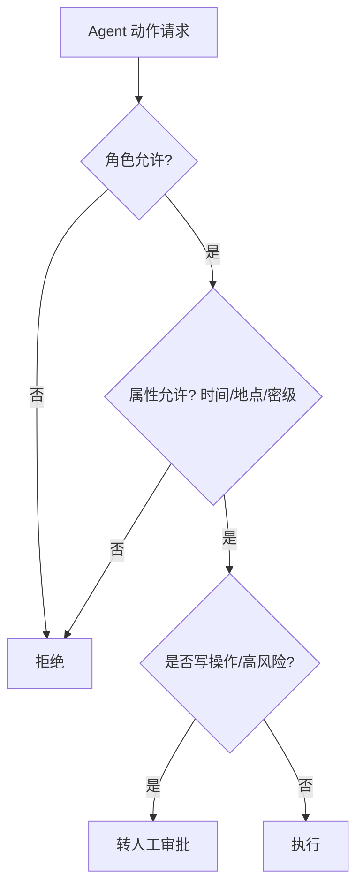

# 05 企业级 Agent 架构

> 本章把 Agent 从"能跑通 demo"升级到"企业级"：多租户隔离、角色权限、长任务编排、Human-in-the-loop 审批、审计留痕。这是区分"玩具 Agent"和"生产 Agent"的核心工程。

## 一、多租户（Multi-tenancy）

### 1.1 隔离维度

| 维度 | 隔离方式 | 说明 |
|------|----------|------|
| 数据 | 租户 ID 行级隔离 / 独立 Schema / 独立库 | 知识/会话/向量按租户隔离 |
| 模型配额 | 网关按租户限流/计费 | 防单租户打爆 |
| 工具权限 | 租户级工具白名单 | A 租户的工具 B 租户不可用 |
|  Prompt/配置 | 租户级覆盖 | 同框架不同行业配置不同 |

### 1.2 隔离策略选择

- **中小规模**：单库 + 租户 ID 行级隔离 + RLS（推荐，运维简单）。
- **强隔离/大客户**：独立 Schema 或独立部署实例（合规要求物理隔离）。

---

## 二、角色与权限（RBAC + ABAC）

### 2.1 三层权限

1. **系统层**：能否登录 Agent 平台（SSO 控制）。
2. **知识层**：能检索哪些知识域（RAG 权限隔离，见 03 篇）。
3. **操作层**：能调哪些工具、能否执行写操作（工具层 RBAC，见 04 篇）。

### 2.2 属性级（ABAC）

除角色外，按**属性**动态判定：时间（下班后禁批量导出）、地点（内网才可调某工具）、数据密级（L3 用户才可见 L3 知识）。



### 2.3 Agent 身份与授权（OAuth 2.1 / 服务身份）

企业 Agent 调企业内部/第三方 API，权限模型的三个层次：

| 层 | 身份形态 | 说明 |
| --- | --- | --- |
| 用户委派（User Delegation） | OAuth 2.1 **Authorization Code + PKCE** | Agent 代表用户做事，权限 ≤ 用户权限 |
| 服务身份（Service Identity） | **Client Credentials**（服务间调用） | Agent 平台自己的身份，走独立 scopes 配额 |
| 用户 + 服务叠加 | Token exchange（OAuth Token Exchange） | 双重身份：既要用户上下文又要服务特权 |

- **关键原则**：Agent 拿到的是**最小 scope、短期（几十分钟级）token**，且每个 Agent 用**独立 client_id**——便于审计「哪个 Agent 干的」；
- **MCP 生态落地**：MCP 服务器的 OAuth 授权（2025-03 规范）+ 企业 MCP 网关统一签发（见「智能体/03」5.1）；
- **敏感操作令牌升级**：低危操作用用户静默令牌，高危操作临时申请**提权令牌 + HITL 审批**（两步授权），防「一次授权、永久权限」。

> 一句话：**企业 Agent 的权限 = 用户委派 × 服务身份 × 属性策略（ABAC）三乘叠加，最小权限 + 短期令牌 + 独立 client_id 是审计底线。**

---

## 三、长任务编排与状态

### 3.1 问题

企业任务常跨分钟/小时（如"分析上月全量工单并生成报告"）。无状态进程重启即失忆、限流即中断。

### 3.2 方案

- **持久化执行（Durable Execution）**：状态 checkpoint 化，重启/限流/审批超时后从断点恢复（LangGraph 内置，或自建 + 工作流引擎如 Temporal）。
- **外部化状态**：会话/中间结果存外部存储（DB/对象存储），不依赖进程内存。
- **超时与补偿**：长任务设总超时；失败步骤有补偿（如已创建草稿单需回滚）。
- **幂等键**：同任务重复触发不重复办事（见 04 篇消息幂等）。

### 3.3 示例（Temporal 风格）

```
Workflow: AnalyzeTickets
  step1: 拉取工单(游标分页, 可恢复)
  step2: 调用 LLM 摘要(每批 checkpoint)
  step3: 生成报告(草稿态)
  step4: 等待 HITL 审批 -> 发布
```

---

## 四、Human-in-the-Loop（HITL）与审批流

### 4.1 为什么必须 HITL

生产里几乎所有**写操作/高危操作**都不能全自动：改订单、发邮件、触发退款、删数据。Agent 生成"待执行草案"，人工/二级审批通过后真正执行。

### 4.2 审批模式

| 模式 | 流程 | 适用 |
|------|------|------|
| 同步审批 | Agent 暂停等审批人通过再继续 | 实时对话、低风险 |
| 异步工单 | 生成工单进审批队列，通过后回调执行 | 跨时区/长流程 |
| 影子模式 | 只 log 不执行，观察一段时间再放开 | 新工具上线灰度 |

### 4.3 审批落点

- 审批人身份来自 SSO，审批动作留痕。
- 审批上下文包含：Agent 想做什么、依据（引用片段）、影响范围（会改哪些数据）。
- 拒绝也要记录，用于优化 Agent 策略（减少无效提案）。

---

## 五、审计与留痕

### 5.1 审计产物（Run Record）

每次 Agent 运行落盘：

- **Trace ID**：贯穿全链路。
- **输入/输出**：用户问题、最终答案、中间步骤。
- **工具调用**：每次调用参数与结果。
- **引用来源**：答案引用了哪些知识/文档（可追溯）。
- **成本/延迟**：token、耗时。
- **人工审批**：谁审批、何时、结果。

### 5.2 可回放

审计产物支持会话回放，用于：合规审查、事故复盘、red-teaming、模型漂移监测。

---

## 六、错误恢复与降级

- **模型降级**：主模型不可用→备用模型（见 01 篇网关）。
- **工具降级**：某业务系统超时→返回降级响应/转人工。
- **优雅失败**：Agent 卡住/循环→超时熔断，给用户明确提示而非假答案。
- **递归循环检测**：识别 Agent 陷入自言自语（见 06 篇可观测）。

---

## 七、企业 Agent 反模式

1. **全自动高危操作**：Agent 直接发退款/删库，出事不可逆——必须 HITL。
2. **租户数据混存**：A 客户知识被 B 客户检索，合规事故——必须租户隔离。
3. **无状态跑长任务**：重启即失忆，重复劳动——必须 checkpoint。
4. **审批形同虚设**：默认自动通过，失去兜底意义。
5. **不留存痕**：事后无法审计/复盘，监管不通过。

---

## 八、与其他篇关系

- 多租户数据隔离见「[03-RAG 工程化](./03-RAG-工程化.md)」。
- 权限/工具/脱敏见「[04-企业系统集成](./04-企业系统集成.md)」。
- 可观测/护栏/成本见「[06-可观测性、成本与安全](./06-可观测性、成本与安全.md)」。
- 部署运维见「[07-部署与上线运维](./07-部署与上线运维.md)」。

> 一句话：**企业级 Agent = 多租户隔离 + 最小权限 + 长任务可恢复 + 高危 HITL + 全程留痕。** 缺任一环节，都不该上线。
