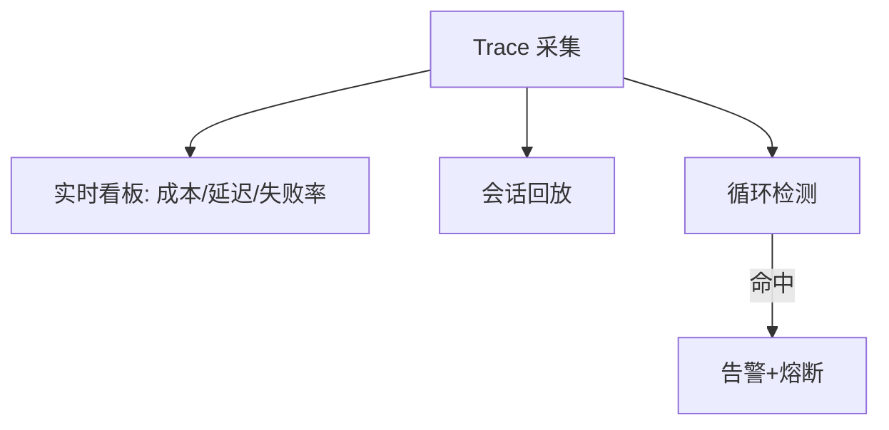

# 06 可观测性、成本与安全

> 把 Agent 跑进生产，难点不在"能跑"，而在"**可控、可观测、可追责、成本可预期**"。本章覆盖可观测性（tracing）、评估（eval）、护栏（含致命三重奏与 OWASP）、成本治理、密钥隔离。与「智能体/06」概念呼应，本章偏工程落地操作。

## 一、可观测性（Observability）

### 1.1 从第一天就埋

Agent 行为比确定性代码更难追溯，**结构化日志 + tracing 必须第一天就埋**，否则线上出问题只能盲猜。

### 1.2 统一 tracing 标准

**OpenTelemetry GenAI Semantic Conventions** 统一了 LLM 调用、工具、agent 步骤的 span 与属性命名，使 trace 跨厂商/框架可互通。建议**直接按这套规范埋点**，下游 LangSmith/AgentOps/MLflow/W&B 免适配。

### 1.3 必埋信号

| 信号 | 内容 | 用途 |
|------|------|------|
| Trace | 全链路 span：用户请求→Agent Loop→工具→模型→输出 | 定位慢/错环节 |
| 输入/输出 | 每步 prompt、模型输出、工具参数与结果 | 回放/复盘 |
| 成本 | 每次调用 token、金额 | 成本看板 |
| 延迟 | p50/p95/p99 | SLA 监控 |
| 失败率 | 工具失败、模型超时、循环检测 | 告警 |

### 1.4 递归循环检测

识别 Agent 陷入无限循环/自言自语（"我刚才说了…我再想想…"），触发超时熔断。



---

## 二、评估（Eval）

> 黄金法则：**先建 eval，再调 prompt**。没有固定测试用例，prompt 改动就是瞎猜。

### 2.1 两类评估

| 视角 | 评什么 | 工具 |
|------|--------|------|
| 结果评估（Outcome） | 最终答案/产物对不对 | 人工/LLM-as-judge/规则 |
| 轨迹评估（Trajectory） | 中间步骤是否合理（工具选对吗） | 逐步标注/自动判分 |

### 2.2 关键指标

- 任务成功率、工具选择准确率、检索质量（groundedness）、对话漂移、延迟预算。
- **持续回归**：每次 prompt/模型变更跑固定测试集，防止退化（模型也会漂移）。

### 2.3 评测集建设

- 从真实日志抽样 + 人工标注，覆盖边界 case（越权请求、模糊问题、超长上下文）。
- 红队（Red Team）：专门测注入/越权/泄露（见下）。

---

## 三、护栏（Guardrails）

### 3.1 Guardrail Sandwich（护栏三明治）

多层安全网：访问控制 → 意图校验 → 行为限阈 → 持续监督。

- **访问边界（PEP）**：行/列级权限（SQL view、RLS、API 网关）；只放行白名单操作（拦截 DELETE/UPDATE 除非显式授权）。
- **作用域凭证**：短期、最小权限（IAM 角色、细粒度 JWT），到期撤销。
- **意图校验与执行门禁**：执行前用分类器/规则/第二个 verifier agent 校验"模型想做的"与"用户意图"一致；早期用**影子模式**（只 log 不执行）。
- **限流与配额**：网关限流；查询/行数/算力软配额（搜索 agent 不应一次拉 1 万条）。
- **HITL**：高风险操作先人工审批（见 05 篇）。

### 3.2 致命三重奏（Lethal Trifecta）

三者同时存在即构成可利用漏洞：
1. **可访问私有数据**（邮件/文件/数据库）
2. **处理不可信输入**（外部/用户内容）
3. **可外发数据/执行操作**（工具能发网络/写系统）

破解：**断链**——隔离私有数据访问、净化不可信输入、限制外发/写操作（最小权限 + HITL）。

### 3.3 OWASP LLM Top 10（重点项）

- LLM01 提示注入（Prompt Injection）
- LLM02 敏感信息泄露
- LLM03 供应链（依赖包/模型来源）
- LLM06 过度代理（Excessive Agency）——工具权限过大
- LLM07 系统提示泄露

> 企业落地重点防 **注入 + 越权 + 过度代理**：攻击者诱导 Agent 越权调工具或泄露不该看的知识。

---

## 四、成本治理

### 4.1 成本爆炸来源

- 全量用顶级模型（应分层：重活小模型、关键才大模型）。
- 长上下文反复塞全量历史（上下文腐烂，见「上下文工程」）。
- 循环/重试无上限。
- 日志/向量存储无生命周期（冷热分层）。

### 4.2 治理手段

- **分层模型**：路由策略（分类小模型判意图，复杂才上大模型）。
- **缓存**：相同/相似问题缓存答案（语义缓存）。
- **上下文裁剪**：compaction/摘要，控制输入 token。
- **限额告警**：租户/用户/应用级预算，超阈值告警+限流。
- **成本看板**：按应用/用户/task 分摊，定位贵在哪。

### 4.3 成本示例（直觉）

```
周成本 ≈ Σ(调用次数 × 平均输入token × 输入单价 + 输出token × 输出单价)
控制变量: 模型单价(分层) / 输入token(裁剪) / 调用次数(缓存+限流)
```

---

## 五、密钥与凭证隔离

- **密钥管理**：Vault / KMS / 云密钥服务，不落配置文件。
- **按租户/项目隔离**：scope token，不共享长期密钥。
- **最小权限**：数据库只读视图、API 只给必要 scope。
- **轮换**：定期轮换，泄露可快速吊销。

---

## 六、安全反模式

1. **无 tracing 上线**：出问题全靠猜。
2. **无 eval 调 prompt**：真实任务失败率可达 60–90%，瞎改。
3. **Lethal Trifecta 齐活**：私有数据+不可信输入+外发=注入泄露。
4. **全量顶级模型**：成本失控。
5. **密钥硬编码**：一泄露全崩。
6. **过度代理**：给 Agent 万能工具权限，被注入利用。

---

## 七、与其他篇关系

- 评估方法论见「模型评测与基准」「智能体/06」。
- 护栏/注入防御见「智能体/06 评估、安全与工程落地」。
- 权限/工具层见「[04-企业系统集成](./04-企业系统集成.md)」「[05-企业级 Agent 架构](./05-企业级Agent架构.md)」。
- 部署运维见「[07-部署与上线运维](./07-部署与上线运维.md)」。

> 一句话：**生产三件套——评估先行、可观测贯穿、护栏兜底；成本靠分层+缓存+裁剪。**
