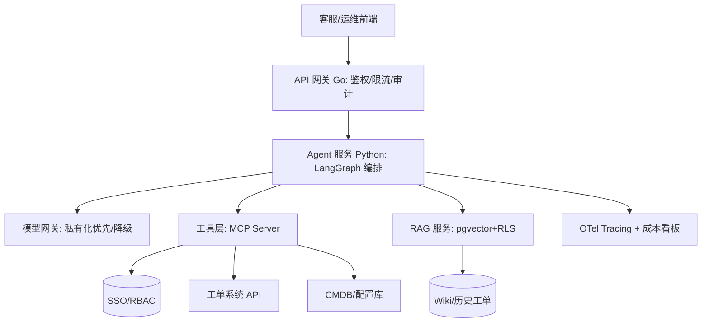

# 08 完整落地案例：企业级「智能工单分析与运维助手」Agent

> 用一条真实感的线索，把本专栏 01–07 串起来：**从需求到上线**全流程。场景选"企业 IT/客服工单智能分析 + 运维助手"——它同时涉及 RAG（知识库）、业务系统集成（工单/CMDB）、HITL（派单/操作）、多租户、合规，是典型企业级 Agent。

## 一、需求与目标

### 1.1 业务痛点

- 客服/运维每天处理海量工单，重复问题多、检索知识慢、派单靠经验。
- 管理层要"上月故障根因分析""SLA 达成"等报表，人工汇总耗时。
- 知识散落在 Wiki/Confluence/历史工单，新人上手慢。

### 1.2 目标（可量化）

- 工单首响智能建议覆盖率 ≥ 70%。
- 知识检索命中率（Recall@5）≥ 85%。
- 高危操作（重启服务/改配置）100% HITL 审批。
- 数据不出内网（强合规）。
- 单租户成本可控，p95 响应 < 5s。

---

## 二、技术选型（对应 01 篇）

| 决策 | 选择 | 理由 |
|------|------|------|
| 语言 | Python（Agent 大脑）+ Go（网关/限流）+ Java（接现有工单中台） | 贴合存量，Python 跑编排 |
| 模型 | 私有化 Qwen/vLLM（主）+ 公有云 Claude（仅非敏感复杂推理，脱敏后） | 合规数据不出域 |
| 模型网关 | 自研轻量 Gateway（OpenAI 兼容协议 + 路由 + 降级） | 屏蔽差异，私有化兜底 |
| 向量库 | pgvector（复用现有 Postgres + RLS 权限） | 省基础设施 + 行级权限隔离 |

---

## 三、整体架构（对应 02 篇）



- **边界清晰**：Agent 不直接连 DB/工单库，全经工具层（MCP）收敛，权限由 SSO/RBAC 控制。

---

## 四、RAG 工程化（对应 03 篇）

- **知识源**：Wiki 文档、历史工单（脱敏后）、运维手册、CMDB 拓扑。
- **权限隔离**：每个 chunk 带部门/密级 ACL；检索时按用户 RLS 过滤——A 组工单 B 组不可见。
- **混合检索**：BM25 + 向量 + BGE-Reranker。
- **增量**：工单状态变更只重索引相关 chunk；文档删除软删向量。
- **评测**：建 200 条真实问答测试集，Recall@5 ≥ 85% 才允许上线。

---

## 五、企业集成（对应 04 篇）

- **身份**：企业微信 SSO 登录，身份不可伪造。
- **权限**：用户角色（客服/运维/管理员）决定可检索知识域与可调工具。
- **业务系统**：工单系统、CMDB 封装为内部 MCP Server，前置鉴权网关。
- **脱敏**：工单含客户手机号/合同号，进模型前 NER 识别打码。
- **消息**：分析结果写 Kafka，触发下游告警/报表。

---

## 六、Agent 架构（对应 05 篇）

- **多租户**：按事业群租户 ID 行级隔离，知识/会话/向量分离。
- **角色权限**：运维可建议派单，管理员可审批高危操作；客服仅只读建议。
- **长任务**：月度报表生成用 LangGraph 持久化 + checkpoint，中断可恢复。
- **HITL**："重启某服务""批量改配置"生成待执行草案 → 管理员审批 → 工具层执行。
- **审计**：每次运行落 Run Record（trace/输入输出/工具调用/引用/成本/审批）。

---

## 七、可观测/成本/安全（对应 06 篇）

- **Tracing**：OTel GenAI 规范埋点，LangSmith 消费，可回放。
- **Eval**：每次 prompt/模型变更跑测试集；红队测注入越权。
- **护栏**：Lethal Trifecta 断链（私有数据经 RLS 隔离、用户输入净化、写操作 HITL）。
- **成本**：分层模型（意图分类用小模型，复杂摘要才大模型）；语义缓存高频问题；租户预算告警。

---

## 八、部署上线（对应 07 篇）

- **部署**：K8s 容器化，Agent 无状态（状态外置），vLLM 私有化 GPU 节点。
- **灰度**：先内部租户 5% 流量，观测成功率/延迟/成本 1 周，再全量。
- **演练**：杀 Agent Pod（自动重启）、vLLM 超时（降级公有云脱敏路径）、注入循环输入（熔断）。
- **SLA**：p95 < 5s，可用性 99.5%；超预算告警。
- **On-call**：Runbook 覆盖"答非所问→查检索/生成""成本突增→查租户""延迟高→查哪层"。

---

## 九、落地时间线与关键风险

| 阶段 | 周期 | 关键风险 |
|------|------|----------|
| 选型 + PoC | 2 周 | 合规边界不清（数据能否出域） |
| RAG + 集成 | 4 周 | 权限隔离遗漏（越权检索） |
| Agent 编排 + HITL | 3 周 | 长任务断点恢复不稳定 |
| 评测 + 灰度 | 2 周 | 真实失败率高于预期（需迭代 prompt） |
| 全量 + 运维 | 持续 | 模型漂移、成本失控 |

---

## 十、复盘：本案例印证的原则

1. **先定约束再写代码**：合规（数据不出域）决定了私有化 + 脱敏 + RLS，回头改代价巨大。
2. **RAG 成败在权限与评测**：不是向量库选型，而是"谁能看什么" + "检索质量可量化"。
3. **工具层是安全边界**：所有业务操作经 MCP + RBAC + HITL，杜绝越权。
4. **上线靠工程纪律**：tracing/eval/护栏/灰度/演练缺一不可，否则线上裸奔。
5. **成本是设计出来的**：分层模型 + 缓存 + 裁剪，而非事后优化。

---

## 十一、可复制模板

> 把上图换成你的业务：把"工单/CMDB"换成你的核心系统（CRM/ERP/数据平台），把"知识域"换成你的文档，HITL 审批你的高危操作——**架构骨架完全通用**。

---

## 十二、2025-2026 明星案例拆解（已验证的公开架构）

### 1. Deep Research（深度研究 agent）——多 agent RAG 范式

```
query → 计划(拆分研究问题) → 多路检索(网页/文档/代码) → 每路子agent精读+摘要
      → 汇总校验(交叉验证冲突) → 引用标注 → 长报告
```

- **骨架**：Orchestrator-Workers + A2A/工具层（每路研究是一个独立子 agent）；进度 UI + 长任务（分钟级）→ 服务端状态机 + 事件推送；
- **关键点**：检索不是一次性的——每个子 agent 内部可多轮检索；引用强制（每个结论带源）；成本用「检索预算」约束；
- **可借鉴**：评测用「引用准确率 + 事实正确率」而非纯阅读体验。

### 2. AI 编码助手（Claude Code / Codex 产品化）——上下文工程 + 记忆

- 上下文工程五件套（检索/记忆/子代理/压缩/工具清理，见上下文工程 03 篇八节）+ 静态指令文件（CLAUDE.md/AGENTS.md）；
- **可借鉴**：`CLAUDE.md` 迭代本身要版本管理 + 评测（让编码 agent 在固定 repo 任务集上跑回归），否则「改了个规则」分不清好坏。

### 3. 客服/销售 agent 的典型坑位清单（公开复盘共性）

- 多租户知识库权限漏配 → 越权回答（教训：检索权限走 RLS 而非应用层过滤）；
- 工具幂等缺失 → 重复下单/重复发券（教训：写操作一律幂等键，见 04 篇）；
- 只测 happy path → 线上注入/边界直接穿（教训：从第一天跑红队集）；
- 长上下文超预算 → 单租户成本失控（教训：每租户配额 + 预算告警，见 06 篇）。

> 一句话：**2025-2026 公开案例证明：能跑的生产 agent 没有新魔法，全是「编排 + 权限 + 评测 + 成本」四件套的纪律性执行。**

---

## 尾声：企业级 Agent 落地清单（总）

- [ ] 01 语言/模型网关/合规边界定死
- [ ] 02 框架选型 + 分层架构 + 工具层收敛
- [ ] 03 RAG 权限隔离 + 混合检索 + 检索评测
- [ ] 04 SSO/RBAC + 业务系统集成 + 脱敏 + MCP 企业化
- [ ] 05 多租户 + 长任务 checkpoint + HITL + 审计
- [ ] 06 tracing + eval + 护栏 + 成本治理
- [ ] 07 容器化/GPU + 灰度 + 演练 + On-call
- [ ] 08 一个端到端案例串起来，验证闭环

> 一句话：**企业级 Agent 落地 = 工程纪律（分层/权限/评测/可观测）套在模型能力之上；本专栏给的就是这套可复制的纪律。**
