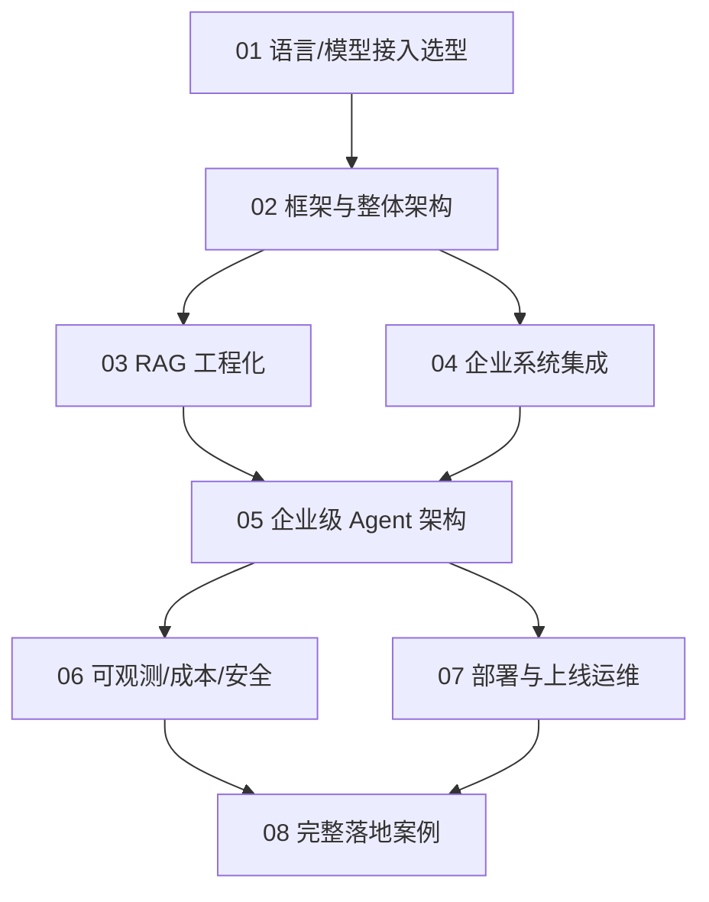

# 大模型工程落地专栏（企业级 Agent 全流程）

> 本专栏从**软件工程交付视角**出发，回答一个问题：**怎么把一个企业级 Agent 从 0 交付到生产并长期稳定运行？**
>
> 与「智能体」子模块（概念/认知架构范式，整理自 Anthropic/OpenAI 官方博客）互补：那边讲"Agent 是什么、怎么思考"，这边讲"在企业里用什么语言、什么框架、怎么接系统、怎么上线运维"。与「训练与部署」（模型侧）也互补：本专栏聚焦**应用层**落地。
>
> 立场：**企业落地不是比谁的 Agent 更"聪明"，而是比谁的 Agent 更"可控、可观测、可追责、合规、成本可预期"**。工程纪律 > 模型噱头。

## 内容索引（8 篇）

| 文件 | 内容 | 形态 |
| --- | --- | --- |
| [01-技术选型与语言栈.md](./01-技术选型与语言栈.md) | 主流语言（Python/TS/Go/Java/.NET）对比、模型接入层（多模型网关/SDK）、私有化与合规约束、选型决策 | 📝 文字 |
| [02-开发框架与整体架构.md](./02-开发框架与整体架构.md) | LangGraph/OpenAI Agents/CrewAI/ADK/Agent Framework/自建 harness 选型、企业分层架构、与现有系统集成边界 | 📝 文字 |
| [03-RAG 工程化.md](./03-RAG-工程化.md) | 企业知识库接入、向量库选型、分块/嵌入/混合检索、权限隔离 RAG（Row-level）、增量更新 | 📝 文字 |
| [04-企业系统集成.md](./04-企业系统集成.md) | SSO/权限/RBAC 打通、消息总线/数据库/业务系统接入、私有数据脱敏、MCP 企业化 | 📝 文字 |
| [05-企业级 Agent 架构.md](./05-企业级Agent架构.md) | 多租户、角色权限、长任务编排、Human-in-the-loop、审批流、审计留痕 | 📝 文字 |
| [06-可观测性、成本与安全.md](./06-可观测性、成本与安全.md) | tracing（OTel GenAI）、评估（eval）、护栏（Lethal Trifecta/OWASP）、成本治理、密钥隔离 | 📝 文字 |
| [07-部署与上线运维.md](./07-部署与上线运维.md) | 容器化/K8s、私有化 GPU 部署、灰度、SLA、故障演练、合规审计、On-call | 📝 文字 |
| [08-完整落地案例.md](./08-完整落地案例.md) | 以一个企业级「智能运维/客服/数据分析 Agent」为例，串起需求→选型→架构→开发→集成→评测→上线全流程 | 📝 文字 |

## 全局学习路径

## 核心要点速览

- **技术栈选型先看约束**：企业现有语言栈（Java/.NET 为主？还是 Python 团队？）、合规（数据能否出内网）、GPU 资源、团队熟练度——比"哪个框架 star 多"重要。
- **模型接入要抽象**：用统一 Gateway 屏蔽厂商差异（OpenAI/Claude/Qwen/本地 vLLM），避免业务代码耦合具体 API；支持私有化兜底。
- **RAG 不是接个向量库就完事**：企业落地的难点是**权限隔离**（不同人看到不同知识）、**增量更新**、**检索质量评测**。
- **企业 Agent 的灵魂是集成与权限**：接 SSO、接业务系统、最小权限、HITL 审批——脱离企业系统的 Agent 只是玩具。
- **上线只是开始**：tracing/eval/护栏/成本看板要从第一天埋；模型会漂移、提示会退化，需要持续回归。

## 与其他子模块关系

- **与智能体**：本专栏是「智能体」的生产化延伸——概念范式见那边，工程交付看这里。
- **与 RAG / 上下文工程 / 记忆**：本专栏的 03 篇是 RAG 的**工程化**落地，与「RAG」概念篇互补；上下文/记忆是 Agent 的运行时底座。
- **与训练与部署**：本专栏用模型（API/私有化推理），不训练模型；若需微调/蒸馏见「训练与部署」。
- **与场景设计/业务模型**：Agent 落地的业务域（金融/储能/电商）可参考「业务模型」「场景设计」中的行业系统架构。

## 推荐延伸阅读

- 智能体子模块（概念/认知架构/MCP/框架对比/评估安全）
- RAG 子模块（检索原理/进阶技术/评估）
- 上下文工程、记忆子模块（运行时上下文与持久化）
- 训练与部署子模块（若需私有化微调/推理优化）
