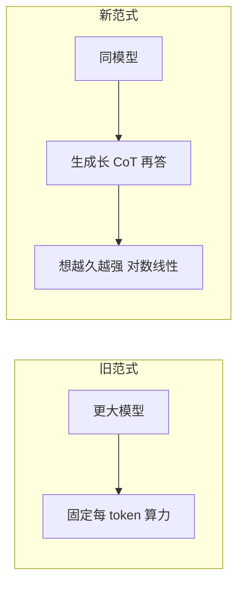
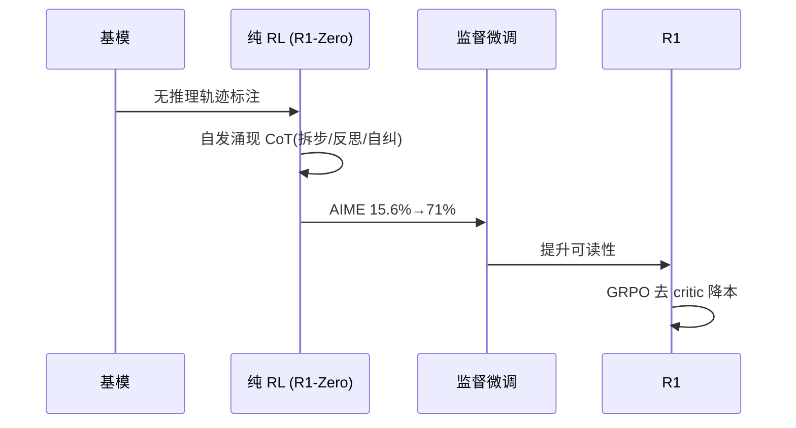

# 推理与思考模型 · 01 核心原理与训练机制

## 一、从「训更大」到「想更久」：范式转移

2020–2024 年，让模型更强的主流杠杆是 **训练时 scaling**：更大的参数量、更多数据。到 2024 下半年，这条路的边际收益放缓，业界重心转向另一条轴——**test-time compute（推理时算力 / inference-time scaling）**：

> 不要更大的模型，而是**让模型在回答前生成一段很长的内部推理链**，探索解法、自检、回溯，再输出最终答案。给的推理算力越多，难题表现越好。

这带来一个颠覆性结论（Snell et al., 2024 的 compute-optimal 研究）：

- 给定算力预算，**小模型 + 足够思考预算，可以击败参数大它最多 14× 的大模型**（在 MATH 等基准上）。
- 含义：不必为每个 query 都上最大模型，可以给小便宜模型在难题上多分配推理算力，总成本更低且效果相当甚至更好。



## 二、代表模型与机制差异

| 模型 | 时间 | 思考可见性 | 训练/特点 |
|------|------|-----------|-----------|
| OpenAI o1 | 2024-09 | **隐藏**（安全考虑，防绕过护栏） | RL 训复杂推理；预览博客称「想越久越好」 |
| OpenAI o3/o4 | 2024-12 起 | 隐藏 | ARC-AGI 高算模式 96.7%，把推理推到极致 |
| DeepSeek-R1 | 2025-01（Nature） | **可见**（含试错/纠偏） | 纯 RL（GRPO）激发 CoT；开放权重 + 蒸馏 |
| Claude 扩展思考（3.7 起） | 2025 | 可切换（标准/扩展） | 混合模式，API 显式 thinking budget |
| Gemini 2.5 推理轨道 | 2025 | 轨道内 | 原生推理轨道 |
| Qwen3 混合 | 2025 | 思考/非思考双模 | 同权重切模式 |

**o1 的关键数据**（发布博客 + 模型卡）：
- AIME 2024：GPT-4o **13%** → o1 **83%**（pass@1）。
- Codeforces 百分位：11th → 89th。
- 生物/化学/物理奥赛基准跳升 30–50 个百分点。
- 单题 CoT 可达数万 token；价格按**隐藏思考长度**计，是 GPT-4o 的数倍。

> **可见 vs 隐藏 CoT**：o-series 隐藏 CoT 是为安全（防止用推理过程绕过护栏）；R1 公开完整 CoT（含错误起步、自检、验证），成为研究推理机制的首选，但也意味着直接给用户要看可用性。

## 三、从「提示技巧」到「训练行为」：CoT → RL

推理模型的能力**不是靠提示词 "think step by step" 堆出来的**，而是后训练阶段用 RL 把「生成可靠推理链」训成了模型自身行为。三个阶段依次演进：

| 想法 | 年份/来源 | 贡献 | 关键结果 |
|------|-----------|------|----------|
| Chain-of-Thought | 2022, Wei et al. (Google) | 提示「逐步思考」提升多步准确率 | 仅在 ~100B+ 参数涌现；纯推理时技巧，不改权重 |
| Test-time compute scaling | 2024, Snell et al. | 把 CoT 重构成 scaling 轴 | 小模型+合适预算可超 14× 大模型 |
| RL for reasoning (GRPO) | 2025, DeepSeek-R1 | 用奖励而非提示训推理 | AIME pass@1 15.6%→71%（纯 RL），86.7%（多数投票） |

### 3.1 DeepSeek-R1：纯 RL 激发推理

R1 的训练里程碑（公开技术报告）：
1. **DeepSeek-R1-Zero**：直接在基模上做纯 RL，**自发涌现**链式推理（拆步骤、反思、自纠），无需人工标注推理轨迹。
2. 再经**有监督微调**提升 CoT 可读性与一致性。
3. 用 **GRPO（Group Relative Policy Optimization）**——**去掉独立 critic 网络**，从一组采样答案中估计基线（组相对优势），大幅降低 RL 训练成本。



> GRPO 为何重要：传统 PPO 需一个与策略同规模的 critic（价值网络），显存/算力翻倍；GRPO 用「同一 prompt 采样一组答案 → 组内得分相对基线」替代 critic，**训练更省**，是 R1 能以相对低成本复现 o1 行为的关键。

## 四、Test-Time Compute 的缩放律与「过度思考悖论」

### 4.1 形状：对数线性、边际递减

跨 8 个开源模型（7B–235B）的研究表明：**给定模型类型，性能随思考算力预算单调上升**，但**不是线性**——前几秒思考收益最大，之后边际递减（log-linear 关系）。

```
Accuracy%
100 |        _______
 80 |    ___/
 60 | __/
 40 |/
    +------------------ Thinking compute (log)
    none  low   medium  high   max
```

**工程含义**：存在「问题难度对应的合适思考量」，超过就是浪费。这也是 thinking budget / reasoning_effort（low/medium/high）旋钮的理论依据——对多数任务 medium 最佳，例程用 low，真正难题才 high。

### 4.2 过度思考悖论（Test-Time Compute Paradox）

最新研究指出：**更多推理算力有时反而降低准确率**。模型对简单问题「想太多」，会自己说服自己怀疑本正确的初答、引入不必要的复杂度、找到虚假理由推翻简单解。

> 这凸显**自适应分配**的重要性：思考量要匹配问题难度，而非无脑拉满。

## 五、成本结构的翻转

| 维度 | 传统 LLM | 推理模型 |
|------|----------|----------|
| 成本主导 | **输入 token**（上下文） | **输出 token**（隐藏思考，仍计费） |
| 单 query token | 输入短、输出短 | 输入 500 + 输出 5000（其中 4500 是隐藏思考） |
| 计价单位 | 每 token | **每任务**（一次对的解比五次自洽更划算） |
| 延迟 | 秒级 | 30 秒–数分钟常见 |

**ROI 例子**：一个推理模型一次 query $0.50 直接答对，优于一个快模型 $0.02/次但需自洽调用 5 次仍有 10% 错误率。

### 5.1 缓存行为变化

推理模型输出侧成本占比高，**输入侧 prompt caching 摊薄效果变弱**；长思考的 KV-cache 复用是活跃研究方向。OpenAI/Anthropic 都重度依赖**前缀缓存**把同一 system prompt 的多 query 输入成本摊薄。

## 六、小结

- test-time compute 是「让模型想更久」的范式转移，不是更大模型。
- 代表：o1/o3（隐藏 CoT）、R1（可见 CoT，GRPO 纯 RL）、Claude 扩展思考（混合模式 + thinking budget）、Gemini/Qwen3 推理轨道。
- 训练上靠 RL（尤其 GRPO 去 critic）把 CoT 训成行为，而非提示技巧。
- 缩放律对数线性、边际递减，且存在过度思考悖论 → 必须自适应分配思考预算。
- 成本结构翻转（输出 token 主导），按每任务算账；缓存逻辑也要调整。

> 下一篇（02）把这些原理落到工程：何时用、thinking budget 怎么调、token 预算与思考泄漏、混合路由、缓存与可观测。
