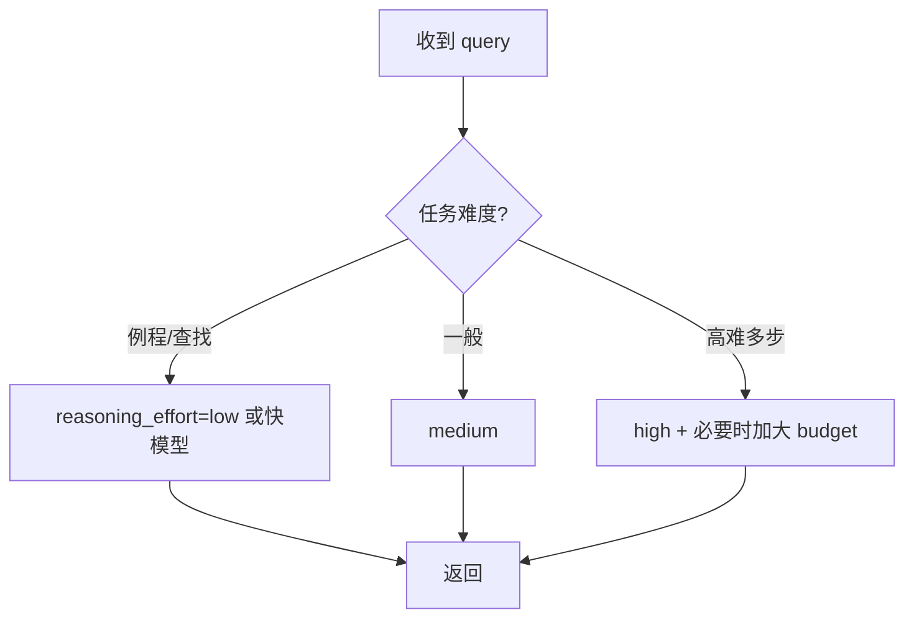

# 推理与思考模型 · 02 工程实践与成本治理

> 原理篇讲了「为什么想更久更强」。本篇讲生产落地：**什么时候该上推理模型、thinking budget 怎么调、token 成本怎么算、怎么防过度思考与思考泄漏、混合路由与缓存怎么搭**。

## 一、何时用 / 何时不用

### 1.1 该上推理模型的场景

错误的中间步骤会毁掉答案、且「做对比做快重要」的任务：

- **数学推导 / 竞赛题**（AIME、MATH 级别）
- **复杂代码重构 / 算法设计**（多文件、需回溯）
- **科学推理**（GPQA 研究生级物化生）
- **结构化论证分析**（法律/财务论证、多约束决策）
- **真实软件工程任务**（SWE-bench 类：修真实 GitHub issue）

### 1.2 不该上、用快模型的场景

- 闲聊、简单查找（"法国首都是哪"）
- 内容生成、翻译、摘要（胜任的首答即可）
- 高实时交互（思考 30 秒不可接受）
- 批处理/后台任务（延迟无所谓，可上）

> **黄金法则**：先判断任务是否需要「多步推理且正确率优先」。不需要就别浪费思考 token。

## 二、Thinking Budget / Reasoning Effort 旋钮

主流 API 已把思考量做成可调旋钮：

| 厂商 | 旋钮 | 形态 |
|------|------|------|
| Anthropic Claude | `thinking budget`（token 数，如 1024 起） | 显式 token 预算 |
| OpenAI o-series | `reasoning_effort` | low / medium / high |
| 通用建议 | 从最小起步，逐步增加找最优平衡 | 深想 vs 成本延迟权衡 |

**调参经验**：
- **medium 是多数任务甜点**；例程查询 low；只有确需模型花一分钟才 high。
- 数学题准确率随预算从 1K→10K→100K token 可预测提升，但过了拐点收益趋零。



## 三、Token 预算与「思考泄漏」

### 3.1 思考 token 计入上下文预算

隐藏/可见的 thinking token **都占上下文窗口、都计费**。长思考会：
- 吃上下文预算，触发上下文工程的压缩/清理杠杆（见上下文工程模块）。
- 增加 KV-cache 占用与首 token 延迟。

### 3.2 思考泄漏（Thinking Leakage）

风险：**模型的内部假设、试错、绕路会泄漏进最终答案**，尤其是可见 CoT 模型（R1）或不加后处理时。表现：
- 最终回答里出现「让我再想想…其实之前错了…」之类的内部独白。
- 把未经验证的内部猜测当成事实陈述。

**治理**：
- 用可见 CoT 模型时，对最终输出做**剥离/重写**后处理（只保留结论与依据）。
- 生产面向用户时优先隐藏 CoT 的模型（o-series），或显式要求「只输出最终答案 + 引用」。
- 在提示里约束输出格式，避免模型把 scratchpad 当答案。

## 四、混合路由（Hybrid Routing）

2026 最有效的部署模式：**运行时按难度路由**——简单 query 走快模型，难 query 走推理模型。

```
                  ┌─ 易 ─→ 快模型 (GPT-4o 级 / 小模型)
用户输入 ─→ 路由 ─┤
                  └─ 难 ─→ 推理模型 (o3 / R1 / Claude 思考)
```

- 路由判定可用：**轻量分类器 / 规则（query 长度、关键词）/ 小模型先判难度**。
- 好处：在不牺牲难任务质量的前提下，把大部分流量成本压到最低。
- 注意：路由本身有误判，难任务误判为易会掉质量，需留 fallback（难任务二次投递）。

> 这与「智能体」的 sub-agent 思路一致：把贵的能力只用在刀刃上。

## 五、成本治理与缓存

### 5.1 按「每任务」算账

| 指标 | 传统 | 推理模型 |
|------|------|----------|
| 计价 | 每 token | **每任务成本**（一次对 > 多次错） |
| 朴素比价 | 误导（忽略隐藏思考） | 必须含思考 token |

**优化手段**：
- **前缀缓存**：同一 system prompt 多 query 摊薄输入成本（OpenAI/Anthropic 都重度依赖）。
- **thinking budget 上限**：设硬顶，防止单 query 失控。
- **结果缓存**：高频相同 query 直接返回缓存答案，跳过思考。
- **蒸馏小模型**：把 R1 推理能力蒸馏到 8B 级（如 Qwen3-8B 从 R1 蒸馏，~800K 样本），特定任务以 1/10–1/40 成本逼近。

### 5.2 长思考的 KV-cache 复用

推理模型输出侧占比高，输入侧缓存收益变小；长 thinking 的 KV-cache 管理（复用、淘汰）是活跃方向。工程上：
- 保持 system prompt 稳定以命中前缀缓存。
- 对可并行的子问题用 sub-agent 隔离思考，避免主上下文被长思考撑爆。

### 5.3 思考 token 的缓存特性与成本攻击（推理模型专属坑）

- **思考 token 不参与缓存**：Anthropic 官方明确 thinking tokens 无法命中 prompt caching——即使 system 前缀命中，每次思考都全量计费。长思考 = 缓存穿透大户，前缀缓存摊薄策略在推理模型上收益打折；
- **拒绝服务/成本攻击**：用户可构造 prompt 诱导超长思考（数万~十万 token）耗尽预算——必须设 `max_thinking_time` / thinking budget 硬顶，超时触发早停（early-exit / adaptive thinking：已能回答就提前结束思考）；
- **输出长度预分配**：思考 token 与可见输出共占 max_tokens 预算，长思考会挤压可用输出长度——预留余量，或按「思考上限 + 输出上限」双配置。
- 部署侧优化（投机解码、验证器模型）见「[训练与部署/05-推理优化与部署工程](../训练与部署/05-推理优化与部署工程.md)」。

## 六、延迟与产品形态

| 产品面 | 建议 |
|--------|------|
| 交互式聊天 | 慎用长思考（30s+ 不可接受）；可显式「深度思考」按钮让用户选择 |
| 批处理 / 文档处理 | 放心用，延迟无所谓 |
| 流式 UI | 用 reasoning/answer 分离流，给用户看「正在思考」状态（OpenAI/Anthropic 已支持） |

## 七、生产落地 Checklist

- [ ] 明确哪些任务是「高难多步且正确率优先」→ 才上推理模型。
- [ ] 设默认 `reasoning_effort=medium`，例程 low，难题 high。
- [ ] 实现难度路由，把易流量导到快模型。
- [ ] 思考 token 计入上下文预算，配压缩/清理杠杆。
- [ ] 对可见 CoT 模型做思考泄漏后处理。
- [ ] 前缀缓存 + 结果缓存 + thinking 硬顶，控每任务成本。
- [ ] 流式 UI 分离 reasoning/answer，管理用户预期。
- [ ] 评测：用 LLM-as-Judge / 任务准确率回归，验证上推理模型确实提升（见「模型评测与基准」模块）。

## 八、小结

推理模型的工程核心是**「在正确难度上、用恰好的思考量」**：

1. 只在高难多步任务上用，其余走快模型。
2. thinking budget 自适应，别写死 high。
3. 防思考泄漏（后处理/隐藏 CoT/格式约束）。
4. 混合路由 + 前缀/结果缓存 + 蒸馏小模型，把每任务成本压下来。
5. 延迟敏感场景用按钮/后台，流式分离 reasoning/answer。

> 推理模型是 Agent 复杂子任务的理想引擎（agentic reasoning），但其事实性上限仍由 RAG/工具/grounding 决定——它不是幻觉的终结者。
