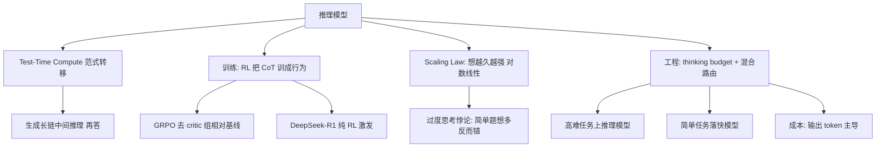
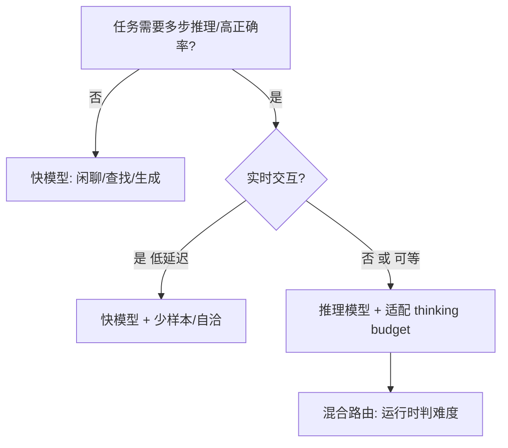

# 推理与思考模型（Reasoning Models）

> 本模块整理自 OpenAI / Anthropic / DeepSeek / Google 官方发布与 2024–2026 年公开研究（test-time compute 系列论文、DeepSeek-R1 技术报告、各厂商模型卡），聚焦「为什么大模型开始『先想后答』、test-time compute 是什么、工程上怎么用好推理模型」。
>
> 内容立场：**推理模型不是更大的模型，而是「在推理时花更多算力」的范式转移**。它是 2024 下半年至今大模型领域最重要的能力跃迁，理解它能直接指导「什么时候该上推理模型、怎么控成本」。

## 内容索引

| 文件 | 内容 | 形态 |
| --- | --- | --- |
| [01-核心原理与训练机制.md](./01-核心原理与训练机制.md) | test-time compute、o1/R1/Claude 思考机制、CoT→RL 训练（GRPO）、缩放律与「过度思考悖论」 | 📝 文字 |
| [02-工程实践与成本治理.md](./02-工程实践与成本治理.md) | 何时用/不用、thinking budget 旋钮、token 预算与「思考泄漏」、混合路由、缓存与可观测 | 📝 文字 |

## 主要参考来源（官方发布 / 公开研究）

- **OpenAI o1 发布（2024-09）**：https://openai.com/index/learning-to-reason-with-llms/ （AIME 13%→83%、Codeforces 11→89 百分位）
- **DeepSeek-R1 技术报告（2025-01，Nature）**：https://github.com/deepseek-ai/DeepSeek-R1 （纯 RL 激发 CoT、GRPO、CoT 可见、开放权重 + 蒸馏）
- **Anthropic Extended Thinking（Claude 3.7 起）**：https://docs.anthropic.com/en/docs/build-with-claude/extended-thinking （混合模式、API thinking budget）
- **Test-Time Compute 综述（Snell et al. 2024）**：compute-optimal 结论——小模型 + 合适思考预算可超 14× 大模型
- **ARC-AGI / GPQA / AIME / SWE-bench** 等基准公开结果（2025–2026）

> ⚠️ 本模块为「公开资料整理 + 个人化注解」，非原创理论。文中基准分数、价格倍数、token 量级均来自上述厂商公开案例与第三方评测（2024–2026），会随时间快速变化，请以你自己的评测与官方最新文档为准。

## 本子模块学习路径

1. `01-核心原理与训练机制.md`：搞懂 test-time compute 是什么、为什么「让模型想更久」能换能力、训练上怎么把 CoT 变成模型行为（RL/GRPO）。
2. `02-工程实践与成本治理.md`：落到生产——何时用推理模型、thinking budget 怎么调、token 成本怎么算、混合路由与缓存怎么搭。

## 核心要点速览

- **范式转移**：2020–2024 靠「训更大的模型」；2024 下半年起靠「推理时花更多算力（test-time compute）」——同一模型，想得越久越强（对数线性，边际递减）。
- **代表模型**：OpenAI o1/o3/o4、DeepSeek-R1、Claude 扩展思考、Gemini 2.5 推理轨道、Qwen3 混合模式。
- **训练关键**：不是提示技巧，而是**后训练用 RL 把「生成可靠 CoT」训成模型行为**；DeepSeek-R1 用 GRPO 纯 RL 即从 15.6%→71%（AIME pass@1）。
- **成本结构翻转**：传统模型成本由输入 token 主导；推理模型由**隐藏思考的输出的 token 主导**，按「每任务成本」而非「每 token 成本」算账。
- **陷阱**：简单问题也会「过度思考」浪费 token；thinking budget 要按任务难度自适应。

## 推荐延伸阅读

- OpenAI《Learning to reason with LLMs》
- DeepSeek-R1 GitHub / 技术报告
- Anthropic Extended Thinking 文档
- Snell et al. Test-Time Compute 论文
- 本知识库「训练与部署」（RLHF/DPO 与推理模型训练的关系）、「上下文工程」（思考 token 也算上下文预算）

## 九、核心概念地图（Mermaid）

## 十、速查表（Cheat Sheet）

| 决策点 | 默认 | 何时调整 |
| --- | --- | --- |
| 是否用推理模型 | 高难多步推理才上 | 闲聊/简单查找走快模型 |
| thinking budget | 中（medium） | 例程 low；确需深想才 high |
| 路由 | 混合：易→快 / 难→推理 | 按任务难度运行时判定 |
| 成本口径 | 每任务成本 | 别只比每 token 价 |
| 思考可见性 | o-series 隐藏 / R1 可见 | 要研究推理过程用 R1 |
| 缓存 | 前缀缓存摊薄输入 | 输出侧成本靠预算控制 |
| 防过度思考 | 自适应预算 + 早停 | 简单 query 强制 low |

## 十一、常见误区清单

1. **以为推理模型=更大模型**：本质是 inference-time scaling，不是参数规模。
2. **所有问题都丢给推理模型**：Capital of France 也会被想出一段再答，纯浪费。
3. **只比 token 单价**：推理模型输出 token 可能是输入的 10–100×，按「每任务」算账。
4. **thinking budget 写死 high**：高预算边际收益趋零，还堆延迟。
5. **忽视思考泄漏**：隐藏 CoT 仍计费、且可能把内部假设带进最终答案（需后处理剥离）。
6. **把可见 CoT 当安全保险**：R1 可见 CoT 也含试错/绕路，直接给用户要看可用性。
7. **忽略 latency 体验**：交互式聊天想 30 秒不可接受，批处理/后台才合适。
8. **认为推理模型能根除幻觉**：它降低复杂推理错，但事实性仍靠 RAG/工具/grounding。

## 十二、与其它子模块关系

- **与训练与部署**：推理模型的「RL 训练 CoT」与 RLHF/DPO 同属后训练，但目标不同（可靠性推理 vs 偏好对齐）；GRPO 与 PPO 一脉相承。
- **与上下文工程**：thinking token 也是上下文窗口的一部分，长思考会吃预算、触发压缩/清理杠杆。
- **与 RAG / 记忆**：推理模型更擅长「多步检索 + 综合推理」，是 Agent 复杂子任务的理想引擎，但检索质量仍是上限。
- **与智能体**：agentic reasoning（跨多次工具调用的长时间思考）是 2026 新形态，与 Agent Loop 深度耦合。

## 十三、面试高频问题（速记）

- test-time compute 是什么？和训练时 scaling 的区别？
- o1 / R1 / Claude 扩展思考的机制差异？CoT 可见与否的取舍？
- DeepSeek-R1 怎么用 RL 训出推理能力（GRPO）？为什么重要？
- test-time compute 的缩放律形状？「过度思考悖论」是什么？
- 推理模型的成本结构为什么翻转？怎么算 ROI？
- thinking budget / reasoning_effort 怎么调？什么是混合路由？
- 推理模型适合哪些任务？不适合哪些？
- 思考 token 对上下文窗口/缓存有什么影响？
- 推理模型能解决幻觉吗？和 RAG 怎么配合？
- agentic reasoning 和传统推理模型区别？

## 十四、一句话决策树

