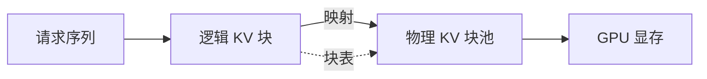

# 推理引擎 vLLM 深度解析

> vLLM 是当下最流行的开源 LLM 推理与服务框架，核心贡献是 **PagedAttention**——把 KV Cache 像操作系统虚拟内存一样分页管理，大幅提升显存利用率与吞吐。

## 1. 为什么需要 vLLM

| 传统推理 | vLLM |
| --- | --- |
| 静态连续 KV Cache，预分配最大长度 | 分页按需分配，消除碎片 |
| 显存浪费严重，并发低 | 显存利用率近 100% |
| 无连续批处理或仅静态批 | 连续批处理（Continuous Batching） |
| 吞吐低 | 吞吐提升数倍到数十倍 |

## 2. 核心机制：PagedAttention



- **逻辑块**：每个序列的 KV 按固定 token 数（如 16）切块。
- **物理块**：实际显存中的块，由全局块池分配。
- **块表（Block Table）**：逻辑块→物理块的映射，支持共享（如同一前缀的并行采样可共享块，即 copy-on-write）。
- **按需增长**：序列变长时动态分配新块，不产生预留浪费。

## 3. 连续批处理（Continuous Batching）

传统静态批处理要等最慢的请求完成才能释放整批；连续批处理在每一步动态地把"已结束/已生成完"的请求移出，新请求随时加入，GPU 利用率显著提升。

```python
from vllm import LLM, SamplingParams

llm = LLM(model="meta-llama/Llama-3-8B",
          tensor_parallel_size=2,
          gpu_memory_utilization=0.9)
params = SamplingParams(temperature=0.7, top_p=0.9, max_tokens=256)
outputs = llm.generate(["你好", "介绍一下北京"], params)
for o in outputs:
    print(o.prompt, "->", o.outputs[0].text)
```

## 4. 关键参数调优

| 参数 | 作用 | 建议 |
| --- | --- | --- |
| `gpu_memory_utilization` | 显存占用比例 | 0.85~0.95，留余量给碎片 |
| `max_num_seqs` | 最大并发序列数 | 受显存与 batch 限制 |
| `max_num_batched_tokens` | 单步最大 token 数 | 控制步长峰值 |
| `block_size` | 块大小 | 默认 16，通常不改 |
| `tensor_parallel_size` | 张量并行卡数 | 按模型大小与卡数 |

## 5. 量化与显存

vLLM 支持 AWQ / GPTQ / bitsandbytes / FP8 等量化：
- **AWQ/GPTQ**：训练后权重量化到 4bit，几乎无损。
- **FP8**：Hopper 架构原生，推理更快。
- 量化可把 70B 模型塞进单张 80G 卡，或提升并发。

## 6. 服务化（OpenAI 兼容 API）

```bash
python -m vllm.entrypoints.openai.api_server \
  --model meta-llama/Llama-3-8B \
  --tensor-parallel-size 2 \
  --port 8000
```

启动后提供 `/v1/chat/completions`，与 OpenAI SDK 直接兼容，业务侧零改造切换。

## 7. 多 LoRA 与多模型

- **多 LoRA**：同一基座加载多个 LoRA 适配器，按请求路由，显存共享。
- **模型置换**：支持在队列空闲时切换模型（吞吐换灵活性）。

## 8. 常见坑

| 坑 | 现象 | 对策 |
| --- | --- | --- |
| 显存 OOM | 并发一高就崩 | 降 `gpu_memory_utilization`、减 `max_num_seqs` |
| 首 token 慢 | 预填充长 | 限制输入长度、批处理优化 |
| 量化掉点 | 输出质量降 | 选成熟量化方案、评测对比 |
| 长上下文爆显存 | KV 过大 | 用 PagedAttention + 限制 max_model_len |

## 9. 面试题

1. PagedAttention 解决了什么问题？
2. 连续批处理与传统批处理的区别？
3. vLLM 如何实现前缀共享（copy-on-write）？
4. 量化对吞吐和质量的权衡？
5. 为什么 vLLM 显存利用率远高于原生 HF 推理？

## 10. 小结

vLLM 通过 PagedAttention + 连续批处理把 GPU 推理效率推向生产级。调优重点在显存占比、并发上限与量化策略，并以 OpenAI 兼容 API 降低接入成本。
