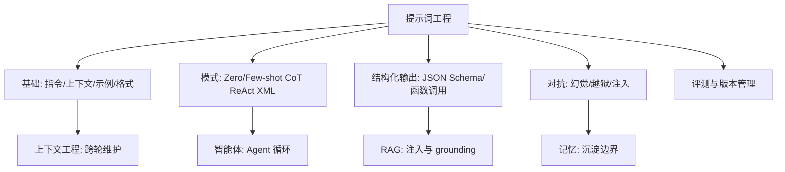
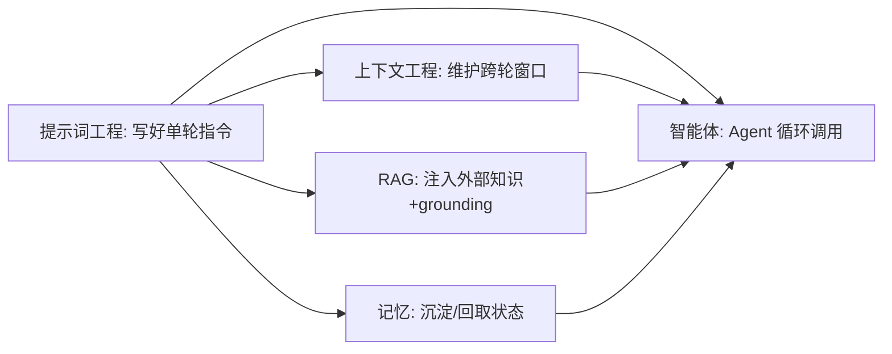

# 提示词工程（Prompt Engineering）

> 本模块整理自 GitHub 与各大模型厂商的公开官方文档，聚焦「如何写出高质量提示词」的通用技巧与模式，可作为日常与大模型（LLM）协作的速查手册。
>
> 内容立场：提示词没有「万能公式」，核心是**清晰、具体、给足上下文、用示例校准**，并针对具体模型迭代验证。

## 内容索引

| 文件 | 内容 | 形态 |
| --- | --- | --- |
| [01-概述.md](./01-概述.md) | 什么是提示词工程、为什么重要、主流资料来源 | 📝 文字 |
| [02-核心原则与最佳实践.md](./02-核心原则与最佳实践.md) | OpenAI 八条经验法则、Anthropic 最佳实践、Microsoft 4S 原则 | 📝 文字 |
| [03-提示技巧与模式.md](./03-提示技巧与模式.md) | 零样本/少样本、思维链、ReAct、XML 标签、角色设定、长上下文等 | 📝 文字 |
| [04-场景化实战与模板.md](./04-场景化实战与模板.md) | 代码生成、RAG、Agent/智能体、示例模板与避坑清单 | 📝 文字 |

## 主要参考来源（GitHub / 官方文档）

- **dair-ai/Prompt-Engineering-Guide**：https://github.com/dair-ai/Prompt-Engineering-Guide （最全面的开源提示词工程指南，含论文、Notebook、工具合集）
- **Anthropic Prompting Best Practices**：https://docs.anthropic.com/en/prompt-library/library
- **Anthropic 企业落地案例**：https://www.anthropic.com/news/prompt-engineering-for-business-performance
- **OpenAI 最佳实践**：https://help.openai.com/en/articles/6654000-best-practices-for-prompt-engineering-with-openai-api
- **OpenAI GPT-5 提示指南**：https://developers.openai.com/cookbook/examples/gpt-5/gpt-5_prompting_guide/
- **Microsoft prompt-engineering**：https://github.com/microsoft/prompt-engineering （及 Learn 上的 4S 原则）

> ⚠️ 本模块为「整理 + 个人化注解」，非原创理论。文中标注的准确率/性能提升数据均来自上述厂商公开案例，具体效果因模型版本与任务而异，请以你自己的评测为准。

## 本子模块学习路径

1. `01-概述.md`：提示词组成、零 / 少样本范式、核心心法、常见反例。
2. `02-核心原则与最佳实践.md`：OpenAI 八条、Anthropic 实践、Microsoft 4S、角色与约束、Few-shot 设计。
3. `03-提示技巧与模式.md`：Zero/Few-shot、CoT/ToT、XML、角色、结构化输出、对抗幻觉。
4. `04-场景化实战与模板.md`：代码 / RAG / Agent 模板与避坑清单。

## 核心要点速览

- 核心共识：清晰、具体、给上下文、用示例、迭代。
- 黄金校验法：把提示给零背景同事看，他懵则模型也懵。
- 没有跨模型通用最优提示，务必针对实际模型验证（Claude 用 XML、OpenAI 用 `###`/`"""`）。
- 先最小可用，再用评测小样本迭代；反例与模板是最好的学习材料。

## 推荐延伸阅读

- dair-ai/Prompt-Engineering-Guide（最全面开源指南）
- Anthropic Prompt Library
- OpenAI 最佳实践 / GPT-5 提示指南
- Microsoft prompt-engineering（4S 原则）
- 本知识库「上下文工程」「RAG」「记忆」模块（提示词是上下文工程的输入之一）

## 一、核心概念地图（Mermaid 概念全景）

> 上图把提示词工程放在「单轮输入设计」的核心：它产出结构化/可控的提示，被上下文工程维护、被智能体循环调用、被 RAG 注入、被记忆沉淀。

## 二、速查表（Cheat Sheet）

| 决策点 | 默认 | 何时调整 |
| --- | --- | --- |
| 范式 | 先零样本 | 不稳再少样本，再微调 |
| 分隔符 | Claude→XML / OpenAI→`###`/`"""` | 按模型脾气 |
| 长文档摆位 | 文档上、指令中、查询末 | 多文档复杂任务 |
| 复杂推理 | CoT → 自洽 → ToT | 需搜索回溯用 ToT |
| 需外部信息 | ReAct + 工具 | Agent 场景 |
| 结构化输出 | 函数调用/JSON Schema | 程序要解析时 |
| 防幻觉 | 限知识边界+引用+说不知 | 事实性任务 |
| 评测 | 小批 cases 回归 | 每次改动必跑 |

## 三、常见误区清单

1. **指令模糊**：「写得好一点」不可验证，改具体可测要求。
2. **负向指令**：「不要 XX」易漏边界，改正向「要 XX」。
3. **一次堆满技巧**：CoT+角色+少样本全上，难排障，先最小可用。
4. **跨模型硬套**：Claude 用 XML、OpenAI 用 `###`，别混用不验证。
5. **长文档后置**：长文档应放最前、查询放最后。
6. **示例脱节**：语言/任务/格式不一致，模型无所适从。
7. **依赖模型自知最新事实**：用 RAG/工具补外部知识。
8. **无评测靠感觉**：建小批测试用例做前后对比。
9. **纯文本约束结构**：程序要解析就用 JSON Schema/函数调用。
10. **提示层防越狱 alone**：高风险必须叠加服务端护栏。

## 四、与其它子模块关系

- **与上下文工程**：提示词是上下文工程的「输入之一」；后者管跨轮窗口维护，前者管单次指令质量。
- **与 RAG**：检索片段靠提示模板约束「如何引用、如何 grounding 不编造」。
- **与记忆**：记忆沉淀的内容（NOTES.md）需提示指示「何时读回、怎么用」。
- **与智能体**：ReAct/Reflexion 等提示范式是 Agent 循环的核心引擎；提示决定主动性/安全边界。

## 五、面试高频问题（速记）

- 提示词工程与微调怎么取舍？OpenAI 建议路径是什么？
- 零样本/少样本/微调三者的适用边界？
- 长上下文摆位有什么技巧？为什么查询放最后？
- CoT / Self-Consistency / ToT 分别解决什么？
- ReAct 的循环结构是什么？和 Reflexion 区别？
- 怎么让模型输出稳定可解析的结构（JSON Schema/函数调用）？
- 怎么用提示对抗幻觉？越狱/提示注入怎么防？
- 怎么评测提示有效性？提示要不要版本管理？
- 不同模型（Claude/OpenAI）提示风格差异？
- 主动性与安全边界怎么用提示校准？

## 六、整合学习路径（与四个子模块串起来）

> 以上为提示词工程子模块全局速查与导航。建议先打牢本模块的「指令/示例/模式」，再向上衔接上下文工程与智能体。各篇（01~04）给出概述、原则、模式与场景模板的细节。
