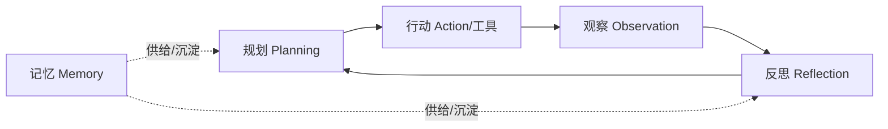
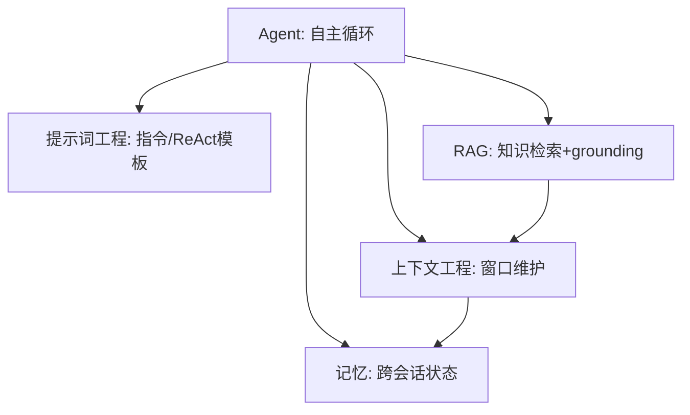

# 01 概述与核心概念

> 一句话：智能体（Agent）是一类**让 LLM 动态主导自己的流程与工具使用**的系统；它不是某个具体框架，而是一种「感知—思考—行动—观察」循环下的自主任务执行范式。

## 一、什么是智能体（Agent）

「Agent」在业界有多种定义。有人指**完全自主、长时间独立运行、调用多种工具**的系统；有人指**按预设工作流执行**的较受限实现。Anthropic 把所有这些变体统称为 **agentic systems（智能体系统）**，但做了一个关键的**架构区分**：

| 类型 | 定义 | 控制权 |
| --- | --- | --- |
| **Workflow（工作流）** | LLM 与工具由**预定义的代码路径**编排 | 流程由代码写死，模型在固定节点被调用 |
| **Agent（智能体）** | LLM **动态主导**自己的过程与工具使用，自己决定如何完成任务 | 模型掌握控制权，自主决定下一步 |

> 关键认知：**这不是「智能体 vs 工作流」的二选一，而是同一谱系的两端**。实际系统往往混合——一部分写死、一部分交给模型自主。Anthropic 在「Building Effective Agents」一文中把两者都归为 agentic systems。

### 1. 基本构建块：增强型 LLM（Augmented LLM）

无论 workflow 还是 agent，底层基石都是**增强型 LLM**：一个 LLM 配上三类增强能力——

- **检索（Retrieval）**：能主动生成搜索/查询，获取外部信息（见本库「RAG」模块）。
- **工具（Tools）**：能选择合适的工具并调用（见 `03-工具调用与MCP.md`）。
- **记忆（Memory）**：能决定保留哪些信息、跨轮/跨会话维持状态（见本库「记忆」模块）。

```text
        ┌──────────── 增强型 LLM ────────────┐
输入 ──▶│  指令 + 检索 + 工具 + 记忆  = 能力    │──▶ 输出/动作
        └────────────────────────────────────┘
```

> 实务心法：很多应用**优化单条增强调用（加检索、加 few-shot、加工具）就足够了**，根本不需要让模型进入自主循环。先问「单条调用能不能解决」，再谈 agent。

## 二、智能体 vs 聊天机器人 / Copilot

| 维度 | 聊天机器人（Chatbot） | Copilot（副驾） | 智能体（Agent） |
| --- | --- | --- | --- |
| 交互方式 | 一问一答 | 在用户工作流中**建议/补全** | **自主执行**多步任务 |
| 谁掌控流程 | 用户一步步问 | 用户主导，AI 辅助 | **AI 主导**，用户设目标 |
| 工具使用 | 通常不调 | 调，但需用户触发/确认 | 自主决定调哪些、何时调 |
| 任务跨度 | 单轮 | 当前文件/上下文 | 跨多个系统、多轮、长时间 |
| 失败处理 | 用户纠正 | 用户纠正 | 自行重试/规划/反思 |

> Copilot 与 Agent 的本质区别在**控制权**：Copilot 是人类副驾（人开车），Agent 是给定目标后自己开车（必要时请求人类兜底）。

## 三、四大核心能力

一个成熟的智能体通常具备以下能力（不一定全有，按需取舍）：

### 1. 自主规划（Planning）
把模糊目标拆成可执行的步骤序列，并能根据中间结果**动态调整计划**。对应认知架构见 `02-架构与核心组件.md`。

### 2. 工具使用（Tool Use）
调用外部工具（搜索、代码执行、API、文件系统）来获取上下文或改变世界。这是智能体「从说话到做事」的关键跃迁。

#### 2.1 浏览器 / 操作系统代理（GUI Agent，2025-2026 最热落地方向）

- **代表**：Anthropic Computer Use、OpenAI Operator / ChatGPT Agent（浏览器）、browser-use、Playwright MCP（开源）、OS 级（模拟点击/键盘，如 Claude Computer Use SDK）；
- **本质**：把「看屏幕（截图/无障碍树）→ 决策 → 点击/输入/滚动」包装成 Agent Loop 的一轮行动——模型从「调用 API」扩展到「操作人类界面」；
- **可靠性现状**：GUI 代理成功率显著低于 API 工具（截图像素级理解、元素定位、页面动态变化），2026 年主流方案从「纯视觉点击」转向「**无障碍树 + 结构化页面模型**」混合定位；
- **安全特殊性**：权限面极大（能操作真实账号/支付/邮件）——必须沙箱/容器隔离、敏感操作 HITL 确认、最小权限浏览器会话（详见 06 篇护栏）；
- **工程范式**：优先「能走 API 就走 API，API 不行再 GUI」——GUI 是兜底而非首选。

> 一句话：**GUI 代理 = 让 Agent 操作真实界面（Computer Use / Operator / browser-use），是最热落地方向；可靠性靠无障碍树增强，安全靠沙箱与 HITL，能用 API 就不上 GUI。**

### 3. 记忆（Memory）
- **短期**：维护当前会话的上下文窗口（依赖「上下文工程」模块）。
- **长期**：跨会话持久化决策、状态、用户偏好（依赖「记忆」模块）。

### 4. 反思（Reflection）
对自己的输出/行动做**自我批评与校验**，发现错误后修正。典型实现是 Reflexion 架构（见 02 篇）。



## 四、Agent Loop（智能体循环）

智能体的运行本质是**一个反馈循环**：**收集上下文 → 采取行动 → 验证结果 → 重复**。这是 Claude Agent SDK 等官方文档反复强调的核心心智模型。

```text
   ┌──────────────────────────────────────────────┐
   │                                              ▼ │
 收集上下文  ──▶  规划/思考  ──▶  行动(调工具)  ──▶  观察结果
   ▲                                              │
   └──────────────── 未达成目标，带着新信息再循环 ───┘
```

在 OpenAI Agents SDK 中，这个循环由 `Runner.run()` 驱动：

```text
Runner.run(agent, input):
  loop:
    调用 LLM（带当前上下文）
    if 产生最终输出: 终止，返回结果
    if 触发 handoff: 切换到目标 agent 继续循环
    else: 执行 tool_calls，把结果回灌给 LLM，继续循环
```

> 这其实就是标准 **ReAct（Reason + Act）模式**的工程实现（详见 02 篇）。不同框架只是把这套循环封装成了不同的原语。

## 五、何时该用 / 何时不该用

Anthropic 的明确建议：**找最简单的方案，只在确有必要时增加复杂度。**

- ✅ **用 workflow**：任务能清晰拆解、需要**可预测性与一致性**（如固定流水线、分类路由）。
- ✅ **用 agent**：需要**灵活性与模型驱动的决策**，且任务难以预先写死（如开放式的深度研究、跨系统长任务）。
- ⚠️ **先别用 agentic 系统**：很多应用靠「单条 LLM 调用 + 检索 + 上下文示例」就够好。Agentic 系统通常用**延迟和成本换取任务表现**——要权衡是否值得。

> 经验法则（来自 Anthropic 工程实践）：**不要一上来就搭复杂框架**。先用 LLM API 直接实现，很多模式几行代码就能跑；真需要框架时，也要理解它底层的 prompts 与调用，避免「黑盒依赖」导致难以调试。

## 六、常见误区

- ❌ 「智能体 = 必须多智能体」：单智能体 + 好工具常常就够，多智能体是手段不是目标（详见 04 篇）。
- ❌ 「框架越重越专业」：Anthropic 观察到最成功的落地往往用**简单、可组合的模式**，而非复杂框架。
- ❌ 「自主 = 全自动」：生产环境几乎都要**人在环（HITL）**兜底高风险操作（详见 06 篇护栏部分）。

> ⚠️ 真实数据警示：第三方评测（Forrester 等，经 Galileo 引用）显示，AI 智能体在需要**多步推理 + 工具调用**的真实企业任务上失败率可达 70–90%；即便上线后，真实企业环境中的失败率也常被报道在约 60% 量级。**不要把 agent 当确定性软件**，必须配评估、护栏与可观测（见 06 篇）。

## 参考来源

- Anthropic — Building Effective Agents：https://www.anthropic.com/engineering/building-effective-agents
- Anthropic — Building agents with the Claude Agent SDK：https://www.anthropic.com/engineering/building-agents-with-the-claude-agent-sdk
- OpenAI Agents SDK 文档：https://openai.github.io/openai-agents-python/
- Galileo — AI Agent Guardrails Framework（引用 Forrester 失败率数据）：https://galileo.ai/blog/ai-agent-guardrails-framework

## 七、智能体与四个子模块的协同

Agent 不是孤岛，它的能力正来自与其它四个子模块的组合：



| 子模块 | 给 Agent 带来 | 缺了会怎样 |
| --- | --- | --- |
| 提示词工程 | 单轮指令质量、ReAct 模板 | agent 行为不可控、格式乱 |
| 上下文工程 | 窗口不爆、长任务可续 | 上下文腐烂、长任务失忆 |
| RAG | 外部知识 + 出处 | 幻觉、知识过时 |
| 记忆 | 跨会话连续性与偏好 | 每次重交代、记不住用户 |

> 💡 实战顺序：先把「单条增强调用」（提示词+RAG+记忆）打磨好，再引入 Agent Loop 与多智能体；底座不稳，编排再花哨也救不回。
