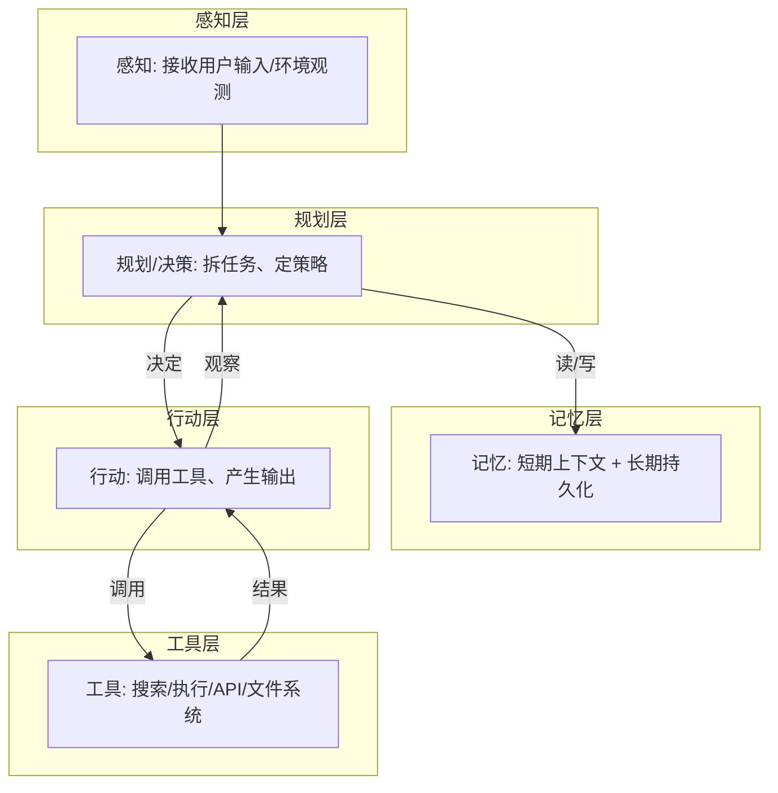
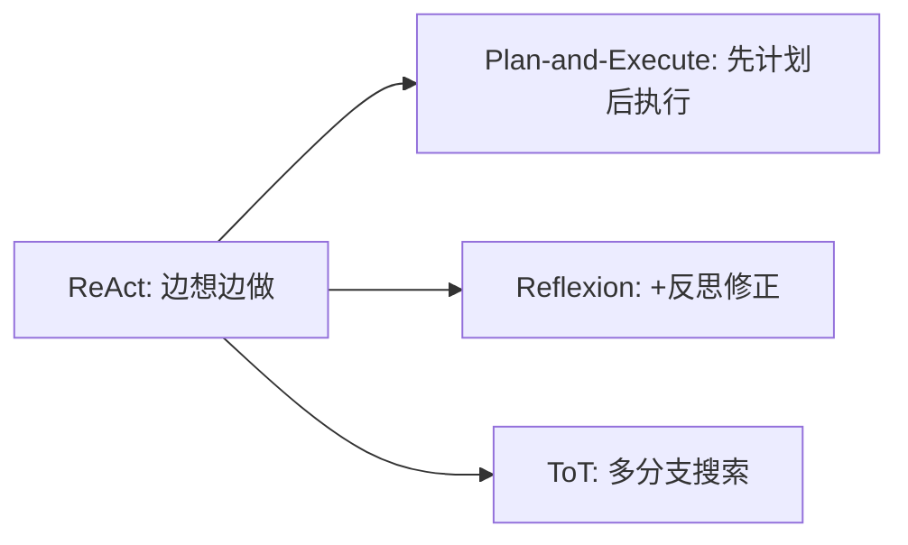

# 02 架构与核心组件

> 本节先讲智能体系统的基本构建块与分层架构，再落到上下文工程在其中的角色，最后展开四种主流**认知架构（Cognitive Architecture）**模式：ReAct、Plan-and-Execute、Reflexion、Tree of Thoughts。这些是几乎所有框架的底层范式。

## 一、增强型 LLM：系统基石

如 01 篇所述，**增强型 LLM = LLM + 检索 + 工具 + 记忆**。它是 agentic 系统的最小单元。实现增强的方式很多，Anthropic 推荐通过 **MCP（Model Context Protocol）** 接入不断壮大的第三方工具生态（详见 `03-工具调用与MCP.md`）。

> 设计重点不在「堆能力」，而在两点：**（1）让增强能力贴合你的具体场景；（2）给 LLM 提供易用、文档完备的接口**。

## 二、智能体系统分层架构

一个较完整的智能体系统可抽象为五层，自上而下协作：



| 层 | 职责 | 关键问题 |
| --- | --- | --- |
| 感知（Perception） | 接收用户指令、环境状态、工具返回 | 「此刻有哪些新信息？」 |
| 规划（Planning） | 把目标拆步、决定下一步动作 | 「我该怎么达成目标？」 |
| 记忆（Memory） | 维护短期上下文与长期状态 | 「我记过什么？该记住什么？」 |
| 工具（Tools） | 提供改变世界/获取信息的能力 | 「我能调用什么？」 |
| 行动（Action） | 执行工具调用、产出最终响应 | 「我现在做什么？」 |

## 三、上下文工程在 Agent 中的角色

智能体在循环中不断产生新数据，上下文窗口因此被快速填满。**上下文工程（见本库「上下文工程」模块）是 Agent 的命脉**：

- 上下文腐烂（context rot）：窗口越长，模型回忆关键信息的能力越差。
- Anthropic 三大杠杆同样适用于 Agent：
  1. **Compaction（压缩）**：长会话蒸馏为高保真摘要。
  2. **Tool-result clearing（工具结果清理）**：丢弃旧的、可重获的工具结果，但保留「调用发生过」的记录。
  3. **Memory / 结构化笔记**：把状态沉淀到窗口外的存储（如 `NOTES.md`、memory tool）。

```text
上下文窗口（小、快）      │     外部存储（大、持久）
─────────────────        │     ─────────────────
当前任务 + 精简摘要  ◀──拉取── NOTES.md / memory
                        └──写入── 里程碑、决策、状态
```

> 智能体工程的很大一部分，本质是「**如何在有限注意力预算内，每轮只保留最高信号的 token**」。

## 四、认知架构模式（Cognitive Architectures）

不同「规划—行动」组织方式，对应不同认知架构。下面四种是最常被引用的范式。

### 1. ReAct（Reason + Act）

**思路**：交替进行「推理（Thought）」与「行动（Action）」，每步把观察（Observation）回灌，再推理下一步。这是 Agent Loop 最经典的实现。

```text
Thought: 我需要先查一下订单状态
Action: search_order(id=123)
Observation: 订单已发货，物流单号 SF123
Thought: 用户问的是预计到达时间，需要查物流
Action: track_logistics(SF123)
Observation: 预计明天送达
Thought: 信息齐全，可以回答了
Final Answer: 您的订单预计明天送达。
```

- **适用**：绝大多数工具调用型 agent、客服、研究助手。
- **优点**：简单、可解释、易实现。
- **缺点**：容易在长任务里「走偏」或陷入重复。

### 2. Plan-and-Execute（先计划，再执行）

**思路**：先让模型**一次性产出完整计划**，然后按计划逐步执行；执行中可重新规划。把「规划」与「执行」解耦，降低每步的认知负担。

```python
plan = llm.plan(goal)          # 先生成整体计划
for step in plan:
    result = execute(step)     # 逐步执行
    if need_replan(result):    # 出现偏差再重规划
        plan = llm.plan(goal, context=result)
```

- **适用**：步骤明确、可预先分解的任务（写代码、跑实验、长文档生成）。
- **优点**：计划可审查、可复用、对长任务更稳。
- **缺点**：初始计划可能过时；重规划成本高。

### 3. Reflexion（反思 / 自我修正）

**思路**：在 ReAct 基础上增加**反思步骤**——任务结束后（或失败后），让模型「复盘」哪里做错了，把反思写进记忆，下一轮避免重蹈。

```text
尝试 → 失败/不达标
   ↓
反思：我为什么失败？下次应注意 X
   ↓
把反思存入 memory
   ↓
带着反思重新尝试（通常表现更好）
```

- **适用**：需要反复试错的任务（代码调试、复杂推理、决策）。
- **优点**：显著提升困难任务的成功率，是「反思」能力的工程化。
- **缺点**：多一轮 LLM 调用，成本/延迟增加。

### 4. Tree of Thoughts（ToT，思维树）

**思路**：把「线性推理」扩展为**树状搜索**——在关键决策点生成多个候选「思维」，用模型自评或启发式打分，保留高分分支，做 BFS/DFS 搜索。

```text
        根(问题)
       /    |    \
     思考A  思考B  思考C      ← 多分支
      ↓      ↓      ↓
   评估打分 → 保留 B、C
            /   \
         思考B1 思考B2  ...    ← 继续展开高分分支
```

- **适用**：需要搜索/探索的任务（谜题、规划、博弈、创意生成）。
- **优点**：比 CoT 更能避免「一条路走到黑」。
- **缺点**：调用次数多、成本高，通常只在确有探索价值的场景使用。

### 模式选型速查

| 架构 | 复杂度 | 适用场景 | 关键代价 |
| --- | --- | --- | --- |
| ReAct | 低 | 通用工具调用、客服、研究 | 易走偏/重复 |
| Plan-and-Execute | 中 | 步骤可预分解的长任务 | 计划可能过时 |
| Reflexion | 中高 | 需试错修正的难任务 | 多一轮反思调用 |
| ToT | 高 | 需搜索探索的难题 | 调用多、成本高 |



## 五、长时间运行智能体的特殊架构

跨多个上下文窗口的长任务（如「搭一个完整 Web 应用」）是开放难题：每个新会话都从「失忆」开始。Anthropic 的 **effective harnesses** 方案给出两 agent 模式：

- **Initializer Agent（初始化 agent）**：第一个会话用专用提示搭建环境——写 `init.sh`、维护 `claude-progress.txt` 进度文件、做初始 git 提交。
- **Coding Agent（编码 agent）**：之后每个会话只做**增量推进**，结束前把状态以结构化方式（如 JSON 功能清单，含 `passes` 字段）留给下一个会话。

```text
会话1: Initializer → 搭环境 + 写 feature list(全 fails) + git commit
会话2: Coding      → 实现部分功能, 改 passes=true, 留干净状态
会话3: Coding      → 继续... (带着 git 历史 + progress.txt 恢复上下文)
```

> 核心洞见：**让 agent 在「干净状态」下交接**（像给下一班工程师留清晰交接文档），是跨会话保持进展的关键。呼应「记忆」模块——把状态外置、可恢复。

### 5.1 Checkpoint / 睡眠-唤醒模式（长任务恢复三板斧）

「两 agent 交接」之外，2025 年工程界沉淀出可落地的恢复模式，按粒度分三档：

| 粒度 | 机制 | 适用 |
| --- | --- | --- |
| **进度文件** | 会话内定期写 `progress.md`/`state.json`（已完成、下一步、坑） | 会话被中断/超时后人工续跑 |
| **状态快照（Checkpoint）** | 序列化 agent 完整状态（记忆索引 + 待办队列 + 已执行工具结果摘要）到外部存储，重启时反序列化恢复 | 平台型 agent（后台任务/队列） |
| **平台级睡眠/唤醒（Sleep-Wake）** | 服务端持久化整个 agent 运行时，任务排队时「睡眠」释放资源，触发时「唤醒」恢复 | 长任务调度（作业系统/深度研究） |

```python
# 最小 checkpoint：每 N 步把「可恢复状态」落盘
class AgentWithCheckpoint:
    def run(self, task):
        state = self.load("state.json") or init_state(task)
        while not state.done:
            step = self.act(state)                  # 模型决策
            state.apply(step)
            if step.n % 5 == 0:
                self.save("state.json", state)      # 崩溃后从最后 5 步内恢复
        self.save("state.json", state)
```

> 注意：**只 checkpoint「外置状态」才可靠**——模型内部隐状态（注意力里的东西）是不可序列化的，恢复等价于「带记忆上下文重开会话」（即 02 篇 Auto Memory 做的事）。设计原则：**一切需要恢复的信息必须显式外置（文件/数据库），模型只负责读与写。**

## 参考来源

- Anthropic — Effective context engineering for AI agents：https://www.anthropic.com/engineering/effective-context-engineering-for-ai-agents
- Anthropic — Effective harnesses for long-running agents：https://www.anthropic.com/engineering/effective-harnesses-for-long-running-agents
- Anthropic — Building Effective Agents（Workflow 模式）：https://www.anthropic.com/engineering/building-effective-agents
- Yao et al., ReAct（2022）；Shinn et al., Reflexion（2023）；Yao et al., Tree of Thoughts（2023）

## 六、认知架构代码模板

把四种认知架构落成可运行骨架，便于直接改造。

**ReAct（边想边做）**

```python
def react(llm, tools, task, max_steps=10):
    msgs = [{"role": "user", "content": task}]
    for _ in range(max_steps):
        out = llm(messages=msgs, tools=tools)
        if out.final:
            return out.text
        call = out.tool_calls[0]
        res = run_tool(call)                        # 执行动作
        msgs += [out, {"role": "tool", "content": res}]   # 观察回灌
    return "未达成"
```

**Plan-and-Execute**

```python
plan = llm.plan(task)
for step in plan:
    res = execute(step)
    if need_replan(res):
        plan = llm.plan(task, context=res)          # 动态重规划
```

**Reflexion（失败→反思→重试）**

```python
for attempt in range(3):
    res = react(llm, tools, task)
    if res.ok:
        break
    reflect = llm.reflect(task, res)                # 写反思
    task = f"{task}\n反思:{reflect}"                # 带反思重试
```

> 💡 选架构先看任务：通用工具调用用 ReAct；步骤可预分解用 Plan-and-Execute；需试错用 Reflexion；需探索用 ToT。多数生产 agent 用 ReAct/Plan-and-Execute 足矣。
