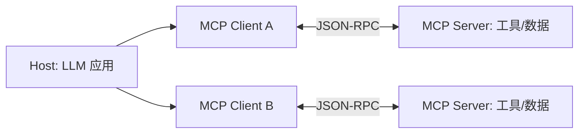

# 03 工具调用与 MCP

> 工具是智能体「从说话到做事」的跃迁点。本文讲三部分：**Function Calling 原理 → 工具设计（ACI）→ MCP 标准协议 → 结构化输出**，最后给出工具安全红线。

## 一、Function Calling（函数调用）原理

主流大模型原生支持「工具调用」：模型不在文本里瞎编答案，而是**输出结构化的工具调用请求**，由运行时执行并把结果回灌。

### 1. 调用流程

```text
① 系统定义工具清单（name + 描述 + 参数 JSON Schema）
② 用户提问：把问题 + 工具清单一起发给 LLM
③ LLM 输出 tool_calls：{name: "search", arguments: {q: "..."}}
④ 运行时执行该工具，拿到结果
⑤ 把结果作为 tool 消息回灌给 LLM
⑥ LLM 基于结果继续推理 / 回答（或再次调用工具）
```

```python
# 概念示意（以 OpenAI/Anthropic 风格统一抽象）
tools = [{
    "name": "search_web",
    "description": "用关键词检索网页，返回前 5 条结果摘要",
    "parameters": {
        "type": "object",
        "properties": {"query": {"type": "string"}},
        "required": ["query"],
    },
}]
resp = llm.chat(messages, tools=tools)      # ③ 模型请求调用
if resp.tool_calls:
    for call in resp.tool_calls:
        result = run_tool(call.name, call.arguments)   # ④ 运行时执行
        messages.append({"role": "tool", "content": result})  # ⑤ 回灌
    resp = llm.chat(messages, tools=tools)   # ⑥ 继续推理
```

> 关键点：模型**只决定「调什么、传什么参」**，真正执行由你的代码负责。这既是能力来源，也是安全边界（见第五节）。

### 2. 解析与校验

- 框架通常**自动从函数签名生成 JSON Schema**（如 OpenAI Agents SDK 的 `@function_tool` 从 Python 类型提示 + docstring 生成）。
- 执行前做 **Pydantic / JSON Schema 校验**，避免脏参数进入工具。
- 失败要**返回明确错误**而非崩溃，让模型有机会重试。

## 二、工具设计：ACI（Agent-Computer Interface）

Anthropic 提出一条金句级原则：

> **像做 HCI（人机界面）一样，认真做 ACI（Agent-Computer Interface）。** 你在工具设计上投入的精力，应该和人机界面工程一样多。

好的工具设计要点：

- **清晰命名 + 详尽说明**：工具名、参数名、描述写清楚——模型靠描述决定何时调用。
- **参数少而准**：避免过多可选参数；用结构化参数而非一大段自由文本。
- **错误处理友好**：返回明确错误信息、提供合理回退，而不是抛异常。
- **充分测试**：模拟各种异常输入，收集使用数据迭代（模型也会「用错」工具）。

```text
❌ 差的工具:  run(cmd: str)            —— 参数模糊，模型易误用
✅ 好的工具:  search_docs(query: str, top_k: int=5)  —— 意图明确、有默认值
```

## 三、MCP：模型上下文协议（Model Context Protocol）

工具越来越多后，每个集成都要写一套适配，碎片化严重。**MCP 是 Anthropic 于 2024-11-25 发布的开放标准**，目标是「一次编写，到处集成」——把 LLM 与工具/数据源的连接标准化。2025-12-09 捐赠给 Linux 基金会下的 Agentic AI Foundation（AAIF）。

> 截至 2026 年，MCP 已成为连接模型与工具/数据的**事实上标准**：月 SDK 下载量 9700 万+，活跃 MCP 服务器 1 万+，并被 OpenAI、Google、Microsoft 采用（ChatGPT、Gemini、Copilot、VS Code 等均集成）。GitHub、Stripe、Notion、Hugging Face、Postman 等均已发布官方 MCP 服务器。

### 1. 架构：Client–Host–Server

MCP 基于 **JSON-RPC 2.0（UTF-8）**，采用三层架构：

- **Host（宿主）**：运行 LLM 的容器应用（如 Claude Desktop、IDE 插件、某 agent 框架）。
- **Client（客户端）**：Host 内每个 MCP 连接对应一个 Client，与**单个 Server 1:1**。
- **Server（服务器）**：暴露能力的独立进程/服务。

初始化时做**双向能力协商（capability negotiation）**，会话在 JSON-RPC 上保持有状态。



### 2. 三大服务端原语 + 两类客户端特性

| 类别 | 原语 | 作用 |
| --- | --- | --- |
| 服务端 | **Tools（工具）** | 可被执行的能力（如查数据库、发 API） |
| 服务端 | **Resources（资源）** | 可被读取的上下文（文件、记录） |
| 服务端 | **Prompts（提示模板）** | 预置的提示工作流 |
| 客户端 | **Roots（根）** | 客户端告知 server 可访问的本地路径边界 |
| 客户端 | **Sampling（采样）** | server 反向请求 LLM 补全（让 server 也能用模型） |

### 3. 传输方式（Transports）

- **stdio**：本地子进程，换行分隔的 JSON-RPC，适合本机工具。
- **Streamable HTTP**：单端点，可选 SSE，用 `Mcp-Session-Id` 管理会话，`Last-Event-ID` 支持断点续传（取代了早期的独立 SSE 传输）。

### 4. 版本演进（精选）

| 版本 | 时间 | 关键变化 |
| --- | --- | --- |
| 2024-11-05 | 2024-11 | 首次发布；stdio + HTTP/SSE；核心原语 |
| 2025-03-26 | 2025-03 | Streamable HTTP 取代 SSE；会话管理；OAuth 2.1 |
| 2025-06-18 | 2025-06 | 结构化输出、Elicitation（向用户补问）、改进授权 |
| 2025-11-25 | 2025-11 | **Tasks（异步任务）**、Extensions 框架、企业级授权、图标 |

> Tasks 是实验性特性：让「调用即返回、稍后取结果」的长时间操作（代码迁移、深度研究、多智能体并发）变得可管理，状态含 `working / input_required / completed / failed / cancelled`。

### 5. 实践亮点：用代码调用工具省 token

Anthropic 工程博客（2025-11-04）提出 **code execution with MCP**：当工具很多时，让 agent**写一段代码去调用工具**，而不是逐个直接调用——实测可将 token 从 ~150K 降到 ~2K（**约 98.7% 的 token 削减**）。这对工具爆炸（tool explosion）场景极具价值。

### 6. 主流框架的 MCP 支持

- **Claude Agent SDK**：原生最深，支持 stdio/SSE/HTTP，还有「进程内 SDK MCP Server」（Python 函数直接变 MCP 工具，无需子进程）。
- **OpenAI Agents SDK**：原生，支持 Hosted MCP / HTTP+SSE / stdio，带工具过滤与缓存。
- **CrewAI**：原生，有专门 MCP 文档（stdio/SSE/HTTP 三种传输、多服务器、安全配置）。
- **Google ADK**：三语言版均集成 MCP SDK（`mcp_tool` 模块）。
- **LangGraph**：通过 `langchain-mcp-adapters` 桥接（非原生）。
- **Microsoft Agent Framework**：通过 Foundry Toolboxes 与 A2A 间接支持。

## 四、结构化输出（Structured Outputs）

需要让 agent 产出**可程序消费**的结果（而非自由文本）时，用结构化输出：

- 给 agent 一个 **output schema（JSON Schema / Pydantic 模型）**，agent loop 会持续直到产出匹配 schema 的结果。
- 用途：信息抽取、分类、作为下一 agent 的输入（链式 agent）。
- 厂商支持：OpenAI Structured Outputs、Anthropic 结构化输出、Gemini 上下文缓存等。

```python
from pydantic import BaseModel

class Ticket(BaseModel):
    category: str
    urgency: int
    summary: str

agent = Agent(name="triager", output_type=Ticket)  # 产出必为 Ticket 结构
```

## 五、工具安全红线

工具让 agent 能「改变世界」，也带来风险。**Lethal Trifecta（致命三重奏）**：当以下三点同时存在即构成漏洞——

1. **可访问私有数据**（邮件、文件、数据库）
2. **会处理不可信输入**（来自外部/用户的内容）
3. **有外发通道**（能把数据发出去）

> 典型后果：提示注入（prompt injection）把私有数据经工具「夹带」出去。防范见 06 篇护栏。

### 规范做法

- **最小权限**：工具只给完成任务所需的权限（NIST AC-6）。
- **白名单执行**：函数调用只在审批过的注册表里放行。
- **影子模式**：早期对写操作先做「模拟执行」（log 不真正发送）。
- **作用域隔离**：限制向量库/记忆的命名空间按用户/角色划分。

## 参考来源

- Anthropic — Introducing the Model Context Protocol：https://www.anthropic.com/news/model-context-protocol
- MCP 规范仓库：https://github.com/modelcontextprotocol/modelcontextprotocol ｜ 文档：https://modelcontextprotocol.io
- MCP 一周年与 2025-11 规范发布：https://blog.modelcontextprotocol.io/posts/2025-11-25-first-mcp-anniversary/
- Anthropic — Code execution with MCP（98.7% token 削减）：https://www.anthropic.com/engineering/code-execution-with-mcp
- OpenAI Agents SDK（Function Tools / Structured Outputs）：https://openai.github.io/openai-agents-python/
- OWASP LLM Top 10（2025）：https://owasp.org/www-project-top-10-for-large-language-model-applications/
