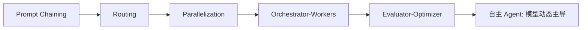
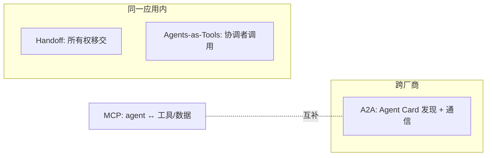

# 04 多智能体协作与编排

> 单智能体 + 好工具常常就够。但当任务**并行、需要隔离上下文、或需要专业化分工**时，才值得拆成多智能体。本文先讲动机，再展开 Anthropic 的五类 workflow、编排拓扑、子代理架构与 agent 间通信。

## 一、为什么要多智能体

| 动机 | 说明 |
| --- | --- |
| **并行（Parallelization）** | 多个 agent 同时处理不同子任务，缩短总时长 |
| **上下文隔离（Context Isolation）** | 每个子 agent 用**自己干净的上下文窗口**，只回传精简摘要，避免主窗口被无关信息污染（对抗上下文腐烂） |
| **专业化（Specialization）** | 不同 agent 各自擅长一类任务（检索/编码/审查/写作），各司其职 |
| **可组合（Composability）** | 把已验证的子 agent 当积木复用 |

```text
        主代理（协调 + 综合）
       /      |       \
  子代理A  子代理B  子代理C
  (干净上下文) (干净上下文) (干净上下文)
    │          │          │
  摘要~1-2k  摘要~1-2k  摘要~1-2k   ← 只回传精简结果
```

> ⚠️ **多智能体是手段不是目标**。业界普遍观察：一个工具定义良好的单智能体，往往胜过编排糟糕的三智能体组合。先穷尽单智能体的能力，再谈拆分。

## 二、Anthropic 的五类 Workflow 模式

Anthropic 在「Building Effective Agents」中总结了生产里最常见的**预定义工作流**（代码编排 LLM 与工具），这些都是多步骤协作的基础构件：

### 1. Prompt Chaining（提示链）
把任务拆成固定顺序的步骤，每步处理上一步输出；可在中间加**程序化检查点（gate）**确保不跑偏。
- 适用：可清晰分解的任务（先写大纲→检查→再写正文；先写文案→再翻译）。

### 2. Routing（路由）
对输入分类，分派给专门的后续流程/提示/工具。
- 适用：输入类型差异大（客服分派到退款/技术支持/常规问答）；或按难度路由到不同模型以优化成本。

### 3. Parallelization（并行化）
让多个 LLM 调用**同时**处理同一任务，再汇总——用于加速或「投票提升可靠性」。
- 适用：代码安全审查、内容审核（多视角核对）。

### 4. Orchestrator-Workers（编排者-工作者）
中央 agent **动态拆任务**并分派给专门 worker，worker 返回结果后由编排者综合。
- 适用：复杂代码库修改、多源信息综合分析（任务结构在运行时才清楚）。

### 5. Evaluator-Optimizer（评估者-优化者）
一个 agent 生成内容，另一个**评估并给反馈**，迭代优化。
- 适用：高质量翻译、复杂检索（有明确客观标准可反复打磨）。



> 从 1→5，自动化程度递增；最右端「自主 Agent」就是 01 篇定义的——由 LLM 动态决定流程，而非代码写死。

## 三、编排拓扑（Orchestration Topologies）

把上述模式落到具体架构，常见四种拓扑：

| 拓扑 | 结构 | 适用 | 代表框架原语 |
| --- | --- | --- | --- |
| **流水线（Pipeline）** | A→B→C 顺序传递 | 步骤固定、可分解 | Prompt Chaining |
| **监督者（Supervisor）** | 一个协调者动态派活给 worker | 任务结构运行时才清楚 | Orchestrator-Workers、LangGraph Supervisor |
| **群体（Group Chat）** | 多个对等 agent 自由讨论 | 头脑风暴、集体决策 | AutoGen GroupChat（已维护模式）、CrewAI |
| **层级（Hierarchical）** | 父 agent 派给子 agent 树 | 大规模、需分层治理 | Google ADK `sub_agents`、Claude SDK 子 Agent |

### 层级示例（Google ADK 风格）

```python
coordinator = LlmAgent(
    name="coordinator",
    sub_agents=[research_agent, code_agent, review_agent],  # 父派子
)
```

## 四、子代理架构（Sub-agent Architecture）

这是「上下文隔离」原则最彻底的工程化，也是 Claude Agent SDK / 上下文工程模块的核心理念：

- 主 agent 协调，多个**子 agent 在各自干净上下文窗口**做深度工作。
- 子 agent **只返回精简摘要**（常 1000–2000 token），而非完整上下文。
- 主 agent 负责综合。

> 本质：用「**隔离的上下文窗口 + 精简回传**」对抗上下文腐烂。这与 02 篇的上下文工程杠杆一脉相承——子 agent 就是把「按需上下文」与「隔离计算」做到极致。

Claude Agent SDK 的**子 Agent 自动调度**：主 agent 在运行时根据任务需要**自主决定是否派生子 agent**，无需显式编排：

```python
agent = Agent.create(agents={
    "code-reviewer": {"description": "专家级代码审查", "prompt": "..."},
    "test-writer":   {"description": "写测试",       "prompt": "..."},
})
# 主 agent 自动决定何时调用哪个子 agent
```

## 五、Agent 间通信

多智能体要「对话」，有三套机制：

### 1. Handoffs（转交，OpenAI Agents SDK）
Agent A 把**对话所有权**完全交给 B，B 看到完整历史并直接继续回答用户。适合「专家应全程接管对话」。

```python
triage = Agent(name="Triage", handoffs=[billing_agent, tech_agent])
# 模型决定转给哪个专家；专家直接接管
```

### 2. Agents-as-Tools（agent 即工具）
编排者**把 specialist 当普通工具调用**，拿回结果再综合。适合「协调者要汇总多个专家结果」。

> Handoff vs Agents-as-Tools：**Handoff 是「交接所有权」**，接收方直接对用户；**Agents-as-Tools 是「协调者仍掌权」**，只吸收结果。按「谁该对用户负责」选择。

### 3. A2A（Agent-to-Agent Protocol，Google）
跨**厂商/框架**的 agent 发现与通信标准。每个 agent 生成 **Agent Card（能力发现文档）**，其他框架的 agent 可据此发现并协作。ADK、CrewAI（2026 起）等原生支持。与 MCP（连接工具/数据）互补：MCP 管「agent 接工具」，A2A 管「agent 接 agent」。



## 六、常见反模式

- ❌ **过度拆分**：把本可单 agent 完成的任务硬拆成多 agent，徒增延迟与调试成本。
- ❌ **无隔离的共享上下文**：多 agent 共用一个膨胀的上下文，反而加速上下文腐烂。
- ❌ **缺乏回传纪律**：子 agent 回传整段原文而非摘要，主窗口被淹。
- ❌ **环依赖**：agent 间相互等待，形成死锁或无限循环（需递归思维检测，见 06 篇）。

## 参考来源

- Anthropic — Building Effective Agents（五类 workflow）：https://www.anthropic.com/engineering/building-effective-agents
- Anthropic — Building agents with the Claude Agent SDK（子代理、自动调度）：https://www.anthropic.com/engineering/building-agents-with-the-claude-agent-sdk
- OpenAI Agents SDK（Handoffs / Agents-as-Tools）：https://openai.github.io/openai-agents-python/
- Google ADK（sub_agents / A2A / Agent Cards）：https://github.com/google/adk-python
- CrewAI（角色组队 + Flows）：https://github.com/crewAIInc/crewAI
