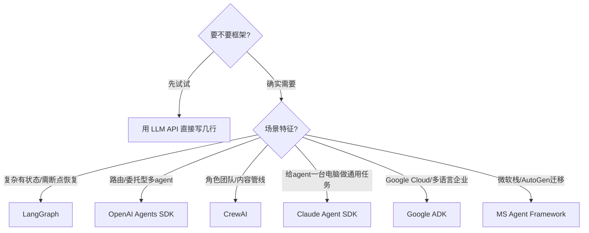

# 05 主流框架与生态

> 2025–2026 年框架格局快速收敛。本文给出**横向对比表 + 每个框架定位 + 选型建议**。核心忠告：**不要按 GitHub star 选框架**，按你的场景选。

## 一、2026 格局速览

到 2026 年，生产可用的主流框架基本定型（star 数为 2026 年中估算，仅供参考，会快速变化）：

| 框架 | GitHub | 语言 | 架构风格 | 最佳场景 | 成熟度 |
| --- | --- | --- | --- | --- | --- |
| **LangGraph** | langchain-ai/langgraph（~31k） | Python + JS/TS | 图 / 状态机 | 复杂有状态、多步、需持久化执行 | 高（v1.0 GA） |
| **OpenAI Agents SDK** | openai/openai-agents-python（~26k） | Python + JS/TS | Handoff 委托 | 轻量、路由/委托型多 agent | 高（provider 无关） |
| **CrewAI** | crewAIInc/crewAI（~50k） | Python | 角色组队 + 事件驱动 Flows | 专家团队型工作流 | 高（日执行千万级） |
| **Claude Agent SDK** | anthropics/claude-agent-sdk-python（~7k） | Python + TS | 自主工具循环 | 给 agent「一台电脑」做通用任务 | 高（源自 Claude Code） |
| **Google ADK** | google/adk-python（~19k，另 Java/Go） | Python/TS/Go/Java | 代码优先 + 层级组合 | Google Cloud / 多语言企业 | 高（Python），Java 早期 |
| **Microsoft Agent Framework** | microsoft/agent-framework（~10k） | Python + .NET/C# | 图工作流 + 分层 | 微软栈、.NET  parity、AutoGen 迁移 | 中（GA 2026 Q1） |
| **AutoGen** | microsoft/autogen | Python | 多 agent 对话 | ⚠️ **已进入维护模式** | 停更（仅安全补丁） |

> ⚠️ **AutoGen 自 2025 下半年起进入维护模式**：不再有新功能，README 直接建议新用户改用 **Microsoft Agent Framework**。已有生产部署可维持，但新项目不应选 AutoGen。

## 二、各框架定位与核心抽象

### 1. LangGraph（图 / 状态机）
- **核心**：把工作流建模为**有向图**——节点是 agent/函数，边是状态转移；状态在每步被追踪。
- **杀手锏**：**持久化执行（Durable Execution）**——状态检查点化，进程重启/限流/人工审批超时后可从断点恢复；**时间旅行调试**（回放任意执行点）；**Human-in-the-loop** 通过 interrupt 节点暂停。
- **生态**：LangSmith（tracing/eval/监控）、Studio v2（可视化调试）。官方现已明确「agent 用 LangGraph，而非 LangChain」。
- **适合**：复杂分支逻辑、需中途恢复、需细粒度状态控制的长任务。
- **不适合**：流程基本顺序/委托、想要最少抽象——此时 OpenAI Agents SDK / CrewAI 更简单。
- 仓库：https://github.com/langchain-ai/langgraph

### 2. OpenAI Agents SDK（Handoff 委托）
- **核心四原语**：**Agents**（带指令+工具的 LLM）、**Handoffs**（agent 间委托，对话历史自动传递）、**Guardrails**（输入/输出护栏）、**Tracing**（内置追踪）。
- **特点**：极简、provider 无关（任何 OpenAI 兼容端点都能用）、Python 优先。`Runner.run()` 驱动 Agent Loop。
- **2026-04 新增**：沙箱原语（安全执行不可信代码）+ 长时程 harness（跨轮 checkpoint 状态，支持跨小时/天的任务）。
- **适合**：以路由/委托为主的多 agent（客服分派、研究助手委托给领域专家）。
- **不适合**：需要跨进程重启的持久化长流程（无内置 checkpoint）。
- 仓库：https://github.com/openai/openai-agents-python

### 3. CrewAI（角色组队）
- **核心**：以「**角色（Agent）+ 任务（Task）+ 流程（Process）**」组织——像组建一支专家团队。
- **模式**：Crews（层级 Manager 动态派活）+ Flows（事件驱动工作流，支持条件/循环/并行）。
- **Skills 一等公民**：可复用的 Markdown 能力文件（crewAIInc/skills 仓库），社区可共享。
- **适合**：内容管线、研究管线、工作流式 agent；从原型到生产最快。
- **2026 新增**：A2A 支持（agent 间通信）。
- 仓库：https://github.com/crewAIInc/crewAI

### 4. Claude Agent SDK（自主工具循环）
- **核心**：把 Claude Code 的完整 agent 能力（Bash、文件操作、搜索、子 Agent）暴露为可编程 SDK。设计哲学——**给 agent 一台电脑，让它像人一样工作**。
- **Agent Loop**：收集上下文 → 行动 → 验证 → 重复。
- **独门**：子 Agent 自动调度（运行时自主派生）、**进程内 SDK MCP Server**（Python 函数直接变 MCP 工具，无需子进程）、Skills 系统（SKILL.md + Marketplace）。
- **适合**：通用型 agent（金融分析、个人助理、客服、深度研究）。
- 仓库：https://github.com/anthropics/claude-agent-sdk-python

### 5. Google ADK（代码优先 + 层级）
- **核心**：代码优先定义 agent（prompt/tools/config），通过 `sub_agents` 做**层级组合**；多语言一致 API。
- **特点**：**唯一支持四语言**（Python/TS/Go/Java）的框架；原生 **A2A**（Agent Cards 跨厂商发现）；深度集成 Vertex AI / Gemini / Google 服务（Search/Maps/Drive）。
- **注意**：生态较新、文档偏薄；曾披露 CVE-2026-4810（1.7.0–1.28.1 认证漏洞，可未授权远程执行），部署需及时升级并加固。
- **适合**：Google Cloud 优先团队、需多语言一致 API 的企业。
- 仓库：https://github.com/google/adk-python

### 6. Microsoft Agent Framework（图工作流 + 分层）
- **核心**：统一框架，取代 AutoGen 与 Semantic Kernel 的 agent 部分；分层 API（Core 消息传递 → Agent Chat → Extensions），图工作流 + **时间旅行调试**。
- **适合**：微软栈团队、Azure 优先、AutoGen 迁移、.NET parity。
- 仓库：https://github.com/microsoft/agent-framework

## 三、MCP 支持对比

各框架的 MCP 集成深度对比表（Claude Agent SDK / OpenAI Agents SDK / CrewAI / Google ADK / LangGraph / MS Agent Framework）见「[03-工具调用与MCP.md](./03-工具调用与MCP.md)」第六节，此处不重复。

## 四、选型决策树

### 选型要点（来自多家生产复盘）
- **LangGraph**：状态机、持久化、时间旅行调试不可妥协时长任务。
- **CrewAI**：角色组队、顺序/层级流程贴合你的心智模型时。
- **OpenAI Agents SDK**：OpenAI 栈、要轻量、要 Realtime/并行工具调用。
- **Google ADK**：Vertex AI 部署目标、多语言服务。
- **Claude Agent SDK**：要通用型、自主循环、子 agent 自动调度。
- **跳过 AutoGen**：新项目不选；现有部署规划迁移到 MS Agent Framework。

> ⚠️ **通用坑**：① 别按 star 选（AutoGen star 最多却已停更，CrewAI star 多于 LangGraph 但心智模型不同）；② 多在**真实工作流**上测，而非玩具 demo；③ 低估调试成本——第一次生产失败，「时间旅行调试」就能回本；④ 把多 agent 当工具不当目标；⑤ 评估（eval）框架选择与运行时选择**相互独立**，用 OTel GenAI semconv + 厂商中立 eval 层。

## 五、协议层：MCP 与 A2A

- **MCP**（Anthropic）：agent ↔ 工具/数据 的标准接口，已成事实标准（见 03 篇）。
- **A2A**（Google）：agent ↔ agent 的发现与通信标准，配合 Agent Card。
- 二者互补：MCP 解决「agent 接工具」，A2A 解决「agent 接 agent」，共同构成 2026 的 agent 互操作底座。

## 参考来源

- 六大 Agent 框架横评（Skills/动态创建/MCP/多语言）：https://www.cnblogs.com/itech/p/19964192
- RaftLabs — AI Agent Frameworks Compared（2026 格局）：https://www.raftlabs.com/blog/ai-agent-framework-comparison
- FutureAGI — Best Multi-Agent Frameworks 2026：https://futureagi.com/blog/best-multi-agent-frameworks-2026
- ManaGen — Agentic AI Orchestration Frameworks：https://www.managen.ai/understanding/agents/frameworks
- 各框架官方仓库（见上文链接）

## 六、框架深度对比表（含 AG2）

05 给了格局速览，这里按「工程关注维度」做更细的横向对比（含 AutoGen 继任者 **AG2**）：

| 维度 | LangGraph | CrewAI | OpenAI Agents SDK | AG2（原 AutoGen） | Claude Agent SDK | Google ADK |
| --- | --- | --- | --- | --- | --- | --- |
| 状态/持久化 | ✅ 持久化执行、断点恢复 | ⚠️ 弱（Flows 内） | ❌ 无内置 checkpoint | ✅ 会话/状态管理 | ⚠️ 长时程 harness | ⚠️ 会话级 |
| HITL | ✅ interrupt 节点 | ⚠️ 部分 | ✅ Guardrails | ✅ | ✅ | ✅ |
| 多 agent 通信 | 图/ supervisor | 角色组队/群聊 | Handoff/Agents-as-Tools | 群聊/GroupChat | 子 Agent 自动调度 | sub_agents / A2A |
| 学习曲线 | 陡（图/状态） | 平缓（角色心智） | 平缓 | 中 | 中 | 中 |
| MCP | 适配器 | 原生 | 原生 | 社区 | 原生最深 | 原生 |
| 最佳场景 | 复杂有状态长任务 | 专家团队工作流 | 路由/委托型 | 多 agent 对话研究 | 通用自主 agent | GCP/多语言企业 |

**关于 AG2**：微软将 AutoGen 演进为 **AG2**（autogen-agent/ag2），继承 GroupChat 等多 agent 对话能力并持续维护，是 AutoGen 停止更新后的官方替代。新项目若需要「多 agent 群聊/对话」范式，优先选 AG2 而非已进入维护模式的 AutoGen。

> 💡 选型铁律：**不要按 star 选**。AutoGen/AG2 star 最多但范式特定；LangGraph 强在持久化与状态机；CrewAI 强在角色组队心智；OpenAI Agents SDK 轻量委托；Claude Agent SDK 通用自主；ADK 多语言 GCP。先定场景特征，再对表选。
