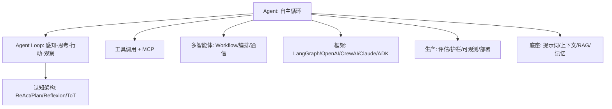
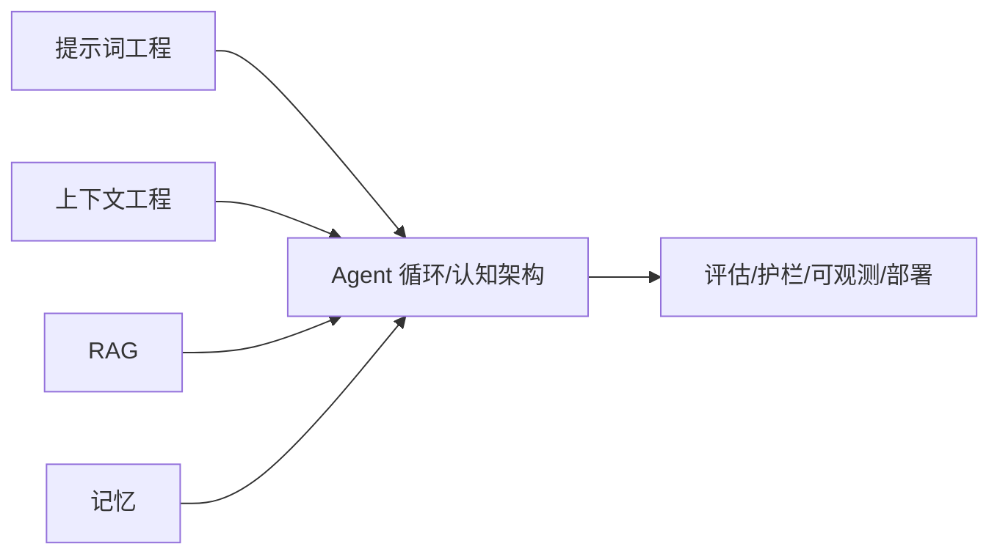

# 智能体（Agent）

> 本模块整理自 Anthropic / OpenAI / Google 官方工程博客与开源文档，以及主流框架（LangGraph、CrewAI、OpenAI Agents SDK、Claude Agent SDK、Google ADK 等）的公开资料，聚焦「AI 智能体是什么、怎么架构、如何调用工具、多智能体如何协作、用什么框架、怎样评测与落地生产」。
>
> 内容立场：智能体不是银弹。**Anthropic 的核心建议是「先找最简单的方案，只在确有必要时才增加复杂度」**。本模块据此组织：从概念 → 架构 → 工具 → 多智能体 → 框架 → 生产落地，逐层加深。

## 内容索引

| 文件 | 内容 | 形态 |
| --- | --- | --- |
| [01-概述与核心概念.md](./01-概述与核心概念.md) | 什么是智能体、与 Chatbot/Copilot 的区别、四大核心能力、Agent Loop、何时用/不用 | 📝 文字 |
| [02-架构与核心组件.md](./02-架构与核心组件.md) | 增强型 LLM、系统分层架构、上下文工程角色、认知架构（ReAct/Plan-and-Execute/Reflexion/ToT） | 📝 文字 |
| [03-工具调用与MCP.md](./03-工具调用与MCP.md) | Function Calling 原理、ACI 工具设计、MCP 协议、结构化输出、工具安全 | 📝 文字 |
| [04-多智能体协作与编排.md](./04-多智能体协作与编排.md) | 多智能体动机、五类 workflow、编排拓扑、子代理架构、A2A/Handoffs 通信 | 📝 文字 |
| [05-主流框架与生态.md](./05-主流框架与生态.md) | LangGraph/OpenAI Agents SDK/CrewAI/Claude SDK/Google ADK/微软 Agent Framework 对比与选型 | 📝 文字 |
| [06-评估、安全与工程落地.md](./06-评估、安全与工程落地.md) | 评估方法论、可观测性、护栏（Guardrail Sandwich/Lethal Trifecta）、成本延迟、生产化 checklist | 📝 文字 |

## 主要参考来源（官方博客 / 开源仓库）

- **Anthropic — Building Effective Agents**：https://www.anthropic.com/engineering/building-effective-agents （workflow 与 agent 的架构区分、五大 workflow 模式、ACI 设计原则）
- **Anthropic — Building agents with the Claude Agent SDK**：https://www.anthropic.com/engineering/building-agents-with-the-claude-agent-sdk （Agent Loop、子代理、compaction 实践）
- **Anthropic — Effective context engineering for AI agents**：https://www.anthropic.com/engineering/effective-context-engineering-for-ai-agents （三大上下文管理杠杆，与「上下文工程」模块呼应）
- **Anthropic — Effective harnesses for long-running agents**：https://www.anthropic.com/engineering/effective-harnesses-for-long-running-agents （长时间运行智能体的 initializer/coding agent 模式）
- **OpenAI Agents SDK 文档**：https://openai.github.io/openai-agents-python/ （Agent/Handoff/Guardrail/Tracing 四原语、Agent Loop）
- **Model Context Protocol（MCP）规范与仓库**：https://modelcontextprotocol.io ｜ https://github.com/modelcontextprotocol/modelcontextprotocol
- **LangGraph**：https://github.com/langchain-ai/langgraph ｜ **CrewAI**：https://github.com/crewAIInc/crewAI
- **Google ADK**：https://github.com/google/adk-python ｜ **Microsoft Agent Framework**：https://github.com/microsoft/agent-framework
- **OpenTelemetry GenAI Semantic Conventions**：https://opentelemetry.io/docs/specs/semconv/gen-ai/ （跨厂商可观测标准）
- **OWASP Top 10 for LLM Applications（2025）**：https://owasp.org/www-project-top-10-for-large-language-model-applications/ （Excessive Agency 风险）

> ⚠️ 本模块为「整理 + 个人化注解」，非原创理论。文中标注的 star 数、失败率、token 倍数等数据均来自上述厂商公开案例与第三方评测（2025–2026），会随时间变化，请以你自己的评测与官方最新文档为准。

## 本子模块学习路径

1. `01-概述与核心概念.md`：先搞清楚「什么是 agent、什么时候该用」，避免一上来就过度工程。
2. `02-架构与核心组件.md`：理解增强型 LLM 与认知架构（ReAct 等），这是所有框架的底层范式。
3. `03-工具调用与MCP.md`：智能体的「手」——工具调用与 MCP 标准协议。
4. `04-多智能体协作与编排.md`：单智能体不够时如何拆分成多智能体，以及常见反模式。
5. `05-主流框架与生态.md`：按场景选型，不要按 GitHub star 选。
6. `06-评估、安全与工程落地.md`：把 agent 真正跑进生产所需的评估、护栏、成本与可观测性。

## 核心要点速览

- **定义**：Agent = LLM **动态主导**自己的流程与工具使用；Workflow = 由**预定义代码路径**编排 LLM 与工具。两者统称 agentic systems。
- **最小可用**：增强型 LLM（检索 + 工具 + 记忆）就是智能体的基本构建块，很多场景「单条增强调用」就够，无需自主循环。
- **Agent Loop**：感知 → 思考（规划）→ 行动（调工具）→ 观察（回收结果）→ 再思考，直到任务完成。
- **工具是护城河**：Anthropic 金句——像做 HCI 一样认真做 **ACI（Agent-Computer Interface）**；MCP 已成为连接工具/数据的事实上标准。
- **多智能体是手段不是目标**：好的单智能体 + 好工具，常胜过编排糟糕的多智能体。
- **生产三件套**：评估（eval）先行、可观测（tracing）贯穿、护栏（guardrail + 最小权限）兜底。

## 推荐延伸阅读

- 本知识库「上下文工程」「RAG」「记忆」模块（Agent 的上下文/检索/持久化底座）
- Anthropic Building Effective Agents（必读）
- OpenAI Practical Guide to Building Agents（PDF，官方 cookbook 附带）
- LangGraph / CrewAI / OpenAI Agents SDK 官方文档与示例
- OWASP LLM Top 10、OpenTelemetry GenAI Semconv（安全与可观测标准）

## 一、核心概念地图（Mermaid 概念全景）

> 上图把智能体置于五个子模块的交点：它由「提示词工程+上下文工程+RAG+记忆」共同支撑，通过工具/MCP 行动，经多智能体协作，最后落到生产化的评估与护栏。

## 二、速查表（Cheat Sheet）

| 决策点 | 默认 | 何时调整 |
| --- | --- | --- |
| 是否上 Agent | 先单条增强调用 | 需自主多步/跨系统才上 |
| 认知架构 | ReAct | 可预分解→Plan；需试错→Reflexion |
| 工具调用 | function calling | 工具多→代码调用省 token |
| 协议 | MCP 接工具 | 跨厂商 agent→A2A |
| 多智能体 | 先穷尽单 agent | 并行/隔离/专业化才拆 |
| 框架 | 按场景非 star | 有状态→LangGraph；委托→OpenAI |
| 生产 | eval+护栏+可观测 | 第一天就埋 |
| 安全 | 最小权限+HITL | 破 Lethal Trifecta |

## 三、常见误区清单（汇总）

1. **智能体=必须多智能体**：单 agent+好工具常够，多 agent 是手段不是目标。
2. **框架越重越专业**：简单可组合模式常胜复杂框架。
3. **自主=全自动**：生产几乎都要 HITL 兜底高危操作。
4. **工具设计随意**：ACI 要像 HCI 一样认真，命名/参数/错误友好。
5. **忽视 Lethal Trifecta**：私有数据+不可信输入+外发=注入外泄漏洞。
6. **无 eval 就上线**：真实任务失败率可达 60–90%，必须评估先行。
7. **不上持久化状态**：长任务进程重启即失忆，需 checkpoint/session。
8. **并发打爆下游**：共享状态要外部化、限并发、幂等键。
9. **按 star 选框架**：AutoGen star 多却已停更，按场景选。
10. **把记忆当数据库**：记忆是启动注入的上下文，非可靠存储。

## 四、与其它子模块关系

- **与提示词工程**：ReAct/Reflexion 等提示范式是 Agent 循环引擎；提示定人设与边界。
- **与上下文工程**：上下文腐烂是 Agent 头号敌人，compaction/clearing/memory 杠杆直接服务 Agent。
- **与 RAG**：RAG 是 Agent 的「知识检索工具」，由 Agent 决定是否调用。
- **与记忆**：记忆给 Agent 跨会话状态保持，是连续性基础。

## 五、面试高频问题（速记）

- Agent 定义？Workflow 与 Agent 的架构区别？
- Agent Loop 是什么？与 ReAct 关系？
- 增强型 LLM 三要素？何时不该用 Agent？
- 四种认知架构（ReAct/Plan/Reflexion/ToT）适用场景？
- ACI 是什么？为什么工具设计重要？
- MCP 架构/原语/传输？为什么成了事实标准？
- Lethal Trifecta 是什么？怎么破？
- 多智能体五大 workflow？编排拓扑有哪些？
- Handoff vs Agents-as-Tools？MCP vs A2A？
- 主流框架怎么选（LangGraph/OpenAI/CrewAI/Claude/ADK/AG2）？
- 生产化三件套？评估指标与红队怎么做？

## 六、整合学习路径（五模块串起来）

> 以上为智能体子模块全局速查与导航。建议路径：01 概念 → 02 架构/认知架构 → 03 工具/MCP → 04 多智能体 → 05 框架 → 06 生产落地。底座（提示词/上下文/RAG/记忆）不稳，编排再花哨也救不回。
