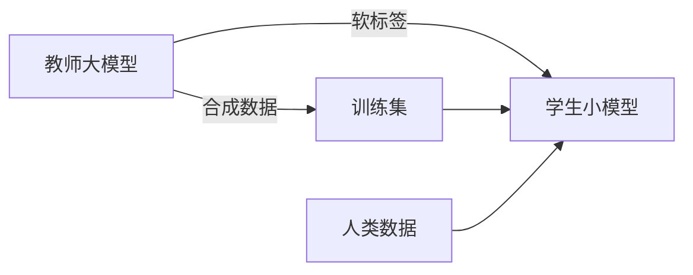

# 模型蒸馏与小型化实战

> 用大模型（教师）指导小模型（学生）学习，是获得"小而强"模型的主流路径。本文覆盖白盒/黑盒蒸馏、数据合成与小模型训练实践。

## 1. 蒸馏的三种路线



| 路线 | 做法 | 数据需求 |
| --- | --- | --- |
| 黑盒蒸馏 | 用教师生成软标签/回答训练学生 | 需教师 API |
| 白盒蒸馏 | 用教师隐状态/注意力作监督 | 需教师权重 |
| 数据蒸馏 | 教师合成高质量数据，学生常规训练 | 合成数据 |

## 2. 软标签蒸馏

教师输出类别概率（含温度 softening），比硬标签含更丰富"类间关系"信息：

```
p_i = exp(z_i/T) / Σ exp(z_j/T)   # T 为温度，T>1 更软
loss = α·KL(学生软, 教师软) + (1-α)·CE(学生硬, 真实标签)
```

## 3. 数据合成（Knowledge Distillation via Synthesis）

实践中最常见：用强模型批量生成指令-回答对，再用其训练小模型。

```python
def synthesize(dataset, teacher):
    out = []
    for topic in dataset:
        resp = teacher.generate(f"就『{topic}』写一道详细问答")
        out.append(resp)
    return out
# 学生用合成数据做 SFT
student.sft(out)
```

要点：
- **多样性**：覆盖多领域、多难度、多风格。
- **质量过滤**：用奖励模型/规则筛掉低质样本。
- **去污染**：避免与评测集重叠。

## 4. 小模型训练实践

- **基座选择**：同系列小模型（如 Qwen2.5-0.5B/1.5B/3B）更易对齐。
- **学习率**：小模型更敏感，需细心调。
- **数据配比**：通用能力 + 领域数据混合，防止灾难性遗忘。
- **评测闭环**：用标准基准（MMLU、C-Eval、GSM8K）验证。

## 5. 其他小型化技术

| 技术 | 说明 |
| --- | --- |
| 剪枝 Pruning | 去掉冗余权重/注意力头 |
| 量化 Quantization | 降低数值精度（见量化专题） |
| 低秩分解 | 用 LoRA 式低秩近似大矩阵 |
|  Early Exit | 简单样本提前输出，省算力 |

## 6. 质量与权衡

- 蒸馏学生通常强于同规模原生训练模型，但仍弱于教师。
- 极端压缩（<1B）会丢失复杂推理，需任务匹配。
- 评测要覆盖"教师擅长的难样本"，避免表面达标。

## 7. 常见坑

| 坑 | 现象 | 对策 |
| --- | --- | --- |
| 合成数据同质 | 学生泛化差 | 多 prompt 模板增广 |
| 蒸馏过热 | 过拟合教师错误 | 混合真实标签 |
| 评测失真 | 只测简单集 | 加难样本基准 |
| 遗忘通用能力 | 只能做专项 | 数据配比控制 |

## 8. 面试题

1. 软标签相比硬标签有什么好处？
2. 温度 T 在蒸馏中起什么作用？
3. 黑盒与白盒蒸馏的区别？
4. 数据蒸馏如何保证质量？
5. 小模型训练为何要关注数据配比？

## 9. 小结

蒸馏 = 用大模型的知识"喂"小模型。最务实的工程路径是"强模型合成高质量数据 + 小模型 SFT + 基准评测闭环"，在成本与能力间取得平衡。
