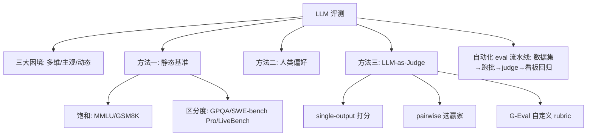
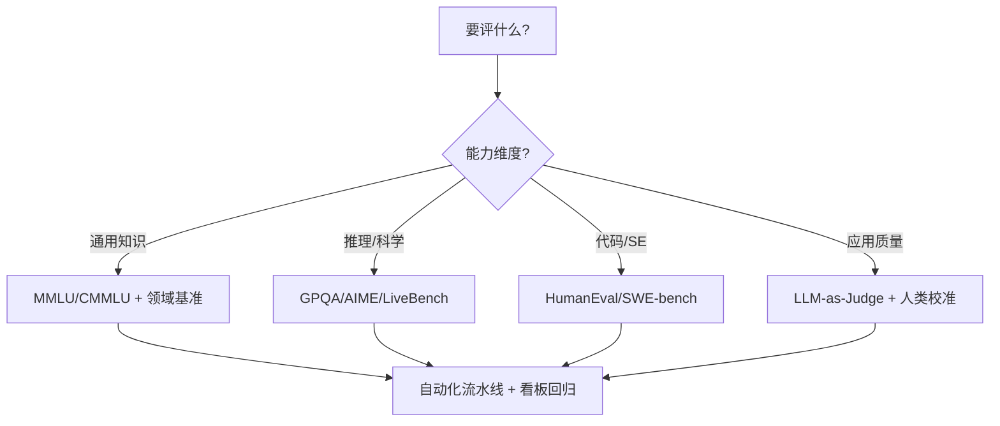

# 模型评测与基准（LLM Evaluation & Benchmarks）

> 本模块整理自 2024–2026 年公开评测研究（Chatbot Arena、MMLU/GPQA/SWE-bench/LiveBench 等）、LLM-as-Judge 方法论（G-Eval、DeepEval）与评测框架（lm-eval-harness、OpenAI Evals），聚焦「怎么科学地衡量一个大模型 / 一个 LLM 应用好不好」。
>
> 内容立场：**评测是 LLM 工程的第一公民**。没有评测的提示词优化、RAG 改造、Agent 上线都是裸奔。尤其对 RAG / Agent / 微调，评测应作为回归看板天天跑。

## 内容索引

| 文件 | 内容 | 形态 |
| --- | --- | --- |
| [01-LLM-Eval方法论.md](./01-LLM-Eval方法论.md) | 为什么难评、三大方法（静态基准/人类/LLM-as-Judge）、G-Eval、自动化 eval 流水线、常见偏差 | 📝 文字 |
| [02-主流基准与榜单.md](./02-主流基准与榜单.md) | MMLU/GPQA/AIME/SWE-bench/LiveBench/Hella's Last Exam/MT-Bench/Chatbot Arena 对比与选型 | 📝 文字 |

## 主要参考来源（公开研究 / 平台 / 框架）

- **LMSYS Chatbot Arena**：https://lmarena.ai （约 500 万人类偏好投票，Elo 排名）
- **Stanford HELM**：https://crfm.stanford.edu/helm/ （系统化多维度评测）
- **EleutherAI lm-eval-harness**：https://github.com/EleutherAI/lm-evaluation-harness （可复现基准实现）
- **OpenAI Evals**：https://github.com/openai/evals （任务特异评测、持续评测哲学）
- **DeepEval（LLM-as-Judge 框架）**：https://github.com/confident-ai/deepeval （G-Eval / Arena 实现）
- **MMLU / GPQA / SWE-bench / LiveBench / Humanity's Last Exam** 公开结果（2025–2026）

> ⚠️ 本模块为「公开资料整理 + 个人化注解」，非原创理论。文中分数、投票数、一致性数字均来自上述公开来源（2024–2026），会快速过时，请以官方最新榜单与你自己任务的评测为准。

## 本子模块学习路径

1. `01-LLM-Eval方法论.md`：理解评测为何难、三大方法论、LLM-as-Judge 怎么用、自动化流水线怎么搭。
2. `02-主流基准与榜单.md`：认识各基准测什么、哪些已饱和、怎么按任务选型。

## 核心要点速览

- **评测三难**：多维性（知识/推理/代码/安全…）、主观性（人类标注一致性仅 60–80%）、动态性（基准易污染过时）。
- **三大方法**：静态基准（MMLU 等，可量化但易 gaming）、人类偏好（Arena，可信但贵）、LLM-as-Judge（80–90% 人类一致性，500–5000× 降本，主流生产方案）。
- **LLM-as-Judge 两型**：single-output（打分）/ pairwise（选赢家）；G-Eval 是当前最常用自定义 judge。
- **基准饱和**：MMLU/GSM8K/HumanEval 已饱和（88%+），新区分度看 GPQA / SWE-bench Pro / LiveBench / Hella's Last Exam。
- **生产实践**：任务特异测试集 + 领域基准 + A/B 三层防线；评测当回归看板。

## 推荐延伸阅读

- LMSYS Chatbot Arena（人类偏好排名）
- Stanford HELM（多维度系统化评测）
- EleutherAI lm-eval-harness（复现基准）
- OpenAI Evals（持续评测哲学）
- DeepEval / RAGAS（自动化 judge 与 RAG 评测）
- 本知识库「RAG」（RAGAS 四指标）、「智能体」（生产评估与红队）

## 九、核心概念地图（Mermaid）

## 十、速查表（Cheat Sheet）

| 决策点 | 默认 | 何时调整 |
| --- | --- | --- |
| 评测方法 | LLM-as-Judge（单/双） | 高风险事实用人类校准 |
| Judge 模型 | GPT-4 级 / 强开源 | 领域任务用领域强模型 |
| 基准选型 | 按任务维度选 | 饱和基准换 GPQA/LiveBench |
| 生产防护 | 三层防线 | 关键路径加人类抽检 |
| 回归 | 每次改动跑 eval | RAG/Agent 必做 |
| 防 gaming | 动态/私有题 | 防针对基准过拟合 |
| 偏差 | swap position + CoT | pairwise judge 必做 |

## 十一、常见误区清单

1. **只看一个总分**：MMLU 86% 不代表写代码/安全好，需多维。
2. **把基准分当真实能力**：数据污染 + Goodhart 定律，分高可能只是针对练过。
3. **LLM Judge 无校准直接用**：要先和人类标注对齐（目标 80%+ 一致）。
4. **pairwise judge 不换位置**：位置偏差会让固定放左边的赢。
5. **无评测就上线 RAG/Agent**：失败率可达 60–90% 才发现。
6. **忽略人类一致性天花板**：人类自己才 60–80% 一致，别追求 judge 100% 对齐。
7. **静态基准一劳永逸**：公开即可能被训进数据，需动态/私有集。
8. **只评最终答案不评过程**：推理/Agent 要评轨迹忠实度。
9. **Judge 用被测同模型**：自卖自夸，应独立更强 judge。
10. **评测与线上脱节**：离线分高线上崩，需线上 A/B + 监控。

## 十二、与其它子模块关系

- **与 RAG**：RAGAS 四指标（faithfulness/answer_relevancy/context_precision/context_recall）是 RAG 的回归看板。
- **与智能体**：Agent 生产三件套之首就是 eval；轨迹级评测 + 红队。
- **与提示词工程**：提示改动必须用评测小样本前后对比验证。
- **与训练与部署**：微调/对齐前后要靠基准（MMLU/GPQA/SWE-bench）量化增益。

## 十三、面试高频问题（速记）

- 为什么 LLM 评测比传统 ML 难？三大困境？
- 静态基准 / 人类偏好 / LLM-as-Judge 各优劣？
- LLM-as-Judge 怎么用？single vs pairwise？G-Eval 是什么？
- Judge 和人类一致性多少算可用？怎么校准？
- 位置偏差 / 自我偏好偏差怎么破？
- MMLU 为什么饱和？新区分度看哪些基准？
- Chatbot Arena 的 Elo 排名原理与局限？
- 生产评测三层防线是什么？
- 怎么把评测做成回归看板？RAG/Agent 评什么？
- 防 benchmark gaming 有哪些手段？

## 十四、一句话决策树

