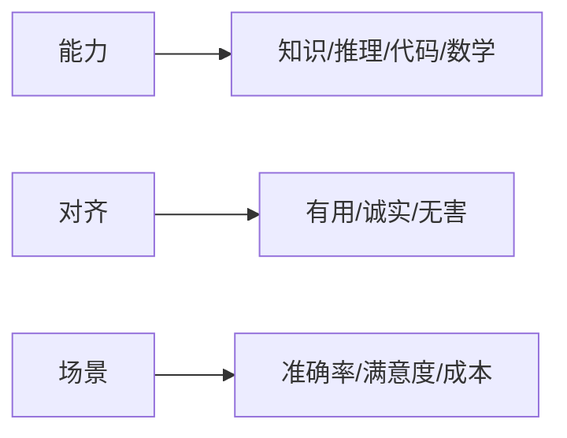

# 模型评测与基准实战

> "模型好不好"不能靠感觉。评测体系要覆盖能力（知识、推理、代码）、对齐（有用、无害）、场景（业务指标），并区分自动评测与人工评测。基准（benchmark）提供横向对比，但需警惕过拟合与数据污染。

## 1. 评测维度

## 2. 评测方法

| 方法 | 说明 | 适用 |
| --- | --- | --- |
| 基准数据集 | MMLU 等标准题 | 横向对比 |
| 自动评分 | LLM-as-judge | 开放问答 |
| 人工评测 | 专家打分 | 高质量 |
| 线上指标 | 采纳率/留存 | 真实效果 |
| 红队 | 对抗测试 | 安全 |

## 3. LLM-as-Judge

- 用强模型对回答打分（相关性、正确性、安全）。
- 设评分 rubric，减少主观漂移。
- 多评委 + 一致性校验，避免单点偏置。
- 与人工评测做相关性校准。

## 4. 防陷阱

- **数据污染**：测试集泄露进训练，分数虚高。
- **过拟合基准**：为刷分牺牲泛化。
- **指标失真**：自动分高但用户不满意。
- **维度单一**：只看准确率忽略成本/延迟。

## 5. 常见坑

| 坑 | 现象 | 对策 |
| --- | --- | --- |
| 基准刷分 | 不泛化 | 多场景验证 |
| 评测偏置 | 不准 | 多评委校准 |
| 只线上好 | 成本高 | 成本/效果权衡 |
| 污染 | 虚高 | 隔离测试集 |
| 维度缺 | 误判 | 多维评估 |

## 6. 面试题

1. 自动评测与人工评测如何配合？
2. LLM-as-judge 有什么风险？
3. 数据污染如何防范？
4. 业务侧如何评测模型？
5. 基准分数为何不能全信？

## 7. 小结

模型评测 = 多维能力 + 对齐 + 场景指标 + 自动/人工互补。核心是"用对的指标、防污染、看真实业务效果"。
