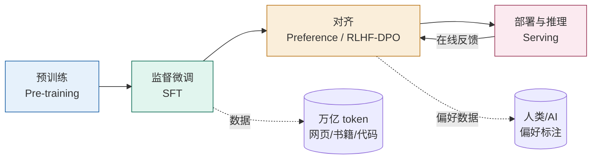
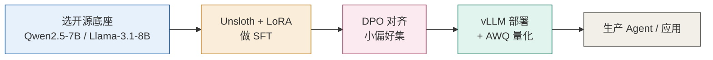

# 01 概述与技术全景

> 大模型不是「一个模型」，而是一条从海量语料到可用产品的**生产线**。理解这条线，才能判断「我到底要不要训模型、该训哪一段、上线要花多少钱」。

## 一、大模型生命周期

一个现代 LLM 从 0 到上线，通常经历四个阶段，前两段是「造能力」，后两段是「打磨与交付」：



| 阶段 | 目标 | 数据 | 算力量级 | 主要技术 |
| --- | --- | --- | --- | --- |
| **预训练** | 学会「语言与世界知识」 | 数 T～数十 T token | 千卡级、数百万美元 | 海量语料、分布式训练（ZeRO/FSDP） |
| **SFT** | 学会「按指令回答」 | 数万～数百万条指令-回答 | 单/多卡、小时～天 | 全参或 LoRA、指令数据 |
| **对齐** | 学会「有用、无害、诚实」 | 偏好对（胜/负） | 中低 | RLHF(PPO) / DPO / RLAIF |
| **部署** | 低成本高并发地服务 | — | 推理卡、持续成本 | vLLM、量化、批处理 |

> 预训练决定「天花板」，SFT 决定「怎么用」，对齐决定「靠不靠谱」，部署决定「贵不贵」。

## 二、关键决策：微调、还是提示词/RAG？

很多团队一上来就想微调，但其实**多数问题不该用微调解决**。请按下面的决策树判断：

```mermaid
flowchart TD
    Q[任务需要模型"学会"什么?] --> A{是"新知识"<br/>私有/实时数据?}
    A -->|是| R[RAG:<br/>外挂检索,<br/>不碰权重]
    A -->|否| B{是"固定格式/风格"<br/>或"专属领域输出"?}
    B -->|是| F[微调 SFT/LoRA:<br/>固化行为]
    B -->|否| C{是"安全/偏好"<br/>拒答/语气?}
    C -->|是| P[对齐 DPO/RLHF<br/>或纯提示约束]
    C -->|否| D[提示词工程:<br/>0成本首选]
    R --> E[配合上下文工程]
    F --> E
    P --> E
    D --> E

    style D fill:#E1F5EE,stroke:#0F6E56
    style R fill:#E6F1FB,stroke:#185FA5
    style F fill:#FAEEDA,stroke:#BA7517
    style P fill:#FBEAF0,stroke:#993556
```

**经验法则（按成本与风险从低到高）**：

1. **提示词工程 + 上下文工程** —— 零训练成本，首选。适用于绝大多数「会做但答得不好」的问题。
2. **RAG** —— 模型需要「它没见过的新知识/私有数据」时，外挂检索比塞进权重更划算、可更新。
3. **SFT / LoRA** —— 需要固化**输出格式、专属语气、领域术语、稳定风格**时。比提示更稳、推理更省 token。
4. **对齐（DPO/RLHF）** —— 主要解决**安全与偏好**（拒答有害请求、语气、简洁度），不是用来灌知识。
5. **预训练 / continued pre-training** —— 仅在你要从零造一个基座、或注入超大规模领域语料时才考虑，成本极高。

> ⚠️ **常见误区**：用微调去「补知识」。微调会「覆盖/扭曲」已有能力，且新知识易随权重漂移、难更新；知识类需求几乎永远该用 RAG。

## 三、技术选型地图

按「你想改模型的哪一层」对照：

| 你的目标 | 推荐技术 | 典型工具 | 是否需要 GPU 训练 |
| --- | --- | --- | --- |
| 让模型遵循指令 | SFT（全参 / LoRA） | TRL、Axolotl、LLaMA-Factory、Unsloth | 是（LoRA 可消费级） |
| 低成本改小模型 | QLoRA（4bit + LoRA） | PEFT + bitsandbytes | 是（单卡即可） |
| 调整安全/偏好 | DPO（最省事）/ RLHF | TRL（DPOTrainer/PPOTrainer） | 是 |
| 多租户共享底座 | 多 LoRA 服务 | vLLM `--enable-lora` | 否（仅推理） |
| 降低推理成本 | 量化（AWQ/GGUF/FP8） | vLLM、llama.cpp、TensorRT-LLM | 否 |
| 多模态能力 | 视觉编码器 + 投影层 | LLaVA 范式、Qwen2-VL | 是 |
| 上线服务 | 高吞吐推理引擎 | vLLM / SGLang / TGI | 否（部署） |

## 四、算力与成本概览

微调与部署的「钱」都花在显存（VRAM）上。先看**权重本身的显存**（每参数字节数）：

| 精度 | 每参数 | 7B 模型 | 70B 模型 | 405B 模型 |
| --- | --- | --- | --- | --- |
| FP16/BF16 | 2 字节 | ~14 GB | ~140 GB | ~810 GB |
| INT8 | 1 字节 | ~7 GB | ~70 GB | ~405 GB |
| INT4 (AWQ) | ~0.5 字节 + 开销 | ~4–5 GB | ~35–40 GB | ~200–230 GB |

**微调显存（含优化器状态、梯度、激活）**的大致经验值（来自 2025 年工程实测）：

| 模型 | LoRA FP16 | QLoRA (NF4) | 说明 |
| --- | --- | --- | --- |
| Llama-3-8B | ~15 GB（A10G/4090/L4） | ~8 GB（T4/消费卡） | 约 1–2 小时 / 1 万样本 |
| Llama-3-70B | ~160 GB（2×A100/H100 + TP） | ~44 GB（单 H100 80G 或 2×A100 40G） | 6–12 小时 / 1 万样本 |
| Llama-3.1-405B | ~900 GB（多机） | ~250 GB（4×H100） | 24+ 小时 / 1 万样本 |

> 结论很直白：**8B 及以下的模型，消费级显卡就能 LoRA；70B 以上优先 QLoRA，除非对质量极度敏感。**

## 五、本模块与其他模块的衔接

- **上下文工程 / 提示词工程**：本模块讲「改模型权重」，那两个模块讲「不改权重、只改输入」，二者是互补而非替代。
- **RAG**：当「知识」需求出现时，优先外挂而非微调（见第二节）。
- **记忆**：训练侧可把「长期行为偏好」固化进权重（对齐），运行侧用记忆系统动态注入。
- **智能体**：Agent 调用工具时，底座模型的「工具调用格式、稳定性」直接受 SFT/对齐质量影响；Agent 的部署又回到本模块的 vLLM/量化。

## 六、最小可行实践路径（个人/小团队）



> 一句话：**先用提示词/RAG 解决 80% 问题，剩下的用 LoRA+DPO 打磨，最后用 vLLM+量化上线。** 不要一上来就预训练。

---

## 参考与延伸

- [Hugging Face PEFT](https://github.com/huggingface/peft) · [TRL](https://github.com/huggingface/trl) · [Transformers](https://github.com/huggingface/transformers)
- [Unsloth](https://github.com/unslothai/unsloth) · [Axolotl](https://github.com/OpenAccess-AI-Collective/axolotl) · [LLaMA-Factory](https://github.com/hiyouga/LLaMA-Factory)
- [LoRA (arXiv:2106.09685)](https://arxiv.org/abs/2106.09685) · [QLoRA (arXiv:2305.14314)](https://arxiv.org/abs/2305.14314)
- [vLLM](https://github.com/vllm-project/vllm) · [SGLang](https://github.com/sgl-project/sglang)
- 选型经验值参考：turion.ai《LoRA, QLoRA, and PEFT: The Fine-Tuning Infrastructure Guide》(2025)
