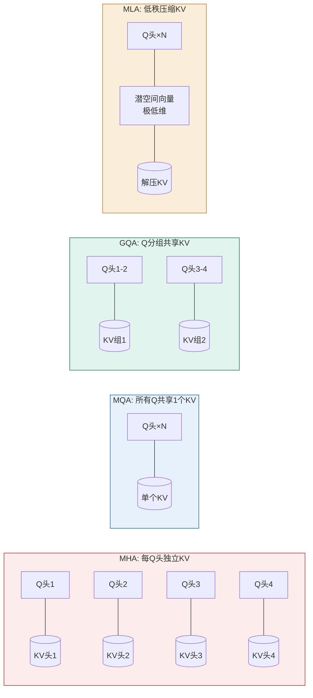
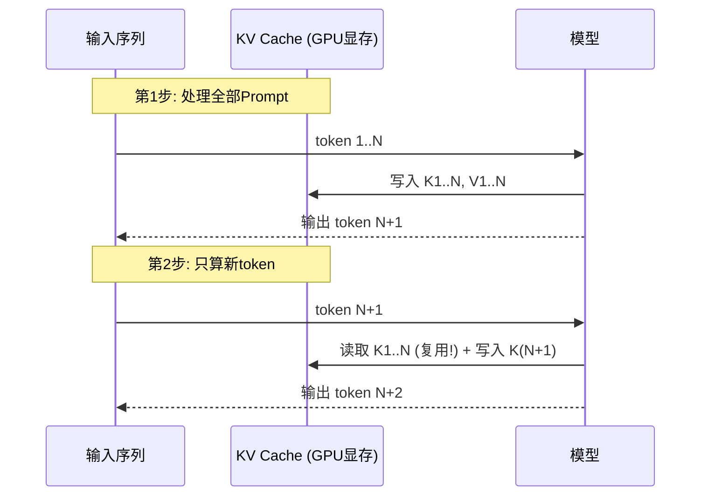

# 02 Transformer 与注意力机制原理

> 不懂底层架构，就无法真正理解「为什么要 KV Cache」「为什么 GQA 更快」「为什么 MoE 省钱」。这一篇把现代 LLM 的骨架拆开，作为微调、部署、多模态所有后续内容的基础。

## 一、从原始 Transformer 到现在的事实标准

2017 年的原始 Transformer 只是起点。今天的主流大模型（Llama、Qwen、DeepSeek、GPT-OSS、Gemma、Mistral）已经偷偷把主干换成了另一套「默认配置」：

| 组件 | 原始 Transformer (2017) | 现代 LLM 事实标准 |
| --- | --- | --- |
| 注意力 | MHA（每头独立 K/V） | **GQA / MQA / MLA** |
| 位置编码 | 绝对位置嵌入（可学习） | **RoPE（旋转位置编码）** |
| 前馈激活 | ReLU / GELU | **SwiGLU** |
| 归一化 | LayerNorm（后置） | **RMSNorm + Pre-Norm** |
| 长序列 | 全局注意力 | 全局 + **滑动窗口 / 稀疏** |

> 「现在的大模型」已经不再把原始 Transformer 当 baseline，而是把**换过模块的 Transformer** 当 baseline。

## 二、注意力机制的瘦身史：MHA → MQA → GQA → MLA

注意力的瓶颈不在算力，而在**推理时的 KV Cache 显存**。每一次生成都要缓存所有历史 token 的 Key/Value。



- **MHA（Multi-Head Attention）**：每个 Query 头有独立 K/V，KV Cache 最大。质量好但最费显存。
- **MQA（Multi-Query Attention）**：所有 Q 头共享一组 K/V，KV Cache 最小，但质量下降明显。
- **GQA（Grouped-Query Attention, Ainslie et al. 2023）**：折中——把 Q 头分组，每组共享一组 K/V（如 32 个 Q 头配 8 个 KV 头）。**KV 显存降约 4×，质量损失 <1.5%**。已被 Llama 3/4、Mistral、Gemma、Qwen、GPT-OSS 广泛采用。
- **MLA（Multi-head Latent Attention, DeepSeek-V2/V3）**：把 KV 压缩进**低秩潜空间**，推理时再解压。DeepSeek-V3 借 MLA 把 KV 缓存**压缩 93.3%**，是比 GQA 更激进的方案，目前主要 DeepSeek 系采用。

> 一句话：**注意力机制的演进主线就是「KV Cache 越小越好」。** 这点直接决定了你能开多大的并发、多长的上下文。

## 三、KV Cache：为什么推理必须缓存

自回归生成是「一个 token 一个 token」吐出来的。第 t 步要算注意力，需要前面所有 token 的 K、V。如果不缓存，每生成一个 token 都要把整段历史重算一遍，复杂度和成本都爆炸。



KV Cache 大小 ≈ `2( K/V ) × 层数 × KV头数 × 头维度 × 序列长度 × 字节数`。这就是 GQA/MLA 存在的根本理由——**头数越少、序列越短，KV 越小，能开的并发越高**。

> ⚠️ 部署时「OOM」十有八九是 KV Cache 撑爆，不是权重放不下。vLLM 的 PagedAttention（见 05 篇）就是专门解决这个的。

## 四、位置编码：RoPE 一统天下

Transformer 本身不知道 token 顺序，需要位置编码。绝对位置嵌入的问题是**训不到的长度就失效**。

**RoPE（Rotary Position Embedding, Su et al. 2021）** 通过对 Query 和 Key 向量做**成对旋转**来注入位置信息：

```
Q_rot = Rot(θ_i) · Q
K_rot = Rot(θ_j) · K
```

- 旋转角由位置决定，注意力得分天然只依赖**相对位置**（i−j），外推性好。
- 支持用 **NTK-aware scaling / YaRN / 位置插值** 把训练时的 4K/8K 上下文「拉伸」到 32K/128K/1M，往往只需极少微调。
- 已成事实标准：Llama、Qwen、DeepSeek、GPT-OSS、Mistral 全部采用。

> RoPE 是「长上下文」从 2022 年的前沿研究变成 2025 年的产品标配的核心推手之一。

## 五、让训练更稳、更快的标配

| 技术 | 作用 | 现状 |
| --- | --- | --- |
| **RMSNorm + Pre-Norm** | 用均方根归一化替代 LayerNorm，放在子层**之前** | 所有主流开源模型标配 |
| **SwiGLU 激活** | 替换 FFN 里的 ReLU，质量提升 1–3% 且零额外算力 | 几乎全部现代 Transformer |
| **Flash Attention (Tri Dao, 2022)** | 分块计算、把中间结果留在 SRAM，减少 HBM 读写 | 训练/推理默认注意力实现，提速 2–4× |
| **Sliding Window Attention** | 部分层只看最近若干 token（如 4K），其余层看全局 | Mistral、Gemma 3 采用，压低 KV 显存 |

## 六、Feed-Forward 的稀疏化：Mixture-of-Experts (MoE)

稠密模型（dense）每个 token 走全部参数，浪费。MoE 把 FFN 换成多个「专家」子网络，由**路由器（router）** 为每个 token 只挑少数几个专家：

```mermaid
flowchart TB
    T[token] --> R{Router 路由器}
    R -->|top-k| E1[专家1 ✓]
    R -->|top-k| E3[专家3 ✓]
    R -.x.-> E2[专家2 ✗]
    R -.x.-> E4[专家4 ✗]
    E1 --> O[输出]
    E3 --> O

    style R fill:#FAEEDA,stroke:#BA7517
    style O fill:#E1F5EE,stroke:#0F6E56
```

- **Mixtral 8×7B**：8 个专家，每 token 激活 2 个 → 拥有约 47B 的容量，却只花 ~13B 的推理成本。
- **DeepSeek-V3**：671B 总参 / 37B 激活；**MLA + MoE**，128K 上下文。
- **Llama 4 Maverick**：400B 总参 / 17B 激活（仅激活 4.25%）。
- **GPT-OSS 120B**：117B / 5.1B 激活（约 4.4%）。

> MoE 让「模型参数量」成为**误导性指标**：一个 400B 的 MoE（激活 17B）和稠密 400B，是完全不同的东西。它带来巨大容量和低激活成本，代价是**路由难训练、负载均衡难、服务复杂**。

## 七、长上下文：怎么让模型看到「更长的上文」

| 手段 | 原理 | 代表 |
| --- | --- | --- |
| RoPE 缩放 | NTK/YaRN/位置插值拉伸位置编码 | Llama 3.1（8K→128K） |
| 滑动窗口 | 浅层只看局部，深层看全局 | Mistral、Gemma 3 |
| 稀疏/MLA | 压缩 KV 表示，降低长序列成本 | DeepSeek-V3(MLA) |
| 分块预填充 | 长 prompt 切成块逐步处理 | TGI v3、vLLM chunked prefill |

> 长上下文≠模型真的「理解」了那么长。评测（如 RULER、LongBench）显示，很多模型在 32K 之后有效信息利用率会明显下降——这是选模型时要实测的。

## 八、注意力之外：状态空间模型（SSM）与混合架构

Mamba 等**选择性状态空间模型（SSM）** 干脆去掉注意力，用一个随 token 流式更新的压缩隐状态来建模序列：

- 序列长度**线性**扩展（注意力是平方级）；超长序列显存和推理极优。
- 代价：精确「检索第 5 万位的那个 token」弱于注意力（压缩会丢信息）。
- 因此出现了**混合架构**：注意力负责精确检索，SSM 负责超长序列效率。

> 趋势是「精细化」：不再追求一个架构通吃，而是按任务组合注意力、MoE、SSM。

## 九、2025 主流开源模型架构速览

| 模型 | 架构 | 注意力 | 激活专家 | 位置编码 | 上下文 |
| --- | --- | --- | --- | --- | --- |
| DeepSeek-V3 | MoE 671B/37B | **MLA** | 9/层（含共享） | RoPE | 128K |
| Llama 4 Maverick | MoE 400B/17B | GQA | 2/层（含共享） | RoPE | — |
| Qwen3-235B | MoE 235B/22B | GQA | 8/层 | RoPE | 128K |
| GPT-OSS 120B | MoE 117B/5.1B | GQA | 4/层 | RoPE | 131K |

> 清晰的行业趋势：**注意力上 GQA/MLA 当道；MoE 已成绝对主流；RMSNorm+Pre-Norm+SwiGLU+RoPE 是统一标准。**

---

## 参考与延伸

- [Attention Is All You Need (Vaswani et al. 2017)](https://arxiv.org/abs/1706.03762)
- [RoPE (Su et al. 2021, arXiv:2104.09864)](https://arxiv.org/abs/2104.09864)
- [GQA (Ainslie et al. 2023, arXiv:2305.13245)](https://arxiv.org/abs/2305.13245)
- [FlashAttention (Dao et al. 2022, arXiv:2205.14135)](https://arxiv.org/abs/2205.14135)
- [Mixtral of Experts (arXiv:2401.04088)](https://arxiv.org/abs/2401.04088) · [DeepSeek-V3 (arXiv:2412.19437)](https://arxiv.org/abs/2412.19437)
- 架构演进综述：justsaid.ai《Transformer》glossary；腾讯云《现代大模型架构：GQA 与 RMSNorm》
