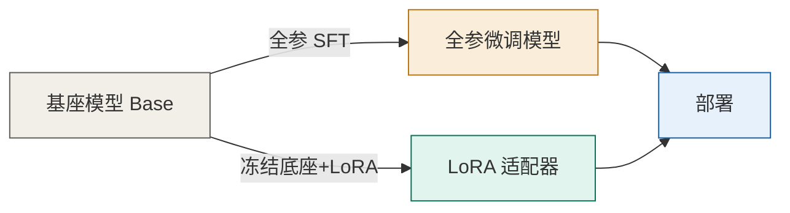
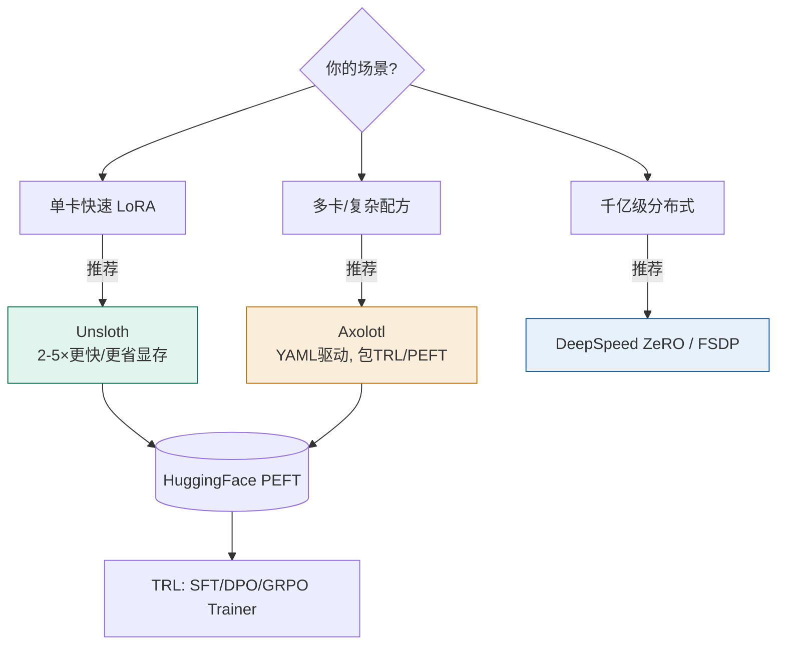

# 03 微调技术（Fine-tuning）

> 微调 = 用你的数据**改模型的权重**，让它在特定任务上更稳、更省 token、风格更固定。但「怎么微、微多少」决定了成本与风险。本篇讲清全参微调、PEFT 家族，以及最关键的——**选哪个、要多少显存**。

## 一、先做 SFT：微调的起点

无论后续怎么做，第一步几乎都是 **SFT（Supervised Fine-Tuning，监督微调）**：用「指令-回答」对训练模型学会按格式回答。



**SFT 数据质量 >> 数量**。几条高质量、覆盖边界情况的样本，胜过几万条噪声数据。数据通常来自：
- 人工标注 / 专家撰写
- 强模型（如 GPT-4 级别）蒸馏生成的「指令-回答」对
- 现有任务数据集改写（如将分类样本转成指令格式）

> ⚠️ SFT 是典型的「覆盖即固化」：它能让模型稳定输出你想要的格式，但**无法可靠地灌入大量新知识**（新知识用 RAG 更稳，见 01 篇）。

## 二、全参微调 vs 参数高效微调（PEFT）

| 方式 | 改动范围 | 显存 | 适用 |
| --- | --- | --- | --- |
| **全参微调** | 所有权重都更新 | 极高（含优化器状态） | 数据极大、任务差异巨大、资源充足 |
| **LoRA** | 仅注入低秩矩阵 | 中（冻结底座） | 绝大多数场景首选 |
| **QLoRA** | LoRA + 4bit 量化底座 | 低（消费级可行） | 大模型 / 显存紧张 |

### 2.1 LoRA：低秩适配

LoRA（Low-Rank Adaptation, Hu et al. 2021）的核心思想：**冻结预训练权重，在 transformer 层里注入可训练的低秩分解矩阵**。

```
原始:  W ∈ ℝ^(d×k)
LoRA:  W' = W + ΔW = W + B·A,   B ∈ ℝ^(d×r), A ∈ ℝ^(r×k),  r ≪ min(d,k)
```

- 只训练 A、B（秩 r 通常 8/16/32/64），可训练参数量可降至全量的 **0.1%–1%**。
- 训练完可把 ΔW 合并回原权重推理，或作为**独立适配器**挂载（便于多任务切换）。
- 常用 `target_modules`：`q_proj, k_proj, v_proj, o_proj, gate_proj, up_proj, down_proj`。

### 2.2 QLoRA：在 4bit 上做 LoRA

QLoRA（Dettmers et al. 2023） = **Quantize（量化）+ LoRA**，让 65B 模型能在单张 48GB GPU 上微调且接近 16bit 效果。关键创新：

- **NF4（4-bit NormalFloat）**：理论上对正态分布最优的 4bit 数据类型，优于 FP4/Int4。
- **双重量化（Double Quantization）**：对量化常数再量化，每参数再省 ~0.37bit（65B 约省 3GB）。
- **分页优化器**：用 NVIDIA 统一内存避免显存峰值 OOM。

> 工程实测（2025）：Llama-3-8B 的 LoRA FP16 约需 15GB，QLoRA NF4 约需 8GB；Llama-3-70B 的 QLoRA NF4 约 44GB，单张 H100 80G 即可。

### 2.3 其他 PEFT 变体

| 方法 | 思路 | 现状 |
| --- | --- | --- |
| **Adapter** | 插入小瓶颈层 | 参数多，已较少用 |
| **Prefix Tuning** | 在输入前加可训练前缀向量 | 研究用 |
| **Prompt Tuning** | 只调软提示 embedding | 轻量但能力有限 |
| **(Q)LoRA / DoRA** | 低秩 + 量化 / 方向缩放 | **生产首选** |
| **IA³** | 用乘性向量调制激活 | 较少 |

## 三、显存怎么算（训练侧）

训练显存 ≈ **权重 + 梯度 + 优化器状态 + 激活 + 临时缓冲**。以 AdamW 全参训练 FP16 为例，每参数约 12–16 字节（权重 2 + 梯度 2 + 动量/方差 8 + 优化器额外）。LoRA/QLoRA 因冻结底座，显存主要来自可训练部分 + 激活，大幅降低。

**实用选型（turion.ai 2025 硬件指南）**：

| 模型 | LoRA FP16 | QLoRA NF4 | 每 1 万样本训练时长 |
| --- | --- | --- | --- |
| Llama-3-8B | ~15 GB（4090/L4） | ~8 GB（T4/消费卡） | 1–2 小时 |
| Llama-3-70B | ~160 GB（2×H100+TP） | ~44 GB（单 H100 / 2×A100） | 6–12 小时 |
| Llama-3.1-405B | ~900 GB（多机） | ~250 GB（4×H100） | 24+ 小时 |

> 一句话：**8B 及以下消费级显卡直接 LoRA；70B+ 优先 QLoRA，除非质量敏感。**

## 四、工具链：2025 年怎么选



- **Unsloth**：高度优化的底层 GPU kernel，比默认 HF 快 2–5×、更省显存，**单卡微调首选**。
- **Axolotl**：YAML 配置驱动，封装 TRL/PEFT，多卡与复杂配方（SFT+DPO+PPO 流水线）友好。
- **LLaMA-Factory**：中文支持完善、配置简单，新手与中文任务友好。
- **DeepSpeed / FSDP**：ZeRO 分布式、张量并行，千亿级训练。
- **TRL（HF）**：提供 SFTTrainer、DPOTrainer、PPOTrainer、GRPOTrainer 等标准训练器。

## 五、一个最小 QLoRA 配置（Axolotl 风格）

```yaml
base_model: meta-llama/Llama-3.1-8B
load_in_4bit: true            # 底座量化为4bit
adapter: lora
lora_r: 16                    # 低秩维度
lora_alpha: 32
lora_dropout: 0.05
lora_target_modules: ["q_proj","k_proj","v_proj","o_proj","gate_proj","up_proj","down_proj"]
datasets:
  - path: my_dataset.jsonl
    type: sharegpt
sequence_len: 4096
sample_packing: true          # 打包短样本, 提吞吐
learning_rate: 2e-4
num_epochs: 3
gradient_accumulation_steps: 4
micro_batch_size: 2
output_dir: ./out/
```

> 基座权重全程不动，适配器落在 `output_dir`；可随时合并回底座推理，或用 vLLM 多 LoRA 服务（见 05 篇）。

## 六、微调决策清单

- ✅ **该微调**：需要固化输出格式/专属语气/领域术语；小模型要追平大模型特定任务；需要多租户各自的行为变体。
- ❌ **不该微调**：缺新知识（用 RAG）；任务能被提示词解决；数据量极小且噪声大（先清洗）；安全偏好（用 DPO/对齐，见 04 篇）。
- ⚠️ **风险**：过拟合小数据集、灾难性遗忘（用较小学习率 + 保留部分预训练数据混入）、数据泄露与版权、微调数据含毒（见 07 篇 LLM04 数据投毒）。

---

## 参考与延伸

- [LoRA (Hu et al. 2021, arXiv:2106.09685)](https://arxiv.org/abs/2106.09685)
- [QLoRA (Dettmers et al. 2023, arXiv:2305.14314)](https://arxiv.org/abs/2305.14314)
- [Hugging Face PEFT](https://github.com/huggingface/peft) · [TRL](https://github.com/huggingface/trl)
- [Unsloth](https://github.com/unslothai/unsloth) · [Axolotl](https://github.com/OpenAccess-AI-Collective/axolotl) · [LLaMA-Factory](https://github.com/hiyouga/LLaMA-Factory)
- turion.ai《LoRA, QLoRA, and PEFT: The Fine-Tuning Infrastructure Guide》(2025)
