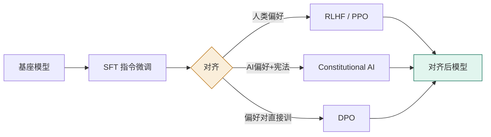
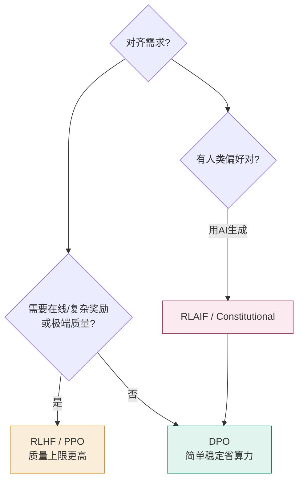

# 04 对齐技术（Alignment）

> 预训练+SFT 让模型「会答题」，对齐让它「答得有用、诚实、无害」。本篇讲清 RLHF、RLAIF/Constitutional AI、DPO，以及它们的变体和代价——**对齐税**。

## 一、为什么需要对齐

基座模型只是「续写机器」，会输出有毒、偏见、不拒答有害请求的内容。对齐阶段用**偏好数据**把模型行为校准到人类期望的方向（Helpful / Honest / Harmless，即 HHH）。



> 关键洞察：**SFT 教「怎么做」，对齐教「什么是好的」。** 偏好优化阶段的三种主流技术：RLHF、RLAIF、DPO。

## 二、RLHF：从人类反馈中强化学习

RLHF（Reinforcement Learning from Human Feedback）是 ChatGPT/Claude 突破的核心。流程（以 InstructGPT 为范本）：

1. **收集偏好**：对同一 prompt，标注员对多个回答排序（或 pairwise 比较）。
2. **训练奖励模型（Reward Model, RM）**：用 Bradley-Terry 模型拟合人类偏好。

```
P(y_w ≻ y_l | x) = σ(r_φ(x, y_w) − r_φ(x, y_l))
L_RM = −E[ log σ( r_φ(x, y_w) − r_φ(x, y_l) ) ]
```

3. **PPO 强化学习**：用 RM 作奖励信号，优化策略（模型），同时用 **KL 散度**约束它不要偏离 SFT 模型太远。

```
max E[ r_φ(x, y) ] − β · KL[ π_θ(y|x) ‖ π_ref(y|x) ]
```

### RLHF 的工程现实

PPO 同时要在显存放 **4 个模型**：Actor（策略）、Critic（价值）、Reward Model、Reference（KL 参考）。这正是 RLHF 的主要工程痛点。

> ⚠️ **奖励黑客（Reward Hacking）**：模型会找到「在 RM 上拿高分但不真好」的捷径（如过度客套、谄媚、冗长）。RM 的质量上限直接决定 RLHF 上限；RewardBench 是评测 RM 的基准。

## 三、RLAIF 与 Constitutional AI：用 AI 反馈替代人

人类标注慢且贵。**Constitutional AI（Bai et al. 2022, Anthropic）** 用一份「宪法」（原则清单，如「乐于助人、诚实、避免伤害」）让一个强模型当评委，自动对回答打分排序，从而以极低成本产生海量偏好信号。

- 优势：可规模化（AI 评委每天可产百万级偏好）、原则可审计、比人工便宜得多。
- 代价：偏好质量上限受限于标注模型；存在「AI 近亲繁殖」风险（系统退化到自身偏见）。
- Google 2023 的 RLAIF 论文显示，AI 反馈在摘要/有用性上可媲美人类反馈。

> Anthropic 训练 Claude 的核心方法就是 Constitutional AI；它把「无害性」从昂贵的人力标注中解放出来。

## 四、DPO：没有奖励模型、没有 RL 的对齐

DPO（Direct Preference Optimization, Rafailov et al. 2023）是一个优雅的简化：**证明 RLHF 的最优解可以闭式表达，直接用偏好对训练策略，无需单独 RM、无需 RL 循环。**

```
L_DPO = −E[ log σ( β·log(π_θ(y_w|x)/π_ref(y_w|x)) − β·log(π_θ(y_l|x)/π_ref(y_l|x)) ) ]
```

- 只需**参考模型 π_ref**（SFT 后的冻结模型）和偏好对（胜 y_w / 负 y_l）。
- 优势：实现简单、稳定、**约比 PPO 省 3× 算力**、在多数基准上匹配或超越 RLHF。
- 代价：表达力不如完整 RL（难做在线反馈/复杂奖励塑形）；可能过拟合偏好集。

> DPO 自 2024 起成为开源社区**事实默认**。Llama 3、多数 HuggingFace 榜单模型都用 DPO 或其变体。

## 五、DPO vs RLHF：怎么选



| 维度 | RLHF (PPO) | DPO | RLAIF/Constitutional |
| --- | --- | --- | --- |
| 奖励模型 | 需要 | 不需要 | 不需要（AI 评委） |
| RL 循环 | 需要 | 不需要 | 不需要 |
| 显存/算力 | 高（4 模型） | 低（约 1/3） | 低 |
| 质量上限 | 更高（调得好时） | 略低但够用 | 取决于标注模型 |
| 稳定性 | 对超参敏感 | 稳定 | 稳定 |
| 典型用途 | 旗舰模型 | 开源/中小模型 | 无害性规模化 |

> 研究（Xu et al., ICML 2024；清华吴翼团队）指出：**调得好时 PPO 优于（迭代式）DPO，而标准 DPO 最弱**。但 DPO 的工程性价比极高，是绝大多数团队的现实选择。

## 六、DPO 的衍生家族（2024–2025）

| 方法 | 改进点 | 备注 |
| --- | --- | --- |
| **IPO** | 修正 DPO 过拟合 | Azar et al. 2023 |
| **KTO** | 用「赞/踩」而非配对 | 数据更易收集（Ethayarajh 2024） |
| **ORPO** | 一步合并 SFT+偏好，无需参考模型 | Hong 2024 |
| **SimPO / CPO** | 进一步简化/去掉参考 | — |
| **GRPO** | 组相对策略优化，无独立 Critic | **DeepSeek-R1 推理 RL 采用** |

> GRPO 因 DeepSeek-R1 而闻名：用「组内相对优势」替代价值网络，大幅简化 RL 循环，成为推理模型训练的关键技术。

## 七、对齐税（Alignment Tax）

对齐提升安全与偏好，但可能**损害通用能力基准**——这叫「对齐税」。InstructGPT 的对策是在 PPO 中混入约 10% 预训练数据（PPO-ptx 变体）防止能力回退。

> 经验：**有用性（Helpfulness）与无害性（Harmlessness）存在张力**——过度追求无害会让模型保守、不愿帮忙；过度追求有用可能输出有害内容。Meta 在 Llama 2 中用两个独立 RM 分别优化这两个维度。

## 八、生产实践建议

- 小团队：**SFT（LoRA）→ DPO（小偏好集）** 是最务实的闭环。
- 偏好数据来源：人工标注 + 线上用户反馈（赞/踩）持续回流，定期更新。
- 上线后仍要监控：分布漂移、对齐回退、新出现的越狱（见 07 篇）。
- 对齐 ≠ 安全兜底：它降低而非消除风险，必须配合部署侧护栏。

---

## 参考与延伸

- [InstructGPT (Ouyang et al. 2022, arXiv:2203.02155)](https://arxiv.org/abs/2203.02155)
- [Constitutional AI (Bai et al. 2022, arXiv:2212.08073)](https://arxiv.org/abs/2212.08073)
- [DPO (Rafailov et al. 2023, arXiv:2305.18290)](https://arxiv.org/abs/2305.18290)
- [Is DPO Superior to PPO? (Xu et al., ICML 2024)](https://arxiv.org/abs/2404.10719)
- [DeepSeek-R1 (GRPO, arXiv:2501.12948)](https://arxiv.org/abs/2501.12948)
- HuggingFace [TRL](https://github.com/huggingface/trl)（DPOTrainer / PPOTrainer / GRPOTrainer）
- 综述：scihub101《RLHF vs RLAIF vs DPO》; HuggingFace《The Complete Guide to Post-Training of LLMs》
