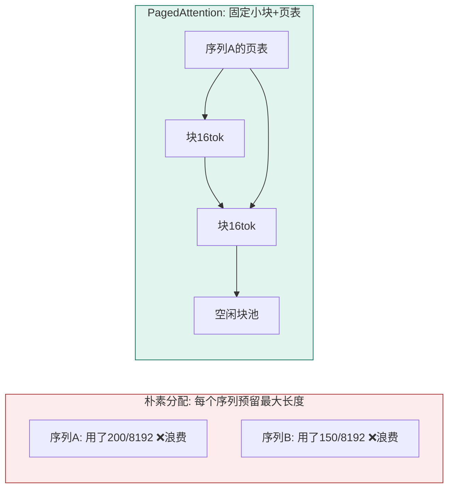
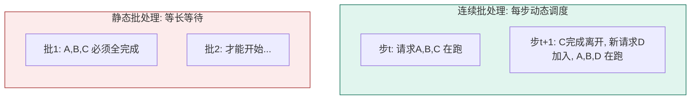
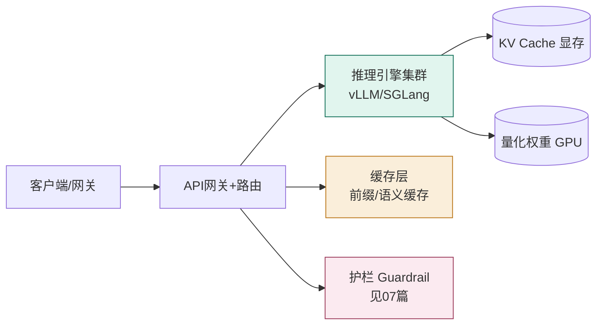

# 05 推理优化与部署工程（Serving）

> 训练一次，推理千万次。部署阶段决定「每千 token 多少钱、首字延迟多少、能扛多少并发」。本篇讲清为什么 vLLM 快、量化怎么选、成本怎么算。

## 一、推理性能的真正瓶颈：KV Cache 内存布局

上一节（02）讲过 KV Cache。推理服务器的吞吐，本质上是**能不能高效管理 KV Cache 显存**。

朴素实现：为每个序列预留一整块 `max_seq_len × 每层 × 头数 × 维度` 的连续显存。问题是绝大多数序列远短于上限——**60%–80% 的 GPU 显存被内部碎片浪费**。



**PagedAttention（Kwon et al., SOSP 2023，vLLM 的核心）** 把 KV Cache 像操作系统虚拟内存一样切成固定小块（如每块 16 token），用页表把序列逻辑位置映射到物理块，按需分配、用完即释放、相同前缀可共享。结果：

- KV 碎片从 60–80% 降到 **<4%**；
- 同一硬件、同模型，并发序列数提升 **6×**（H100 上从 ~5 并发到 ~30–50）；
- 整体吞吐比原生 HF Transformers 高 **2–24×**，比早期 TGI 高 2.2–3.5×。

> 这是自 FlashAttention 以来 LLM 服务层面最影响深远的内核级改动。任何生产推理引擎（vLLM/SGLang/TGI/TensorRT-LLM）底层都是「分页存储」。

## 二、连续批处理（Continuous Batching）

传统静态批处理要等整批都生成完才能换下一批，短请求被长请求拖死。连续批处理在**每个解码步**动态地把新请求插入、把完成的移出，GPU 利用率大幅提升（vLLM 还配合 chunked prefill，把长 prompt 切块与解码交织）。



## 三、主流推理引擎对比（2025）

| 引擎 | 核心特点 | 何时选 |
| --- | --- | --- |
| **vLLM** | PagedAttention + 连续批处理，生态最全，多 LoRA、投机解码、前缀缓存 | **通用默认首选** |
| **SGLang** | RadixAttention（前缀树共享）+ 同分页存储，结构化输出/复杂编排强 | 长共享前缀、复杂程序化调用 |
| **TGI (HF)** | Rust HTTP + 与 HF Hub 深度集成，v3 加 chunked prefill/前缀缓存 | 已深度用 HF 生态、长对话历史 |
| **TensorRT-LLM** | 编译为固定模型 CUDA 引擎，NVIDIA 上吞吐最高（比 vLLM 高 20–40%） | NVIDIA 专栈、愿为每模型调优 |
| **llama.cpp / GGUF** | CPU/Apple Silicon 友好，本地单机 | 本地开发、边缘、Mac |

> ⚠️ GGUF/llama.cpp **不适合多用户 GPU 生产服务**：它缺少连续批处理与 PagedAttention，吞吐远低于专门引擎。它是给开发机、边缘、单机自托管的。

## 四、量化：用精度换显存与成本

量化把权重/激活从 FP16 降到更低比特。核心权衡：**越小越省，但质量越脆**。

### 4.1 三大训练后量化（PTQ）路线

| 方法 | 原理 | 硬件 | 质量 | 使用建议 |
| --- | --- | --- | --- | --- |
| **GPTQ** | 用校准集二阶信息最小化量化误差（最优脑量化） | GPU | 4bit 基准 | 2023–24 主流，但对校准集敏感 |
| **AWQ** | **激活感知**：保护对大激活敏感的「显著权重」，其余更激进量化 | Ampere+ GPU | 同比特比 GPTQ 优 1–3% | **2026 年 INT4 GPU 生产默认** |
| **GGUF** | llama.cpp 生态，k-quant 混合精度，CPU 优化内核 | CPU/Apple Silicon | Q4_K_M 为推荐默认 | 本地/单机，可层卸载到 GPU |

> AWQ 的关键洞察：**不是所有权重都同等重要**。少数「显著权重」决定输出质量，保护它们就能在更低比特保持质量。AWQ 对校准集要求也更宽松。

### 4.2 FP8：现代加速器的原生量化

- FP8（8bit 浮点）是 **Hopper(H100)/Blackwell(B200)** 的原生数据类型，有硬件 FP8 tensor core。
- 近似 FP16 质量、接近 INT8 速度；**在 H100/B200 上首选 FP8 跑大模型**。
- 老卡（A100/Ampere）无原生 FP8，软件模拟会丢失性能优势 → 老卡用 AWQ INT4。

### 4.3 bitsandbytes / NF4：训练友好

bitsandbytes 的 NF4 是为**训练/微调**（QLoRA）设计的——前向动态量化、反向可算梯度，推理不是它的主战场。

### 4.4 量化显存速算（70B 为例）

| 精度 | 70B 显存 | 说明 |
| --- | --- | --- |
| FP16 | ~140 GB | 需多卡 |
| INT8 | ~70 GB | 单卡勉强（80G） |
| INT4 (AWQ) | ~35–40 GB | 单 H100 轻松 |

> 经验法则：**买 H100/B200 → 目标 FP8；买 A100/A10G → 用 AWQ INT4。**

## 五、知识蒸馏（Distillation）

用大模型（教师）的输出训练小模型（学生），让小模型在特定任务逼近大模型。配合量化，是「小模型上线」的常用组合。代价：仅在教师擅长、数据分布匹配时有效。

## 六、多 LoRA 服务：一底座多租户

因为底座冻结，可在**同一个基座上挂载多个 LoRA 适配器**，按请求动态切换——这是多租户 SaaS「每客户一个微调变体」的利器。

```bash
vllm serve meta-llama/Llama-3.1-70B-Instruct \
  --enable-lora --max-loras 20 --max-lora-rank 64 \
  --lora-modules cust_a=./lora_a cust_b=./lora_b
# 请求时指定 model="cust_a" 即切换适配器，开销极小
```

> 同一 GPU 集群可服务 20+ 个 LoRA，底座权重共享，边际成本极低。

## 六、投机解码（Speculative Decoding）

自回归生成逐 token 串行，是延迟的主要来源。投机解码用**草稿模型一次猜多个 token**，主模型**并行验证**——猜对了整段通过，猜错了回退重来：

- **流程**：草稿模型（小模型/同模型前层）快速生成 K 个候选 token → 主模型一次前向并行验证 → 接受连续正确部分，其余丢弃重试；
- **收益**：单 token 延迟大幅下降，加速通常 2~3×（接受率高时）；**batch 小、延迟敏感时收益最大**，大 batch 下连续批处理已把 GPU 打满，收益递减；
- **主流方案**：EAGLE / EAGLE-2（自回归草稿，基于特征外推，LLM 场景最优之一）、Medusa（并行 head 预测）、Lookahead Decoding；
- **推理模型特别适配**：长思考 token 是投机解码的理想场景（思考 token 预测难度低、可提前并行）；思考分块（chunked thinking）让思考与输出交错，可边思考边输出，进一步摊薄延迟。

> 一句话：**投机解码 = 「小模型猜、大模型验」，用并行换取串行延迟，2~3× 加速；小 batch + 长思考场景收益最大。**

## 七、PD 分离（Prefill-Decode Disaggregation）与 KV 量化

2025-2026 推理架构最大热点：**把 prefill（计算密集）与 decode（访存密集）拆分到不同机器/进程**，各自最优化：

- **为什么分离**：prefill 阶段 GPU 算力打满但显存带宽空闲，decode 阶段反之；混跑时互相拖累，且长上下文 prefill 会挤占 decode 的 KV cache；
- **架构**：请求先到 prefill 节点（并行计算首 token）→ KV cache 传输到 decode 节点（vLLM 原生支持 /v1 级调度，Mooncake、字节、DeepSeek 实践）→ decode 节点持续生成；
- **收益与代价**：TTFT 与吞吐双提升、可按流量比独立扩缩容；代价是 KV 跨节点传输带宽开销、调度复杂度；
- **KV Cache 量化与压缩**：FP8 KV cache（显存减半，精度损失可控）、KV offload 到 CPU/DRAM（长上下文兜底）、KV 压缩方法（KIVI 等）——长上下文 + 高并发场景的直接成本项；
- **MoE 推理**：DeepSeek-V3 等 MoE 模型需**专家并行（EP）**：专家层在多个 GPU 上分片，路由按专家分发 token，vLLM 已支持 EP 部署。

## 八、吞吐 / 延迟 / 成本：怎么衡量与优化

| 指标 | 含义 | 优化方向 |
| --- | --- | --- |
| **吞吐 Throughput** | tokens/s，整体产能 | PagedAttention、连续批处理、更大 batch |
| **TTFT 首字延迟** | 从请求到第一个 token | 前缀缓存、分块预填充、编译优化 |
| **TPOT / 逐字延迟** | 相邻 token 间隔 | 量化、投机解码、KV 量化 |
| **成本** | $/千 token | 量化、路由小模型、批处理、缓存 |

> 关键认知：**延迟与吞吐常矛盾**。高并发时吞吐优先（批更大），单用户交互时延迟优先。选型看你的流量画像。

## 九、部署架构草图



> 上线前必问：目标 QPS / 平均与 P99 延迟 / 上下文长度 / 成本预算 / 是否需要多LoRA / 合规与护栏。这些直接决定选 vLLM 还是 TRT-LLM、FP8 还是 AWQ、单卡还是多机。

---

## 参考与延伸

- [vLLM: PagedAttention (Kwon et al., SOSP 2023, arXiv:2309.06180)](https://arxiv.org/abs/2309.06180) · [vLLM GitHub](https://github.com/vllm-project/vllm)
- [SGLang](https://github.com/sgl-project/sglang) · [Hugging Face TGI](https://github.com/huggingface/text-generation-inference)
- [TensorRT-LLM](https://github.com/NVIDIA/TensorRT-LLM)
- 量化对比：AWQ([arXiv:2306.00978](https://arxiv.org/abs/2306.00978)) · GPTQ([arXiv:2210.17323](https://arxiv.org/abs/2210.17323)) · GGUF/llama.cpp([GitHub](https://github.com/ggml-org/llama.cpp))
- cloudrps《LLM Quantization in Production》(2026)；oobabooga 量化对比实测；aigeneratorreviews《Top 6 Inference Runtimes 2025》
