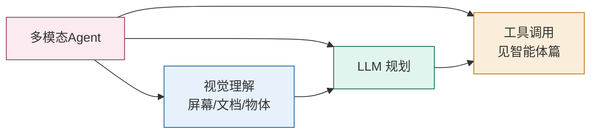

# 06 多模态大模型（Multimodal LLM）

> 文本之外的世界（图像、视频、音频）怎么喂给 LLM？本篇讲清 CLIP 的奠基、LLaVA 的经典「嫁接」范式，以及 Qwen2-VL / InternVL 等前沿架构。它与 02/05 篇共用同一套 Transformer 底座。

## 一、核心问题：把「非文本」变成「token 序列」

LLM 只吃 token。多模态模型（MLLM）的本质，是用一个**视觉（或音频）编码器**把信号变成向量，再用一个**连接器（Projector）** 把它映射到 LLM 的词嵌入空间，最后把视觉 token 与文本 token 拼接进同一个 Transformer 做自回归生成。

```mermaid
flowchart LR
    IMG[图像] --> VE[视觉编码器<br/>CLIP ViT]
    VE --> PR[连接器<br/>MLP / Q-Former / 交叉注意力]
    TXT[文本] --> EM[词嵌入]
    PR --> CAT[拼接 [视觉token; 文本token]]
    EM --> CAT
    CAT --> LLM[LLM 自回归解码]
    LLM --> OUT[回答]

    style VE fill:#E6F1FB,stroke:#185FA5
    style PR fill:#FAEEDA,stroke:#BA7517
    style LLM fill:#E1F5EE,stroke:#0F6E56
```

## 二、奠基：CLIP（对比学习对齐图文）

CLIP（Radford et al. 2021）用 4 亿图文对做**对比学习**：图像编码器和文本编码器分别把图、文编码到同一向量空间，使「匹配的图文」距离近、「不匹配的」距离远。

- 它产出的 **ViT 视觉编码器**成为几乎所有开源 MLLM 的标配特征提取器（冻结使用）。
- 零样本分类能力的来源：把类别名编成文本，与图像向量比对即可分类。

> CLIP 解决了「视觉特征从哪来」的问题，是后续所有 VLM 的地基。

## 三、经典范式：LLaVA（线性/MLP 投影）

LLaVA（Liu et al., NeurIPS 2023）是最有影响力的开源多模态模型之一，证明「冻结的 CLIP + 轻量投影 + 微调 LLM」就能获得惊艳的视觉对话能力。

- **架构**：冻结 CLIP ViT-L/14 → 轻量投影层（LLaVA-1.0 线性、1.5 升级为两层 MLP）→ 冻结 Vicuna LLM。
- **两阶段训练**：
  1. **特征对齐预训练**：只训投影矩阵，用 CC3M 子集。
  2. **端到端指令微调**：投影层 + LLM 一起训（视觉指令数据）。
- **数据创新**：用纯文本 GPT-4 生成多模态指令数据（158K 样本），开创「自指令」式多模态数据构建。
- LLaVA-1.5 仅靠公开数据、单节点 8×A100 一天训练即达 11 项基准 SOTA。

> LLaVA 的意义：把多模态研究从「拼数据量」拉回「架构与数据设计」，成为后续 VLN 系列的范式模板。

## 四、连接器（融合机制）对比

视觉特征注入 LLM 的方式，决定了架构形态：

| 机制 | 代表模型 | 新增参数 | 视觉 token 数 | 特点 |
| --- | --- | --- | --- | --- |
| 线性投影 | LLaVA-1.0 | ~2M | 576 | 简单高效 |
| MLP 投影 | LLaVA-1.5 | ~20M | 576 | 表达更强 |
| **Q-Former** | BLIP-2 | ~107M | 32（压缩） | 用可学习 query 压缩视觉信息 |
| 交叉注意力 | LLaMA 3.2 Vision | ~1B | 可变 | 在 LLM 内部深度融合 |

- **BLIP-2（Q-Former）**：用 32 个可学习 query token 通过交叉注意力从视觉特征提取信息，输出固定 32 个视觉 token，**以 1/54 的训练参数超越 Flamingo-80B**。
- **LLaMA 3.2 Vision**：在冻结的 LLaMA 3.1 文本模型上**插入交叉注意力适配器**，训视觉编码器+适配器、冻结 LLM，实现「即插即用」替换，保持文本能力不变。

## 五、前沿架构

### 5.1 Qwen2-VL：动态分辨率 + M-RoPE

- **动态分辨率**：去掉 ViT 绝对位置编码，引入 **2D-RoPE**，支持任意分辨率输入。
- **M-RoPE（多模态旋转位置编码）**：把旋转位置编码拆成时间 + 空间（高/宽）三部分，统一处理图文视频的位置。
- **Token 压缩**：MLP 把相邻 2×2 token 压成 1 个，224×224 图仅产生 66 个视觉 token，大幅省上下文。

### 5.2 InternVL：把视觉编码器做大

- 视觉编码器扩到 **60 亿参数（InternViT-6B）**，用 QLLaMA（8B）作连接「胶水层」。
- 三阶段训练：对比学习 → 生成学习 → 指令微调。
- **InternVL 2.5 是首个在 MMMU 基准突破 70% 的开源模型，达到 GPT-4o 水平。**

### 5.3 原生多模态（Native Multimodal）

区别于「在单模态模型上嫁接」，原生多模态指**从设计之初就多模态统一训练**（如 GPT-4V、Gemini）。优势是跨模态推理更自然，代价是训练成本与数据工程极高。

### 5.4 开源生态 2025-2026 现状（选型基准）

| 模型 | 视觉编码 | 特点 |
| --- | --- | --- |
| **Qwen2.5-VL / Qwen3-VL** | SigLIP-675M（原生） | 开源全模态主力：长视频（Qwen2.5-VL-72B 支持 1h+）、屏幕/文档理解 SOTA，Agent 友好（GUI 定位） |
| **InternVL 3.0** | InternViT-6B（升级） | 模型更大视觉骨干更强，MMMU/图表密集场景强 |
| **GLM-4.5V** | 原生 | 中文文档/OCR 性价比高 |
| **Llama 4** | 原生 MoE 视觉 | 开源多模态 MoE 尝试，中文生态弱 |
| **GPT-4o / Gemini 2.5 / GPT-5** | 闭源原生 | 综合最强，Agentic 多模态（读屏操作）标杆 |

> 选型三问：**要不要 OCR/文档 → 动态分辨率优先（Qwen/InternVL）；要不要视频理解 → Qwen2.5-VL-72B 级；要不要 GUI 操作 → 看 Agent 评测（OSWorld/WebArena，见「[模型评测与基准/02-主流基准与榜单](../模型评测与基准/02-主流基准与榜单.md)」）。**

## 六、视频与音频

- **视频**：把视频抽帧当多图处理，或用时序 token 建模；LLaVA-NeXT、Qwen2-VL 等支持。
- **音频/语音**：用音频编码器（如 Whisper 类）产生 token，与文本拼接；语音助手常采用「ASR → LLM → TTS」或端到端语音 LLM。
- **Token 压缩**是多模态落地的关键：LLaVA-Mini 把 576 个视觉 token 压到 1 个，FLOPs 降 77%、吞吐近 3×，QA/视频理解精度基本不掉。

### 6.1 语音路线之争（2025 热点）

- **管线式（ASR → LLM → TTS）**：成熟、可控、延迟可控；短板是情感/打断/副语言信息丢失，且错误在 ASR/TTS 端逐级放大；
- **端到端语音模型**：Gemini 2.5 Flash Native Audio / OpenAI Realtime / GLM-4-Voice / Qwen-Audio——直接输入输出音频 token，自然交互（打断、情绪、口音）；代价：训练数据贵、TTS 音质可控性差、评测难（SpeechBench 类基准刚起步）；
- **工程判断**：客服/语音助手这类「低延迟 + 打断」场景选端到端；播报/播客/多音色 TTS 场景仍用管线式（TTS 模型成熟且可控）。

### 6.2 视频理解落地的 token 账本

- 1 秒视频 ≈ 8~10 帧；Qwen2.5-VL 每帧约 0.5~1K token → **1 分钟视频 ≈ 300~600K token**，超大多数上下文窗口——必须「抽帧策略 + 采样步长 + 全局/局部双编码」；
- 工程套路：**先全局低帧率粗看 → 模型选关键片段 → 对关键片段高帧率细看**（两阶段视频 agent）；
- 视频 token 压缩（Qwen2.5-VL 的 Visual Token Compression）与长视频模型（1h+）是 2026 年方向，见 05 篇 KV 优化配合。

## 七、多模态与智能体（呼应本仓库）

多模态是**多模态 Agent** 的感官：能看图、读屏、理解文档图像、操作 GUI。



> 训练侧：多模态能力靠「视觉编码器 + 投影层」微调获得，底座 LLM 可用 03/04 篇的 LoRA/DPO 技术；部署侧回到 05 篇的 vLLM/量化（vLLM 已支持多模态骨干）。

## 八、选型与踩坑

- 想要**开源可本地部署**：LLaVA 系、Qwen2-VL、InternVL 是主力。
- **高分辨率/文档理解**：优先 Qwen2-VL、InternVL（动态分辨率 + 大模型编码器）。
- ⚠️ **视觉 token 数**直接吃上下文与 KV Cache：高分辨率图 + 不压缩 = 上下文爆炸，务必看模型的 token 压缩策略。
- ⚠️ 多模态**幻觉**比文本更严重（看图编细节），评测要用 MMMU、DocVQA 等专项基准，而非仅靠文本基准。

---

## 九、工程落地：多模态应用的架构套路

```
业务场景(图/文档/视频) → 预处理(OCR/抽帧/裁剪) → MLLM(视觉理解/问答) → 后处理(结构化) → 业务系统
                                  └─ 索引入库(向量化) → 多模态 RAG 检索
```

| 场景 | 技术选型 | 关键点 |
|------|----------|--------|
| 文档审核/票据 OCR 理解 | Qwen2-VL + OCR 预处理 | 高分辨率动态输入，长文档分页 |
| 看图问答/电商图搜索 | InternVL/LLaVA + 多模态向量检索 | 图像 embedding + 文本联合检索 |
| 视频审核/摘要 | 抽帧 + MLLM 批量理解 | 帧率采样 + 分片处理，控制 token |
| 屏幕理解 Agent | MLLM + 界面元素识别 | 与 [多模态 Agent](../智能体/06-评估、安全与工程落地.md) 联动 |

**工程四坑**：
1. **上下文爆炸**：高分辨率图 token 多 → 先缩放/裁剪 + 用压缩策略强的模型；
2. **延迟与成本**：视觉推理比文本贵 → 批量、缓存、降采样，区分「需要视觉」与「文本足够」的请求；
3. **结果不可控**：多模态输出结构化更易漂 → 输出强制 JSON + 二次校验；
4. **评测缺失**：仅用文本基准评估视觉模型 = 盲人摸象 → 用 MMMU/DocVQA/SeedBench 等专项集。

---

## 十、面试高频追问

1. Q：多模态模型怎么把图像送进 LLM？ A：视觉编码器（CLIP ViT）→ 连接器（MLP/Q-Former）映射到词嵌入空间 → 视觉 token 与文本 token 拼接进同一 Transformer。
2. Q：视觉 token 多了会怎样？ A：直接占上下文窗口和 KV Cache 显存，成本与延迟上升；所以要 token 压缩（2×2 合并/Q-Former 压缩/LLaVA-Mini 单 token）。
3. Q：CLIP 的预训练目标是什么？ A：图文对比学习——匹配对拉近、不匹配推远，产出的视觉编码器成为 VLM 标配地基。
4. Q：LLaVA 为什么成功？ A：冻结编码器+轻量投影+两阶段训练（先对齐后微调），以极小成本证明「嫁接范式」可行，并开创自指令数据构建。
5. Q：选多模态模型看什么？ A：基准（MMMU/DocVQA）、视觉 token 压缩率、动态分辨率支持、幻觉率与部署成本（显存/推理速度）。

---

## 参考与延伸

- [CLIP (Radford et al. 2021, arXiv:2103.00020)](https://arxiv.org/abs/2103.00020)
- [LLaVA (Liu et al., NeurIPS 2023, arXiv:2304.08485)](https://arxiv.org/abs/2304.08485) · [LLaVA 项目主页](https://llava-vl.github.io/)
- [BLIP-2 (Li et al. 2023, arXiv:2301.12597)](https://arxiv.org/abs/2301.12597)
- [Qwen2-VL (arXiv:2408.09300)](https://arxiv.org/abs/2408.09300) · [InternVL (arXiv:2404.16821)](https://arxiv.org/abs/2404.16821)
- 架构综述：phonism《Transformer 学习笔记(八): 前沿应用》(LLaVA/Qwen-VL/InternVL/Llama-3.2 Vision 融合机制对比)
