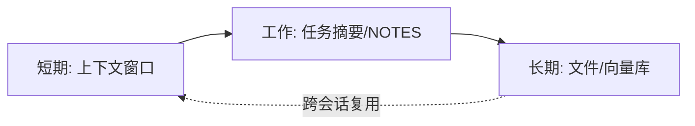

# 总览与架构地图

> 本文是「记忆系统」模块的导读。先建立直觉，再分系统深挖（见 02 Claude Code、03 Codex）。

## 一、为什么需要记忆

即使是 Claude Code、Codex 这类强大的 coding agent，**每次会话（session）也都从一块全新的上下文窗口开始**。它不会自动「记得」你昨天的偏好、项目约定或刚修掉的那个诡异 bug。

这意味着两件事：

1. **你每次都要重新交代背景**，否则 agent 会基于默认值瞎猜。
2. **所谓「记忆」并不是魔法**——它本质是 agent 在启动（或读取子目录）时，从磁盘读取一批 Markdown 文件，注入到 prompt 里当上下文参考。

```text
用户打开会话
   ↓
agent 启动时扫描磁盘上的记忆文件（CLAUDE.md / AGENTS.md / MEMORY.md / memories …）
   ↓
把文件内容拼进 system / context（作为「参考」，不是强制配置）
   ↓
模型带着这些上下文开始工作
```

> 关键认知：这些文件是「上下文（context）」，不是「强制配置（config）」。遇到冲突规则，模型可能**随机选一条**，无法保证一定执行。要真正强制行为，得用 Hook（如 PreToolUse）。

## 二、记忆的两种性质

记忆系统普遍分成两层，理解这一点是看懂后面所有内容的前提：

| 性质 | 谁来写 | 是什么 | 例子 |
| --- | --- | --- | --- |
| **静态指令（你写的）** | 你 / 团队 | 主动编写的、受版本控制的规则文件 | `CLAUDE.md`、`AGENTS.md` |
| **生成笔记（agent 自己写的）** | agent | 后台从会话历史中总结出来的事实 | Claude 的 `MEMORY.md`、Codex 的 `memories/` |

- **静态指令层**：你明确告诉 agent「我们项目用 pnpm」「不要改 migrations」。确定、可控、可提交。
- **生成笔记层**：agent 在对话中发现「这个项目的鉴权用 OAuth 代理」并自动记下来，下次直接复用，补上「会话中涌现的事实」这一缺口。

两套系统**互补**：静态层给确定性，生成层补涌现信息。

## 三、Claude Code 与 Codex 架构总览对比

| 维度 | Claude Code | OpenAI Codex |
| --- | --- | --- |
| 静态指令文件 | `CLAUDE.md`（四层作用域） | `AGENTS.md`（全局/仓库根/子目录） |
| 生成笔记文件 | `MEMORY.md` + 主题文件（位于 `~/.claude/projects/<p>/memory/`） | `memories/`（位于 `~/.codex/memories/`） |
| 静态层是否可被 agent 改写 | 否（你维护） | 否（普通受版本控制文件，用户维护） |
| 生成层写入方式 | agent 自动总结，每会话加载索引 | 后台异步总结，会话空闲约 6 小时才 eligible |
| override 机制 | 无独立 override；用 `CLAUDE.local.md` + `.gitignore` 做个人覆盖 | 有 `.override.md` 优先于 `AGENTS.md` |
| 跨工具约定 | 读 `CLAUDE.md`，不读 `AGENTS.md`（可用 `@AGENTS.md` 导入） | `AGENTS.md` 是 Cursor/Aider/Jules 等共用的跨工具规范，已归 Linux Foundation Agentic AI Foundation |
| 云同步 | 机器本地，不云同步 | 机器本地，不云同步 |

> ⚠️ 两者的自动记忆都只存在**机器本地，不云同步**。换电脑、重装、清缓存都会丢。重要约定请放在静态指令层并纳入版本控制。

## 四、本文范围

- 覆盖：Claude Code（`CLAUDE.md` + Auto Memory）、Codex（`AGENTS.md` + Memories）、二者差异、三系统横向对比与落地建议。
- 不覆盖：模型内部权重/微调、RAG 向量数据库式长期记忆、企业级私有化部署细节（超出官方文档范围的不再展开）。

下一篇：[02-Claude-Code记忆架构.md](./02-Claude-Code记忆架构.md)

## 五、短期 / 长期 / 工作记忆区分

把「记忆」按生命周期与用途拆开，才能选对存储载体——这正是上下文工程里「Memory 杠杆」的理论基础。

| 类型 | 生命周期 | 存什么 | 典型载体 |
| --- | --- | --- | --- |
| **短期记忆（Short-term）** | 单次会话内 | 当前轮上下文、临时变量 | 上下文窗口本身 |
| **工作记忆（Working memory）** | 一个任务 / 子目标期间 | 当前任务的计划、中间结论 | 窗口内摘要 / NOTES.md |
| **长期记忆（Long-term）** | 跨会话、持久 | 项目约定、踩坑、用户偏好 | CLAUDE.md / MEMORY.md / 向量库 |



> 演进路径：会话内靠窗口（短期）→ 任务内靠摘要沉淀（工作）→ 跨会话靠文件 / 向量库（长期）。三层配合，agent 才有「连续性」。

## 六、记忆与 RAG 的关系

两者都解决「模型没记住的东西临时补上」，但层次不同：

| 维度 | 记忆（Memory） | RAG |
| --- | --- | --- |
| 目的 | 保留「项目 / 用户」的稳定事实与偏好 | 检索「知识库」的相关片段作答 |
| 写入 | 多为离线 / 异步沉淀 | 多为实时检索 |
| 数据形态 | 少量、结构化、低更新 | 海量、文档、高频更新 |
| 关系 | 记忆可当 RAG 的「路由 / 过滤上下文」 | RAG 补记忆覆盖不到的语料 |

> 实践上：**记忆 = 给 agent 的「长期人设与约定」，RAG = 给答案的「即时资料」**。两者可串联——用长期记忆决定检索范围与偏好，再用 RAG 取细节事实。

## 七、记忆架构对比表（扩展）

| 架构 | 存储 | 检索 | 遗忘 | 适用 |
| --- | --- | --- | --- | --- |
| 纯文件（Claude / Codex） | Markdown | 启动时全量 / 索引加载 | 手动 / 不自动 | 轻量、可版本化 |
| 向量库 | embedding | 相似度 top-k | 按时间 / 去重清理 | 海量语义记忆 |
| KV 存储 | key→value | 精确 key 查 | TTL / LRU | 结构化偏好 |
| 向量 + KV 混合 | 两者结合 | 语义 + 精确 | 分别策略 | 生产级 Agent |
