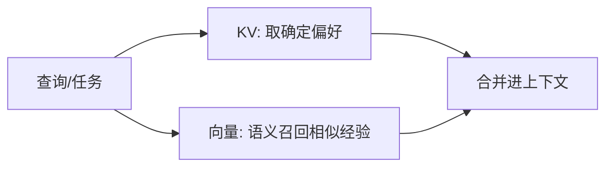
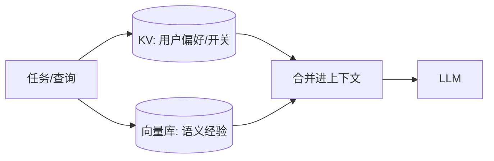

# Claude Code 记忆架构

> Claude Code 的记忆由两套互补系统组成：你写的 **CLAUDE.md**（静态指令）与 agent 写的 **Auto Memory**（生成笔记）。两者叠加，既保证确定性规则，又补上涌现事实。

## 一、CLAUDE.md 体系（你写的静态指令）

### 1. 四层作用域

| 层级 | 路径 | 作用 | 是否提交 VCS |
| --- | --- | --- | --- |
| ① Managed 组织级 | macOS `/Library/Application Support/ClaudeCode/CLAUDE.md` 等 | IT 通过 MDM 推送，团队强制基线 | 不可被 `claudeMdExcludes` 排除 |
| ② User 用户级 | `~/.claude/CLAUDE.md` | 个人偏好，作用于所有项目 | 个人，通常不提交 |
| ③ Project 项目级 | `./CLAUDE.md` 或 `./.claude/CLAUDE.md` | 团队共享的项目约定 | **提交 VCS** |
| ④ Local 个人项目级 | `./CLAUDE.local.md` | 个人项目偏好，覆盖但不污染团队文件 | **加 `.gitignore`** |

```text
your-project/
├── CLAUDE.md            # ③ 项目级，团队共享，提交
├── .claude/
│   └── CLAUDE.md        # ③ 另一种写法（同样项目级）
├── CLAUDE.local.md      # ④ 个人偏好，记得 .gitignore
└── .gitignore           # 建议包含 CLAUDE.local.md
```

> ⚠️ `CLAUDE.local.md` 含个人/机器相关偏好，**务必加入 `.gitignore`**，否则容易把本地路径、密钥习惯等误提交到团队仓库。

### 2. 加载与合并规则

- **从工作目录向上遍历串联**：Claude Code 会沿目录树向上找所有 `CLAUDE.md`，依次拼接（**不覆盖**，是合并上下文）。
- **子目录按需加载**：子目录里的 `CLAUDE.md` 不是启动就全读，而是在 Claude 实际读取/处理该子目录时才加载。
- **目标 < 200 行/文件**：官方建议每个文件保持精简，避免上下文膨胀。
- **`@import` 最多 5 跳**：可用 `@path/to/other.md` 语法引入其它文件，相对路径，递归跳转上限为 **5 跳**。

```text
工作目录 ./services/api/
   ↓ 向上遍历
读取 ./services/api/CLAUDE.md
读取 ./services/CLAUDE.md
读取 ./CLAUDE.md
读取 ~/.claude/CLAUDE.md
读取 Managed 组织级 CLAUDE.md
   ↓ 全部拼接进上下文（不互相覆盖）
```

### 3. `.claude/rules/` 路径限定规则

有些规则只对特定文件类型生效，可以放 `.claude/rules/` 下，用 **YAML frontmatter 的 `paths:`** 声明只在处理匹配文件时加载。

目录示意：

```text
your-project/.claude/rules/
├── backend.md        # 通用后端规则
└── frontend.md       # 仅前端文件生效
```

`frontend.md` 示例：

```yaml
---
paths:
  - "src/**/*.tsx"
  - "src/**/*.css"
---
- 组件必须用函数式写法
- 样式优先用 CSS Modules
```

> 只有 Claude 正在处理匹配 `paths` 的文件时，`frontend.md` 的内容才被注入上下文；处理后端文件时不会被干扰。

### 4. AGENTS.md 兼容

Claude Code **读 `CLAUDE.md`，不读 `AGENTS.md`**。若你的仓库已经有一份 `AGENTS.md`（比如同时给 Codex / Cursor 用），在 `CLAUDE.md` 里加一行即可让它被同时读取：

```text
@AGENTS.md
```

这样 Claude 会把 `AGENTS.md` 当作导入内容一起加载，避免维护两份重复约定。

## 二、Auto Memory（agent 自己写的生成笔记）

### 1. 存储位置

```text
~/.claude/projects/<project>/memory/
├── MEMORY.md          # 索引：指向各主题文件
├── debugging.md       # 主题文件示例：调试经验
├── api-conventions.md # 主题文件示例：API 约定
└── ...                # 其它涌现主题
```

- 同一 git 仓库的**所有 worktree 共享**这份记忆。
- **机器本地，不云同步**。

> ⚠️ Auto Memory 只在机器本地，重装/换机即丢失。它不适合存「唯一真相」，关键约定仍应写进 `CLAUDE.md` 并纳入 VCS。

### 2. 加载方式

- **`MEMORY.md` 索引**：每会话加载其**前 200 行或前 25KB**（超出部分本会话不自动注入）。
- **主题文件按需读取**：`MEMORY.md` 里引用的主题文件，超过索引部分时由 agent 在需要时再读。
- **可用 `/memory` 命令**：浏览、编辑、开关自动记忆。

### 3. 子代理记忆

子代理（subagent）也可以拥有自己的自动记忆，逻辑与主代理一致，独立存储于对应项目目录下。

## 三、小结

- **确定性规则** → 写 `CLAUDE.md`（项目级提交、个人级 `.gitignore`）。
- **涌现事实** → 交给 Auto Memory（agent 自动总结，机器本地）。
- **跨工具** → 用 `@AGENTS.md` 复用仓库里已有的 `AGENTS.md`。

下一篇：[03-Codex记忆架构.md](./03-Codex记忆架构.md)

## 四、从 Markdown 记忆到「向量 + KV 混合存储」

Claude Code 原生用 Markdown（`MEMORY.md` 索引 + 主题文件），但当你需要**海量、语义化**的长期记忆时，可演进为混合存储——把「精确偏好」与「语义经验」分开存。

| 存储 | 适合存 | 检索方式 |
| --- | --- | --- |
| **KV 存储** | 用户偏好、项目开关等精确键值 | 按 key 直接取（快、确定） |
| **向量库** | 调试经验、踩坑等语义片段 | embedding 相似度 top-k |
| **Markdown 索引** | 人可读的目录与摘要 | 启动时加载 |



> 落地建议：确定性约定仍走 `CLAUDE.md`（等价 KV），涌现事实可同时写一份到向量库做语义检索，Markdown 索引仅作人读总览。这样既不污染版本化静态层，又补上语义召回能力。

## 五、记忆检索与遗忘策略（Claude 侧）

**检索**

- 每会话自动加载 `MEMORY.md` 索引前 **200 行 / 25KB**；超出的主题文件按需读取。
- 用 `/memory` 浏览、编辑、开关自动记忆。

**遗忘 / 淘汰**

- 自动记忆**不会自动过期**，需人工清理或 `/memory` 编辑。
- 长期不用的主题文件建议定期归档，避免索引膨胀、噪声稀释高信号。
- 关键真相不要只依赖自动记忆——它机器本地、不云同步，可能丢失。

```text
检索：MEMORY.md(≤200行/25KB) → 按需读主题文件
遗忘：人工 /memory 清理，无自动 TTL

## 六、记忆检索与遗忘策略（代码实现）

把 05 的文本策略落成可运行逻辑。核心三类操作：检索合并、TTL 过期、LRU/重要性淘汰。

```python
import time, json
from pathlib import Path

class MemoryStore:
    def __init__(self, root):
        self.root = Path(root)
        self.root.mkdir(parents=True, exist_ok=True)

    # 检索：合并「精确 KV 命中 + 索引文件 + 按需主题」
    def retrieve(self, key=None, limit=5):
        if key and (self.root / f"{key}.json").exists():
            return json.loads((self.root / f"{key}.json").read_text())  # KV 精确取
        hits = [p for p in self.root.glob("*.md")][:limit]             # 否则召回索引
        return [p.read_text() for p in hits]

    # 写入：KV 精确写 + 更新访问时间（用于 LRU）
    def write(self, key, value):
        (self.root / f"{key}.json").write_text(json.dumps(
            {"value": value, "ts": time.time(), "access": time.time()}))

    # 遗忘：TTL 过期 + LRU 淘汰（按最近访问时间）
    def forget(self, ttl=7*24*3600, max_items=100):
        items, now = [], time.time()
        for p in self.root.glob("*.json"):
            d = json.loads(p.read_text()); items.append((p, d["access"]))
        for p, access in items:
            if now - access > ttl:
                p.unlink()                      # TTL 过期
        items.sort(key=lambda x: x[1])
        while len(items) > max_items:           # LRU 淘汰
            p, _ = items.pop(0); p.unlink()
```

> 💡 生产记忆必须有「遗忘」机制：无 TTL 的记忆会无限膨胀、噪声稀释高信号。KV 用 TTL/LRU，向量库用时间窗口+去重清理。

## 七、向量 + KV 混合存储设计（深化）

精确偏好走 KV、语义经验走向量，二者在「检索时合并注入」：



| 字段层 | 存储 | 示例 key/schema | 检索 |
| --- | --- | --- | --- |
| 偏好 | KV（Redis/SQLite） | `user:123:lang=zh` | 按 user_id 精确取 |
| 经验 | 向量（pgvector/Milvus） | `embedding + text + tags` | 相似度 top-k |
| 索引 | Markdown/JSON | `MEMORY.md` 人读总览 | 启动加载 |

```python
def recall(user_id, task, mem_kv, mem_vec):
    prefs = mem_kv.get(f"user:{user_id}:prefs")     # KV 精确
    exps  = mem_vec.search(embed(task), top_k=5)      # 向量语义
    return build_context(prefs, exps)                # 合并注入
```

> 💡 混合设计的关键：KV 保证「确定性偏好零延迟命中」，向量补「记了但想不起来的长尾经验」。静态指令层（CLAUDE.md/AGENTS.md）可视为系统级 KV。

## 八、多会话与多用户隔离

记忆若不分租户，会出现「用户 A 看到用户 B 的偏好」或「会话互相污染」。隔离维度：

| 维度 | 隔离键 | 做法 |
| --- | --- | --- |
| 多用户 | `user_id` | 记忆路径/命名空间按用户分 |
| 多会话 | `session_id` | 工作记忆按会话隔离，长期记忆按用户 |
| 多项目 | `project_id` | 同 Codex/Claude 的仓库级分层 |
| 多团队 | `tenant_id` | 向量库建独立 collection/namespace |

```python
def user_memory_path(user_id, project_id):
    # 用户 + 项目双重隔离，避免跨项目串味
    return f"~/.mem/{user_id}/{project_id}/MEMORY.md"
```

> ⚠️ 多用户场景**必须做隔离 + 鉴权**：记忆可能含 PII，越权读取即合规事故。向量库用 namespace/collection 隔离，KV 用 user_id 前缀，检索前校验权限。

## 九、在 Agent 中落地的示例代码

把记忆接入一个最简 Agent 循环：启动加载长期记忆、任务中写工作记忆、结束沉淀长期记忆。

```python
class Agent:
    def __init__(self, user_id):
        self.mem = MemoryStore(f"~/.mem/{user_id}")
        self.long_term = self.mem.retrieve()        # 启动注入长期记忆

    def run(self, task):
        ctx = self.long_term + "\n" + self.working   # 长期 + 工作记忆
        plan = llm.plan(task, ctx)
        for step in plan:
            res = tool(step)
            self.working += f"\n- {step}: {res}"      # 工作记忆滚动
        self.mem.write("recent", summarize(self.working))  # 结束沉淀
        return final_answer
```

> 💡 闭环：**启动读长期 → 任务用工作记忆 → 结束沉淀长期**。配合 05 的遗忘策略（TTL/LRU）防止膨胀，配合异步总结即可接近 Claude/Codex 的自动记忆体验。
```
