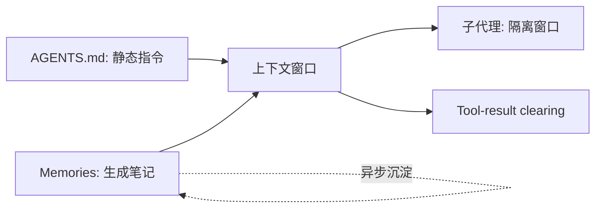

# Codex 记忆架构

> Codex 的记忆同样分两层：**AGENTS.md**（你写的静态指令）与 **Memories**（agent 生成的笔记）。但关键区别是——Codex 的 `AGENTS.md` 是**纯静态**的，agent 不能自己改写它。

## 一、AGENTS.md 静态指令层（你写的）

### 1. 文件位置与优先级

```text
~/.codex/
├── AGENTS.md            # 全局指令
└── AGENTS.override.md   # 全局覆盖，优先于 AGENTS.md

your-repo/
├── AGENTS.md            # 仓库根指令（团队共享，提交 VCS）
├── AGENTS.override.md   # 仓库级覆盖，优先于 AGENTS.md
└── x/
    ├── AGENTS.md        # 子目录指令
    └── AGENTS.override.md
```

- **全局**：`~/.codex/AGENTS.md`（或同目录 `AGENTS.override.md` 优先）。
- **仓库根**：`./AGENTS.md`。
- **子目录**：`./x/AGENTS.md`（`override.md` 优先）。

### 2. 发现与拼接规则（root-first）

Codex 从 **git 仓库根向当前工作目录遍历**，每一级目录都按 `override → AGENTS.md → fallback` 的顺序检查，把命中的文件拼接成一条指令链（**root-first**，仓库根在最前）。

```text
git 仓库根 /
   ↓ 检查 override.md → AGENTS.md → fallback
读取 ./AGENTS.md
   ↓ 进入子目录
读取 ./x/AGENTS.md（或 ./x/AGENTS.override.md 优先）
   ↓ 拼接为指令链（root-first）
```

### 3. 大小上限与 fallback

- **默认上限 32 KiB**：由配置项 `project_doc_max_bytes` 控制，可调整；**超出部分静默截断**（不会报错，但内容被砍）。
- **可配 fallback 文件名**：通过 `project_doc_fallback_filenames`（如 `TEAM_GUIDE.md`）指定备选文件名，找不到 `AGENTS.md` 时回退使用。

```toml
# 示意：Codex 配置（具体键名以官方文档为准）
project_doc_max_bytes = 32768          # 32 KiB
project_doc_fallback_filenames = ["TEAM_GUIDE.md", "CONTRIBUTING.md"]
```

### 4. 跨工具约定与治理

- `AGENTS.md` 是 **Cursor / Aider / Jules 等共用的跨工具约定**，一份文件多工具复用。
- 该约定现已归入 **Linux Foundation Agentic AI Foundation** 规范（成为事实标准）。
- **agent 不能自主改写 `AGENTS.md`**：它就是个普通、受版本控制的文件，由你 / 团队维护。

> 注意：因为没有「agent 自己改 `AGENTS.md`」的通道，`AGENTS.md` 无法补「会话中涌现的事实」这一缺口——这个缺口由下面的 Memories 层来填。

## 二、Memories 生成层（agent 写的笔记）

### 1. 存储与生成

```text
~/.codex/
└── memories/
    ├── <session-summary-1>.md
    └── <session-summary-2>.md
```

- Codex 在后台**异步总结历史会话**，把涌现的事实写入 `~/.codex/memories/`。
- **下一个会话**启动时读取这些记忆作为上下文。

### 2. eligible 条件

- 一个会话要被纳入记忆，需**空闲约 6 小时**后才会变成 eligible（可被合并进 memories）。
- 不是「聊完立刻记住」，有延迟。

### 3. 控制

- `/memories` 命令可控制**单任务**是否使用 / 贡献记忆（per-task 开关）。
- 同样**机器本地**，不云同步。

> ⚠️ Memories 只存于机器本地。它与 `AGENTS.md` 一样，换机即丢；涉及唯一真相的约定请放 `AGENTS.md` 并版本控制。

## 三、Claude vs Codex 关键差异

| 维度 | Claude Code | OpenAI Codex |
| --- | --- | --- |
| 静态指令文件 | `CLAUDE.md` | `AGENTS.md` |
| 静态层可否被 agent 改写 | 否（你维护） | 否（普通版本控制文件，用户维护） |
| 生成笔记层 | Auto Memory（自动总结，每会话加载索引 200 行/25KB） | Memories（异步总结，空闲约 6 小时才 eligible） |
| override 机制 | 用 `CLAUDE.local.md` + `.gitignore` | 原生 `.override.md` 优先 |
| 跨工具 | 读 `CLAUDE.md`，不读 `AGENTS.md`（需 `@AGENTS.md` 导入） | `AGENTS.md` 是 Cursor/Aider/Jules 共用规范 |

> 一句话差异：**Codex 的 `AGENTS.md` 是静态的、agent 不能自主改写；Memories 正是用来补「对话中涌现的事实」这块 `AGENTS.md` 覆盖不到的缺口**。Claude 侧则是用 Auto Memory 直接补同一缺口，但静态/生成两层都不允许 agent 改写静态层。

下一篇：[04-跨系统对比与落地建议.md](./04-跨系统对比与落地建议.md)

## 四、记忆检索与遗忘策略（Codex 侧）

**检索**

- 下一个会话启动时读取 `~/.codex/memories/` 作为上下文。
- 用 `/memories` 控制**单任务**是否使用 / 贡献记忆（per-task 开关）。

**遗忘 / 淘汰**

- 一个会话需**空闲约 6 小时**才变成 eligible（可合并进 memories），有延迟、非即时。
- 没有自动 TTL；旧记忆长期堆积会拉低信噪比，建议定期用 `/memories` 审视。
- 同样机器本地、不云同步，换机即丢。

```text
检索：启动读 memories/ ；/memories 控制 per-task
遗忘：无自动 TTL；需空闲 6h 才 eligible；人工审视
```

## 五、扩展：从 Markdown 记忆到向量记忆

当 memories 累积到「靠文件名 / 索引已难命中」时，可加一层向量检索，把「生成笔记层」从纯文件演进为「文件 + 向量」混合：

```python
# 伪代码：把记忆片段向量化，按需语义召回
mem_vecs = embed_all(load_memories("~/.codex/memories/"))
hits = vector_search(mem_vecs, embed(current_task), top_k=5)
inject(hits)   # 只把最相关的几条注入上下文
```

> 这样 Codex 的自动记忆既能靠文件名定位，也能靠语义召回长尾经验，缓解「记了但想不起来」的问题。注意向量库同样要本地化或受控，避免把敏感会话外泄。

### 5.1 Codex Skills（2025-2026 Codex 侧的热点机制）

- **定位**：`~/.codex/skills/` 下的结构化技能包——比 `AGENTS.md` 更「可复用、可封装」的静态指令（含 `SKILL.md` + 示例 + 模板），类似 Claude 的 Skills 生态；
- **触发方式**：按用户指令 / 配置自动加载，也可由 agent 按需拉取（与 RAG 理念一致：不预载，用时取）；
- **典型内容**：项目脚手架流程、领域规范（如「数据库迁移必须写回滚」）、公司编码约定、常用命令模板——把「经验」固化成可分发资产；
- **与 Memories 的分工**：Skills 是「**可分享的知识**」（团队复制即用），Memories 是「**私人涌现的笔记**」（只属于这台机器）——前者进 git 版本控制，后者天然本地。

> 一句话：**AGENTS.md（全局约定）+ Skills（可复用技能包）+ Memories（会话涌现笔记）构成 Codex 记忆的三层结构；与 Claude 的 CLAUDE.md + Skills + Auto Memory 一一对应。** 落地对比见 04 篇。

## 六、记忆与上下文工程 / 智能体的联动

Codex 的 `AGENTS.md` + `Memories` 不是孤立的，它们正是上下文工程「Memory 杠杆」与智能体「状态保持」的落地形态：



| 联动点 | 说明 |
| --- | --- |
| 与上下文工程 | `Memories` 是「窗口外持久化」的具体实现，呼应 compaction/clearing 把高信号落外部 |
| 与智能体 | 多轮工具调用间靠 `Memories` 保持状态，避免每轮重交代 |
| 与 RAG | `AGENTS.md` 可写「检索范围/偏好」，再由 RAG 取细节 |
| 与提示词 | `AGENTS.md` 本身是强结构化提示，决定 agent 人设与边界 |

> 💡 Codex 的极简两层（静态 `AGENTS.md` + 生成 `Memories`）已覆盖大多数 coding agent 场景；要上海量语义记忆，再叠加 05 的向量检索即可。
