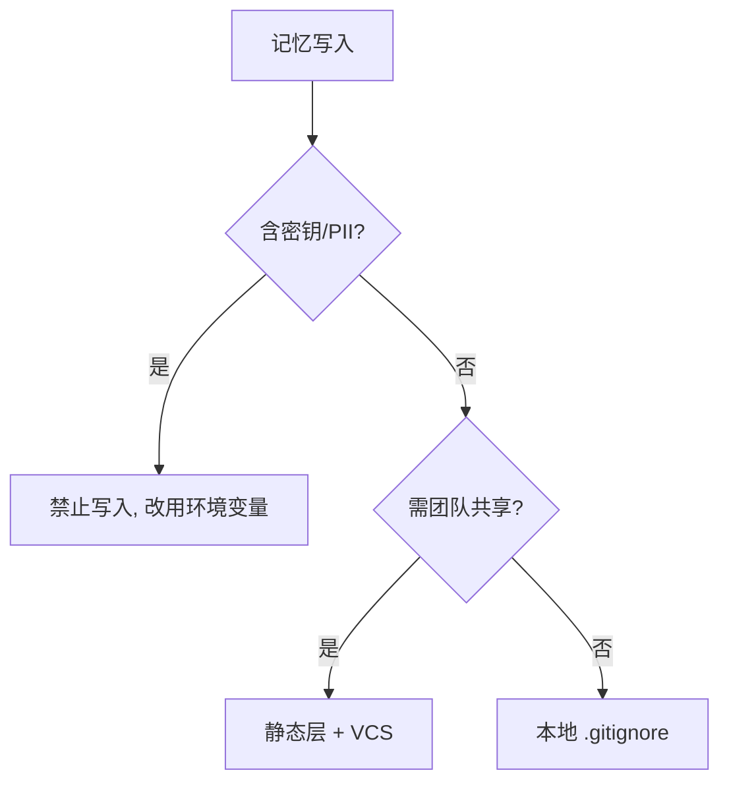

# 跨系统对比与落地建议

> 把 Codex CLI、Claude Memory、Gemini CLI 三套记忆机制放到一张表里对照，再给一份可照做的落地清单与避坑指南。

## 一、三系统对比表

> 以下事实维度来自 **Codex CLI 记忆深潜对比**（https://mer.vin/2025/12/openai-codex-cli-memory-deep-dive）。其中 Claude Memory 的 `/memory refresh`、Gemini CLI 的 `/chat save` 视为「session save 类」能力。

| 维度 | Codex CLI | Claude Memory | Gemini CLI |
| --- | --- | --- | --- |
| 文件名 | `AGENTS.md` / `~/.codex/memories/*` | `CLAUDE.md` / `~/.claude/projects/<p>/memory/MEMORY.md` | `GEMINI.md` |
| 是否支持 override | ✅ `.override.md` 优先 | ❌ 无独立 override 系统（用 `CLAUDE.local.md` + `.gitignore` 替代） | ❌ 无 |
| 层级 | Global / Project / Subdir | Flat Global / Project / Subdir | Global / Project / Subdir |
| 上限 | **32 KiB**（可配，`project_doc_max_bytes`，超出静默截断） | 上下文窗口大小 | 上下文窗口大小 |
| fallback 文件名 | ✅ 可配 `project_doc_fallback_filenames`（如 `TEAM_GUIDE.md`） | ❌ 无 | ❌ 无 |
| session save | ❌ 无 | ✅ `/memory refresh`（session save 类） | ✅ `/chat save`（session save） |

> 注：「层级」列里 Claude 标为 Flat Global/Project/Subdir，指它没有 Codex 那种 root-first 分级 override，但同样支持全局 / 项目 / 子目录多位置。

## 二、给工程师的落地清单

### 1. 项目级 `CLAUDE.md` / `AGENTS.md` 写什么

放**确定性、团队共享、长期不变**的约定：

- 包管理器与常用命令（`pnpm i` / `make test`）。
- 目录结构约定、模块边界。
- 编码规范（命名、格式化、测试要求）。
- 禁止操作（不要改 migrations、不要提交 `node_modules`）。
- 技术栈与关键依赖说明。

```text
# 项目级 CLAUDE.md / AGENTS.md 推荐内容
- 技术栈与版本
- 构建 / 测试 / 提交 命令
- 目录约定
- 编码规范
- 明确禁止项
```

### 2. 哪些放自动记忆（Auto Memory / Memories）

放**会话中涌现、非显而易见**的事实：

- 踩过的坑与对应 workaround（如「这个 OAuth 代理在特定环境下会 401，需加 header X」）。
- 项目特有的 API 约定、隐含业务规则。
- 调试结论（某 bug 根因与修复点）。

> 这类信息静态文件难覆盖，交给 agent 自动总结最省心；但记住——**机器本地、不云同步**，换机即丢。

### 3. 敏感信息务必 `.gitignore`

- `CLAUDE.local.md`、`.env`、含本地路径/密钥习惯的个人文件 → **加入 `.gitignore`**。
- 自动记忆目录（`~/.claude/projects/...`、`~/.codex/memories/`）本就在用户主目录，一般不进仓库；但不要在记忆文件里写明文密钥。

```bash
# .gitignore 建议追加
CLAUDE.local.md
.env
.env.*
```

> ⚠️ 记忆是「上下文」而非「强制配置」：冲突规则模型可能随机选；要强制用 Hook（PreToolUse）。敏感/个人文件必须 `.gitignore`。自动记忆机器本地、不云同步。

## 三、避坑

1. **别把记忆当数据库**：它是启动时注入 prompt 的 Markdown，不是可靠存储。关键真相放静态层 + VCS。
2. **别在静态文件里塞机密**：`CLAUDE.md`/`AGENTS.md` 可能提交到仓库，明文密钥一律禁入。
3. **小心上下文膨胀**：Claude 单文件目标 <200 行，Codex `AGENTS.md` 超 32 KiB 会**静默截断**——超长内容会被悄悄砍掉，且不会报错。
4. **override 语义别混**：Codex 用 `.override.md` 优先；Claude 没有 override，靠 `CLAUDE.local.md` + `.gitignore` 做个人覆盖，别套用错机制。
5. **跨工具复用要显式**：Claude 不自动读 `AGENTS.md`，需 `@AGENTS.md` 导入；别以为放了 `AGENTS.md` Claude 就认。
6. **别指望即时记忆**：Codex 的 Memories 需会话空闲约 6 小时才 eligible，不是聊完即用。

> 一句话落地：**静态层写确定性规则并版本化，生成层补涌现事实但别依赖其持久性，敏感信息全部 `.gitignore`，强制行为交给 Hook。**

## 四、隐私与合规

记忆系统直接碰项目与用户数据，合规不能事后补——写入前就要想清。

| 风险点 | 说明 | 应对 |
| --- | --- | --- |
| 明文密钥 / PII 进入记忆 | 自动记忆可能记下 token、密码、邮箱 | 记忆文件禁写密钥；敏感字段走环境变量 |
| 机器本地不云同步 | 数据不出本机，但换机 / 重装即丢 | 关键约定放静态层 + VCS，不依赖自动记忆 |
| 团队共享静态文件泄漏 | `CLAUDE.md` / `AGENTS.md` 可能提交仓库 | 个人 / 本地信息用 `.local.md` + `.gitignore` |
| 跨工具复用范围 | `AGENTS.md` 被多工具读，可见面更广 | 审视跨工具可见内容，避免误曝内部信息 |
| 合规留存与审计 | 金融 / 医疗等行业需留痕可审计 | 静态指令纳入版本控制，保留变更记录 |



> 一句话：**自动记忆是便利不是保险箱——敏感信息一律不进记忆文件，确定性真相走版本化静态层，必要时用 Hook 强制。**

## 五、隐私合规深化（GDPR / 数据脱敏 / 被遗忘权）

04 第四节讲了基础风险，这里落到法规动作。

| GDPR 条款 | 要求 | 记忆系统落地 |
| --- | --- | --- |
| 第 15 条 访问权 | 用户可查被存了什么 | 提供 `/memory`、`/memories` 浏览与导出 |
| 第 17 条 被遗忘权 | 用户可要求删除 | 提供按 `user_id` 彻底清除记忆的接口 |
| 第 25 条 数据保护 by design | 默认最小化收集 | 记忆只存必要事实，禁明文 PII |
| 第 32 条 安全 | 传输存储加密 | 本地存储 + 访问控制，敏感字段加密 |

**数据脱敏（写入前）**：

```python
import re
def mask(text):
    text = re.sub(r"\b[\w.]+@[\w.]+\.\w+\b", "[EMAIL]", text)   # 邮箱
    text = re.sub(r"\b\d{6,}\b", "[ID]", text)                  # 长数字(电话/证件)
    text = re.sub(r"(?i)(api[_-]?key|token)\s*[:=]\s*\S+",
                  r"\1: [REDACTED]", text)                      # 密钥
    return text

# 写入记忆前先脱敏
memory.write("note", mask(raw_session_text))
```

**多租户与最小权限**：记忆按 `user_id`/`tenant_id` 隔离；检索前校验调用方权限；跨工具（`AGENTS.md` 被多工具读）时审查可见面。

> ⚠️ 自动记忆机器本地、不云同步，本身就降低外泄面；但 GDPR 的「被遗忘权」要求你能**按用户彻底删除**，因此多用户系统必须保留「按 user_id 清记忆」的能力，而不能只靠换机丢失。
