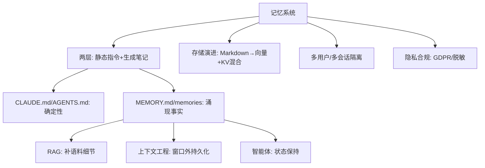
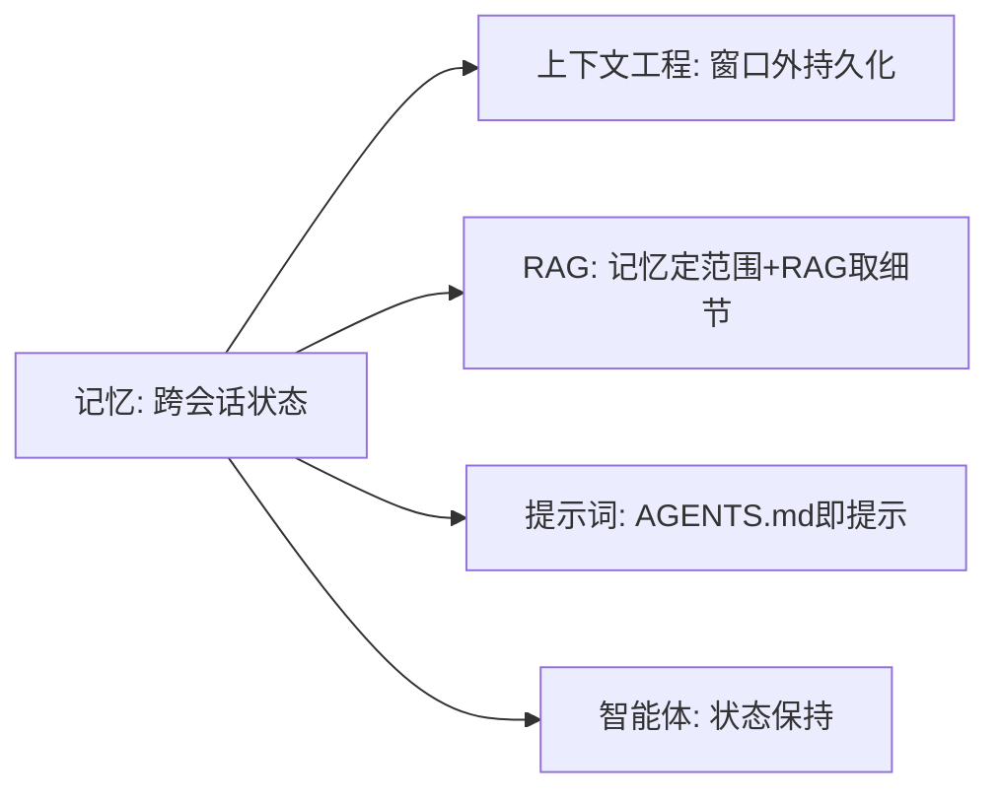

# 记忆系统（以 Claude Code 与 OpenAI Codex 的记忆体系架构为例）

> 本模块整理自 Anthropic Claude Code 与 OpenAI Codex 的官方文档与公开深潜资料，聚焦「 coding agent 如何在会话之间保留上下文」这一工程问题。
>
> 核心一句话：**每个会话都从全新上下文窗口开始，「记忆」本质是启动时从磁盘读取一批 Markdown 文件注入 prompt 作为上下文参考**，而不是数据库或持久化状态机。

## 内容索引

| 文件 | 内容 | 形态 |
| --- | --- | --- |
| [01-总览与架构地图.md](./01-总览与架构地图.md) | 为什么需要记忆、记忆的两种性质、Claude Code 与 Codex 架构总览对比、本文范围 | 📝 文字 |
| [02-Claude-Code记忆架构.md](./02-Claude-Code记忆架构.md) | CLAUDE.md 四层作用域、加载合并规则、`.claude/rules/` 路径限定、Auto Memory、AGENTS.md 兼容 | 📝 文字 |
| [03-Codex记忆架构.md](./03-Codex记忆架构.md) | AGENTS.md 静态指令层、Memories 生成层、Claude vs Codex 关键差异 | 📝 文字 |
| [04-跨系统对比与落地建议.md](./04-跨系统对比与落地建议.md) | 三系统对比表（Codex CLI / Claude Memory / Gemini CLI）、落地清单与避坑 | 📝 文字 |

## 主要参考来源

- **Claude Code Memory 官方文档**：https://code.claude.com/docs/en/memory （中文版 https://code.claude.com/docs/zh-CN/memory）
- **OpenAI Codex Customization（AGENTS.md / Memories / Skills）**：https://developers.openai.com/codex/customization/overview
- **OpenAI Codex CLI Memory 深潜**：https://mer.vin/2025/12/openai-codex-cli-memory-deep-dive
- **How Memory Works in Codex CLI**：https://www.linkedin.com/pulse/how-memory-works-codex-cli-mem0-wuw1f

> ⚠️ 本模块为「官方文档整理 + 个人化注解」，非原创理论。文中所有路径、上限数值（如 32 KiB、200 行、25KB、6 小时、5 跳）、以及「自动记忆机器本地不云同步」等均为官方事实，原样保留，请勿篡改。

## 本子模块学习路径

1. `01-总览与架构地图.md`：记忆的两种性质、短期 / 长期 / 工作记忆、与 RAG 关系、架构对比。
2. `02-Claude-Code记忆架构.md`：CLAUDE.md 四层、Auto Memory、向量 + KV 混合视角、检索与遗忘。
3. `03-Codex记忆架构.md`：AGENTS.md、Memories、检索与淘汰、向量记忆扩展。
4. `04-跨系统对比与落地建议.md`：三系统对比、隐私合规、落地清单与避坑。

## 核心要点速览

- 每个会话都从新上下文窗口开始，「记忆」= 启动时从磁盘读 Markdown 注入 prompt。
- 两层：静态指令（你写，确定性）+ 生成笔记（agent 写，补涌现事实）。
- 分短期 / 长期 / 工作记忆；可演进为向量 + KV 混合存储。
- 自动记忆机器本地、不云同步，关键真相放静态层 + VCS。

## 推荐延伸阅读

- Claude Code Memory 官方文档（https://code.claude.com/docs/en/memory）
- OpenAI Codex Customization（AGENTS.md / Memories / Skills）
- mem0、Zep 等通用 Agent 记忆框架（向量 + 图）
- 本知识库「RAG」「上下文工程」模块（记忆 ↔ RAG ↔ 上下文工程互补）

## 九、核心概念地图（Mermaid 概念全景）

> 上图表明：记忆 = 两层架构 + 存储演进 + 隔离 + 合规；它给 RAG 提供路由偏好、给上下文工程提供窗口外持久化、给智能体提供跨轮状态。

## 十、速查表（Cheat Sheet）

| 决策点 | 默认 | 何时调整 |
| --- | --- | --- |
| 确定性规则 | 写 CLAUDE.md/AGENTS.md + VCS | 团队约定/禁止项 |
| 涌现事实 | 交自动记忆（MEMORY/memories） | 踩坑/隐含约定 |
| 静态层被改写 | 不允许（你维护） | Codex 用 override.md |
| 上限 | Claude <200行/Codex 32KiB | 超长会截断/膨胀 |
| 持久性 | 机器本地不云同步 | 关键真相走 VCS |
| 海量语义 | Markdown→向量+KV | 记了想不起时 |
| 多用户 | user_id 隔离+鉴权 | 含 PII 必隔离 |
| 合规 | 脱敏+被遗忘权 | GDPR 场景 |

## 十一、常见误区清单

1. **把记忆当数据库**：它是启动注入 prompt 的 Markdown，不是可靠存储，关键真相走静态层+VCS。
2. **静态文件塞机密**：CLAUDE.md/AGENTS.md 可能提交仓库，明文密钥禁入。
3. **忽略上下文膨胀**：Claude 单文件<200行，Codex 超 32KiB 静默截断。
4. **override 语义混用**：Codex 用 `.override.md` 优先；Claude 靠 `.local.md`+`.gitignore`。
5. **跨工具复用不显式**：Claude 不自动读 AGENTS.md，需 `@AGENTS.md`。
6. **指望即时记忆**：Codex Memories 需空闲约 6 小时才 eligible。
7. **无遗忘机制**：自动记忆不会自动过期，需 TTL/LRU 防膨胀。
8. **多用户不隔离**：记忆含 PII，须按 user_id 隔离+鉴权，否则合规事故。
9. **记忆与 RAG 混淆**：稳定事实/偏好用记忆，海量文档/出处用 RAG。
10. **依赖自动记忆持久性**：机器本地、换机即丢，唯一真相必须版本化。

## 十二、与其它子模块关系

- **与 RAG**：记忆给 agent「人设与约定」（静态/生成），RAG 给答案「即时资料」；可串联用记忆定检索范围、RAG 取细节。
- **与上下文工程**：记忆是「窗口外持久化」的具体实现，呼应 Memory 杠杆与 compaction/clearing。
- **与提示词工程**：CLAUDE.md/AGENTS.md 本身是强结构化提示，决定 agent 人设与边界。
- **与智能体**：记忆提供跨轮/跨会话状态保持，是 Agent 连续性基础。

## 十三、面试高频问题（速记）

- 为什么 coding agent 需要记忆？记忆的本质是什么？
- 记忆的两层（静态指令 / 生成笔记）区别？谁写、谁维护？
- Claude Code 与 Codex 记忆架构关键差异？
- Auto Memory / Memories 的持久性与同步限制？
- 记忆如何演进到向量+KV 混合存储？
- 记忆检索与遗忘策略有哪些（TTL/LRU/重要性）？
- 多用户/多会话如何隔离记忆？
- 记忆与 RAG 的边界怎么划分？
- GDPR 下记忆系统要做什么（脱敏/被遗忘权）？
- 怎么在 Agent 循环里落地记忆（启动读/任务写/结束沉淀）？

## 十四、整合学习路径（与四模块串起来）

> 以上为记忆子模块全局速查与导航。建议先读 01 总览建立两层架构直觉，再深入 02/03 单系统、04 跨系统对比，最后用本_append 的代码/合规清单落地。
