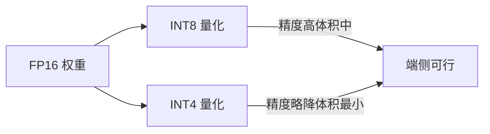

# 边缘端大模型部署与量化实战

> 把小模型跑在手机、PC、IoT 设备上，实现"离线、低延迟、隐私"的本地推理，是端侧智能的重要方向。量化与推理框架选型是核心。

## 1. 端侧场景与约束

| 约束 | 说明 |
| --- | --- |
| 算力有限 | 手机 NPU 数 TOPS，远不及数据中心 |
| 内存小 | 2~12GB 可用，大模型放不下 |
| 功耗敏感 | 持续推理耗电发热 |
| 离线优先 | 无网络或弱网可用 |

对策：**小模型（≤3B）+ 激进量化（INT4/INT8）+ 专用推理引擎**。

## 2. 量化基础



- **INT8**：通用、精度损失小，多数端侧首选。
- **INT4 / GPTQ / AWQ**：极致压缩，3B 模型可入 2GB 内存。
- **混合精度**：敏感层保留高精度。

## 3. 主流端侧引擎

| 引擎 | 平台 | 特点 |
| --- | --- | --- |
| llama.cpp / GGUF | 全平台 | CPU/GPU 通吃，量化生态成熟 |
| Ollama | 桌面 | 一键运行，开发友好 |
| MLX | Apple Silicon | 原生加速，Mac/iOS 高效 |
| ONNX Runtime | 跨平台 | 工业部署标准 |
| TensorRT-LLM | NVIDIA | GPU 极致优化 |
| MNN / NCNN | 移动端 | 阿里/腾讯移动端推理 |

## 4. GGUF 量化实战

```bash
# 把 HF 模型转 GGUF 并量化到 Q4
python convert_hf_to_gguf.py model_dir --outfile m.Q8.gguf
./llama-quantize m.Q8.gguf m.Q4_K_M.gguf Q4_K_M
# 运行
./llama-cli -m m.Q4_K_M.gguf -p "你好" -n 256
```

## 5. Apple 端侧（MLX）

```python
import mlx_lm
model, tokenizer = mlx_lm.load("mlx-community/Qwen2.5-3B-4bit")
print(mlx_lm.generate(model, tokenizer, "介绍一下机器学习", max_tokens=200))
```

MLX 利用 Apple Silicon 统一内存，模型与数据零拷贝，效率极高。

## 6. 性能优化要点

1. **KV Cache 量化**：连 KV 也量化，省显存。
2. **推测解码（Speculative）**：小模型草稿+大模型校验，提速。
3. **批处理**：多请求合并（端侧一般单用户可不考虑）。
4. **预热与常驻**：首调用慢，服务常驻避免重复加载。

## 7. 质量与体验

- 端侧模型能力弱于云端，需任务裁剪（简单问答、摘要、本地助手）。
- 复杂任务"端侧预处理 + 云端精修"混合。
- 隐私数据本地处理，敏感才上云。

## 8. 常见坑

| 坑 | 现象 | 对策 |
| --- | --- | --- |
| 量化掉点 | 输出变差 | 选成熟量化、关键层混合精度 |
| 内存爆 | 加载失败 | 用更低比特或更小模型 |
| 速度慢 | 体验差 | 启 KV 量化+推测解码 |
| 平台不兼容 | 跑不起来 | 选对应引擎/格式 |

## 9. 面试题

1. 端侧部署为什么必须量化？
2. INT4 与 INT8 的权衡？
3. GGUF 是什么？相比 safetensors 的优势？
4. 如何在手机上跑 3B 模型？
5. 端云协同的典型架构？

## 10. 小结

边缘端大模型 = 小模型 + 量化 + 专用引擎。优先 INT8/INT4 + llama.cpp/MLX，任务做减法，隐私敏感走本地。
