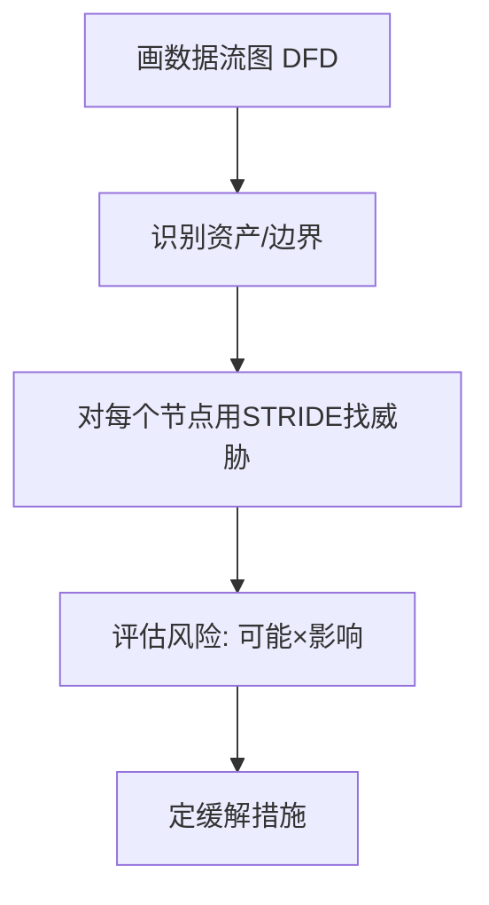
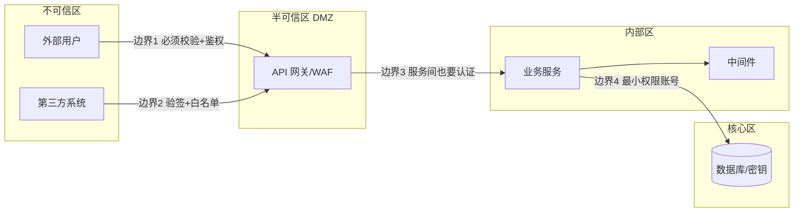
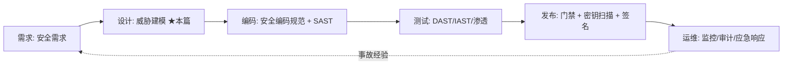

# 01 · 应用安全基础与威胁建模

> 写安全代码之前，先建立"攻击者视角"。这一篇讲安全的核心模型（CIA）、业界公认的 OWASP Top 10，以及如何在设计阶段就做威胁建模——把安全从"事后补洞"变成"事前设计"。

---

## 一、安全的基石：CIA 三性

| 属性 | 含义 | 反面威胁 |
|------|------|----------|
| **C 机密性 Confidentiality** | 数据不被未授权读取 | 泄露、越权读 |
| **I 完整性 Integrity** | 数据不被未授权篡改 | 篡改、注入 |
| **A 可用性 Availability** | 服务可被授权用户访问 | DoS、资源耗尽 |

> 安全设计就是在这三者间权衡（如加密提升机密性但可能降性能）。

---

## 二、OWASP Top 10（2021，Web 应用头号风险）

| 排名 | 风险 | 一句话 |
|------|------|--------|
| A01 | 失效的访问控制 | 越权（见 03 篇） |
| A02 | 加密机制失效 | 明文密码、弱加密 |
| A03 | 注入 | SQL/命令注入（见 03 篇） |
| A04 | 不安全设计 | 缺威胁建模、业务逻辑漏洞 |
| A05 | 安全配置错误 | 默认口令、暴露端口 |
| A06 | 易受攻击组件 | 老旧有 CVE 的依赖 |
| A07 | 身份鉴别失效 | 弱密码、会话劫持 |
| A08 | 软件数据完整性失效 | 未校验的依赖/更新 |
| A09 | 安全日志监控不足 | 出事看不到 |
| A10 | SSRF | 服务端请求被诱导打内网 |

> 03/04/05 篇分别深入 A01/A03、A06 依赖扫描、A02/A05/A07/A09。本篇建立框架。

---

## 三、威胁建模：设计阶段就"想攻击"

### 3.1 STRIDE 模型

| 字母 | 威胁 | 对应 CIA |
|------|------|----------|
| **S**poofing 假冒 | 伪装身份 | 认证 |
| **T**ampering 篡改 | 改数据/代码 | 完整性 |
| **R**epudiation 抵赖 | 否认操作 | 审计 |
| **I**nfo 泄露 | 信息暴露 | 机密性 |
| **D**enial 拒绝 | 服务不可用 | 可用性 |
| **E**levation 提权 | 普通用户变管理员 | 授权 |

### 3.2 威胁建模流程（Microsoft 法）



**示例**：用户 → [API 网关] → [订单服务] → [DB]
- 边界：网关是信任边界，外部输入在此必须校验；
- 威胁：网关被绕过（Spoofing）、订单服务越权改他人单（Elevation）、DB 被注入（Tampering）；
- 缓解：网关鉴权、订单服务校验归属、参数化查询。

> **口诀：画边界、找入口、STRIDE 过一遍、风险定缓解。**

---

## 四、攻击面管理

- **缩小攻击面**：关不必要端口、接口鉴权、最小暴露；
- **信任边界**：明确"内部可信 / 外部不可信"，跨边界必须校验；
- **纵深防御（Defense in Depth）**：多层防护，一层破还有下一层。

---

## 五、深挖：威胁建模实操（画图 → 找威胁 → 定缓解）

### 5.1 数据流图（DFD）怎么画

```
外部实体(用户/第三方) ──数据流──▶ 处理过程(订单服务) ──▶ 数据存储(DB)
    ▲                              ▲
    └──── 信任边界 ─────┘          │
                                信任边界(网关)
```

- **画出**：外部实体、处理过程、数据存储、数据流、信任边界——五要素缺一不可；
- **重点**：跨边界的数据流就是"必须校验"的点；数据存储是被拖库的风险点。

### 5.2 风险评分：DREAD / CVSS

威胁定性后打分排序，优先修高危：

| 维度 | 问题 |
|------|------|
| D 破坏潜力 | 泄露/篡改影响多大？ |
| R 可复现性 | 攻击能否稳定复现？ |
| E 可利用性 | 利用难度？ |
| A 受影响用户 | 波及多少人？ |
| D 可发现性 | 是否容易被发现？ |

> 实践中也可直接用 **CVSS 评分**（0-10）排序：≥9 高危、7~8.9 中、<4 低，P0 立即修。

### 5.3 常见应用威胁与缓解对照（模板）

| 资产/节点 | 典型威胁(STRIDE) | 缓解措施 |
|-----------|------------------|----------|
| Web 层 | SQL 注入(T)、XSS(S)、CSRF(T) | 参数化、转义+CSP、CSRF Token |
| API 层 | 越权(E)、DoS(D) | RBAC/ABAC、限流熔断 |
| 认证服务 | 暴力破解、会话劫持 | 慢哈希、锁定策略、HttpOnly |
| 数据库 | 拖库(I)、越权读 | 最小权限账号、字段加密、审计 |
| 第三方回调 | SSRF(S)、伪造请求(S) | 签名验签、IP 白名单 |

> 威胁建模产出不是文档，是**风险登记表**：每项威胁要有 owner + 缓解项 + 验收方式。

---

## 六、安全设计的反模式

| 反模式 | 危害 | 正解 |
|--------|------|------|
| 上线前才想安全 | 架构定型难改，补洞成本高 | 设计阶段威胁建模（安全左移） |
| "内部服务不用鉴权" | 内网横向移动，一破全破 | 零信任：服务间也要认证授权 |
| 信任客户端输入 | 前端校验可被绕过（改包/直接调 API） | 前端校验只为体验，服务端必须重校验 |
| 默认配置不 hardening | 暴露管理端口/默认口令 | 基线加固 + 配置扫描 |
| 靠"隐藏"当安全 | 隐藏 URL/改端口不是防护（Security by Obscurity） | 真正的访问控制 |
| 自研加密算法 | 几乎必然有漏洞 | 用标准算法与成熟库 |
| 只防已知漏洞 | 0day 与逻辑漏洞防不住 | 纵深防御 + 监控 + 快速响应 |
| 安全全靠 WAF | WAF 可被绕过（编码/分块/大小写变形） | WAF 只是一层，应用层必须兜底 |

---

## 七、面试高频追问（10+ 条）

1. Q：CIA 三性各自对应什么反面威胁？ A：机密性→泄露/越权读；完整性→篡改/注入；可用性→DoS/资源耗尽。
2. Q：威胁建模第一步做什么？ A：画数据流图 DFD，标出信任边界。
3. Q：STRIDE 每个字母含义？ A：Spoofing 假冒/Tampering 篡改/Repudiation 抵赖/Info 泄露/Denial 拒绝/Elevation 提权。
4. Q：内部接口需要鉴权吗？ A：需要，零信任/纵深防御——内网可能被横向移动攻破。
5. Q：OWASP Top 10 2021 第一名？ A：失效的访问控制（越权）。
6. Q：水平越权 vs 垂直越权？ A：水平=同级资源互访；垂直=低权限访问高权限功能（详见 03 篇）。
7. Q：DREAD 打分维度？ A：破坏潜力/可复现性/可利用性/受影响用户/可发现性。
8. Q：纵深防御什么意思？ A：多层防护，单层失守仍有兜底（WAF→网关→应用→DB）。
9. Q：信任边界怎么定？ A：所有外部可触达的边界（网络入口/用户输入/第三方回调）都是。
10. Q：威胁建模的产出？ A：风险登记表——威胁、风险评分、缓解措施、owner、验收。
11. Q：SSRF 属于 STRIDE 哪个威胁？ A：Info 泄露/可作 Tampering（打内网元数据窃取凭证）。
12. Q：哪些是"不安全设计"（OWASP A04）？ A：缺威胁建模、业务逻辑缺陷（如风控绕过、并发薅羊毛）。

---

## 八、安全设计的十条经典原则（Saltzer & Schroeder + 现代补充）

这十条是安全架构的"设计模式"，几乎所有具体防护手段都是它们的实例化：

| 原则 | 含义 | 工程实例 |
|------|------|----------|
| **1. 最小权限** Least Privilege | 只给完成任务所需的最小权限 | DB 账号无 DROP；容器非 root；IAM 精细化 |
| **2. 失败时默认拒绝** Fail-Safe Defaults | 出错/未匹配时拒绝，而不是放行 | 鉴权异常时返回 403 而非放过 |
| **3. 机制经济性** Economy of Mechanism | 设计越简单越不容易有漏洞 | 复杂的权限规则往往有绕过路径 |
| **4. 完全仲裁** Complete Mediation | 每次访问都检查，不缓存"已授权" | 不要"首次校验后就一路信任" |
| **5. 开放设计** Open Design | 安全性不依赖算法保密 | 用公开标准算法（AES/RSA），密钥才是秘密 |
| **6. 权限分离** Separation of Privilege | 关键操作需多方/多因子 | 大额转账双人复核；MFA |
| **7. 最少共享机制** Least Common Mechanism | 减少共享组件，降低串通风险 | 多租户资源隔离 |
| **8. 心理可接受性** Psychological Acceptability | 安全措施太麻烦，用户会绕过 | 密码策略过严 → 用户写便签纸上 |
| **9. 纵深防御** Defense in Depth | 多层防护，一层破还有下一层 | WAF → 网关 → 应用 → DB 各防一段 |
| **10. 默认安全** Secure by Default | 开箱即安全，不需要用户额外配置 | 默认开启 HTTPS、默认不暴露管理端口 |

> **第 4 条最容易被违背**：很多系统在"登录时校验一次"，之后所有请求都信任 session 里的角色信息。当权限被撤销、账号被封禁时，**旧会话依然有效** —— 这就是"不完全仲裁"。
>
> **第 8 条最容易被忽视**：安全措施如果严重损害体验，最终必然被绕过（业务方要求关掉、用户找旁路）。**能被落地的 80 分方案，胜过没人用的 100 分方案。**

---

## 九、OWASP Top 10 逐条深入（原理 + 防护 + 检测）

### 9.1 A01 失效的访问控制（最频发）

| 子类型 | 表现 |
|--------|------|
| 水平越权 IDOR | 改 `orderId` 访问他人订单 |
| 垂直越权 | 普通用户直接调 `/admin/*` |
| 强制浏览 | 猜路径访问未授权页面 |
| 元数据篡改 | 改 JWT 里的 role 字段（未验签/弱算法） |
| CORS 配置错误 | `Access-Control-Allow-Origin: *` + 带凭证 |

**根因**：授权检查**不在服务端资源访问点上**，而在 UI 层或入口层"一次性"完成。

**防护要点**：
```
1. 默认拒绝（Deny by default）：没有明确授权就拒绝
2. 授权检查必须在"数据访问那一层"做（查询带 owner 条件）
3. 不要用可预测的资源标识符（自增 ID 便于枚举）
4. 服务端强制校验，前端隐藏按钮不算防护
```

> 详细代码级防护见 [03 常见 Web 安全漏洞](03-常见Web安全漏洞与防护.md)。

### 9.2 A02 加密机制失效

| 常见错误 | 后果 |
|----------|------|
| 明文传输敏感数据 | 中间人窃听 |
| 用 MD5/SHA1 存口令 | 彩虹表秒破 |
| 硬编码密钥 | 代码泄露即密钥泄露 |
| 用 ECB 模式 | 相同明文块产生相同密文（图案可见） |
| IV 固定/复用 | 破坏语义安全 |
| 自己拼 HMAC 校验（非恒定时间比较） | 时序攻击可逐字节爆破 |

> 详见 [05 数据安全与密码学基础](05-数据安全与密码学基础.md)。

### 9.3 A03 注入

不只是 SQL：**任何"把不可信数据拼进解释器语法"的场合**都是注入。

| 注入类型 | 解释器 |
|----------|--------|
| SQL 注入 | 数据库 SQL 引擎 |
| NoSQL 注入 | MongoDB 查询表达式 |
| 命令注入 | Shell |
| LDAP 注入 | LDAP 查询 |
| 模板注入 SSTI | 模板引擎（Freemarker/Thymeleaf/Jinja2） |
| 表达式注入 | SpEL / OGNL |
| XPath / XML 注入 | XML 解析器 |
| 日志注入 | 日志系统（Log4Shell 就是 JNDI 查找 + 日志） |
| 头注入 / CRLF | HTTP 解析器 |

> **统一根治思路：让"数据"永远不被当作"代码/语法"解析** —— 参数化、预编译、白名单枚举，而不是靠转义过滤黑名单。

### 9.4 A04 不安全设计（业务逻辑漏洞）

这是**唯一不能靠工具扫出来**的一类，也是威胁建模最大的价值所在。

| 典型业务逻辑漏洞 | 机理 |
|-----------------|------|
| 优惠券并发领取 | 无并发控制/幂等，同时发多个请求领多张 |
| 越权改价 | 前端传价格，服务端不校验 |
| 状态机跳步 | 未支付直接调"发货"接口 |
| 负数/超大数量 | 数量为 -1 导致退款为正 |
| 重放攻击 | 支付回调无幂等，重复加余额 |
| 短信/验证码轰炸 | 无频率限制 |
| 逻辑越权 | 通过"分享链接"绕过权限校验 |
| 竞态条件 TOCTOU | 检查与使用之间状态被改（先查余额再扣款） |

```java
// 反面：检查与使用分离（TOCTOU 竞态）
if (coupon.getStock() > 0) {          // T1: 两个线程都读到 stock=1
    coupon.setStock(coupon.getStock() - 1);
    couponRepo.save(coupon);          // T2: 都扣成 0，实际发了 2 张
}

// 正面：原子操作 + 数据库约束兜底
int updated = couponRepo.decrementStock(couponId);   // UPDATE ... SET stock=stock-1 WHERE id=? AND stock>0
if (updated == 0) throw new OutOfStockException();
// 并配合唯一索引防重复领取：UNIQUE KEY (coupon_id, user_id)
```

> **口诀：业务逻辑漏洞查三样——并发（原子性）、状态（能否跳步）、边界（负数/极值/重放）。**

### 9.5 A05 安全配置错误

| 检查项 | 常见问题 |
|--------|----------|
| 默认凭据 | admin/admin、root 无密码 |
| 管理端口暴露 | Actuator、Druid 监控、Nacos 控制台公网可访问 |
| 错误信息泄露 | 堆栈/SQL/框架版本直接返回给用户 |
| 目录列表开启 | 可遍历文件 |
| 未使用的功能开着 | 不必要的服务/端点 |
| 云存储桶公开 | S3/OSS bucket 匿名可读 |
| 缺少安全响应头 | 无 CSP/HSTS/X-Frame-Options |
| 容器以 root 运行 | 逃逸后直接拿宿主机 |

```yaml
# Spring Boot Actuator 安全基线（反面：全部暴露）
management:
  endpoints:
    web:
      exposure:
        include: health,info          # 只暴露必要端点，绝不用 "*"
  endpoint:
    health:
      show-details: never             # 不泄露依赖详情（DB 地址等）
  server:
    port: 9090                        # 管理端口与业务端口分离
    address: 127.0.0.1                # 只监听本地，由 sidecar/内网访问
```

> **真实高频泄露源**：`/actuator/env` 会把所有配置（含数据库密码、密钥）以明文返回。**这是最常见的"一个 URL 拿下整个系统"的入口。**

### 9.6 A06 易受攻击的组件 / A08 完整性失效

| 风险 | 说明 |
|------|------|
| 依赖有已知 CVE | Log4Shell、Fastjson 反序列化 |
| 传递依赖 | 你没直接引，但被间接引入 |
| 未验证的更新 | 下载脚本直接执行（`curl \| sh`） |
| CI/CD 被投毒 | 构建环节被篡改 |
| 反序列化不可信数据 | 触发 gadget 链 RCE |

> 详见 [06 供应链安全与 SBOM](06-供应链安全与SBOM.md)、[04 安全测试方法论](04-安全测试方法论.md)。

### 9.7 A07 身份鉴别失效

| 问题 | 防护 |
|------|------|
| 弱口令/常见口令 | 口令黑名单（不是复杂度规则）+ 长度优先 |
| 撞库（凭据填充） | 登录失败限流、异地登录风控、MFA |
| 暴力破解 | 递增延迟 + 锁定 + 验证码 |
| 会话固定 | 登录后**重新生成** session ID |
| 会话不失效 | 登出、改密、权限变更时销毁全部会话 |
| 会话 token 泄露 | HttpOnly + Secure + SameSite；短过期 |
| 密码重置流程可绕过 | 重置 token 一次性、短时效、绑定用户 |

> **反直觉但重要**：现代口令建议是「**长度优先，禁用常见口令**」，而非「必须含大小写数字特殊字符」——后者导致用户产生 `Password1!` 这类可预测口令，且频繁强制改密反而降低强度（违背第 8 条心理可接受性）。

### 9.8 A09 安全日志与监控不足

| 应记录的安全事件 | 为什么 |
|-----------------|--------|
| 登录成功/失败（含 IP、UA） | 发现撞库与异常登录 |
| 权限变更、角色授予 | 提权行为审计 |
| 敏感数据导出/批量查询 | 发现内部数据窃取 |
| 鉴权失败（403） | 大量 403 = 有人在探测越权 |
| 关键配置/密钥变更 | 追溯责任 |
| 管理操作（删除、退款） | 抵赖防护（STRIDE 的 R） |

> **关键指标：大量 403/401 集中出现是攻击探测的强信号**——很多团队只监控 5xx，把 403 当"正常拒绝"忽略掉，错失了最早的攻击预警。
>
> 审计日志与业务日志应**分离存储**，且审计日志要**防篡改（追加写、异地备份）**——否则攻击者进来第一件事就是删日志。

### 9.9 A10 SSRF

| 攻击目标 | 危害 |
|----------|------|
| 云元数据服务（169.254.169.254） | 偷取临时凭证 → 接管云账号 |
| 内网服务（Redis/ES/Consul 无鉴权） | 直接读写内网数据 |
| localhost 管理端点 | 打 Actuator/管理接口 |
| 内网端口扫描 | 通过响应时间差探测拓扑 |

> 详见 [03 常见 Web 安全漏洞](03-常见Web安全漏洞与防护.md)。

---

## 十、攻击面管理实操

### 10.1 攻击面盘点清单

```text
外部攻击面
[ ] 公网域名与 IP（含被遗忘的测试域名）
[ ] 开放端口与服务（定期扫描自己）
[ ] 对外 API 清单（含未文档化的历史接口）
[ ] 第三方回调入口（支付/OAuth 回调）
[ ] 文件上传/下载入口
[ ] 对象存储桶权限
[ ] 移动端/小程序调用的接口（常被认为"内部"其实公开）
[ ] CDN/边缘配置（是否可绕过回源）

内部攻击面
[ ] 内网服务是否有鉴权（Redis/ES/MQ 常裸奔）
[ ] 管理后台是否公网可达
[ ] 运维通道（跳板机/VPN/K8s API）
[ ] CI/CD 系统权限（能改构建 = 能植入代码）
[ ] 数据库账号权限范围
[ ] 服务账号与密钥的分发范围

人的攻击面
[ ] 离职账号是否及时回收
[ ] 权限是否随岗位变更调整
[ ] 是否存在共享账号（无法追责）
```

> **最容易被忽略的攻击面：被遗忘的资产**。测试环境域名、下线业务的旧接口、临时开的调试端点——**它们不在任何人的维护清单里，也不打补丁**，是最好的突破口。

### 10.2 信任边界识别



| 边界 | 必须做的检查 |
|------|-------------|
| 边界 1（用户 → 网关） | 认证、授权、输入校验、限流、WAF |
| 边界 2（第三方 → 系统） | 签名验签、IP 白名单、时间戳防重放、幂等 |
| 边界 3（服务 → 服务） | mTLS 或服务令牌（零信任，不因"在内网"就信任） |
| 边界 4（服务 → 数据） | 最小权限账号、字段级权限、审计 |

> **常见错误：只在边界 1 做校验**。一旦有 SSRF 或某个服务被攻破，攻击者就在"内部区"了，边界 3 和 4 缺失意味着**横向移动零阻力**。

### 10.3 缩小攻击面的具体动作

| 动作 | 效果 |
|------|------|
| 关闭不用的端口与服务 | 直接减少入口 |
| 删除不用的历史接口 | 消除无人维护的漏洞 |
| 管理端点绑本地 + 独立端口 | 避免公网直达 |
| 统一入口（API 网关） | 集中做鉴权/限流/审计，避免旁路 |
| 移除调试/测试代码 | 消除后门（如"测试用万能验证码"） |
| 容器精简（distroless） | 减少可利用的工具（无 shell 就难反弹） |
| 网络分段 | 限制横向移动范围 |

---

## 十一、威胁建模的组织落地

### 11.1 什么时候做威胁建模

| 时机 | 做什么 |
|------|--------|
| 新系统设计阶段 | 完整建模（DFD + STRIDE + 风险登记表） |
| 重大架构变更 | 增量建模（只看变化的数据流与边界） |
| 引入新的外部集成 | 重点建模新增的信任边界 |
| 出现安全事故后 | 补建模，看还有哪些同类风险未覆盖 |
| 定期（如半年） | 复核旧模型是否还符合现状 |

### 11.2 轻量化建模：四个问题法

完整 STRIDE 对小团队太重，可以用简化版（Adam Shostack 的四问）：

```
1. 我们在做什么？       → 画个简图（不必标准 DFD）
2. 哪里可能出问题？     → 对每个箭头和框问 STRIDE
3. 我们要做什么？       → 列缓解措施
4. 我们做得好不好？     → 验收：措施是否真的实现了、能否被测试证明
```

> **第 4 问最常被跳过**：威胁建模文档写了缓解措施，但没人验证它真的落地了。**必须把缓解措施变成可测试的验收项**（如"越权测试用例已加入回归"）。

### 11.3 风险登记表模板

```text
| ID | 资产/流程 | 威胁(STRIDE) | 攻击场景 | 风险(可能×影响) | 缓解措施 | Owner | 验收方式 | 状态 |
|----|----------|-------------|---------|----------------|---------|-------|---------|------|
| T1 | 订单查询 API | E 提权 | 修改 orderId 查他人订单 | 高×高=严重 | 查询带 owner 条件 + 越权测试用例 | 张三 | 自动化用例 #123 通过 | 已修 |
| T2 | 图片抓取 | I 泄露 | SSRF 打云元数据偷凭证 | 中×极高=严重 | IP 白名单 + 禁重定向 + 出网代理 | 李四 | DAST 扫描 + 手工验证 | 进行中 |
| T3 | 支付回调 | S 假冒 | 伪造回调加余额 | 中×极高=严重 | 验签 + 幂等 + IP 白名单 | 王五 | 回放测试用例 | 已修 |
```

| 表格设计要点 | 原因 |
|-------------|------|
| 必须有 Owner | 无主威胁 = 不会被修 |
| 必须有验收方式 | 否则"已修"无法证明 |
| 必须有状态跟踪 | 进入常规迭代 backlog，而不是躺在文档里 |

> **威胁建模最大的失败模式**：产出一份漂亮的文档，然后归档，没有任何一条进入研发 backlog。**建模的产出必须是"任务"，不是"文档"。**

---

## 十二、安全左移与 DevSecOps 定位



| 阶段 | 修复成本（相对） | 说明 |
|------|-----------------|------|
| 设计阶段发现 | 1× | 改设计文档 |
| 编码阶段发现 | 数倍 | 改代码 |
| 测试阶段发现 | 更高 | 改代码 + 回归 |
| 生产发现 | 最高 | 应急 + 数据泄露 + 合规处罚 + 品牌损失 |

> **这就是"安全左移"的经济学依据**：越早发现越便宜。而**威胁建模是最左边的那一步**——它在一行代码都还没写的时候就能消除整类漏洞（比如"这个设计根本不该让客户端传价格"）。

---

## 十三、常见误区

| 误区 ❌ | 正解 ✅ |
|---------|---------|
| 有 WAF 就安全了 | WAF 可被编码/变形绕过；应用层必须兜底 |
| 内网服务不用鉴权 | 零信任：假设内网已被攻破 |
| 前端做了校验就行 | 前端校验只为体验，可被直接调 API 绕过 |
| 隐藏接口路径算防护 | Security by Obscurity 不是安全 |
| 扫描工具没报就没漏洞 | 业务逻辑漏洞工具扫不出来，需威胁建模 |
| 威胁建模是安全团队的事 | 最懂业务逻辑的是开发，必须开发参与 |
| 威胁建模产出是文档 | 产出是带 owner 与验收方式的任务 |
| 密码策略越复杂越安全 | 长度优先 + 口令黑名单；过复杂会被绕过 |
| 只监控 5xx | 大量 403/401 是攻击探测的最早信号 |
| 加密了就安全 | ECB 模式、固定 IV、硬编码密钥都能让加密形同虚设 |

---

## 十四、口诀与小结

> **建模口诀：画边界、找入口、STRIDE 过一遍、风险定缓解、缓解要验收。**
>
> **原则口诀：默认拒绝最小权限，完全仲裁不缓存信任；纵深防御多层挡，默认安全免配置。**
>
> **逻辑漏洞口诀：查并发（原子）、查状态（跳步）、查边界（负数极值重放）。**

| 主题 | 要点 |
|------|------|
| CIA | 机密/完整/可用，权衡取舍 |
| OWASP | Top 10 是 Web 风险清单，A01 越权最频发 |
| STRIDE | 假冒/篡改/抵赖/泄露/拒绝/提权 |
| 建模 | 画 DFD、定边界、STRIDE、评风险、定缓解、可验收 |
| 十原则 | 最小权限、默认拒绝、完全仲裁、开放设计、纵深防御… |
| 攻击面 | 盘点外部/内部/人；最危险的是被遗忘的资产 |
| 信任边界 | 四道边界都要检查，不能只守最外层 |
| 业务逻辑漏洞 | 工具扫不出，只能靠建模 + 并发/状态/边界三查 |
| 安全日志 | 登录、权限变更、批量导出、403 集中出现 |
| 左移 | 设计阶段修复成本最低；威胁建模是最左的一步 |

---

## 十五、延伸阅读

| 想深入 | 去这里 |
|--------|--------|
| 认证与授权体系 | [02 认证与授权体系](02-认证与授权体系.md) |
| 具体漏洞与代码级防护 | [03 常见 Web 安全漏洞与防护](03-常见Web安全漏洞与防护.md) |
| 漏洞怎么测出来 | [04 安全测试方法论](04-安全测试方法论.md) |
| 加密、密钥与合规 | [05 数据安全与密码学基础](05-数据安全与密码学基础.md) |
| 依赖与制品安全 | [06 供应链安全与 SBOM](06-供应链安全与SBOM.md) |
| 零信任架构落地 | [07 零信任架构](07-零信任架构.md) |
| Web 漏洞速查 | [基础知识·Web 安全](../基础知识/Web安全.md) |
| 权限系统工程实现 | [场景设计·权限系统设计](../场景设计/权限系统设计.md) |
| 安全门禁进 CI | [CI/CD·DORA 与 DevSecOps](../基础知识/CI-CD/13-可观测性DORA度量与DevSecOps.md) |
| 安全日志与监控 | [SRE·日志与告警规则库](../SRE与稳定性工程/06-日志与告警规则库.md) |

---

## 十六、Cheat Sheet

| 主题 | 要点 |
|------|------|
| CIA | 机密/完整/可用，权衡取舍 |
| OWASP | Top 10 是 Web 风险清单 |
| STRIDE | 假冒/篡改/抵赖/泄露/拒绝/提权 |
| 建模 | 画 DFD、定边界、STRIDE、评风险、定缓解 |
| 原则 | 缩攻击面、信任边界校验、纵深防御 |
| 风险评分 | DREAD 五维 或 CVSS 0-10 排序 |
| 产出 | 风险登记表：威胁+评分+缓解+owner+验收 |

> 下一篇：[02 认证与授权体系](02-认证与授权体系.md) —— "你是谁"和"你能干啥"是安全的地基，OAuth2/JWT/SSO 一次讲清。
