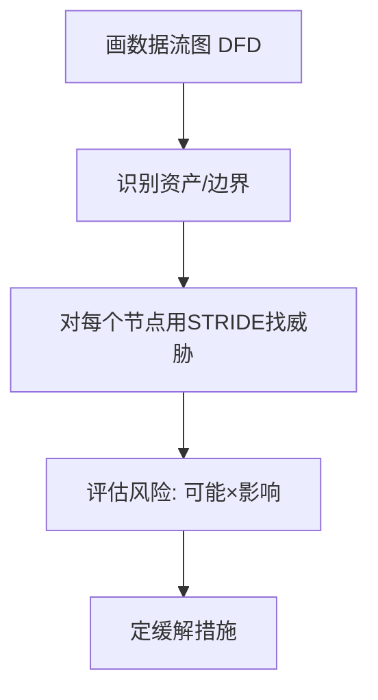

# 01 · 应用安全基础与威胁建模

> 写安全代码之前，先建立"攻击者视角"。这一篇讲安全的核心模型（CIA）、业界公认的 OWASP Top 10，以及如何在设计阶段就做威胁建模——把安全从"事后补洞"变成"事前设计"。

---

## 一、安全的基石：CIA 三性

| 属性 | 含义 | 反面威胁 |
|------|------|----------|
| **C 机密性 Confidentiality** | 数据不被未授权读取 | 泄露、越权读 |
| **I 完整性 Integrity** | 数据不被未授权篡改 | 篡改、注入 |
| **A 可用性 Availability** | 服务可被授权用户访问 | DoS、资源耗尽 |

> 安全设计就是在这三者间权衡（如加密提升机密性但可能降性能）。

---

## 二、OWASP Top 10（2021，Web 应用头号风险）

| 排名 | 风险 | 一句话 |
|------|------|--------|
| A01 | 失效的访问控制 | 越权（见 03 篇） |
| A02 | 加密机制失效 | 明文密码、弱加密 |
| A03 | 注入 | SQL/命令注入（见 03 篇） |
| A04 | 不安全设计 | 缺威胁建模、业务逻辑漏洞 |
| A05 | 安全配置错误 | 默认口令、暴露端口 |
| A06 | 易受攻击组件 | 老旧有 CVE 的依赖 |
| A07 | 身份鉴别失效 | 弱密码、会话劫持 |
| A08 | 软件数据完整性失效 | 未校验的依赖/更新 |
| A09 | 安全日志监控不足 | 出事看不到 |
| A10 | SSRF | 服务端请求被诱导打内网 |

> 03/04/05 篇分别深入 A01/A03、A06 依赖扫描、A02/A05/A07/A09。本篇建立框架。

---

## 三、威胁建模：设计阶段就"想攻击"

### 3.1 STRIDE 模型

| 字母 | 威胁 | 对应 CIA |
|------|------|----------|
| **S**poofing 假冒 | 伪装身份 | 认证 |
| **T**ampering 篡改 | 改数据/代码 | 完整性 |
| **R**epudiation 抵赖 | 否认操作 | 审计 |
| **I**nfo 泄露 | 信息暴露 | 机密性 |
| **D**enial 拒绝 | 服务不可用 | 可用性 |
| **E**levation 提权 | 普通用户变管理员 | 授权 |

### 3.2 威胁建模流程（Microsoft 法）



**示例**：用户 → [API 网关] → [订单服务] → [DB]
- 边界：网关是信任边界，外部输入在此必须校验；
- 威胁：网关被绕过（Spoofing）、订单服务越权改他人单（Elevation）、DB 被注入（Tampering）；
- 缓解：网关鉴权、订单服务校验归属、参数化查询。

> **口诀：画边界、找入口、STRIDE 过一遍、风险定缓解。**

---

## 四、攻击面管理

- **缩小攻击面**：关不必要端口、接口鉴权、最小暴露；
- **信任边界**：明确"内部可信 / 外部不可信"，跨边界必须校验；
- **纵深防御（Defense in Depth）**：多层防护，一层破还有下一层。

---

## 五、深挖：威胁建模实操（画图 → 找威胁 → 定缓解）

### 5.1 数据流图（DFD）怎么画

```
外部实体(用户/第三方) ──数据流──▶ 处理过程(订单服务) ──▶ 数据存储(DB)
    ▲                              ▲
    └──── 信任边界 ─────┘          │
                                信任边界(网关)
```

- **画出**：外部实体、处理过程、数据存储、数据流、信任边界——五要素缺一不可；
- **重点**：跨边界的数据流就是"必须校验"的点；数据存储是被拖库的风险点。

### 5.2 风险评分：DREAD / CVSS

威胁定性后打分排序，优先修高危：

| 维度 | 问题 |
|------|------|
| D 破坏潜力 | 泄露/篡改影响多大？ |
| R 可复现性 | 攻击能否稳定复现？ |
| E 可利用性 | 利用难度？ |
| A 受影响用户 | 波及多少人？ |
| D 可发现性 | 是否容易被发现？ |

> 实践中也可直接用 **CVSS 评分**（0-10）排序：≥9 高危、7~8.9 中、<4 低，P0 立即修。

### 5.3 常见应用威胁与缓解对照（模板）

| 资产/节点 | 典型威胁(STRIDE) | 缓解措施 |
|-----------|------------------|----------|
| Web 层 | SQL 注入(T)、XSS(S)、CSRF(T) | 参数化、转义+CSP、CSRF Token |
| API 层 | 越权(E)、DoS(D) | RBAC/ABAC、限流熔断 |
| 认证服务 | 暴力破解、会话劫持 | 慢哈希、锁定策略、HttpOnly |
| 数据库 | 拖库(I)、越权读 | 最小权限账号、字段加密、审计 |
| 第三方回调 | SSRF(S)、伪造请求(S) | 签名验签、IP 白名单 |

> 威胁建模产出不是文档，是**风险登记表**：每项威胁要有 owner + 缓解项 + 验收方式。

---

## 六、安全设计的反模式

| 反模式 | 危害 |
|--------|------|
| 上线前才想安全 | 架构定型难改，补洞成本高 |
| "内部服务不用鉴权" | 内网横向移动，一破全破 |
| 信任客户端输入 | 前端校验可被绕过 |
| 默认配置不 hardening | 暴露管理端口/默认口令 |

---

## 六、安全设计的反模式

| 反模式 | 危害 |
|--------|------|
| 上线前才想安全 | 架构定型难改，补洞成本高 |
| "内部服务不用鉴权" | 内网横向移动，一破全破 |
| 信任客户端输入 | 前端校验可被绕过 |
| 默认配置不 hardening | 暴露管理端口/默认口令 |

---

## 七、面试高频追问（10+ 条）

1. Q：CIA 三性各自对应什么反面威胁？ A：机密性→泄露/越权读；完整性→篡改/注入；可用性→DoS/资源耗尽。
2. Q：威胁建模第一步做什么？ A：画数据流图 DFD，标出信任边界。
3. Q：STRIDE 每个字母含义？ A：Spoofing 假冒/Tampering 篡改/Repudiation 抵赖/Info 泄露/Denial 拒绝/Elevation 提权。
4. Q：内部接口需要鉴权吗？ A：需要，零信任/纵深防御——内网可能被横向移动攻破。
5. Q：OWASP Top 10 2021 第一名？ A：失效的访问控制（越权）。
6. Q：水平越权 vs 垂直越权？ A：水平=同级资源互访；垂直=低权限访问高权限功能（详见 03 篇）。
7. Q：DREAD 打分维度？ A：破坏潜力/可复现性/可利用性/受影响用户/可发现性。
8. Q：纵深防御什么意思？ A：多层防护，单层失守仍有兜底（WAF→网关→应用→DB）。
9. Q：信任边界怎么定？ A：所有外部可触达的边界（网络入口/用户输入/第三方回调）都是。
10. Q：威胁建模的产出？ A：风险登记表——威胁、风险评分、缓解措施、owner、验收。
11. Q：SSRF 属于 STRIDE 哪个威胁？ A：Info 泄露/可作 Tampering（打内网元数据窃取凭证）。
12. Q：哪些是"不安全设计"（OWASP A04）？ A：缺威胁建模、业务逻辑缺陷（如风控绕过、并发薅羊毛）。

---

## 八、Cheat Sheet

| 主题 | 要点 |
|------|------|
| CIA | 机密/完整/可用，权衡取舍 |
| OWASP | Top 10 是 Web 风险清单 |
| STRIDE | 假冒/篡改/抵赖/泄露/拒绝/提权 |
| 建模 | 画 DFD、定边界、STRIDE、评风险、定缓解 |
| 原则 | 缩攻击面、信任边界校验、纵深防御 |

> 下一篇：[02 认证与授权体系](02-认证与授权体系.md) —— "你是谁"和"你能干啥"是安全的地基，OAuth2/JWT/SSO 一次讲清。
