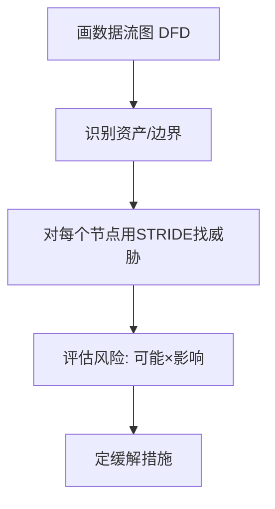

# 01 · 应用安全基础与威胁建模

> 写安全代码之前，先建立"攻击者视角"。这一篇讲安全的核心模型（CIA）、业界公认的 OWASP Top 10，以及如何在设计阶段就做威胁建模——把安全从"事后补洞"变成"事前设计"。

---

## 一、安全的基石：CIA 三性

| 属性 | 含义 | 反面威胁 |
|------|------|----------|
| **C 机密性 Confidentiality** | 数据不被未授权读取 | 泄露、越权读 |
| **I 完整性 Integrity** | 数据不被未授权篡改 | 篡改、注入 |
| **A 可用性 Availability** | 服务可被授权用户访问 | DoS、资源耗尽 |

> 安全设计就是在这三者间权衡（如加密提升机密性但可能降性能）。

---

## 二、OWASP Top 10（2021，Web 应用头号风险）

| 排名 | 风险 | 一句话 |
|------|------|--------|
| A01 | 失效的访问控制 | 越权（见 03 篇） |
| A02 | 加密机制失效 | 明文密码、弱加密 |
| A03 | 注入 | SQL/命令注入（见 03 篇） |
| A04 | 不安全设计 | 缺威胁建模、业务逻辑漏洞 |
| A05 | 安全配置错误 | 默认口令、暴露端口 |
| A06 | 易受攻击组件 | 老旧有 CVE 的依赖 |
| A07 | 身份鉴别失效 | 弱密码、会话劫持 |
| A08 | 软件数据完整性失效 | 未校验的依赖/更新 |
| A09 | 安全日志监控不足 | 出事看不到 |
| A10 | SSRF | 服务端请求被诱导打内网 |

> 03/04/05 篇分别深入 A01/A03、A06 依赖扫描、A02/A05/A07/A09。本篇建立框架。

---

## 三、威胁建模：设计阶段就"想攻击"

### 3.1 STRIDE 模型

| 字母 | 威胁 | 对应 CIA |
|------|------|----------|
| **S**poofing 假冒 | 伪装身份 | 认证 |
| **T**ampering 篡改 | 改数据/代码 | 完整性 |
| **R**epudiation 抵赖 | 否认操作 | 审计 |
| **I**nfo 泄露 | 信息暴露 | 机密性 |
| **D**enial 拒绝 | 服务不可用 | 可用性 |
| **E**levation 提权 | 普通用户变管理员 | 授权 |

### 3.2 威胁建模流程（Microsoft 法）

**示例**：用户 → [API 网关] → [订单服务] → [DB]
- 边界：网关是信任边界，外部输入在此必须校验；
- 威胁：网关被绕过（Spoofing）、订单服务越权改他人单（Elevation）、DB 被注入（Tampering）；
- 缓解：网关鉴权、订单服务校验归属、参数化查询。

> **口诀：画边界、找入口、STRIDE 过一遍、风险定缓解。**

---

## 四、攻击面管理

- **缩小攻击面**：关不必要端口、接口鉴权、最小暴露；
- **信任边界**：明确"内部可信 / 外部不可信"，跨边界必须校验；
- **纵深防御（Defense in Depth）**：多层防护，一层破还有下一层。

---

## 五、安全设计的反模式

| 反模式 | 危害 |
|--------|------|
| 上线前才想安全 | 架构定型难改，补洞成本高 |
| "内部服务不用鉴权" | 内网横向移动，一破全破 |
| 信任客户端输入 | 前端校验可被绕过 |
| 默认配置不 hardening | 暴露管理端口/默认口令 |

---

## 六、Cheat Sheet

| 主题 | 要点 |
|------|------|
| CIA | 机密/完整/可用，权衡取舍 |
| OWASP | Top 10 是 Web 风险清单 |
| STRIDE | 假冒/篡改/抵赖/泄露/拒绝/提权 |
| 建模 | 画 DFD、定边界、STRIDE、评风险、定缓解 |
| 原则 | 缩攻击面、信任边界校验、纵深防御 |

> 下一篇：[02 认证与授权体系](02-认证与授权体系.md) —— "你是谁"和"你能干啥"是安全的地基，OAuth2/JWT/SSO 一次讲清。
