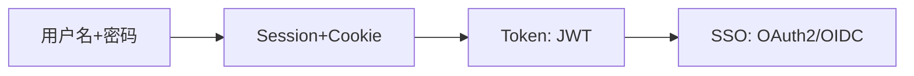
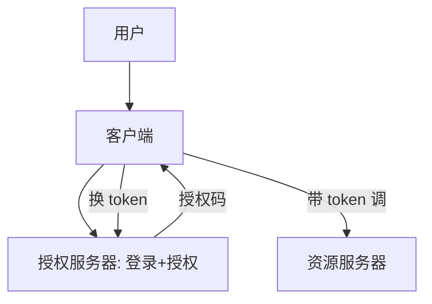
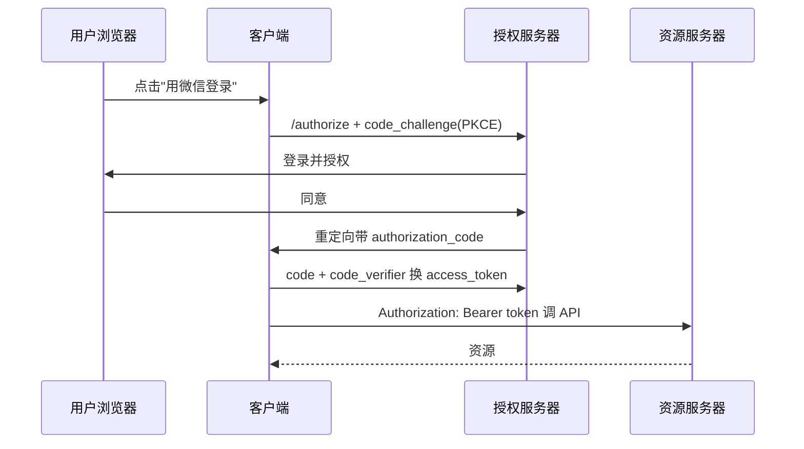

# 02 · 认证与授权体系

> "你是谁"（认证）和"你能干啥"（授权）是安全的地基，却最常被混淆。这一篇把 Session/JWT、OAuth2/OIDC、SSO、RBAC/ABAC、零信任一次讲清。

---

## 一、认证 vs 授权：别混

| 概念 | 英文 | 问题 | 例子 |
|------|------|------|------|
| **认证 Authentication** | AuthN | 你是谁 | 登录、验证码、指纹 |
| **授权 Authorization** | AuthZ | 你被允许做什么 | 角色能删单、能看报表 |

> **口诀：AuthN 进门，AuthZ 进门后能开哪扇柜。** 越权漏洞（OWASP A01）本质就是授权没做好。

---

## 二、认证机制演进



### 2.1 Session + Cookie（服务端状态）

```
登录成功 → 服务端存 Session(用户ID) → 下发 SessionID 到 Cookie
后续请求 → 带 Cookie → 服务端查 Session 认身份
```
- 优点：服务端可控、可主动注销；
- 缺点：服务端存状态，分布式需集中存储（Redis）；CSRF 风险。

### 2.2 JWT（无状态 Token）

```
登录成功 → 服务端签 JWT(负载+签名) → 客户端自存
后续请求 → 带 Authorization: Bearer <JWT> → 服务端验签名
```
- 优点：无状态、易横向扩展、适合微服务；
- 缺点：**无法主动吊销**（除非维护黑名单/短过期+刷新）；签名密钥泄露即全崩；别存敏感信息。

> **JWT 最佳实践**：access token 短过期（15min）+ refresh token 长过期；用非对称 RS256（公钥验、私钥签）；HTTPS 传输。

### 2.3 OAuth2 / OIDC（授权框架 + 身份认证）

| 概念 | 作用 |
|------|------|
| **OAuth2** | 授权框架：让第三方**代表用户**访问资源（如"用微信登录"） |
| **OIDC** | 在 OAuth2 上叠加身份认证（id_token），解决"你是谁" |
| **SSO 单点登录** | 一次登录，多系统通行（常基于 OIDC/SAML） |

**四种授权模式**：
| 模式 | 适用 |
|------|------|
| 授权码 Authorization Code | 最常用，Web/App（带 PKCE 防拦截） |
| 客户端凭证 Client Credentials | 服务到服务（机器对机器） |
| 隐式 Implicit | 已淘汰（不安全） |
| 密码 Resource Owner | 仅老系统，不推荐 |



> **常见误区**：OAuth2 是授权不是认证，做"登录"要用 OIDC。

---

## 三、深挖：落地细节（JWT 验签 / OAuth2 时序 / RBAC 表设计）

### 3.1 JWT 结构与验签

```
Header(Payload Signature) 三段 Base64URL
┌─────────┬───────────────┬──────────────────────┐
│ alg:RS256│ sub,exp,iss,role│ 签名(私钥对前两段)  │
└─────────┴───────────────┴──────────────────────┘
服务端用公钥验签 + 校验 exp/iss/aud，即可信任 claims
```

```java
// Spring Security / jjwt 验签
Jws<Claims> jws = Jwts.parserBuilder()
    .setSigningKey(publicKey)
    .build().parseClaimsJws(token);   // 签名或过期都会抛异常
```

- **绝不把密码/身份证塞 payload**（base64 可解）；
- 吊销方案：黑名单(Redis) / 短过期+刷新 / 版本号 claim 踢人。

### 3.2 OAuth2 授权码 + PKCE（浏览器/移动端标准姿势）



- **PKCE**：客户端先发 `code_challenge`（verifier 的哈希），换 token 时发 `code_verifier` 对账——防授权码被第三方客户端截取后滥用（App 场景必须）。

### 3.3 RBAC 落地：表设计与鉴权点

| 表 | 说明 |
|----|------|
| user | 用户 |
| role | 角色（管理员/运营/普通用户） |
| user_role | 用户-角色关联（多对多） |
| permission | 权限点（`order:delete`、`report:view`） |
| role_permission | 角色-权限关联 |

- 鉴权点：网关/拦截器查"用户→角色→权限"，命中才放行；
- 超级管理员直接全量放行；权限变更走缓存失效（角色版本号）。

---

## 四、授权模型

| 模型 | 逻辑 | 适用 |
|------|------|------|
| **RBAC** 角色 | 用户→角色→权限 | 大多数系统（管理员/普通用户） |
| **ABAC** 属性 | 按属性策略（用户部门=资源部门 且 时间<18点） | 细粒度、动态 |
| **ACL** 列表 | 资源上列允许的用户/组 | 简单资源共享 |

> 与 [大模型·企业级 Agent 架构](../大模型/工程落地/05-企业级Agent架构.md) 里的 RBAC/ABAC 权限设计呼应——权限是系统级概念，AI 应用也要管。

---

## 四、零信任（Zero Trust）

传统"内网可信"已被打穿。零信任原则：
- **永不信任，始终验证**：每次请求都认证授权，不论内外；
- **最小权限 + 微隔离**：服务间也鉴权（mTLS）；
- **持续评估**：结合设备/行为风险动态决策。

> 与 [01 威胁建模](01-应用安全基础与威胁建模.md) 的"内网不可信"一致。

---

## 五、零信任（Zero Trust）

传统"内网可信"已被打穿。零信任原则：
- **永不信任，始终验证**：每次请求都认证授权，不论内外；
- **最小权限 + 微隔离**：服务间也鉴权（mTLS）；
- **持续评估**：结合设备/行为风险动态决策。

> 与 [01 威胁建模](01-应用安全基础与威胁建模.md) 的"内网不可信"一致。

---

## 六、深挖：常见认证方案选型决策树

```
需要登录的业务系统？
├─ 单系统、自己管用户 → Session+Cookie 或 JWT（短过期+刷新）
├─ 多系统统一登录 → SSO（OIDC 授权码 + PKCE）
├─ 需要第三方登录（微信/Google）→ OAuth2/OIDC 授权码
├─ 机器对机器（服务间）→ Client Credentials + mTLS
└─ 内部服务互信 → 服务账号 + JWT/mTLS（零信任微隔离）
```

| 场景 | 推荐方案 | 原因 |
|------|----------|------|
| 传统 Web 应用 | Session + Redis | 可注销、防 CSRF 配 SameSite |
| 微服务/App API | JWT 短过期 + 刷新 | 无状态、易横向扩展 |
| 第三方授权 | OAuth2 授权码 + PKCE | 不泄露密码、防拦截 |
| 单点登录 | OIDC SSO | 一次认证多系统通行 |
| 服务间调用 | mTLS / Client Credentials | 双向认证、防横向移动 |

---

## 七、反模式

| 反模式 | 危害 |
|--------|------|
| 认证授权不分 | 登录即万能，越权风险 |
| JWT 长期有效不吊销 | 泄露后被长期冒用 |
| "内部服务不鉴权" | 横向移动 |
| 明文存密码 | 拖库即崩（必须 bcrypt/argon2 加盐哈希） |
| 把敏感信息塞 JWT | 前端可见/易泄露 |

---

## 八、面试高频追问（12+ 条）

1. Q：认证和授权的区别？ A：认证确认"你是谁"，授权决定"你能干啥"；越权=授权没做好。
2. Q：Session 和 JWT 优缺点？ A：Session 可控可注销但需集中存储；JWT 无状态易扩展但难吊销。
3. Q：JWT 怎么吊销？ A：黑名单/短过期+刷新/版本号 claim；无状态是双刃剑。
4. Q：为什么 JWT 用 RS256 而非 HS256？ A：RS256 非对称，签发与验签密钥分离，多服务验签只需公钥；HS256 共享密钥易泄露。
5. Q：OAuth2 与 OIDC 区别？ A：OAuth2 是授权框架（拿 token 访问资源），OIDC 在其上加了身份认证（id_token 告诉你"你是谁"）。
6. Q：为什么用授权码模式而不是隐式？ A：隐式 token 在 URL 回跳中暴露，不安全已淘汰；授权码+PKCE 走后端换 token。
7. Q：PKCE 解决什么问题？ A：防止授权码被恶意第三方 App 截获后兑换（code_challenge/verifier 对账）。
8. Q：RBAC 和 ABAC 怎么选？ A：静态角色够用选 RBAC；需要按属性动态决策（部门/时间/环境）选 ABAC。
9. Q：SSO 是什么？ A：一次登录多系统通行，常基于 OIDC/SAML 建信任。
10. Q：refresh token 比 access token 长过期安全吗？ A：是，access 短命减少泄露窗口；refresh 可集中吊销/滑动续期。
11. Q：JWT 放 Cookie 还是 Header？ A：Header(Bearer) 天然抗 CSRF；若放 Cookie 需 SameSite+HttpOnly。
12. Q：零信任落地要点？ A：永不信任始终验证、微隔离(mTLS)、最小权限、持续评估。
13. Q：AuthN 成功但 AuthZ 失败的典型漏洞？ A：越权——登录后任意切换 userId 访问他人资源。
14. Q：Token 泄露了怎么办？ A：走吊销流程（黑名单/refresh 失效/版本号踢人），审计并轮换密钥。

---

## 九、Cheat Sheet

| 主题 | 要点 |
|------|------|
| 认证授权 | AuthN 进门、AuthZ 开门；别混 |
| Session/JWT | Session 可控可注销；JWT 无状态但难吊销，短过期+刷新 |
| OAuth2/OIDC | OAuth2 授权、OIDC 认证；授权码+PKCE |
| SSO | 一次登录多系统，基于 OIDC/SAML |
| 授权模型 | RBAC 常用、ABAC 细粒度、ACL 简单 |
| 零信任 | 永不信任始终验证、最小权限、微隔离 |

> 下一篇：[03 常见 Web 安全漏洞与防护](03-常见Web安全漏洞与防护.md) —— 越权、注入、XSS、CSRF、SSRF 这些高频漏洞怎么来、怎么防。
