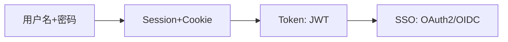
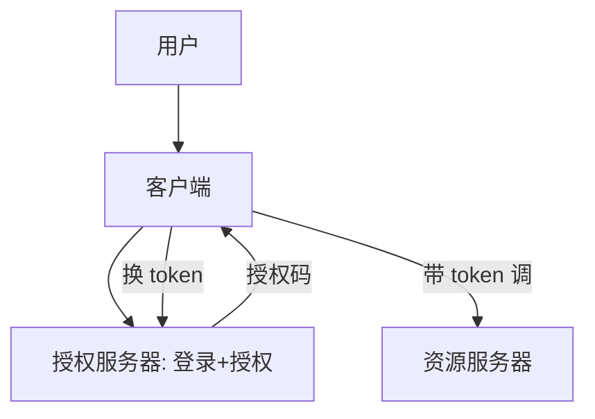

# 02 · 认证与授权体系

> "你是谁"（认证）和"你能干啥"（授权）是安全的地基，却最常被混淆。这一篇把 Session/JWT、OAuth2/OIDC、SSO、RBAC/ABAC、零信任一次讲清。

---

## 一、认证 vs 授权：别混

| 概念 | 英文 | 问题 | 例子 |
|------|------|------|------|
| **认证 Authentication** | AuthN | 你是谁 | 登录、验证码、指纹 |
| **授权 Authorization** | AuthZ | 你被允许做什么 | 角色能删单、能看报表 |

> **口诀：AuthN 进门，AuthZ 进门后能开哪扇柜。** 越权漏洞（OWASP A01）本质就是授权没做好。

---

## 二、认证机制演进



### 2.1 Session + Cookie（服务端状态）

```
登录成功 → 服务端存 Session(用户ID) → 下发 SessionID 到 Cookie
后续请求 → 带 Cookie → 服务端查 Session 认身份
```
- 优点：服务端可控、可主动注销；
- 缺点：服务端存状态，分布式需集中存储（Redis）；CSRF 风险。

### 2.2 JWT（无状态 Token）

```
登录成功 → 服务端签 JWT(负载+签名) → 客户端自存
后续请求 → 带 Authorization: Bearer <JWT> → 服务端验签名
```
- 优点：无状态、易横向扩展、适合微服务；
- 缺点：**无法主动吊销**（除非维护黑名单/短过期+刷新）；签名密钥泄露即全崩；别存敏感信息。

> **JWT 最佳实践**：access token 短过期（15min）+ refresh token 长过期；用非对称 RS256（公钥验、私钥签）；HTTPS 传输。

### 2.3 OAuth2 / OIDC（授权框架 + 身份认证）

| 概念 | 作用 |
|------|------|
| **OAuth2** | 授权框架：让第三方**代表用户**访问资源（如"用微信登录"） |
| **OIDC** | 在 OAuth2 上叠加身份认证（id_token），解决"你是谁" |
| **SSO 单点登录** | 一次登录，多系统通行（常基于 OIDC/SAML） |

**四种授权模式**：
| 模式 | 适用 |
|------|------|
| 授权码 Authorization Code | 最常用，Web/App（带 PKCE 防拦截） |
| 客户端凭证 Client Credentials | 服务到服务（机器对机器） |
| 隐式 Implicit | 已淘汰（不安全） |
| 密码 Resource Owner | 仅老系统，不推荐 |



> **常见误区**：OAuth2 是授权不是认证，做"登录"要用 OIDC。

---

## 三、授权模型

| 模型 | 逻辑 | 适用 |
|------|------|------|
| **RBAC** 角色 | 用户→角色→权限 | 大多数系统（管理员/普通用户） |
| **ABAC** 属性 | 按属性策略（用户部门=资源部门 且 时间<18点） | 细粒度、动态 |
| **ACL** 列表 | 资源上列允许的用户/组 | 简单资源共享 |

> 与 [测试·企业级 Agent 架构](../测试与代码质量/05-企业级Agent架构.md) 里的 RBAC/ABAC 权限设计呼应——权限是系统级概念，AI 应用也要管。

---

## 四、零信任（Zero Trust）

传统"内网可信"已被打穿。零信任原则：
- **永不信任，始终验证**：每次请求都认证授权，不论内外；
- **最小权限 + 微隔离**：服务间也鉴权（mTLS）；
- **持续评估**：结合设备/行为风险动态决策。

> 与 [01 威胁建模](01-应用安全基础与威胁建模.md) 的"内网不可信"一致。

---

## 五、反模式

| 反模式 | 危害 |
|--------|------|
| 认证授权不分 | 登录即万能，越权风险 |
| JWT 长期有效不吊销 | 泄露后被长期冒用 |
| "内部服务不鉴权" | 横向移动 |
| 明文存密码 | 拖库即崩（必须 bcrypt/argon2 加盐哈希） |
| 把敏感信息塞 JWT | 前端可见/易泄露 |

---

## 六、Cheat Sheet

| 主题 | 要点 |
|------|------|
| 认证授权 | AuthN 进门、AuthZ 开门；别混 |
| Session/JWT | Session 可控可注销；JWT 无状态但难吊销，短过期+刷新 |
| OAuth2/OIDC | OAuth2 授权、OIDC 认证；授权码+PKCE |
| SSO | 一次登录多系统，基于 OIDC/SAML |
| 授权模型 | RBAC 常用、ABAC 细粒度、ACL 简单 |
| 零信任 | 永不信任始终验证、最小权限、微隔离 |

> 下一篇：[03 常见 Web 安全漏洞与防护](03-常见Web安全漏洞与防护.md) —— 越权、注入、XSS、CSRF、SSRF 这些高频漏洞怎么来、怎么防。
