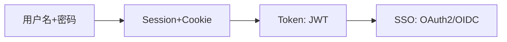
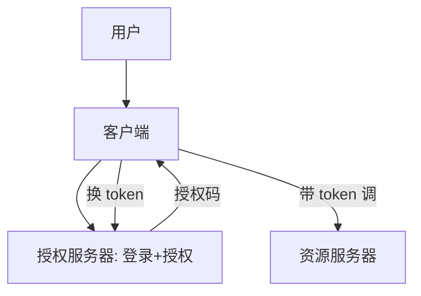
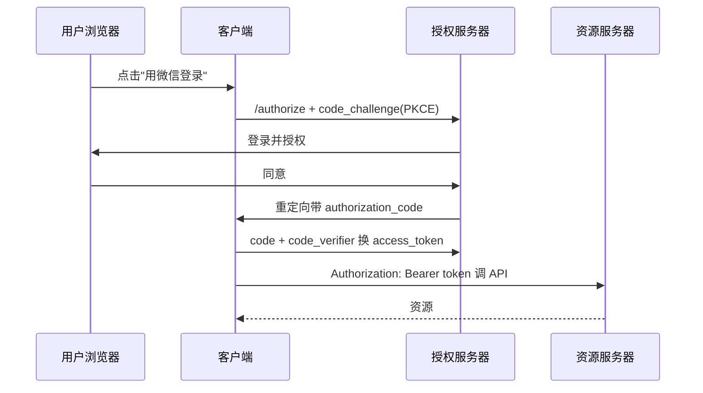
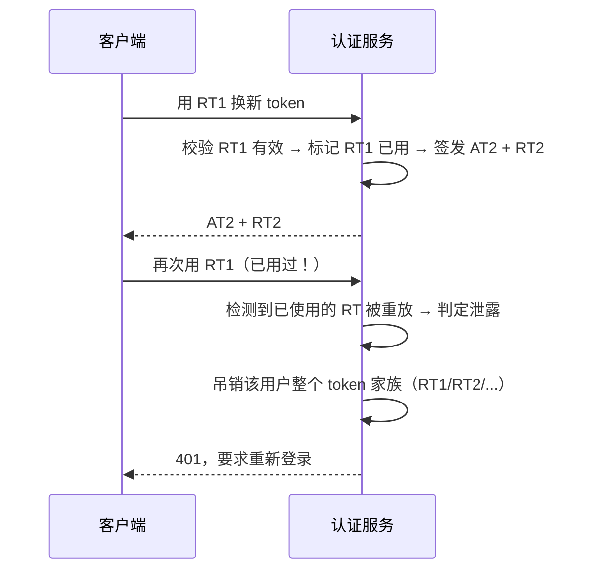
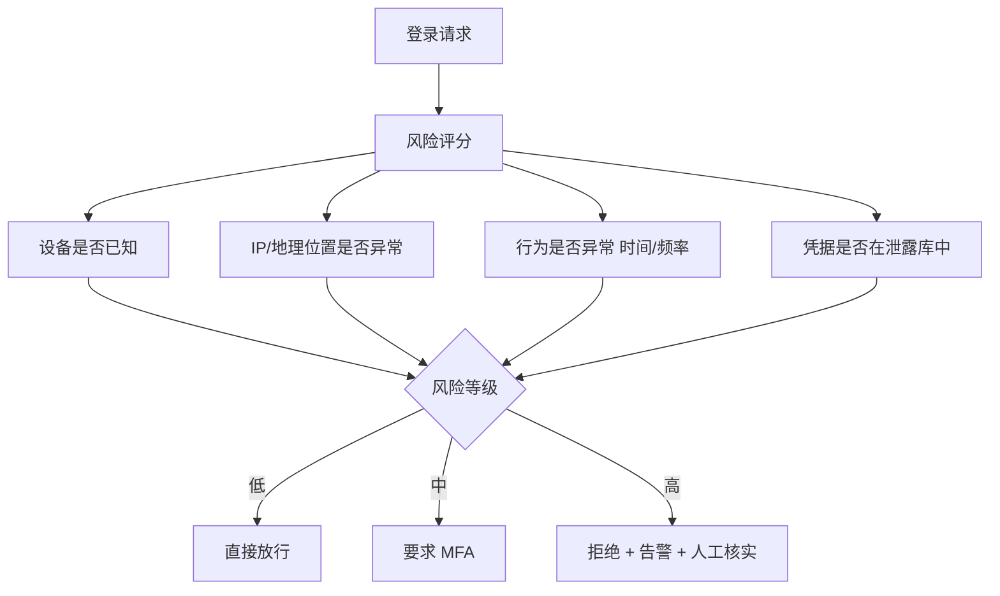

# 02 · 认证与授权体系

> "你是谁"（认证）和"你能干啥"（授权）是安全的地基，却最常被混淆。这一篇把 Session/JWT、OAuth2/OIDC、SSO、RBAC/ABAC、零信任一次讲清。

---

## 一、认证 vs 授权：别混

| 概念 | 英文 | 问题 | 例子 |
|------|------|------|------|
| **认证 Authentication** | AuthN | 你是谁 | 登录、验证码、指纹 |
| **授权 Authorization** | AuthZ | 你被允许做什么 | 角色能删单、能看报表 |

> **口诀：AuthN 进门，AuthZ 进门后能开哪扇柜。** 越权漏洞（OWASP A01）本质就是授权没做好。

---

## 二、认证机制演进



### 2.1 Session + Cookie（服务端状态）

```
登录成功 → 服务端存 Session(用户ID) → 下发 SessionID 到 Cookie
后续请求 → 带 Cookie → 服务端查 Session 认身份
```
- 优点：服务端可控、可主动注销；
- 缺点：服务端存状态，分布式需集中存储（Redis）；CSRF 风险。

### 2.2 JWT（无状态 Token）

```
登录成功 → 服务端签 JWT(负载+签名) → 客户端自存
后续请求 → 带 Authorization: Bearer <JWT> → 服务端验签名
```
- 优点：无状态、易横向扩展、适合微服务；
- 缺点：**无法主动吊销**（除非维护黑名单/短过期+刷新）；签名密钥泄露即全崩；别存敏感信息。

> **JWT 最佳实践**：access token 短过期（15min）+ refresh token 长过期；用非对称 RS256（公钥验、私钥签）；HTTPS 传输。

### 2.3 OAuth2 / OIDC（授权框架 + 身份认证）

| 概念 | 作用 |
|------|------|
| **OAuth2** | 授权框架：让第三方**代表用户**访问资源（如"用微信登录"） |
| **OIDC** | 在 OAuth2 上叠加身份认证（id_token），解决"你是谁" |
| **SSO 单点登录** | 一次登录，多系统通行（常基于 OIDC/SAML） |

**四种授权模式**：
| 模式 | 适用 |
|------|------|
| 授权码 Authorization Code | 最常用，Web/App（带 PKCE 防拦截） |
| 客户端凭证 Client Credentials | 服务到服务（机器对机器） |
| 隐式 Implicit | 已淘汰（不安全） |
| 密码 Resource Owner | 仅老系统，不推荐 |



> **常见误区**：OAuth2 是授权不是认证，做"登录"要用 OIDC。

---

## 三、深挖：落地细节（JWT 验签 / OAuth2 时序 / RBAC 表设计）

### 3.1 JWT 结构与验签

```
Header(Payload Signature) 三段 Base64URL
┌─────────┬───────────────┬──────────────────────┐
│ alg:RS256│ sub,exp,iss,role│ 签名(私钥对前两段)  │
└─────────┴───────────────┴──────────────────────┘
服务端用公钥验签 + 校验 exp/iss/aud，即可信任 claims
```

```java
// Spring Security / jjwt 验签
Jws<Claims> jws = Jwts.parserBuilder()
    .setSigningKey(publicKey)
    .build().parseClaimsJws(token);   // 签名或过期都会抛异常
```

- **绝不把密码/身份证塞 payload**（base64 可解）；
- 吊销方案：黑名单(Redis) / 短过期+刷新 / 版本号 claim 踢人。

### 3.2 OAuth2 授权码 + PKCE（浏览器/移动端标准姿势）



- **PKCE**：客户端先发 `code_challenge`（verifier 的哈希），换 token 时发 `code_verifier` 对账——防授权码被第三方客户端截取后滥用（App 场景必须）。

### 3.3 RBAC 落地：表设计与鉴权点

| 表 | 说明 |
|----|------|
| user | 用户 |
| role | 角色（管理员/运营/普通用户） |
| user_role | 用户-角色关联（多对多） |
| permission | 权限点（`order:delete`、`report:view`） |
| role_permission | 角色-权限关联 |

- 鉴权点：网关/拦截器查"用户→角色→权限"，命中才放行；
- 超级管理员直接全量放行；权限变更走缓存失效（角色版本号）。

---

## 四、授权模型

| 模型 | 逻辑 | 适用 |
|------|------|------|
| **RBAC** 角色 | 用户→角色→权限 | 大多数系统（管理员/普通用户） |
| **ABAC** 属性 | 按属性策略（用户部门=资源部门 且 时间<18点） | 细粒度、动态 |
| **ACL** 列表 | 资源上列允许的用户/组 | 简单资源共享 |

> 与 [大模型·企业级 Agent 架构](../大模型/工程落地/05-企业级Agent架构.md) 里的 RBAC/ABAC 权限设计呼应——权限是系统级概念，AI 应用也要管。

---

## 五、零信任（Zero Trust）

传统"内网可信"已被打穿。零信任原则：
- **永不信任，始终验证**：每次请求都认证授权，不论内外；
- **最小权限 + 微隔离**：服务间也鉴权（mTLS）；
- **持续评估**：结合设备/行为风险动态决策。

> 与 [01 威胁建模](01-应用安全基础与威胁建模.md) 的"内网不可信"一致；完整架构与落地路径见 [07 零信任架构](07-零信任架构.md)。

---

## 六、深挖：常见认证方案选型决策树

```
需要登录的业务系统？
├─ 单系统、自己管用户 → Session+Cookie 或 JWT（短过期+刷新）
├─ 多系统统一登录 → SSO（OIDC 授权码 + PKCE）
├─ 需要第三方登录（微信/Google）→ OAuth2/OIDC 授权码
├─ 机器对机器（服务间）→ Client Credentials + mTLS
└─ 内部服务互信 → 服务账号 + JWT/mTLS（零信任微隔离）
```

| 场景 | 推荐方案 | 原因 |
|------|----------|------|
| 传统 Web 应用 | Session + Redis | 可注销、防 CSRF 配 SameSite |
| 微服务/App API | JWT 短过期 + 刷新 | 无状态、易横向扩展 |
| 第三方授权 | OAuth2 授权码 + PKCE | 不泄露密码、防拦截 |
| 单点登录 | OIDC SSO | 一次认证多系统通行 |
| 服务间调用 | mTLS / Client Credentials | 双向认证、防横向移动 |

---

## 七、反模式

| 反模式 | 危害 |
|--------|------|
| 认证授权不分 | 登录即万能，越权风险 |
| JWT 长期有效不吊销 | 泄露后被长期冒用 |
| "内部服务不鉴权" | 横向移动 |
| 明文存密码 | 拖库即崩（必须 bcrypt/argon2 加盐哈希） |
| 把敏感信息塞 JWT | 前端可见/易泄露 |

---

## 八、面试高频追问（12+ 条）

1. Q：认证和授权的区别？ A：认证确认"你是谁"，授权决定"你能干啥"；越权=授权没做好。
2. Q：Session 和 JWT 优缺点？ A：Session 可控可注销但需集中存储；JWT 无状态易扩展但难吊销。
3. Q：JWT 怎么吊销？ A：黑名单/短过期+刷新/版本号 claim；无状态是双刃剑。
4. Q：为什么 JWT 用 RS256 而非 HS256？ A：RS256 非对称，签发与验签密钥分离，多服务验签只需公钥；HS256 共享密钥易泄露。
5. Q：OAuth2 与 OIDC 区别？ A：OAuth2 是授权框架（拿 token 访问资源），OIDC 在其上加了身份认证（id_token 告诉你"你是谁"）。
6. Q：为什么用授权码模式而不是隐式？ A：隐式 token 在 URL 回跳中暴露，不安全已淘汰；授权码+PKCE 走后端换 token。
7. Q：PKCE 解决什么问题？ A：防止授权码被恶意第三方 App 截获后兑换（code_challenge/verifier 对账）。
8. Q：RBAC 和 ABAC 怎么选？ A：静态角色够用选 RBAC；需要按属性动态决策（部门/时间/环境）选 ABAC。
9. Q：SSO 是什么？ A：一次登录多系统通行，常基于 OIDC/SAML 建信任。
10. Q：refresh token 比 access token 长过期安全吗？ A：是，access 短命减少泄露窗口；refresh 可集中吊销/滑动续期。
11. Q：JWT 放 Cookie 还是 Header？ A：Header(Bearer) 天然抗 CSRF；若放 Cookie 需 SameSite+HttpOnly。
12. Q：零信任落地要点？ A：永不信任始终验证、微隔离(mTLS)、最小权限、持续评估。
13. Q：AuthN 成功但 AuthZ 失败的典型漏洞？ A：越权——登录后任意切换 userId 访问他人资源。
14. Q：Token 泄露了怎么办？ A：走吊销流程（黑名单/refresh 失效/版本号踢人），审计并轮换密钥。

---

## 九、JWT 的安全陷阱（面试与实战高频）

### 9.1 算法混淆攻击（alg 相关）

```
攻击一：alg: none
  攻击者把 header 改成 {"alg":"none"}，去掉签名
  若服务端"按 header 里的 alg 去验签" → 认为无需验签 → 任意伪造
  防护：服务端硬编码期望算法，不信 header 里的 alg

攻击二：RS256 → HS256 降级
  服务端用 RS256（公钥验签），公钥是公开的
  攻击者把 alg 改成 HS256，用"公钥内容当作 HMAC 密钥"签名
  若服务端代码是 verify(token, key) 且 key 随 alg 变化 → 验签通过
  防护：显式指定算法白名单，公钥与对称密钥严格分离
```

```java
// 危险：让 token 自己决定用什么算法
Jwts.parser().setSigningKey(key).parseClaimsJws(token);

// 安全：显式限定算法（jjwt 0.11+）
Jws<Claims> jws = Jwts.parserBuilder()
    .setSigningKey(publicKey)
    .requireIssuer("https://auth.example.com")   // 校验 iss
    .requireAudience("order-service")            // 校验 aud
    .setAllowedClockSkewSeconds(30)              // 容忍时钟偏移
    .build()
    .parseClaimsJws(token);
// 额外显式校验算法（防降级）
if (!SignatureAlgorithm.RS256.getValue().equals(jws.getHeader().getAlgorithm())) {
    throw new SecurityException("unexpected alg: " + jws.getHeader().getAlgorithm());
}
```

### 9.2 必须校验的 claim 清单

| Claim | 含义 | 不校验的后果 |
|-------|------|-------------|
| `exp` | 过期时间 | 永久有效的 token |
| `nbf` | 生效时间 | 提前使用 |
| `iat` | 签发时间 | 无法做"签发时间早于密码修改时间则失效" |
| `iss` | 签发者 | 接受其他系统签发的 token |
| `aud` | 受众 | **A 服务的 token 能用在 B 服务**（横向越权） |
| `sub` | 主体（用户 ID） | 身份不明 |
| `jti` | Token 唯一 ID | 无法做单次吊销/防重放 |

> **`aud` 最容易被忽略且危害大**：多个微服务共用一个签发者，如果不校验 aud，**给"报表服务"签发的低权限 token 可以直接拿去调"支付服务"**。

### 9.3 JWT 吊销的四种方案对比

| 方案 | 原理 | 优点 | 缺点 |
|------|------|------|------|
| **短过期 + refresh** | access 15min，refresh 集中管理 | 简单，泄露窗口小 | 最长仍有 15min 窗口 |
| **黑名单（Redis）** | 吊销的 jti 存 Redis，验签后查一次 | 立即生效 | 引入状态（丢了 JWT 无状态优势） |
| **版本号 claim** | token 带 `ver`，用户表存当前 ver；改密/踢人时 ver+1 | 可批量踢人；查询可缓存 | 需查一次用户版本（可本地缓存短 TTL） |
| **白名单（等于 Session）** | 只有登录时记录的 token 有效 | 完全可控 | 退化为 Session，失去无状态意义 |

```
实战推荐组合：
  access token 短过期（5~15min）+ 版本号 claim（改密/封禁批量失效）
  refresh token 长过期（7~30天）+ 服务端存储 + 一次性轮转（Rotation）
```

### 9.4 Refresh Token 轮转与重放检测



| 机制 | 作用 |
|------|------|
| **一次性使用（Rotation）** | 每次刷新都换新 RT，旧的立即失效 |
| **家族追踪（Token Family）** | 同一登录链上的所有 token 归为一族 |
| **重放检测** | 已用过的 RT 再次出现 → 说明被盗 → 吊销整族 |

> 这是 OAuth2 Security BCP 推荐做法：**无法阻止 token 被偷，但能保证"偷了也只能用一次，且用了就会暴露"**。

### 9.5 JWT 该放哪里

| 存储位置 | CSRF | XSS | 说明 |
|----------|------|-----|------|
| `localStorage` | ✅ 天然免疫 | ❌ JS 可读，XSS 直接偷走 | 常见但风险高 |
| `Authorization` header（内存变量） | ✅ 免疫 | ⚠️ XSS 仍可读内存，但刷新即丢 | 较好 |
| Cookie（HttpOnly + Secure + SameSite） | ⚠️ 需 SameSite/CSRF Token | ✅ JS 读不到 | 推荐组合 |

```
推荐方案（Web）：
  access token  → 内存变量（不落盘），随页面刷新丢失
  refresh token → HttpOnly + Secure + SameSite=Strict Cookie，路径限定 /auth/refresh
  → XSS 偷不到 refresh token（HttpOnly）
  → CSRF 打不了业务接口（业务用 header 传 access token）
```

> **没有绝对安全的存储位置，只有针对具体威胁的权衡**。面试被问"JWT 存哪"，正确答法是：**说清 XSS 与 CSRF 两个威胁方向，再给出组合方案**，而不是直接答一个位置。

### 9.6 JWT 其他坑

| 坑 | 说明 |
|----|------|
| payload 只是 Base64 不是加密 | 任何人可解码看内容，绝不放敏感信息 |
| token 太大 | 权限点全塞进去导致 header 超限（Nginx 默认 header 上限） |
| 时钟不同步 | 各服务时间偏差导致刚签发的 token 被判过期 → 需 clock skew 容忍 |
| 公钥轮换无过渡 | 直接换公钥导致旧 token 全失效 → 用 `kid` 支持多密钥并存 |
| 权限变更不生效 | 权限在 token 里，改了角色要等 token 过期 → 用版本号或短过期 |

---

## 十、Session 方案的工程细节

### 10.1 分布式 Session 的三种做法

| 方案 | 原理 | 优缺点 |
|------|------|--------|
| **粘性会话（Sticky Session）** | LB 按 IP/Cookie 把用户固定到同一实例 | 简单；但实例挂了会话丢失、扩缩容不友好 |
| **Session 复制** | 实例间同步 session | 无单点；但网络开销大，实例多时不可用 |
| **集中存储（Redis）** | 所有实例读同一份 | ✅ 主流；需处理 Redis 可用性 |

### 10.2 Session 安全配置

```java
// Spring Boot Session 安全基线
server:
  servlet:
    session:
      timeout: 30m
      cookie:
        http-only: true       // JS 读不到，防 XSS 窃取
        secure: true          // 只在 HTTPS 传输
        same-site: lax        // 防 CSRF（strict 更严但影响外链跳转体验）
        name: SESSIONID       // 改掉默认名（少暴露技术栈）
        path: /
```

| 必做项 | 原因 |
|--------|------|
| **登录后重新生成 Session ID** | 防会话固定攻击（攻击者先给受害者一个已知 sessionId） |
| 登出时服务端销毁 | 只删 Cookie 不销毁服务端 session = 没登出 |
| 改密码/改权限时销毁全部会话 | 防止旧会话继续使用旧权限 |
| 设置绝对超时 + 空闲超时 | 空闲 30min 失效 + 绝对 8h 强制重登 |
| 敏感操作二次认证 | 即使会话有效，改密/转账要再验一次 |

```java
// 防会话固定：登录成功后必须换 ID
public void onLoginSuccess(HttpServletRequest request, User user) {
    HttpSession oldSession = request.getSession(false);
    if (oldSession != null) {
        oldSession.invalidate();          // 销毁旧会话
    }
    HttpSession newSession = request.getSession(true);   // 生成全新 ID
    newSession.setAttribute("userId", user.getId());
}
```

### 10.3 Session vs JWT 决策表

| 需求 | 选 Session | 选 JWT |
|------|-----------|--------|
| 需要立即踢人/吊销 | ✅ | ❌（需额外机制） |
| 多语言/多服务共享身份 | ⚠️（需共享 Redis） | ✅（只需公钥） |
| 无状态横向扩展 | ⚠️ | ✅ |
| 移动端/第三方 API | ⚠️（Cookie 不便） | ✅ |
| 权限频繁变化 | ✅（读时最新） | ❌（token 里是旧的） |
| 想避免 Redis 依赖 | ❌ | ✅ |
| 传统单体 Web | ✅ | 过度设计 |

> **实战常见组合**：网关处验 JWT（无状态、高性能），同时查一个**轻量的吊销版本号缓存**（本地 caffeine + 短 TTL）——**兼顾无状态与可吊销**。

---

## 十一、OAuth2 深入：常见误用与安全要点

### 11.1 各授权模式的现状

| 模式 | 状态 | 说明 |
|------|------|------|
| Authorization Code + PKCE | ✅ **唯一推荐**（Web/移动/SPA 全适用） | 当前标准姿势 |
| Client Credentials | ✅ 推荐（服务间） | 机器对机器，无用户参与 |
| Device Code | ✅ 适用（电视/IoT 无键盘） | 显示码让用户在手机上授权 |
| Refresh Token | ✅ 配合使用 | 建议一次性轮转 |
| Implicit | ❌ 已弃用 | token 走 URL fragment，易泄露 |
| Resource Owner Password | ❌ 已弃用 | 客户端拿到用户密码，违背 OAuth 初衷 |

> **OAuth 2.1 草案已正式移除 Implicit 和 Password 模式**。面试提到这两个，要能说清"为什么被淘汰"。

### 11.2 授权码流程的三个必守要点

| 要点 | 防什么 | 怎么做 |
|------|--------|--------|
| **PKCE** | 授权码被截获后被恶意 App 兑换 | `code_challenge = S256(code_verifier)` |
| **state 参数** | CSRF（攻击者诱导受害者用攻击者的授权码完成绑定） | 随机值，回调时严格比对 |
| **redirect_uri 精确匹配** | 开放重定向导致授权码被送到攻击者服务器 | 服务端**预注册 + 完全字符串匹配**，不做前缀/通配匹配 |

```
redirect_uri 的经典绕过：
  注册了 https://app.example.com/callback
  若服务端用"前缀匹配" → 攻击者可用
    https://app.example.com/callback/../../evil
    https://app.example.com/callback?next=https://evil.com
    https://app.example.com.evil.com/callback     ← 后缀绕过
  → 必须精确匹配完整 URI（含 scheme/host/port/path）
```

### 11.3 授权码只能用一次

| 规则 | 原因 |
|------|------|
| `code` 一次性 | 被用过就失效，二次使用应吊销相关 token |
| `code` 短时效（≤ 60s） | 缩小被截获后的可用窗口 |
| `code` 绑定 client_id | 防止 A 客户端的码被 B 兑换 |
| `code` 绑定 redirect_uri | 换 token 时要再次校验一致 |

### 11.4 Scope 与最小权限

```
反面：所有客户端都申请 scope=all
正面：按需最小化
  read:order       只读订单
  write:order      创建/修改订单
  read:profile     读用户基本信息

资源服务器必须校验 scope，而不只是校验"token 有效"：
  GET /orders     → 需要 read:order
  POST /orders    → 需要 write:order
  DELETE /orders  → 需要 admin:order
```

> **常见错误：只验签不验 scope**。一个只申请了 `read:profile` 的第三方应用，拿着 token 就能调订单接口——**这是授权粒度失效，属于 OWASP A01**。

### 11.5 OAuth2 用于"登录"的正确姿势

```
❌ 错误：用 access_token 调 /userinfo 拿到 userId 就当登录成功
   问题：access_token 可能是给别的客户端签发的（token 替换/混淆攻击）
        你无法确认这个 token 是"为你"签发的

✅ 正确：用 OIDC 的 id_token
   id_token 是 JWT，包含 aud（受众=你的 client_id）、nonce（防重放）
   校验 iss + aud + exp + nonce + 签名 → 才能确认"这个用户是为我这个应用登录的"
```

| 概念 | 用途 |
|------|------|
| `access_token` | 访问资源的凭证（**不是身份证明**） |
| `id_token` | 身份证明（OIDC 专用，必须验 aud + nonce） |
| `nonce` | 防 id_token 重放（客户端生成，回来时比对） |

> 口诀：**「access_token 是门禁卡，id_token 才是身份证。做登录必须用 OIDC 的 id_token。」**

---

## 十二、授权模型的工程实现

### 12.1 RBAC 的演进层次

| 层次 | 说明 | 适用规模 |
|------|------|----------|
| **RBAC0** 基础 | 用户 - 角色 - 权限 | 小型系统 |
| **RBAC1** 角色继承 | 角色有层级（主管继承员工权限） | 组织结构清晰 |
| **RBAC2** 约束 | 互斥角色（会计与审计不能同一人）、基数限制 | 有合规要求 |
| **RBAC3** = 1+2 | 继承 + 约束 | 大型企业 |

**权限点命名规范**：

```
<资源>:<操作>[:<范围>]

order:read           读订单
order:write          写订单
order:read:own       只读自己的（数据范围）
order:read:dept      读本部门的
report:export        导出报表（高危操作单独建权限点）
```

### 12.2 数据权限（行级/字段级）：RBAC 的盲区

RBAC 解决"能不能调这个接口"，但不解决"能看哪些行、哪些字段"。

| 类型 | 问题 | 方案 |
|------|------|------|
| **功能权限** | 能否访问 `/orders` | RBAC 接口级鉴权 |
| **数据权限（行级）** | 能看哪些订单（自己的/本部门/全部） | 查询自动拼 WHERE 条件 |
| **字段权限（列级）** | 能否看到手机号完整值 | 序列化时按角色脱敏 |

```java
// 数据权限：把范围转成查询条件（而不是查出来再过滤！）
public List<Order> listOrders(CurrentUser user, OrderQuery q) {
    OrderSpec spec = OrderSpec.from(q);
    switch (dataScopeOf(user)) {
        case SELF -> spec.and("owner_id", user.getId());
        case DEPT -> spec.and("dept_id", user.getDeptId());
        case DEPT_AND_SUB -> spec.in("dept_id", deptTree(user.getDeptId()));
        case ALL -> { /* 无附加条件 */ }
    }
    return orderRepo.find(spec);
}
```

> **严重反模式：先查全部再在内存里过滤**。
> - 性能问题：查了 100 万条只留 10 条
> - **安全问题**：一旦过滤逻辑有分支遗漏（如导出功能走了另一条代码路径），就直接泄露全量数据
>
> **数据权限必须下推到查询条件**，让"查不到"而不是"查到了不给看"。

### 12.3 ABAC / 策略引擎

当规则变成「部门相同 且 金额 < 1万 且 工作时间内 且 非黑名单设备」，RBAC 的角色会爆炸，此时需要策略引擎。

```
ABAC 四类属性：
  Subject（谁）    ：用户角色、部门、职级、风险分
  Resource（什么） ：资源类型、归属部门、敏感级别、金额
  Action（做什么） ：read/write/delete/export
  Environment（环境）：时间、IP、设备、地理位置、认证强度
```

```csv
# Casbin ABAC 策略示例（keyMatch + 表达式）
p, admin, /api/*, (GET)|(POST)|(DELETE)
p, dept_manager, /api/orders/*, GET, r.sub.deptId == r.obj.deptId
p, finance, /api/refund/*, POST, r.obj.amount < 10000 && r.env.hour >= 9 && r.env.hour < 18
```

| 引擎 | 特点 |
|------|------|
| Casbin | 轻量、多语言、模型灵活（PERM 元模型） |
| OPA / Rego | 云原生标准，K8s 准入控制常用，策略即代码 |
| 自研 | 简单场景够用，但要小心规则组合爆炸与可测试性 |

### 12.4 权限缓存与一致性

```
问题：每次请求都查"用户→角色→权限"三表 join → DB 压力大
方案：缓存用户权限集合
风险：改了角色权限，缓存里还是旧的 → 越权窗口

解法：
  1. 版本号：用户表存 perm_version，权限变更时 +1
     缓存 key = user:{id}:perm:{version}，版本一变旧缓存自动作废
  2. 短 TTL（如 60s）+ 变更时主动删缓存（双保险）
  3. 高危操作（退款/删除）不吃缓存，实时查
```

> **权限缓存的一致性权衡**：缓存 5 分钟意味着"撤销权限后最多 5 分钟仍可操作"。**对高危权限这个窗口不可接受**——所以要么版本号立即失效，要么高危操作绕过缓存。

---

## 十三、认证的增强手段

### 13.1 MFA（多因素认证）

| 因素类型 | 例子 | 强度 |
|----------|------|------|
| 你知道的（Knowledge） | 密码、PIN | 弱（可被猜/钓） |
| 你拥有的（Possession） | TOTP App、硬件密钥、手机 | 中~强 |
| 你是的（Inherence） | 指纹、面容 | 中（不可更换是缺点） |

| MFA 方式 | 抗钓鱼 | 说明 |
|----------|--------|------|
| 短信验证码 | ❌ 弱 | 可被 SIM 劫持、可被实时转发钓鱼 |
| TOTP（Google Authenticator） | ⚠️ 一般 | 可被实时钓鱼转发 |
| 推送确认 | ⚠️ 一般 | 存在"疲劳轰炸"攻击（连续推送直到用户误点） |
| **FIDO2 / WebAuthn（Passkey）** | ✅ 强 | **绑定域名**，钓鱼站拿不到有效断言 |

> **为什么 FIDO2 抗钓鱼**：认证断言里包含了 origin（域名），且私钥不出设备。用户在 `examp1e.com`（假站）上，浏览器不会用 `example.com` 的凭据签名——**钓鱼从原理上失效**，而验证码类方案只是"让钓鱼多一步"。

### 13.2 风险自适应认证



> **平衡点**：全员每次登录都 MFA → 体验极差、被要求关掉（违背心理可接受性）。**按风险动态提升认证强度**，才是可持续的方案。

### 13.3 防撞库与暴力破解

| 手段 | 说明 |
|------|------|
| **按账号限流** | 同账号连续失败 N 次 → 递增延迟/锁定 |
| **按 IP 限流** | 同 IP 大量不同账号尝试 = 撞库特征 |
| **全局异常检测** | 全站登录失败率突增 → 告警 |
| **口令泄露库比对** | 用户设置的口令若在已知泄露集合中则拒绝 |
| **验证码分层** | 正常用户不打扰，风险升高才出验证码 |
| **登录日志与通知** | 异地登录通知用户 |

> **注意锁定策略的副作用**：「同账号失败 5 次锁定 30 分钟」会被用来**恶意锁定他人账号（DoS）**。
> 更好的做法：**递增延迟 + 验证码 + 风控**，而不是硬锁定；或锁定只针对"该 IP + 该账号"组合。

---

## 十四、服务间认证（东西向流量）

| 方案 | 原理 | 适用 |
|------|------|------|
| **mTLS** | 双向证书，双方互验身份 | Service Mesh 自动注入，最推荐 |
| **服务账号 + JWT** | 每个服务有身份，签发短期 token | 无 Mesh 时可用 |
| **API Key** | 静态密钥 | ⚠️ 难轮换、易泄露，仅低敏场景 |
| **网络策略（仅 IP）** | 只靠网段限制 | ❌ 不算认证，IP 可伪造/Pod IP 会变 |

```yaml
# Istio: 强制全网 mTLS + 服务级授权
apiVersion: security.istio.io/v1beta1
kind: PeerAuthentication
metadata:
  name: default
  namespace: istio-system
spec:
  mtls:
    mode: STRICT          # 强制 mTLS，拒绝明文
---
apiVersion: security.istio.io/v1beta1
kind: AuthorizationPolicy
metadata:
  name: payment-authz
  namespace: prod
spec:
  selector:
    matchLabels:
      app: payment
  action: ALLOW
  rules:
    - from:
        - source:
            # 只允许订单服务的服务账号调用（身份而非 IP）
            principals: ["cluster.local/ns/prod/sa/order-service"]
      to:
        - operation:
            methods: ["POST"]
            paths: ["/api/pay"]
```

> **关键转变：从"基于网络位置的信任"转为"基于身份的信任"**。IP 会变、网段会被穿透，但加密身份不会。详见 [07 零信任架构](07-零信任架构.md)、[云原生·ServiceMesh](../云原生/ServiceMesh.md)。

---

## 十五、认证授权的常见踩坑实录

| 踩坑 | 现象 | 根因 |
|------|------|------|
| 网关鉴权，服务不鉴权 | 有人绕过网关直连服务，全量越权 | 只在边界做鉴权（违反完全仲裁） |
| JWT 验签用了 header 的 alg | 被 alg:none / HS256 降级伪造 | 信任了不可信输入 |
| 不校验 aud | 报表服务 token 能调支付接口 | 多服务共享签发者未隔离受众 |
| 登录后不换 sessionId | 会话固定攻击 | 未重新生成会话 |
| 改密码后旧会话仍有效 | 账号被盗改密后攻击者仍在线 | 未销毁全部会话 |
| 权限缓存 TTL 太长 | 撤权后仍能操作数十分钟 | 缓存无版本失效机制 |
| 数据权限内存过滤 | 某个导出接口走了另一分支 → 全量泄露 | 过滤未下推到查询 |
| 只验 token 不验 scope | 第三方 App 超范围调用 | 授权粒度缺失 |
| redirect_uri 前缀匹配 | 授权码被重定向到攻击者站点 | 未精确匹配 |
| 内部管理接口无鉴权 | "反正只有内网能访问" | SSRF 一打就穿 |
| 用户 ID 从请求参数取 | 改 userId 即越权 | 身份必须从 token/session 取，绝不信参数 |

```java
// 最经典的越权代码：身份来自请求参数
@GetMapping("/profile")
public Profile get(@RequestParam Long userId) {     // ❌ 攻击者随意改
    return profileRepo.findByUserId(userId);
}

// 正确：身份只能来自已验证的凭据
@GetMapping("/profile")
public Profile get(@AuthenticationPrincipal CurrentUser me) {   // ✅
    return profileRepo.findByUserId(me.getId());
}
```

> **铁律：当前用户身份必须来自服务端验证过的凭据（token/session），永远不能来自请求参数、header 里的自定义字段或前端传值。**

---

## 十六、常见误区

| 误区 ❌ | 正解 ✅ |
|---------|---------|
| OAuth2 就是登录方案 | OAuth2 是授权；登录要用 OIDC 的 id_token |
| JWT 比 Session 更安全 | 各有取舍；JWT 难吊销是硬伤 |
| JWT 加密了所以能放敏感信息 | payload 只是 Base64，人人可解 |
| 验签通过就信任所有 claim | 还要校验 iss/aud/exp，尤其 aud |
| 网关鉴权了服务就不用 | 完全仲裁：每层都要验（防绕过与横向移动） |
| RBAC 能解决所有权限问题 | 数据权限/字段权限需额外设计 |
| 数据权限查出来再过滤 | 必须下推查询条件，否则一个分支遗漏就泄露 |
| 短信验证码是强 MFA | 抗钓鱼弱；FIDO2/Passkey 才是强的 |
| 失败 5 次锁账号最安全 | 会被用来恶意锁定他人；用递增延迟+风控 |
| 内网服务间调用不用认证 | 零信任：用 mTLS 或服务令牌 |
| 密码复杂度规则越严越好 | 长度优先 + 泄露库比对，过严会被绕过 |

---

## 十七、面试速答框架

1. **认证和授权区别？** → AuthN 确认"你是谁"，AuthZ 决定"你能干啥"；越权（OWASP A01）就是 AuthZ 失效。
2. **JWT 怎么保证安全？** → 显式指定算法（防 alg 混淆/降级）、校验 iss/aud/exp、短过期 + refresh 轮转、不放敏感信息、支持版本号吊销。
3. **JWT 怎么吊销？** → 短过期 + 版本号 claim 组合最实用；黑名单立即生效但引入状态；白名单等于退化成 Session。
4. **OAuth2 为什么必须用 PKCE？** → 防授权码被恶意应用截获后兑换；`code_challenge`/`code_verifier` 把码绑定到发起方。
5. **做第三方登录要注意什么？** → 用 OIDC 的 id_token（验 aud + nonce）、state 防 CSRF、redirect_uri 精确匹配、code 一次性短时效。
6. **RBAC 怎么支持"只能看本部门数据"？** → 这是数据权限，不是功能权限；把数据范围转成查询条件下推到 SQL，不要内存过滤。
7. **权限改了怎么立即生效？** → 权限版本号（改动即 +1，缓存 key 带版本自动失效）+ 高危操作不吃缓存。
8. **服务间怎么认证？** → mTLS（Mesh 自动化）或服务账号短期 JWT；不能只靠 IP/网段（那不是认证）。
9. **怎么防撞库？** → 账号+IP 双维度限流、递增延迟、风险自适应验证码、泄露口令库比对、异地登录通知。
10. **Session 和 JWT 选哪个？** → 需要立即吊销/权限频变选 Session；多语言无状态扩展/移动端选 JWT；实战常在网关验 JWT + 查版本号缓存兼顾两者。

---

## 十八、口诀与小结

> **认证授权口诀：AuthN 进门 AuthZ 开柜，身份只信服务端凭据；每层都验不缓存信任，参数里的 userId 一律不认。**
>
> **JWT 口诀：算法要写死、iss/aud/exp 全校验；短过期加轮转，版本号能踢人。**
>
> **OAuth 口诀：授权码加 PKCE，state 防伪 redirect 精确配；登录要用 id_token，scope 也得验。**
>
> **权限口诀：功能看 RBAC，数据要下推；缓存带版本，高危不吃缓存。**

| 主题 | 要点 |
|------|------|
| 认证授权 | AuthN 进门、AuthZ 开门；别混 |
| Session/JWT | Session 可控可注销；JWT 无状态但难吊销，短过期+刷新 |
| JWT 安全 | 硬编码算法、校验 iss/aud/exp、payload 非加密 |
| JWT 吊销 | 短过期 + 版本号最实用；黑名单立即生效但有状态 |
| Refresh | 一次性轮转 + 家族追踪 + 重放即吊销整族 |
| OAuth2/OIDC | OAuth2 授权、OIDC 认证；授权码 + PKCE + state + 精确 redirect |
| Scope | 只验 token 不验 scope 等于没有授权粒度 |
| SSO | 一次登录多系统，基于 OIDC/SAML |
| 授权模型 | RBAC 常用、ABAC 细粒度、ACL 简单；RBAC0~3 分层 |
| 数据权限 | 行级下推查询、列级序列化脱敏 |
| 权限缓存 | 版本号失效 + 短 TTL + 高危绕过 |
| MFA | FIDO2/Passkey 抗钓鱼最强；短信最弱 |
| 服务间认证 | mTLS 或服务账号 JWT；IP 不算认证 |
| 零信任 | 永不信任始终验证、最小权限、微隔离 |

---

## 十九、延伸阅读

| 想深入 | 去这里 |
|--------|--------|
| 越权漏洞的攻防细节 | [03 常见 Web 安全漏洞与防护](03-常见Web安全漏洞与防护.md) |
| 越权怎么测出来 | [04 安全测试方法论](04-安全测试方法论.md) |
| 口令哈希与密钥管理 | [05 数据安全与密码学基础](05-数据安全与密码学基础.md) |
| 零信任完整架构与落地 | [07 零信任架构](07-零信任架构.md) |
| 威胁建模与安全原则 | [01 应用安全基础与威胁建模](01-应用安全基础与威胁建模.md) |
| JWT/OAuth2 中间件视角 | [中间件·认证授权 JWT/OAuth2](../基础知识/中间件/认证授权JWT-OAuth2.md) |
| 权限系统工程设计 | [场景设计·权限系统设计](../场景设计/权限系统设计.md) |
| Service Mesh mTLS | [云原生·ServiceMesh](../云原生/ServiceMesh.md) |
| 网关鉴权实现 | [中间件·Kong 与 APISIX 网关](../基础知识/中间件/Kong与APISIX网关.md) |

> 下一篇：[03 常见 Web 安全漏洞与防护](03-常见Web安全漏洞与防护.md) —— 越权、注入、XSS、CSRF、SSRF 这些高频漏洞怎么来、怎么防。
