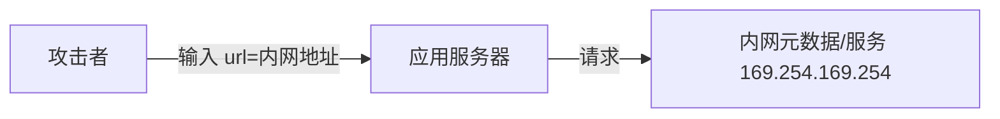

# 03 · 常见 Web 安全漏洞与防护

> 这一篇是后端高频漏洞的"攻防手册"：越权、注入、XSS、CSRF、SSRF、反序列化。速查式可看 [基础知识·Web 安全](../基础知识/Web安全.md)，本篇侧重**原理 + 代码级防护**。

---

## 一、越权（OWASP A01，最频发）

| 类型 | 含义 | 例子 |
|------|------|------|
| **水平越权** | 访问他人的同权限资源 | 改 URL 里的 `orderId=别人的` |
| **垂直越权** | 普通用户干管理员的事 | 直接调 `/admin/delete` |

**防护**：
- 每个资源操作**服务端校验归属**（"这条订单 belongs to 当前用户?"）；
- 基于 RBAC/ABAC 做接口级鉴权（见 [02 认证授权](02-认证与授权体系.md)）；
- 不要前端隐藏按钮就算"鉴权"。

```java
// 错误：只信前端不校验
@GetMapping("/order/{id}") Order get(@PathVariable id) { return repo.findById(id); }
// 正确：校验归属
Order o = repo.findById(id);
if (!o.getOwnerId().equals(currentUser())) throw new ForbiddenException();
```

---

## 二、注入（OWASP A03）

### 2.1 SQL 注入

```java
// 危险：拼接 SQL
String sql = "select * from user where name='" + name + "'";  // 输入 ' or 1=1 --
// 安全：参数化（预编译）
PreparedStatement ps = conn.prepareStatement("select * from user where name=?");
ps.setString(1, name);
```

**防护**：参数化查询 / ORM（MyBatis `#{}` 非 `${}`）/ 最小权限 DB 账号 / 输入白名单。

### 2.2 命令注入 / 表达式注入

- 避免 `Runtime.exec` 拼用户输入；用白名单+转义；
- 小心 SpEL/OGNL 等表达式引擎执行用户输入。

---

## 三、XSS（跨站脚本）

| 类型 | 触发 | 防护 |
|------|------|------|
| 存储型 | 恶意脚本存库，别人看时执行 | 输出转义 + CSP |
| 反射型 | 链接带脚本，点击执行 | 同上 |
| DOM 型 | 前端 JS 拼 DOM | 安全 DOM API |

**防护**：输出到 HTML 时**上下文转义**（HTML/JS/URL 各自转义）；CSP（Content-Security-Policy）限制脚本源；HttpOnly Cookie 防盗。

---

## 四、CSRF（跨站请求伪造）

攻击者诱导已登录用户浏览器，向目标站发非本意请求（如转账）。

**防护**：
- **CSRF Token**：每个状态变更请求带服务端校验的 token；
- **SameSite Cookie**：`Strict/Lax` 限制跨站带 Cookie；
- 关键操作要求二次确认/重新认证。

> 注意：JWT 放 Authorization Header（非 Cookie）天然抗 CSRF，但仍有 XSS 盗 token 风险。

---

## 五、SSRF（服务端请求伪造，OWASP A10）

应用代用户发请求（如"输入 URL 抓取"），攻击者诱导它打内网。



**防护**：
- 白名单协议（仅 http/https）+ 解析后校验 IP **非内网/环回/链路本地**；
- 禁用重定向跟随；
- 出网走代理并限制目标。

---

## 六、反序列化漏洞

不可信数据反序列化为对象，可能触发恶意代码（Java 原生序列化、Fastjson 历史 CVE）。

**防护**：不用危险默认反序列化、升级有 CVE 的库、用 JSON 等安全格式、白名单类。

---

## 七、防护总原则

> **口诀：输入校验白名单、输出转义按上下文、参数化查库、跨边界鉴权、依赖勤更新。**

| 漏洞 | 首要防护 |
|------|----------|
| 越权 | 服务端校验资源归属 + RBAC |
| 注入 | 参数化 + 白名单 |
| XSS | 输出转义 + CSP + HttpOnly |
| CSRF | CSRF Token + SameSite |
| SSRF | IP/协议白名单 + 禁重定向 |
| 反序列化 | 安全格式 + 升级 CVE 库 |

---

## 八、Cheat Sheet

| 主题 | 要点 |
|------|------|
| 越权 | 水平/垂直，服务端校验归属 |
| 注入 | 参数化，禁拼接 |
| XSS | 转义+CSP+HttpOnly |
| CSRF | Token+SameSite |
| SSRF | 协议/IP 白名单，禁跟重定向 |
| 反序列化 | 安全格式，升级 CVE |

> 下一篇：[04 安全测试方法论](04-安全测试方法论.md) —— 漏洞怎么"测出来"：SAST/DAST/IAST/SCA、模糊测试、渗透。
