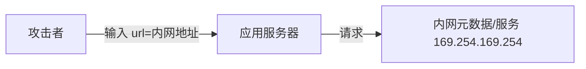
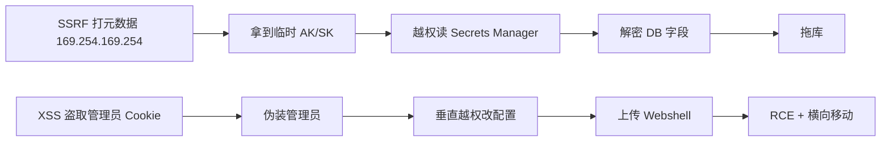
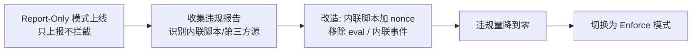
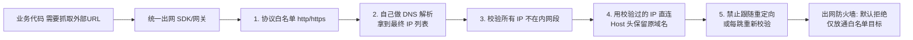

# 03 · 常见 Web 安全漏洞与防护

> 这一篇是后端高频漏洞的"攻防手册"：越权、注入、XSS、CSRF、SSRF、反序列化。速查式可看 [基础知识·Web 安全](../基础知识/Web安全.md)，本篇侧重**原理 + 代码级防护**。

---

## 一、越权（OWASP A01，最频发）

| 类型 | 含义 | 例子 |
|------|------|------|
| **水平越权** | 访问他人的同权限资源 | 改 URL 里的 `orderId=别人的` |
| **垂直越权** | 普通用户干管理员的事 | 直接调 `/admin/delete` |

**防护**：
- 每个资源操作**服务端校验归属**（"这条订单 belongs to 当前用户?"）；
- 基于 RBAC/ABAC 做接口级鉴权（见 [02 认证授权](02-认证与授权体系.md)）；
- 不要前端隐藏按钮就算"鉴权"。

```java
// 错误：只信前端不校验
@GetMapping("/order/{id}") Order get(@PathVariable id) { return repo.findById(id); }
// 正确：校验归属
Order o = repo.findById(id);
if (!o.getOwnerId().equals(currentUser())) throw new ForbiddenException();
```

---

## 二、注入（OWASP A03）

### 2.1 SQL 注入

```java
// 危险：拼接 SQL
String sql = "select * from user where name='" + name + "'";  // 输入 ' or 1=1 --
// 安全：参数化（预编译）
PreparedStatement ps = conn.prepareStatement("select * from user where name=?");
ps.setString(1, name);
```

**防护**：参数化查询 / ORM（MyBatis `#{}` 非 `${}`）/ 最小权限 DB 账号 / 输入白名单。

### 2.2 命令注入 / 表达式注入

- 避免 `Runtime.exec` 拼用户输入；用白名单+转义；
- 小心 SpEL/OGNL 等表达式引擎执行用户输入。

---

## 三、XSS（跨站脚本）

| 类型 | 触发 | 防护 |
|------|------|------|
| 存储型 | 恶意脚本存库，别人看时执行 | 输出转义 + CSP |
| 反射型 | 链接带脚本，点击执行 | 同上 |
| DOM 型 | 前端 JS 拼 DOM | 安全 DOM API |

**防护**：输出到 HTML 时**上下文转义**（HTML/JS/URL 各自转义）；CSP（Content-Security-Policy）限制脚本源；HttpOnly Cookie 防盗。

---

## 四、CSRF（跨站请求伪造）

攻击者诱导已登录用户浏览器，向目标站发非本意请求（如转账）。

**防护**：
- **CSRF Token**：每个状态变更请求带服务端校验的 token；
- **SameSite Cookie**：`Strict/Lax` 限制跨站带 Cookie；
- 关键操作要求二次确认/重新认证。

> 注意：JWT 放 Authorization Header（非 Cookie）天然抗 CSRF，但仍有 XSS 盗 token 风险。

---

## 五、SSRF（服务端请求伪造，OWASP A10）

应用代用户发请求（如"输入 URL 抓取"），攻击者诱导它打内网。



**防护**：
- 白名单协议（仅 http/https）+ 解析后校验 IP **非内网/环回/链路本地**；
- 禁用重定向跟随；
- 出网走代理并限制目标。

---

## 六、反序列化漏洞

不可信数据反序列化为对象，可能触发恶意代码（Java 原生序列化、Fastjson 历史 CVE）。

**防护**：不用危险默认反序列化、升级有 CVE 的库、用 JSON 等安全格式、白名单类。

---

## 七、深挖：漏洞检测速查（我怎么发现有没有这个洞）

| 漏洞 | 手动验证 | 工具/扫描 | 代码走查点 |
|------|----------|-----------|------------|
| 越权 | 换 userId/role 重放请求 | 业务逻辑测试 | 资源查询是否带 `WHERE owner=?` |
| SQL 注入 | 输入 `' or 1=1--` 看报错 | sqlmap、SAST | 是否有字符串拼接 SQL / `${}` |
| XSS | 提交 `<script>alert(1)</script>` | DAST、浏览器插件 | 输出是否转义、有无 CSP |
| CSRF | 跨站表单重放 | CSRF PoC 生成器 | 状态变更接口是否校验 Token/SameSite |
| SSRF | 输入内网 IP 看响应 | DAST + 出网监控 | 出网请求是否有目标白名单 |
| 反序列化 | 恶意序列化 payload | ysoserial、SCA | 是否反序列化不可信数据 |

> **规律**：80% 高危漏洞靠"服务端信任输入"这一句话就能预防——参数化、白名单、校验归属、输出转义。

### 7.1 纵深防御下的防护层次

```
WAF(规则拦截) → 网关(鉴权限流) → 应用层(校验/转义/参数化) → 数据库(最小权限)
```

- 单点防护会被绕过，**每层各防一部分**才叫纵深；
- 例如 SQL 注入：WAF 挡常见 payload + 应用层参数化兜底 + DB 账号无 DROP 权限。

### 7.2 安全头基线（N ginx/Spring 一键配置）

| Header | 作用 |
|--------|------|
| `Content-Security-Policy` | 限制脚本/资源来源（防 XSS） |
| `X-Frame-Options: DENY` | 防点击劫持（iframe 嵌入） |
| `Strict-Transport-Security` | 强制 HTTPS（防降级） |
| `X-Content-Type-Options: nosniff` | 防 MIME 嗅探 |
| `Referrer-Policy` | 控制 Referer 泄露 |

---

## 八、防护总原则

> **口诀：输入校验白名单、输出转义按上下文、参数化查库、跨边界鉴权、依赖勤更新。**

| 漏洞 | 首要防护 |
|------|----------|
| 越权 | 服务端校验资源归属 + RBAC |
| 注入 | 参数化 + 白名单 |
| XSS | 输出转义 + CSP + HttpOnly |
| CSRF | CSRF Token + SameSite |
| SSRF | IP/协议白名单 + 禁重定向 |
| 反序列化 | 安全格式 + 升级 CVE 库 |

---

## 九、面试高频追问（12+ 条）

1. Q：SQL 注入的根本原因？ A：把用户输入当 SQL 代码拼接执行；根治=参数化（SQL 与数据分离）。
2. Q：MyBatis 里 `#{}` 和 `${}` 区别？ A：`#{}` 预编译占位参数（安全），`${}` 直接字符串拼接（有注入风险，仅限白名单值）。
3. Q：水平越权怎么防？ A：每个资源操作服务端校验归属（资源 owner == 当前用户）。
4. Q：XSS 三种类型？ A：存储型（存库后他者触发）、反射型（URL 带 payload）、DOM 型（前端 JS 拼接）。
5. Q：CSP 是什么？ A：内容安全策略，白名单声明允许加载的脚本/样式来源，即使注入脚本也无法执行。
6. Q：CSRF 攻击为什么可行？ A：浏览器自动带 Cookie 发起跨站请求，服务端无法区分请求是否用户本意。
7. Q：JWT 为什么天然抗 CSRF？ A：token 放 Authorization Header，跨站请求无法自动附带（CORS 也限制读取）。
8. Q：SSRF 打内网的经典目标？ A：云元数据服务 169.254.169.254（可偷临时凭证）、内网 Redis/ES 等。
9. Q：反序列化漏洞怎么产生？ A：反序列化时触发类构造/gadget 链执行任意代码；Java 原生序列化/Fastjson 历史高危。
10. Q：转义按什么做？ A：按输出上下文（HTML/属性/JS/URL/CSS 各自转义），统一转义反而绕过。
11. Q：上传漏洞怎么防？ A：白名单后缀+内容嗅探校验、随机文件名、存储与执行目录隔离。
12. Q：验证码/限流属于哪类防护？ A：防暴力破解/撞库（A07 身份鉴别），属可用性+认证保护。
13. Q：业务逻辑漏洞（A04）举例？ A：优惠券并发薅羊毛、越权改价格、重复领取——靠威胁建模+流程校验。
14. Q：拿到一个漏洞报告先做什么？ A：确认危害范围（能否复现、影响数据）、定级、止损、修复、回归验证、复盘。

---

## 十、Cheat Sheet

| 主题 | 要点 |
|------|------|
| 越权 | 水平/垂直，服务端校验归属 |
| 注入 | 参数化，禁拼接 |
| XSS | 转义+CSP+HttpOnly |
| CSRF | Token+SameSite |
| SSRF | 协议/IP 白名单，禁跟重定向 |
| 反序列化 | 安全格式，升级 CVE |

> 下一篇：[04 安全测试方法论](04-安全测试方法论.md) —— 漏洞怎么"测出来"：SAST/DAST/IAST/SCA、模糊测试、渗透。

---

## 十一、漏洞组合利用链（攻击者的"拼图思维"）

单个漏洞往往不够看，**真实入侵是链式的**：一个低危入口 + 一个配置缺陷 = 高危沦陷。理解链路才能正确排优先级。



| 组合 | 链路 | 单点看不起眼，组合致命 |
|------|------|------------------------|
| SSRF + 云元数据 | 内网请求 → 偷临时凭证 → 横向 | SSRF 单看是"读网页"，实则拿根密钥 |
| XSS + CSRF | 盗 Cookie → 伪造请求 | 有了会话即可绕过 CSRF 保护 |
| 反序列化 + 内网可达 | RCE → 扫内网弱口令 | 单台沦陷变跳板 |
| 水平越权 + 批量遍历 | 改 ID 遍历 → 爬全量用户 | 单条越权 × 枚举 = 大规模泄露 |
| 文件上传 + 解析漏洞 | 传图马 → 服务器解析执行 | 上传校验过了但执行端没防 |

> **防守启示**：不能只看单漏洞 CVSS。评估时要把"可达性 + 后续利用路径"一起算，这也是 [02 认证授权](02-认证与授权体系.md) 强调"服务端校验归属"的价值——它直接切断大多数横向链路的起点。

---

## 十二、各漏洞语言级防护代码示例

### 12.1 SQL 注入：多语言参数化对照

```java
// Java — PreparedStatement（? 占位，数据与语句分离）
String sql = "select id, name from user where phone = ?";
try (PreparedStatement ps = conn.prepareStatement(sql)) {
    ps.setString(1, phone);            // 驱动自动转义，注入失效
    return ps.executeQuery();
}
```

```go
// Go — database/sql 占位符
row := db.QueryRow("select id from user where name = $1", name)
```

```python
# Python — 参数化（严禁 % 拼接）
cur.execute("select * from user where name = %s", (name,))   # psycopg2
```

```javascript
// Node — 用参数化库（mysql2 的 ? 占位，或 ORM）
const [rows] = await conn.query("select * from user where name = ?", [name]);
```

> MyBatis 里 `#{}` 走预编译参数，`${}` 是字符串拼接——**只把 `${}` 留给白名单列名/排序方向**，且必须经过枚举校验。

### 12.2 XSS：按上下文转义（不能一刀切）

| 输出位置 | 转义方式 | 常见错误 |
|----------|----------|----------|
| HTML 正文 | HTML 实体转义（& < > " '） | 用 URL 转义导致仍可执行 |
| HTML 属性 | 属性转义 + 加引号 | 属性值未引号包裹 |
| JS 上下文 | JS 转义（\xHH / JSON.stringify） | 直接拼接字符串变量 |
| URL 参数 | URL 编码（encodeURIComponent） | 未编码导致 `javascript:` 注入 |

```java
// 推荐：框架自带转义（Thymeleaf 默认 HTML 转义；Freemarker 用 ?html）
// 禁止：<%= request.getParameter("name") %> 直接进页面
```

### 12.3 SSRF：解析后校验 IP 归属（Java 示例）

```java
// 校验 URL 解析后的 IP 不落在危险段（内网/环回/链路本地）
private void assertSafeUrl(String url) throws MalformedURLException, IOException {
    URI uri = new URI(url);
    if (!List.of("http","https").contains(uri.getScheme().toLowerCase()))
        throw new SecurityException("协议不被允许");
    InetAddress addr = InetAddress.getByName(uri.getHost());
    if (addr.isLoopbackAddress() || addr.isSiteLocalAddress()
        || addr.isLinkLocalAddress() || addr.isAnyLocalAddress())
        throw new SecurityException("禁止访问内网地址: " + addr.getHostAddress());
}
```

### 12.4 上传漏洞：白名单 + 内容校验 + 隔离存储

```java
// 1) 后缀白名单（非黑名单！）
Set<String> ALLOW = Set.of("jpg","png","pdf");
String ext = FilenameUtils.getExtension(name).toLowerCase();
if (!ALLOW.contains(ext)) throw new SecurityException("不支持的文件类型");
// 2) 内容嗅探（读 magic number，不轻信后缀）
// 3) 随机文件名，避免路径穿越（禁 ../）
String stored = UUID.randomUUID() + "." + ext;
// 4) 存储与执行目录分离（对象存储/OSS，不落 Web 根可执目录）
```

---

## 十三、WAF 与 RASP：边界与运行时的补位

| 手段 | 位置 | 能防 | 不能防 | 误杀 |
|------|------|------|--------|------|
| **WAF** | 流量入口（反向代理层） | 已知 payload 正则/规则 | 业务逻辑漏洞、加密隧道内的攻击 | 高（规则粗暴） |
| **RASP** | 应用运行时（agent 插桩） | 真实触达危险函数的行为 | 需agent、重、兼容性风险 | 低 |
| **网关鉴权限流** | 服务前 | 越权、刷接口、DDoS | 应用内部逻辑 | 中 |

> 三者是**纵深**而非替代：WAF 挡自动化扫描、RASP 兜住绕过的精准攻击、网关管业务风控。详见 [安全工程总览](安全工程总览.md) 的纵深防御模型。

---

## 十四、业务安全（逻辑漏洞，OWASP A04）

技术漏洞讲完，最容易被忽视的是**业务逻辑本身**被滥用：

| 漏洞 | 手法 | 防护 |
|------|------|------|
| 并发薅羊毛 | 同一优惠券并发领取/下单 | 分布式锁 + 幂等 + 库存原子扣减 |
| 越权改价 | 改请求体里的 `price` 字段 | 服务端重算价格，不信任前端 |
| 短信/邮件轰炸 | 无限触发验证码 | 频率限制 + 图形验证码 + 行为风控 |
| 重放攻击 | 截获请求重复提交 | 一次性 nonce / 时间戳 + 签名 |
| 越权遍历 | 改 `userId` 爬数据 | 归属校验 + 分页总量限制 |

```java
// 价格不信任前端：下单时服务端按 skuId 查库价
BigDecimal price = skuRepo.findById(dto.getSkuId()).getPrice();
// 而非直接用 dto.getPrice()
```

---

## 十五、漏洞修复优先级模型

不是所有漏洞都"立刻修"。用 **CVSS 基础分 × 业务暴露面** 双维度排序：

```
高 CVSS + 公网可达 + 有 PoC  → P0，24h 内修
高 CVSS + 仅内网 + 难利用    → P1，1 周内
低 CVSS + 公网              → P2，排期
低 CVSS + 内网 + 需前置条件  → P3， backlog
```

> 用 [04 安全测试方法论](04-安全测试方法论.md) 的 EPSS（漏洞被利用概率）辅助排序，比单纯看 CVSS 更贴近现实。

---

## 十六、实战踩坑实录

1. **预编译 ≠ 100% 安全**：若 SQL 本身用 `${}` 拼了表名/order by，仍可能注入。务必区分"值"和"结构"。
2. **CSP 配了但形同虚设**：`default-src 'self'` 却把 `'unsafe-inline'` 放开，XSS 仍可执行。CSP 要收口到 nonce/hash。
3. **SameSite=Lax 仍可被 CSRF**：Lax 仅拦截"跨站非安全方法/顶级导航的 GET"，POST 表单 + 顶级导航仍可能带 Cookie。关键操作加 Token 才稳。
4. **SSRF 只禁 IP 没禁域名**：攻击者用 `http://169.254.169.254.nip.io` 或短链重定向绕过 IP 校验——必须**解析最终 IP 且禁重定向**。
5. **越权靠"前端不显示按钮"**：爬接口直接调，按钮藏不住。服务端归属校验是唯一有效手段。

---

## 十七、反模式与误区

| 反模式 | 为什么错 |
|--------|----------|
| 黑名单防注入（屏蔽 `or 1=1`） | 绕过手段无穷（大小写、编码、注释变体） |
| 只防外部不防内部 | 内部服务调用同样要鉴权（零信任，见 [07](../安全工程/07-零信任架构.md)） |
| 一个 WAF 走天下 | 业务/逻辑漏洞 WAF 看不见 |
| 漏洞修完不回归 | 修复引入新洞/回退，需自动化复测 |
| 把安全当测试阶段的事 | 应在设计期威胁建模（[01](../安全工程/01-应用安全基础与威胁建模.md)） |

---

## 十八、延伸阅读与面试框架

**面试答题框架（STAR 式答漏洞题）**：
1. **根因**：为什么会产生（信任了输入 / 数据代码未分离 / 缺鉴权）；
2. **利用**：攻击者怎么打（payload / 链路）；
3. **防护**：分层的根治方案（首选参数化/校验归属，辅以 WAF/RASP）；
4. **权衡**：防护带来的成本（CSP 收口影响内联脚本、加密影响查询）。

**延伸**：
- 漏洞速查可回 [基础知识·Web 安全](../基础知识/Web安全.md)；
- 怎么"测出"这些洞见 [04 安全测试方法论](04-安全测试方法论.md)；
- 怎么从架构上消除——[01 威胁建模](../安全工程/01-应用安全基础与威胁建模.md) 与 [07 零信任](../安全工程/07-零信任架构.md)。

> **本篇口诀**：越权验归属，注入参数化；XSS 按上下文转义，CSRF 靠 Token+SameSite；SSRF 锁协议锁 IP 禁跳转，反序列化拒不可信；业务漏洞靠幂等锁，纵深防御不靠单点。

---

## 十九、SQL 注入完整分类：从回显到盲注

很多人以为"页面不报错就没注入"，这是最大的误解。注入的**信息回传信道**有很多种：

| 类型 | 原理 | 攻击者如何拿数据 | 特征 |
|------|------|-----------------|------|
| **联合查询注入** | `UNION SELECT` 拼接额外结果集 | 数据直接显示在页面上 | 最快，需页面有回显位 |
| **报错注入** | 构造函数报错，把数据带在错误信息里 | 读数据库错误提示 | 依赖详细错误页 |
| **布尔盲注** | 构造 `AND 1=1` / `AND 1=2`，观察页面差异 | 逐位二分猜测（一次一 bit） | 慢但无需回显 |
| **时间盲注** | `AND SLEEP(5)`，观察响应耗时 | 用延迟表达 0/1 | 最慢，但连页面差异都不需要 |
| **带外注入（OOB）** | 让数据库主动发起 DNS/HTTP 请求带出数据 | 攻击者收自己服务器的日志 | 绕过所有页面观察 |
| **二次注入** | 第一次存进库（转义了），第二次从库取出再拼接 | 存储时安全，使用时爆发 | 极易漏，代码审计难发现 |
| **宽字节注入** | 特定字符集下 `%df` 吃掉转义反斜杠 | 绕过 `addslashes` 类转义 | 用参数化即免疫 |

### 19.1 二次注入：最容易漏的一种

```java
// 第一步：注册用户名 admin'--  → 用参数化写入，安全，库里存的是字面量
insertUser(name);   // PreparedStatement，无问题

// 第二步：某处从库读出这个用户名，然后拼进 SQL —— 这里爆发
String name = userRepo.findName(id);          // 得到 admin'--
String sql = "select * from log where user='" + name + "'";  // 注入！
```

**根因**：开发者认为"从自己数据库读出来的数据是可信的"。**不成立**——数据库里的内容源头仍是用户输入。

> **正确心智模型**：不是"外部输入不可信"，而是**"进入 SQL 语句的一切都必须走参数化，不论它从哪来"**。同理适用于从 Redis、消息队列、配置中心、上游服务读到的值。

### 19.2 参数化管不了的地方：结构 vs 值

预编译只能参数化**值**，不能参数化**结构**（表名、列名、`ORDER BY` 字段、`ASC/DESC`、`LIMIT` 之外的关键字）：

```java
// 无法参数化：ORDER BY 后的列名
// 错误：直接拼
String sql = "select * from t order by " + sortField + " " + sortDir;

// 正确：枚举白名单映射，用户输入只作为"key"去查表
private static final Map<String, String> SORT_WHITELIST = Map.of(
    "time",  "create_time",
    "price", "amount"
);
String col = SORT_WHITELIST.get(sortField);
if (col == null) throw new IllegalArgumentException("非法排序字段");
String dir = "desc".equalsIgnoreCase(sortDir) ? "DESC" : "ASC";  // 二值枚举
String sql = "select * from t order by " + col + " " + dir;       // 全部来自代码常量
```

关键点：**用户输入永远不进入 SQL 字符串，只用于查白名单**。拼进 SQL 的每个字符都来自代码里的常量。

### 19.3 纵深：DB 账号权限收敛

即使注入发生，最小权限也能大幅降低损失：

| 权限 | 应用账号是否需要 | 不给的收益 |
|------|-----------------|-----------|
| `SELECT/INSERT/UPDATE/DELETE` 业务表 | 需要 | — |
| `DROP` / `ALTER` | 不需要（DDL 走迁移工具的独立账号） | 注入无法删库 |
| `FILE` / `LOAD_FILE` / `INTO OUTFILE` | 不需要 | 无法读写服务器文件、写 webshell |
| 跨库访问（`information_schema` 外的其他业务库） | 不需要 | 限制横向拖库范围 |
| 存储过程创建/执行 | 通常不需要 | 减少提权路径 |

> 一条常被忽略的配置：MySQL 的 `local_infile` 和 JDBC 的 `allowLoadLocalInfile` 应关闭，否则存在恶意服务端读取客户端文件的风险。

---

## 二十、越权的系统性根治：从"处处判断"到"框架强制"

第一章讲了"服务端校验归属"，但**靠每个接口的开发者手写 `if (o.ownerId != currentUser)` 是不可持续的**——接口越多，漏掉一处的概率就趋近于 1。越权是 OWASP 排第一的漏洞，根本原因就在这里。

### 20.1 三代解法演进

| 代际 | 做法 | 问题 |
|------|------|------|
| 第一代 | 每个方法手写归属判断 | 必然遗漏；新人不知道要写；重构易丢 |
| 第二代 | 抽出鉴权工具方法 + Code Review 卡 | 依赖人的自觉，Review 会疲劳 |
| 第三代 | **框架层强制**：查询自动注入归属条件，漏写则查不到数据 | 需要前期设计，但一次投入长期收益 |

### 20.2 第三代：数据权限自动下推

思路是**让"忘记写鉴权"变成"查不出数据"而不是"查出所有数据"**——把默认行为从危险改成安全。

```java
// MyBatis 拦截器：为所有带 @TenantScoped 的表自动追加 tenant_id 条件
@Intercepts(@Signature(type = StatementHandler.class, method = "prepare",
                       args = {Connection.class, Integer.class}))
public class DataScopeInterceptor implements Interceptor {
    @Override
    public Object intercept(Invocation inv) throws Throwable {
        BoundSql boundSql = ((StatementHandler) inv.getTarget()).getBoundSql();
        String sql = boundSql.getSql();
        if (needScope(sql)) {
            // 用 SQL 解析器（JSqlParser）安全地在 WHERE 上加条件，而非字符串拼接
            sql = SqlScopeRewriter.addCondition(sql, "tenant_id", CurrentUser.tenantId());
            ReflectUtil.setFieldValue(boundSql, "sql", sql);
        }
        return inv.proceed();
    }
}
```

**关键设计要求**：

1. **用 SQL 解析器改写，不要正则拼接**——正则处理不了子查询、UNION、JOIN、CTE，会漏也会改坏；
2. **默认全表纳管，白名单豁免**——需要跨租户查询的地方显式声明 `@IgnoreDataScope` 并强制 Code Review；
3. **豁免必须可审计**——统计有多少处豁免，作为安全债务指标跟踪；
4. **上下文必须可靠**——`CurrentUser.tenantId()` 从已验签的 Token 取，不能从请求参数取（否则等于让攻击者自己填）。

### 20.3 越权的自动化测试：双账号 Diff

越权是**工具扫不出来的**（扫描器不知道哪条数据该归谁），但可以用一个巧妙的自动化方法：

```
1. 用账号 A 走一遍核心业务流程，录制所有请求（含响应）
2. 把这批请求的凭据换成账号 B，重放
3. 断言：所有涉及 A 私有资源的请求，B 重放应返回 403/404
   - 若返回 200 且内容与 A 相同 → 水平越权
4. 把凭据换成低权限角色 C 重放管理接口
   - 若返回 200 → 垂直越权
```

| 断言结果 | 判定 |
|----------|------|
| 403 / 404 | 正确（注意：返回 404 比 403 更好，不泄露资源存在性） |
| 200 且返回 A 的数据 | **水平越权漏洞** |
| 200 且返回 B 自己的数据 | 正常（说明接口按当前用户过滤，设计正确） |
| 500 | 需排查（可能鉴权逻辑抛异常，也可能是注入面） |

> 这套 Diff 测试可以做成 CI 的一个 Job，成本远低于人工渗透，且能防**回归**——重构改坏了鉴权，下次 CI 就红。

### 20.4 IDOR 与不可预测 ID

自增 ID 让"遍历"变得极其容易（`orderId=1001` → `1002` → …）。用 UUID / Snowflake / 哈希 ID 能提升攻击成本：

| 方案 | 抗遍历 | 注意 |
|------|--------|------|
| 自增 ID | 无 | 同时泄露业务量级 |
| UUID v4 | 强 | 索引性能与存储开销需评估 |
| Snowflake | 弱（含时间戳，可推测邻近 ID） | 抗遍历有限 |
| 对外映射 ID（内部自增 + 外部哈希） | 强 | 需维护映射，但兼顾性能 |

> **但这只是纵深，不是根治**。不可预测 ID 属于"提高成本"，归属校验才是"关闭大门"。**绝不能用 UUID 代替鉴权**——ID 会通过分享链接、日志、Referer、客服截图泄露。

---

## 二十一、XSS 深入：CSP 三代演进与 Trusted Types

### 21.1 CSP 为什么常常"配了没用"

```http
# 第一代：域名白名单 —— 看起来严格，实际常被绕过
Content-Security-Policy: default-src 'self'; script-src 'self' cdn.example.com

# 绕过途径：
# 1) 白名单 CDN 上有 JSONP 接口 → 可执行任意回调
# 2) 白名单域上有开放上传 → 上传 JS 文件
# 3) 加了 'unsafe-inline' → CSP 基本失效（最常见）
# 4) 加了 'unsafe-eval' → 模板引擎/eval 仍可利用
```

```http
# 第二代：nonce（每次响应随机，只有带对 nonce 的脚本才执行）
Content-Security-Policy: script-src 'nonce-r4nd0mBase64' 'strict-dynamic'; object-src 'none'; base-uri 'none'

# 页面里：
# <script nonce="r4nd0mBase64"> ... </script>   ← 执行
# <script>alert(1)</script>                      ← 被拦（注入的没有 nonce）
```

**`strict-dynamic` 的价值**：允许已被信任的脚本动态创建新脚本（解决第三方库动态加载的兼容问题），同时忽略域名白名单——**从"信任域名"转向"信任来源标记"**，这是 CSP 设计思路的根本转变。

| CSP 关键指令 | 作用 | 为什么重要 |
|-------------|------|-----------|
| `script-src 'nonce-xxx' 'strict-dynamic'` | 只执行带 nonce 的脚本 | 核心防线 |
| `object-src 'none'` | 禁用 Flash/插件 | 老插件是绕过通道 |
| `base-uri 'none'` | 禁止改 `<base>` | 防相对路径脚本劫持 |
| `frame-ancestors 'none'` | 防被 iframe 嵌套 | 替代 `X-Frame-Options` |
| `require-trusted-types-for 'script'` | 强制 Trusted Types | 防 DOM XSS |
| `report-uri` / `report-to` | 违规上报 | 灰度上线 CSP 的必备 |

### 21.2 CSP 灰度上线的正确姿势

直接上 `Content-Security-Policy` 会大面积白屏。正确流程：



```http
# 第一步：只观察，不影响用户
Content-Security-Policy-Report-Only: script-src 'nonce-xxx' 'strict-dynamic'; report-uri /csp-report
```

> 踩坑：`report-uri` 会收到大量浏览器扩展造成的噪音违规（扩展注入的脚本）。上报处理时要按 `source-file` 过滤掉 `chrome-extension://` 之类的来源，否则真信号被淹没。

### 21.3 DOM XSS 与 Trusted Types

DOM XSS 不经过服务端，CSP 的 `script-src` 也管不住 `innerHTML`：

```javascript
// 危险的 Sink（污点汇）
el.innerHTML = userInput;                 // HTML 解析 → 可执行
el.outerHTML = userInput;
document.write(userInput);
eval(userInput); new Function(userInput);
location = userInput;                     // javascript: 伪协议
el.setAttribute('href', userInput);       // javascript: 伪协议
element.onclick = userInput;

// 安全替代
el.textContent = userInput;               // 只当文本，不解析
el.setAttribute('data-x', userInput);     // 非危险属性
// 需要富文本时：用 DOMPurify 白名单净化
el.innerHTML = DOMPurify.sanitize(userInput);
```

**Trusted Types** 让浏览器强制要求：赋给危险 Sink 的必须是经过策略函数处理的对象，而不是普通字符串：

```javascript
// 开启后，直接赋字符串给 innerHTML 会抛异常，从根上消除 DOM XSS
const policy = trustedTypes.createPolicy('app', {
  createHTML: (s) => DOMPurify.sanitize(s)
});
el.innerHTML = policy.createHTML(userInput);   // 必须走策略
```

> Trusted Types 的价值在于**把"记得净化"变成"不净化就报错"**——和第二十章"框架强制鉴权"是同一个思路：**让安全成为默认，让不安全成为编译/运行期错误**。

### 21.4 常被忽略的 XSS 载体

| 载体 | 风险 | 防护 |
|------|------|------|
| SVG 上传 | SVG 内可含 `<script>`，作为图片打开即执行 | 独立域名托管 + `Content-Disposition: attachment` + 净化 |
| Markdown 渲染 | `[x](javascript:alert(1))`、内嵌 HTML | 渲染器禁用 raw HTML + URL 协议白名单 |
| PDF / Office 预览 | 预览器可能执行脚本 | 沙箱域名 + 转图片预览 |
| `Content-Type` 错误 | 用户上传 HTML 被当页面渲染 | `X-Content-Type-Options: nosniff` + 正确 MIME |
| JSONP 回调 | 回调名可控 → 注入 | 弃用 JSONP，用 CORS |
| 邮件模板 | 富文本邮件里的链接 | 服务端渲染时转义 |

**用户上传内容的黄金法则**：**放在独立的、不共享 Cookie 的域名下**（如 `usercontent-xxx.com` 而非 `cdn.主站.com`）。这样即使触发 XSS，也拿不到主站会话——这是纵深防御的典型应用。

---

## 二十二、CSRF 深入：SameSite 语义与多重防护

### 22.1 SameSite 三个值的精确语义

| 值 | 跨站请求是否带 Cookie | 注意 |
|----|---------------------|------|
| `Strict` | 完全不带 | 从外站点击链接进来也不带 → 用户看到未登录状态 |
| `Lax` | 仅"顶级导航 + 安全方法（GET）"带 | **跨站 POST 不带**，但顶级导航 GET 带 |
| `None` | 都带（必须同时 `Secure`） | 第三方嵌入场景才用 |

**`Lax` 的防护边界**（这是最容易误判的地方）：

```html
<!-- 跨站 POST 表单：Lax 下不带 Cookie → CSRF 失败 -->
<form action="https://bank.com/transfer" method="POST">...</form>

<!-- 但如果转账接口误用了 GET：Lax 下顶级导航会带 Cookie → CSRF 成功！ -->
<a href="https://bank.com/transfer?to=attacker&amount=10000">领取奖品</a>
<!-- 甚至： 是子资源请求，Lax 不带；
     但 window.open / location 跳转是顶级导航，Lax 会带 -->
```

> **结论**：`SameSite=Lax` 的前提是**严格遵守 HTTP 方法语义——GET 绝不产生副作用**。这条工程纪律不只是 RESTful 洁癖，它直接决定了 CSRF 防护是否成立。

### 22.2 三种 CSRF Token 方案

| 方案 | 原理 | 优点 | 缺点 |
|------|------|------|------|
| **同步器令牌（Synchronizer Token）** | 服务端会话存 token，每次比对 | 最安全 | 需服务端存储，分布式需共享会话 |
| **双提交 Cookie（Double Submit）** | token 同时放 Cookie 和请求头/表单，服务端比对二者 | 无状态 | 若攻击者能写子域 Cookie 则可绕过 |
| **加密令牌（签名 token）** | token = HMAC(sessionId + 时间戳)，服务端验签 | 无状态且抗子域写入 | 需管理密钥与时效 |

```java
// 双提交的正确实现要点
// 1) Cookie 里的 csrf token 不能是 HttpOnly（前端 JS 要读它放到 header）
// 2) 校验时必须用恒定时间比较（防时序侧信道）
// 3) Cookie 加 __Host- 前缀，防子域写入劫持
Set-Cookie: __Host-csrf=abc123; Path=/; Secure; SameSite=Lax
// 请求：X-CSRF-Token: abc123
```

**`__Host-` 前缀的作用**：浏览器强制要求带此前缀的 Cookie 必须 `Secure`、`Path=/`、且**不能带 `Domain` 属性**——这意味着子域无法写入它，直接封堵了双提交方案最大的绕过路径（攻击者控制 `evil.主站.com` 后写一个 CSRF Cookie）。

### 22.3 Origin / Referer 校验

```java
// 作为 Token 的补充层，不作为唯一防线
String origin = req.getHeader("Origin");
if (origin == null) origin = extractOrigin(req.getHeader("Referer"));
if (origin == null) {
    // 两个头都没有：可能是隐私设置/代理剥离。是否放行取决于风险偏好
    // 关键操作应拒绝，普通操作可依赖 Token 兜底
    throw new ForbiddenException("缺少来源信息");
}
if (!ALLOWED_ORIGINS.contains(origin))     // 精确匹配集合，不用 startsWith
    throw new ForbiddenException("非法来源");
```

**典型错误**：用 `origin.startsWith("https://example.com")` 校验 → `https://example.com.evil.com` 通过；用 `origin.contains("example.com")` → `https://evil-example.com` 通过。**必须精确匹配完整 Origin**。

### 22.4 CORS ≠ CSRF 防护

这是高频混淆点：

| | CORS | CSRF Token |
|---|------|-----------|
| 解决什么 | 浏览器**能否读取**跨域响应 | 服务端**能否确认**请求是本站发起 |
| 对写操作 | **不阻止请求发出**（简单请求无预检，请求已到服务端并生效） | 阻止执行 |
| 配错的后果 | `Access-Control-Allow-Origin: *` + `Credentials: true` 会被浏览器拒绝；但反射 Origin + Credentials 则是真漏洞 | 无防护 → CSRF |

```java
// 危险的 CORS 配置：反射任意 Origin 且允许携带凭据
// → 任何网站都能用受害者的 Cookie 读取你的接口响应（等于全站数据泄露）
resp.setHeader("Access-Control-Allow-Origin", req.getHeader("Origin"));  // 反射！
resp.setHeader("Access-Control-Allow-Credentials", "true");

// 正确：白名单精确匹配
String origin = req.getHeader("Origin");
if (ALLOWED_ORIGINS.contains(origin)) {
    resp.setHeader("Access-Control-Allow-Origin", origin);
    resp.setHeader("Access-Control-Allow-Credentials", "true");
    resp.setHeader("Vary", "Origin");     // 必须！否则 CDN 缓存会串号
}
```

> **`Vary: Origin` 漏了会出大事**：CDN/网关缓存了带某个 Origin 的响应头，后续其他站点的请求命中缓存，拿到了不该给它的 `Allow-Origin`。这是一个"配置对了但缓存害了你"的经典坑。

---

## 二十三、SSRF 深入：绕过手法与统一出网治理

### 23.1 为什么"校验 IP"总是被绕过

```
1. DNS 重绑定（DNS Rebinding）
   校验时 evil.com → 1.2.3.4（公网，通过校验）
   实际请求时 evil.com → 127.0.0.1（TTL=0，第二次解析变了）
   ★ 校验与使用之间存在时间窗（TOCTOU）

2. 重定向跳转
   http://evil.com/ → 302 → http://169.254.169.254/
   校验了第一跳，没校验后续跳

3. IP 表示法变体
   127.0.0.1 == 127.1 == 0x7f000001 == 2130706433 == 0177.0.0.1
   ::1 / ::ffff:127.0.0.1（IPv6 映射）

4. 域名解析到内网
   nip.io / xip.io 这类服务：127.0.0.1.nip.io 解析到 127.0.0.1

5. 协议走私
   file:///etc/passwd、gopher://（可构造任意 TCP 报文打 Redis）、dict://

6. URL 解析器差异
   http://evil.com#@169.254.169.254/  ← 不同库对 @ 和 # 的解析不一致
   校验用的解析器和发请求用的库解析结果不同 → 绕过
```

### 23.2 根治方案：统一出网代理 + 自定义 DNS 解析

单靠"校验 URL"是打补丁，正确做法是**把出网能力收敛到一个受控通道**：



**第 4 步是消除 DNS 重绑定的关键**：不要让 HTTP 客户端再解析一次域名，而是**用你已经校验过的 IP 直接建连**，把域名放在 `Host` 头里。这样校验与使用用的是同一个 IP，时间窗被消除。

```java
// 关键实现：把校验过的 IP 固定下来，避免二次解析
InetAddress[] addrs = InetAddress.getAllByName(host);
for (InetAddress a : addrs) assertNotInternal(a);      // 所有解析结果都要校验
InetAddress pinned = addrs[0];

HttpClient client = HttpClient.newBuilder()
    .followRedirects(Redirect.NEVER)                  // 禁止自动跟随
    .build();
// 用 pinned IP 建连，Host 头写原域名（HTTPS 场景需配 SNI）
```

### 23.3 必须拦截的地址段

```java
private static void assertNotInternal(InetAddress a) {
    if (a.isLoopbackAddress()          // 127.0.0.0/8, ::1
     || a.isLinkLocalAddress()          // 169.254.0.0/16 ← 云元数据！fe80::/10
     || a.isSiteLocalAddress()          // 10/8, 172.16/12, 192.168/16
     || a.isAnyLocalAddress()           // 0.0.0.0, ::
     || a.isMulticastAddress()          // 224.0.0.0/4
     || isCarrierGradeNat(a)            // 100.64.0.0/10 ← 云内网常用，易漏
     || isUniqueLocalIPv6(a)            // fc00::/7 ← IPv6 内网，最常漏
     || isSpecialPurpose(a))            // 192.0.0.0/24, 198.18/15 等
        throw new SecurityException("拒绝内网地址: " + a.getHostAddress());
}
```

**最常漏的三个**：
1. `100.64.0.0/10`（运营商级 NAT，多家云的容器网络在这个段）；
2. `fc00::/7`（IPv6 唯一本地地址）——很多代码只处理了 IPv4；
3. 云厂商的元数据地址除了 `169.254.169.254`，部分平台还有其他专用地址，需按实际环境确认并全部纳入黑名单。

### 23.4 云元数据的纵深防护

SSRF 最高价值的目标是云元数据服务（能拿到实例角色的临时凭证，直接横向到整个云账号）。除了应用层防护，还应在基础设施层加固：

| 措施 | 效果 |
|------|------|
| 启用 IMDSv2（要求先 PUT 取 token 再 GET） | 简单的 GET 型 SSRF 直接失效 |
| 设置元数据响应的 hop limit = 1 | 容器内经过网络转发的请求拿不到 |
| 完全禁用元数据访问（若不需要） | 彻底关闭 |
| 实例角色权限最小化 | 即使凭证泄露，能做的事有限 |
| 出网防火墙拦截 link-local 段 | 应用层绕过了也出不去 |

> 这是一个绝佳的纵深防御案例：**应用层校验 + 客户端行为约束 + 元数据服务加固 + 网络出口管控 + IAM 最小权限**，五层任一层生效都能挡住，任一层单独存在都可能被绕过。

---

## 二十四、反序列化深入：为什么"改个库"治不了本

### 24.1 根因：反序列化 = 让攻击者控制对象图

普通数据解析（如 JSON 转 Map）只产生数据。**对象反序列化会构造类实例并触发其方法**——这就把"数据"变成了"控制流"。

```
攻击者可控的字节流
  → 反序列化框架按其中的类型信息实例化对象
  → 触发构造函数 / setter / readObject / finalize / toString / hashCode
  → 若类路径上存在某个类，它的这些方法能执行危险操作（如加载远程类、执行命令）
  → 攻击者串联多个这样的类 = gadget chain
  → RCE
```

**关键洞察**：漏洞不在序列化库里，而在**"库允许攻击者指定要实例化的类型"** 这个设计上。所以：

| 应对方式 | 是否根治 | 说明 |
|----------|----------|------|
| 升级到修复版本 | ❌ 不根治 | 修的是"已知的 gadget 黑名单"，新 gadget 会不断被发现 |
| 加危险类黑名单 | ❌ 不根治 | 黑名单永远滞后于新 gadget 的挖掘 |
| **禁用多态类型/autoType** | ✅ 根治 | 攻击者无法指定类型，gadget 链无从构造 |
| **改用无类型信息的格式** | ✅ 根治 | 纯 JSON/Protobuf 映射到固定 DTO |
| 不反序列化不可信数据 | ✅ 根治 | 最彻底，但常做不到 |

### 24.2 各框架的正确配置

```java
// Jackson：默认安全，但一旦开启多态类型就危险
ObjectMapper om = new ObjectMapper();
// 危险：等于开放 autoType
om.enableDefaultTyping();                          // 绝对禁止
om.activateDefaultTyping(LaissezFaireSubTypeValidator.instance);  // 同样危险

// 若业务确实需要多态：用严格白名单校验器
PolymorphicTypeValidator ptv = BasicPolymorphicTypeValidator.builder()
    .allowIfSubType(MyBaseEvent.class)             // 只允许自己的基类子树
    .build();
om.activateDefaultTyping(ptv, ObjectMapper.DefaultTyping.NON_FINAL);

// 更好的方案：用 @JsonSubTypes 显式声明允许的子类，不开 defaultTyping
@JsonTypeInfo(use = Id.NAME, property = "type")
@JsonSubTypes({ @Type(value = OrderCreated.class, name = "created"),
                @Type(value = OrderPaid.class,    name = "paid") })
public abstract class OrderEvent { }
```

```java
// Java 原生序列化：如果无法避免，用 ObjectInputFilter（JDK 9+）
ObjectInputFilter filter = ObjectInputFilter.Config.createFilter(
    "com.myapp.dto.*;java.base/java.lang.*;!*"      // 白名单，末尾 !* 拒绝其余全部
);
ObjectInputStream ois = new ObjectInputStream(in);
ois.setObjectInputFilter(filter);
```

### 24.3 反序列化之外的同类问题

同一个根因（"让不可信输入决定执行什么"）还有多种变体，防护思路一致：

| 漏洞 | 触发点 | 防护 |
|------|--------|------|
| **SSTI（模板注入）** | 用户输入进入模板**模板体**而非变量 | 模板从代码/固定文件加载，用户输入只作变量传入 |
| **表达式注入** | SpEL / OGNL / MVEL 求值用户输入 | 不对用户输入求值；必须时用沙箱 + 白名单函数 |
| **XXE** | XML 解析器允许外部实体 | 禁用 DTD 与外部实体 |
| **原型链污染（JS）** | 递归 merge 用户对象时污染 `__proto__` | 校验 key，用 `Object.create(null)`，用 `Map` |
| **YAML 反序列化** | `yaml.load` 支持构造任意对象 | 用 `safe_load` / `SafeConstructor` |
| **ClassLoader 注入** | 参数绑定到 `class.*` 属性 | 框架层禁止绑定 `class`/`classLoader` 前缀 |

```java
// XXE 防护：三行配置
DocumentBuilderFactory f = DocumentBuilderFactory.newInstance();
f.setFeature("http://apache.org/xml/features/disallow-doctype-decl", true);  // 最彻底
f.setFeature("http://xml.org/sax/features/external-general-entities", false);
f.setFeature("http://xml.org/sax/features/external-parameter-entities", false);
f.setXIncludeAware(false);
f.setExpandEntityReferences(false);
```

```python
# YAML：永远用 safe_load
data = yaml.safe_load(untrusted)     # 而不是 yaml.load(untrusted)
```

> **统一心智模型**：**凡是"输入能决定代码路径/类型/执行什么"的地方，都是同一类漏洞**。识别方法：在代码里搜索"能把字符串变成行为"的 API——反序列化、模板编译、表达式求值、反射、动态类加载、`eval`。这些点必须只接受来自代码常量或严格白名单的输入。

---

## 二十五、其他高频漏洞速览

前面覆盖了六大类，实战中还有一批"不常被列在 Top 10 但频繁出事"的漏洞：

### 25.1 路径穿越（Path Traversal）

```java
// 危险：用户控制文件名
File f = new File("/data/upload/" + fileName);   // fileName = ../../etc/passwd

// 正确：规范化后校验是否仍在允许目录内
Path base = Paths.get("/data/upload").toRealPath();
Path target = base.resolve(fileName).normalize();
if (!target.startsWith(base)) throw new SecurityException("路径越界");
```

注意点：
- 必须先 `normalize()` 再比较，否则 `../` 未被消解；
- Windows 下还要处理 `..\\`、盘符、UNC 路径、8.3 短名；
- 压缩包解压是高危场景（**Zip Slip**）：条目名可含 `../`，解压时逐条校验目标路径；
- 双重编码：`%252e%252e%252f` 经两次解码变成 `../`，校验必须在**最终解码后**做。

### 25.2 开放重定向（Open Redirect）

```java
// 危险：登录后跳转到用户指定 URL —— 钓鱼利用
resp.sendRedirect(req.getParameter("returnUrl"));

// 正确：只允许站内相对路径，或白名单域名
String url = req.getParameter("returnUrl");
if (url == null || !url.startsWith("/") || url.startsWith("//"))
    url = "/home";           // 注意 // 开头是协议相对 URL，会跳到外站！
resp.sendRedirect(url);
```

> `//evil.com` 是**协议相对 URL**，`startsWith("/")` 会误判通过。这是开放重定向最经典的绕过，也常被用来绕过 OAuth 的 `redirect_uri` 校验。

### 25.3 HTTP 请求走私（Request Smuggling）

前端代理与后端服务器对 `Content-Length` 和 `Transfer-Encoding` 的解析不一致，导致一个请求被"劈开"，后半段被当成下一个请求的开头：

| 类型 | 前端用 | 后端用 |
|------|--------|--------|
| CL.TE | Content-Length | Transfer-Encoding |
| TE.CL | Transfer-Encoding | Content-Length |
| TE.TE | 二者都支持但对畸形头处理不同 | 同 |

**危害**：绕过前端的鉴权/WAF、缓存投毒、劫持其他用户的请求。

**防护**：统一代理与后端的 HTTP 解析实现与版本；拒绝同时出现 `CL` 和 `TE` 的请求；前后端之间用 HTTP/2；关闭连接复用可缓解但有性能代价。

### 25.4 CRLF 注入与响应头注入

```java
// 危险：用户输入进入响应头
resp.setHeader("Location", userInput);   // userInput 含 \r\n 可注入新的头甚至响应体
// → 可注入 Set-Cookie（会话固定）、注入 XSS 到响应体

// 防护：过滤 \r \n（现代容器通常已拦截，但自己拼原始响应时仍要注意）
if (userInput.matches(".*[\\r\\n].*")) throw new IllegalArgumentException();
```

同理适用于**日志注入**：用户输入含换行会伪造日志行，干扰审计与告警。日志打印用户输入前应转义换行符。

### 25.5 点击劫持（Clickjacking）

```http
Content-Security-Policy: frame-ancestors 'none'      # 现代方案
X-Frame-Options: DENY                                # 兼容老浏览器，二者都配
```

### 25.6 缓存投毒与缓存欺骗

| 攻击 | 原理 | 防护 |
|------|------|------|
| **缓存投毒** | 用未纳入缓存 key 的头（如 `X-Forwarded-Host`）影响响应内容，污染共享缓存 | 缓存 key 包含所有影响响应的输入；不信任转发头 |
| **缓存欺骗** | 请求 `/account/profile.css`，后端忽略后缀返回私有内容，CDN 按 `.css` 缓存了它 | 严格路由匹配；私有响应显式 `Cache-Control: private, no-store` |

> **一条通用规则**：**任何返回用户私有数据的响应，必须带 `Cache-Control: private, no-store`**。默认不设置就可能被中间层缓存，导致 A 用户的数据被 B 用户看到——这类事故排查极难，因为它只在缓存命中时偶发。

---

## 二十六、漏洞修复对照速查表（扩展版）

| 漏洞 | 根治手段（做这个） | 纵深补充 | 绝不能只靠这个 |
|------|-------------------|----------|---------------|
| 水平/垂直越权 | 框架层数据权限下推 + 归属校验 | 不可预测 ID、网关角色校验 | 前端隐藏、UUID |
| SQL 注入 | 参数化 + 结构白名单 | DB 最小权限、WAF | 黑名单过滤、转义函数 |
| 命令注入 | 不拼接 shell，用数组参数 API | 容器无 shell、只读文件系统 | 转义特殊字符 |
| 存储/反射 XSS | 输出按上下文转义 | CSP nonce、HttpOnly | 输入端一次性过滤 |
| DOM XSS | 安全 DOM API + Trusted Types | CSP、DOMPurify | 服务端转义 |
| CSRF | Token（同步器/加密） | SameSite、Origin 校验 | 仅 SameSite=Lax |
| SSRF | 统一出网 + 解析后 IP 校验 + 禁跳转 | 出网防火墙、IMDSv2 | 域名/IP 黑名单 |
| 反序列化 | 禁多态类型/用固定 DTO | 升级版本、类白名单过滤器 | 只升级版本 |
| XXE | 禁用 DTD 与外部实体 | 网络出口管控 | 过滤 `<!ENTITY` |
| 路径穿越 | 规范化后校验前缀 | 存储与执行隔离 | 过滤 `../` |
| 开放重定向 | 只允许站内相对路径 | 跳转前二次确认页 | `startsWith("/")` |
| 文件上传 | 后缀白名单 + 内容嗅探 + 独立域名 | 随机文件名、不可执行目录 | 只看 `Content-Type` |
| 业务逻辑 | 服务端重算 + 幂等 + 原子扣减 | 风控、限频 | 前端校验 |

---

## 二十七、漏洞挖掘的"提问清单"

拿到一份代码或一个接口，按这个顺序问，比背漏洞名单有效得多：

```mermaid
graph TD
    A[这个接口谁能调?] --> A1[无鉴权? → 未授权访问]
    A --> A2[有鉴权但不校归属? → 越权]
    B[输入去了哪里?] --> B1[进SQL? → 注入]
    B --> B2[进shell/表达式? → 命令/表达式注入]
    B --> B3[进HTML? → XSS]
    B --> B4[进文件路径? → 路径穿越]
    B --> B5[进URL发请求? → SSRF]
    B --> B6[进反序列化? → RCE]
    B --> B7[进响应头? → CRLF]
    C[输出带了什么?] --> C1[别人的数据? → 越权/信息泄露]
    C --> C2[堆栈/内部信息? → 信息泄露]
    C --> C3[能被缓存吗? → 缓存欺骗]
    D[状态变更操作] --> D1[能被跨站触发? → CSRF]
    D --> D2[能被重放? → 重放攻击]
    D --> D3[能并发? → 逻辑漏洞]
    D --> D4[金额/数量前端来? → 篡改]
```



**三个核心提问**（背这三个就够）：
1. **谁能调？**（认证 + 授权 + 归属）
2. **输入去哪了？**（追踪污点到每一个 Sink）
3. **输出带了什么？**（是否越界、是否泄露、是否会被缓存）

> 这就是 [04 安全测试](04-安全测试方法论.md) 里 IAST 污点分析的人工版本。工具能自动化第 2 问的一部分，但第 1 问和第 3 问目前只有人能判断——**这也是为什么访问控制类漏洞长期占据 OWASP 榜首**。

---

## 二十八、防护措施的"默认安全"改造清单

前面反复出现一个主题：**靠人记住的防护会失效，靠框架强制的防护才可靠**。汇总成一份改造清单：

| 从"靠自觉" | 改成"框架强制" | 收益 |
|-----------|---------------|------|
| 每处手写归属校验 | ORM 拦截器自动加租户/归属条件 | 忘写 = 查不到数据（安全的失败） |
| 记得用参数化 | 静态检查禁止字符串拼 SQL（Semgrep 规则） | 提交即拦截 |
| 记得转义输出 | 模板引擎默认转义，需显式声明才输出原始 HTML | 默认安全 |
| 记得净化 innerHTML | 开启 Trusted Types | 不净化直接抛异常 |
| 记得校验上传后缀 | 统一上传 SDK，业务方无法直接落盘 | 收敛入口 |
| 记得校验外部 URL | 统一出网 SDK + 出网防火墙 | 双层收敛 |
| 记得加 CSRF Token | 框架全局开启，白名单豁免 | 默认开启 |
| 记得给私有响应加 no-store | 拦截器按接口标注自动加 | 默认不缓存 |
| 记得脱敏日志 | 序列化器按字段注解自动掩码 | 见 [05 数据分级](05-数据安全与密码学基础.md) |

> **判断一个团队安全水平的最快方法**：问"如果一个新人忘记写鉴权，会发生什么？"
> - 答"会有漏洞" → 靠人，L2 水平；
> - 答"CI 会拦下来" → 有门禁，L3 水平；
> - 答"查不到数据，功能跑不通" → **默认安全**，L4 水平。

---

## 二十九、口诀汇总（扩展）

> **三问定位法**：谁能调？输入去哪了？输出带了什么？
>
> **注入统一律**：**进 SQL 的一切都参数化，不论它从哪来**（含从库里读出来的）；结构走白名单，值走占位符。
>
> **越权四字**：**身份、角色、归属、下推**——查身份、查角色、查归属、框架自动下推。
>
> **XSS 三层**：输出按上下文转义（根治）+ CSP nonce（兜底）+ 独立域名托管用户内容（隔离）。
>
> **CSRF 组合**：Token 为主，SameSite 为辅，Origin 精确匹配，GET 绝不改状态。
>
> **SSRF 五步**：协议白名单 → 自己解析 DNS → 校验所有 IP → 用校验过的 IP 直连 → 禁跟重定向；外加出网防火墙。
>
> **反序列化一句**：**别让攻击者决定实例化什么类**——禁多态、用固定 DTO，升级只是止痛。
>
> **默认安全一句**：**让忘记防护的后果是"功能跑不通"，而不是"出现漏洞"。**
