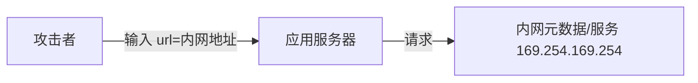

# 03 · 常见 Web 安全漏洞与防护

> 这一篇是后端高频漏洞的"攻防手册"：越权、注入、XSS、CSRF、SSRF、反序列化。速查式可看 [基础知识·Web 安全](../基础知识/Web安全.md)，本篇侧重**原理 + 代码级防护**。

---

## 一、越权（OWASP A01，最频发）

| 类型 | 含义 | 例子 |
|------|------|------|
| **水平越权** | 访问他人的同权限资源 | 改 URL 里的 `orderId=别人的` |
| **垂直越权** | 普通用户干管理员的事 | 直接调 `/admin/delete` |

**防护**：
- 每个资源操作**服务端校验归属**（"这条订单 belongs to 当前用户?"）；
- 基于 RBAC/ABAC 做接口级鉴权（见 [02 认证授权](02-认证与授权体系.md)）；
- 不要前端隐藏按钮就算"鉴权"。

```java
// 错误：只信前端不校验
@GetMapping("/order/{id}") Order get(@PathVariable id) { return repo.findById(id); }
// 正确：校验归属
Order o = repo.findById(id);
if (!o.getOwnerId().equals(currentUser())) throw new ForbiddenException();
```

---

## 二、注入（OWASP A03）

### 2.1 SQL 注入

```java
// 危险：拼接 SQL
String sql = "select * from user where name='" + name + "'";  // 输入 ' or 1=1 --
// 安全：参数化（预编译）
PreparedStatement ps = conn.prepareStatement("select * from user where name=?");
ps.setString(1, name);
```

**防护**：参数化查询 / ORM（MyBatis `#{}` 非 `${}`）/ 最小权限 DB 账号 / 输入白名单。

### 2.2 命令注入 / 表达式注入

- 避免 `Runtime.exec` 拼用户输入；用白名单+转义；
- 小心 SpEL/OGNL 等表达式引擎执行用户输入。

---

## 三、XSS（跨站脚本）

| 类型 | 触发 | 防护 |
|------|------|------|
| 存储型 | 恶意脚本存库，别人看时执行 | 输出转义 + CSP |
| 反射型 | 链接带脚本，点击执行 | 同上 |
| DOM 型 | 前端 JS 拼 DOM | 安全 DOM API |

**防护**：输出到 HTML 时**上下文转义**（HTML/JS/URL 各自转义）；CSP（Content-Security-Policy）限制脚本源；HttpOnly Cookie 防盗。

---

## 四、CSRF（跨站请求伪造）

攻击者诱导已登录用户浏览器，向目标站发非本意请求（如转账）。

**防护**：
- **CSRF Token**：每个状态变更请求带服务端校验的 token；
- **SameSite Cookie**：`Strict/Lax` 限制跨站带 Cookie；
- 关键操作要求二次确认/重新认证。

> 注意：JWT 放 Authorization Header（非 Cookie）天然抗 CSRF，但仍有 XSS 盗 token 风险。

---

## 五、SSRF（服务端请求伪造，OWASP A10）

应用代用户发请求（如"输入 URL 抓取"），攻击者诱导它打内网。



**防护**：
- 白名单协议（仅 http/https）+ 解析后校验 IP **非内网/环回/链路本地**；
- 禁用重定向跟随；
- 出网走代理并限制目标。

---

## 六、反序列化漏洞

不可信数据反序列化为对象，可能触发恶意代码（Java 原生序列化、Fastjson 历史 CVE）。

**防护**：不用危险默认反序列化、升级有 CVE 的库、用 JSON 等安全格式、白名单类。

---

## 七、深挖：漏洞检测速查（我怎么发现有没有这个洞）

| 漏洞 | 手动验证 | 工具/扫描 | 代码走查点 |
|------|----------|-----------|------------|
| 越权 | 换 userId/role 重放请求 | 业务逻辑测试 | 资源查询是否带 `WHERE owner=?` |
| SQL 注入 | 输入 `' or 1=1--` 看报错 | sqlmap、SAST | 是否有字符串拼接 SQL / `${}` |
| XSS | 提交 `<script>alert(1)</script>` | DAST、浏览器插件 | 输出是否转义、有无 CSP |
| CSRF | 跨站表单重放 | CSRF PoC 生成器 | 状态变更接口是否校验 Token/SameSite |
| SSRF | 输入内网 IP 看响应 | DAST + 出网监控 | 出网请求是否有目标白名单 |
| 反序列化 | 恶意序列化 payload | ysoserial、SCA | 是否反序列化不可信数据 |

> **规律**：80% 高危漏洞靠"服务端信任输入"这一句话就能预防——参数化、白名单、校验归属、输出转义。

### 7.1 纵深防御下的防护层次

```
WAF(规则拦截) → 网关(鉴权限流) → 应用层(校验/转义/参数化) → 数据库(最小权限)
```

- 单点防护会被绕过，**每层各防一部分**才叫纵深；
- 例如 SQL 注入：WAF 挡常见 payload + 应用层参数化兜底 + DB 账号无 DROP 权限。

### 7.2 安全头基线（N ginx/Spring 一键配置）

| Header | 作用 |
|--------|------|
| `Content-Security-Policy` | 限制脚本/资源来源（防 XSS） |
| `X-Frame-Options: DENY` | 防点击劫持（iframe 嵌入） |
| `Strict-Transport-Security` | 强制 HTTPS（防降级） |
| `X-Content-Type-Options: nosniff` | 防 MIME 嗅探 |
| `Referrer-Policy` | 控制 Referer 泄露 |

---

## 八、防护总原则

> **口诀：输入校验白名单、输出转义按上下文、参数化查库、跨边界鉴权、依赖勤更新。**

| 漏洞 | 首要防护 |
|------|----------|
| 越权 | 服务端校验资源归属 + RBAC |
| 注入 | 参数化 + 白名单 |
| XSS | 输出转义 + CSP + HttpOnly |
| CSRF | CSRF Token + SameSite |
| SSRF | IP/协议白名单 + 禁重定向 |
| 反序列化 | 安全格式 + 升级 CVE 库 |

---

## 八、面试高频追问（12+ 条）

1. Q：SQL 注入的根本原因？ A：把用户输入当 SQL 代码拼接执行；根治=参数化（SQL 与数据分离）。
2. Q：MyBatis 里 `#{}` 和 `${}` 区别？ A：`#{}` 预编译占位参数（安全），`${}` 直接字符串拼接（有注入风险，仅限白名单值）。
3. Q：水平越权怎么防？ A：每个资源操作服务端校验归属（资源 owner == 当前用户）。
4. Q：XSS 三种类型？ A：存储型（存库后他者触发）、反射型（URL 带 payload）、DOM 型（前端 JS 拼接）。
5. Q：CSP 是什么？ A：内容安全策略，白名单声明允许加载的脚本/样式来源，即使注入脚本也无法执行。
6. Q：CSRF 攻击为什么可行？ A：浏览器自动带 Cookie 发起跨站请求，服务端无法区分请求是否用户本意。
7. Q：JWT 为什么天然抗 CSRF？ A：token 放 Authorization Header，跨站请求无法自动附带（CORS 也限制读取）。
8. Q：SSRF 打内网的经典目标？ A：云元数据服务 169.254.169.254（可偷临时凭证）、内网 Redis/ES 等。
9. Q：反序列化漏洞怎么产生？ A：反序列化时触发类构造/gadget 链执行任意代码；Java 原生序列化/Fastjson 历史高危。
10. Q：转义按什么做？ A：按输出上下文（HTML/属性/JS/URL/CSS 各自转义），统一转义反而绕过。
11. Q：上传漏洞怎么防？ A：白名单后缀+内容嗅探校验、随机文件名、存储与执行目录隔离。
12. Q：验证码/限流属于哪类防护？ A：防暴力破解/撞库（A07 身份鉴别），属可用性+认证保护。
13. Q：业务逻辑漏洞（A04）举例？ A：优惠券并发薅羊毛、越权改价格、重复领取——靠威胁建模+流程校验。
14. Q：拿到一个漏洞报告先做什么？ A：确认危害范围（能否复现、影响数据）、定级、止损、修复、回归验证、复盘。

---

## 九、Cheat Sheet

| 主题 | 要点 |
|------|------|
| 越权 | 水平/垂直，服务端校验归属 |
| 注入 | 参数化，禁拼接 |
| XSS | 转义+CSP+HttpOnly |
| CSRF | Token+SameSite |
| SSRF | 协议/IP 白名单，禁跟重定向 |
| 反序列化 | 安全格式，升级 CVE |

> 下一篇：[04 安全测试方法论](04-安全测试方法论.md) —— 漏洞怎么"测出来"：SAST/DAST/IAST/SCA、模糊测试、渗透。
