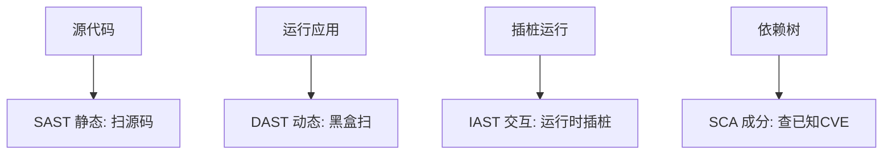
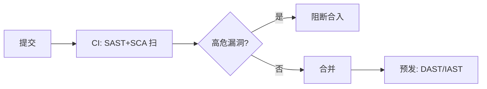

# 04 · 安全测试方法论

> 漏洞写出来了，怎么"测出来"？这一篇讲安全测试的四种形态（SAST/DAST/IAST/SCA）、模糊测试、渗透测试，以及如何把它们接进 CI 成为**安全门禁**。

---

## 一、安全测试的四种形态

| 形态 | 全称 | 怎么测 | 优点 | 缺点 |
|------|------|--------|------|------|
| **SAST** | Static AST | 扫源码/字节码找漏洞模式 | 早期、覆盖全、无运行 | 误报多 |
| **DAST** | Dynamic AST | 黑盒扫运行中的应用 | 真实、无需源码 | 晚、漏逻辑漏洞 |
| **IAST** | Interactive AST | 运行时插桩，结合流量 | 准、低误报 | 需 agent、重 |
| **SCA** | Software Composition Analysis | 查第三方依赖的已知 CVE | 防供应链攻击 | 只管已知漏洞 |

> **组合**：SAST（写代码时）+ SCA（依赖）进 CI 左移；DAST/IAST 在预发/准生产扫运行态。

---

## 二、SCA：供应链安全（OWASP A06/A08）

> 现代应用 80%+ 代码来自依赖。一个有 CVE 的库（如 Log4j）就能打穿。

- 工具：OWASP Dependency-Check、Snyk、Trivy（镜像）；
- 实践：**CI 卡高危 CVE**、SBOM（软件物料清单）留存、定期更新；
- 与 [测试·安全门禁](../测试与代码质量/07-质量门禁度量与持续测试.md) 联动。

---

## 三、模糊测试（Fuzzing）：主动喂畸形输入

> 与其手想攻击向量，不如让工具自动生成海量随机/畸形输入，看程序崩不崩。

| 工具 | 语言/场景 |
|------|-----------|
| AFL / libFuzzer | C/C++ 原生 |
| jazzer | JVM |
| go-fuzz | Go |
| Atheris | Python |

价值：发现**崩溃/内存破坏/未处理异常**——这类漏洞手测极难覆盖。

---

## 四、渗透测试（Penetration Test）

人工/工具模拟真实攻击者：
- **黑盒**：不知内部，纯外部打；
- **白盒**：给源码，深入；
- **灰盒**：部分信息；
- 产出：漏洞报告 + 修复建议 + 复测。

> 与 [测试·混沌工程](../测试与代码质量/08-测试数据Mock服务与混沌工程.md) 区别：混沌测"可用性韧性"，渗透测"安全性突破"。

---

## 五、安全门禁：把安全接进 CI

门禁项（参考 [测试·质量门禁](../测试与代码质量/07-质量门禁度量与持续测试.md)）：
- SAST 高危项 = 0；
- SCA 高危 CVE = 0；
- 密钥泄露扫描（别把 AK/SK 提交进库，用 [CI/CD·密钥管理](../基础知识/CI-CD/12-环境配置与密钥管理.md)）；
- DAST 在预发兜底。

---

## 六、反模式

| 反模式 | 危害 |
|--------|------|
| 只做 DAST（上线前才测） | 晚、贵、改不动 |
| 忽视依赖 CVE | 供应链被打穿（Log4j 教训） |
| SAST 误报全忽略 | 真漏洞也被关 |
| 密钥提交明文 | 仓库即泄露源 |

---

## 七、Cheat Sheet

| 主题 | 要点 |
|------|------|
| 四形态 | SAST 早、DAST 真、IAST 准、SCA 管依赖 |
| SCA | CI 卡 CVE、SBOM、防供应链 |
| Fuzzing | 自动畸形输入找崩溃 |
| 渗透 | 黑/白/灰盒模拟攻击 |
| 门禁 | SAST+SCA 卡合入；DAST 预发兜底；防密钥泄露 |

> 下一篇：[05 数据安全与密码学基础](05-数据安全与密码学基础.md) —— 数据怎么加密、密钥怎么管、敏感信息怎么脱敏合规。
