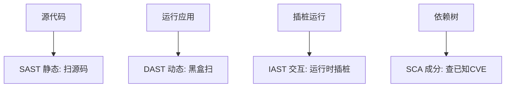
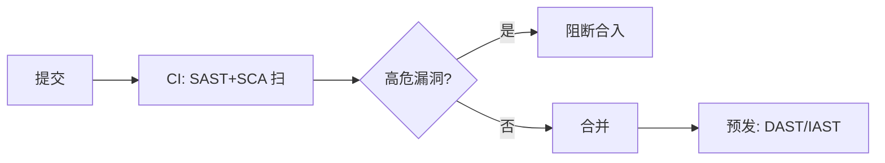

# 04 · 安全测试方法论

> 漏洞写出来了，怎么"测出来"？这一篇讲安全测试的四种形态（SAST/DAST/IAST/SCA）、模糊测试、渗透测试，以及如何把它们接进 CI 成为**安全门禁**。

---

## 一、安全测试的四种形态



| 形态 | 全称 | 怎么测 | 优点 | 缺点 |
|------|------|--------|------|------|
| **SAST** | Static AST | 扫源码/字节码找漏洞模式 | 早期、覆盖全、无运行 | 误报多 |
| **DAST** | Dynamic AST | 黑盒扫运行中的应用 | 真实、无需源码 | 晚、漏逻辑漏洞 |
| **IAST** | Interactive AST | 运行时插桩，结合流量 | 准、低误报 | 需 agent、重 |
| **SCA** | Software Composition Analysis | 查第三方依赖的已知 CVE | 防供应链攻击 | 只管已知漏洞 |

> **组合**：SAST（写代码时）+ SCA（依赖）进 CI 左移；DAST/IAST 在预发/准生产扫运行态。

---

## 二、SCA：供应链安全（OWASP A06/A08）

> 现代应用 80%+ 代码来自依赖。一个有 CVE 的库（如 Log4j）就能打穿。

- 工具：OWASP Dependency-Check、Snyk、Trivy（镜像）；
- 实践：**CI 卡高危 CVE**、SBOM（软件物料清单）留存、定期更新；
- 与 [测试·安全门禁](../测试与代码质量/07-质量门禁度量与持续测试.md) 联动。

---

## 三、模糊测试（Fuzzing）：主动喂畸形输入

> 与其手想攻击向量，不如让工具自动生成海量随机/畸形输入，看程序崩不崩。

| 工具 | 语言/场景 |
|------|-----------|
| AFL / libFuzzer | C/C++ 原生 |
| jazzer | JVM |
| go-fuzz | Go |
| Atheris | Python |

价值：发现**崩溃/内存破坏/未处理异常**——这类漏洞手测极难覆盖。

---

## 四、渗透测试（Penetration Test）

人工/工具模拟真实攻击者：
- **黑盒**：不知内部，纯外部打；
- **白盒**：给源码，深入；
- **灰盒**：部分信息；
- 产出：漏洞报告 + 修复建议 + 复测。

> 与 [测试·混沌工程](../测试与代码质量/08-测试数据Mock服务与混沌工程.md) 区别：混沌测"可用性韧性"，渗透测"安全性突破"。

---

## 五、安全门禁：把安全接进 CI



门禁项（参考 [测试·质量门禁](../测试与代码质量/07-质量门禁度量与持续测试.md)）：
- SAST 高危项 = 0；
- SCA 高危 CVE = 0；
- 密钥泄露扫描（别把 AK/SK 提交进库，用 [CI/CD·密钥管理](../基础知识/CI-CD/12-环境配置与密钥管理.md)）；
- DAST 在预发兜底。

---

## 六、深挖：工具落地清单与红蓝视角

### 6.1 常用工具速查（按形态）

| 形态 | 开源工具 | 商业化 | 何时跑 |
|------|----------|--------|--------|
| SAST | SpotBugs、Semgrep、ESLint 安全规则 | Fortify、Checkmarx | 每次 commit/PR |
| SCA | OWASP Dependency-Check、Trivy、Grype | Snyk、Black Duck | CI 每构建 |
| DAST | OWASP ZAP、Nikto | Burp Suite Pro、AppScan | 预发周期 |
| IAST | Contrast Community | Contrast、Seeker | 测试环境常驻 |
| 密钥扫描 | gitleaks、trufflehog | — | 每次 commit |
| Fuzzing | AFL++、jazzer、go-fuzz | — | 专项/协议解析器 |

### 6.2 Fuzzing 工作流

```
种子输入 → 变异器(bit flip/拼接/字典) → 被测程序(插桩) → 崩溃/超时/泄漏?
    ↑                                                        │
    └──────── 新覆盖路径的输入加入语料库 ←────────────────────┘
```

- 核心是**覆盖率引导**：只有能触发新代码路径的输入才保留，越走越深；
- JVM 用 **jazzer**（可查 OOM、NullPointer、反序列化异常）；
- 重点对象：协议解析、JSON/XML 解析、正则、命令拼接处。

### 6.3 红队 vs 蓝队（组织视角）

| 角色 | 职责 | 产出 |
|------|------|------|
| 红队 | 模拟真实攻击者找漏洞/突破口 | 攻击报告、突破路径 |
| 蓝队 | 监测、响应、加固 | 告警有效、响应时效 |
| 紫队 | 红蓝联动复盘 | 检测缺口清单、改进项 |

> 攻防演练的本质：**不是测"有没有漏洞"，而是测"发现和响应速度"**。

---

## 七、反模式

| 反模式 | 危害 |
|--------|------|
| 只做 DAST（上线前才测） | 晚、贵、改不动 |
| 忽视依赖 CVE | 供应链被打穿（Log4j 教训） |
| SAST 误报全忽略 | 真漏洞也被关 |
| 密钥提交明文 | 仓库即泄露源 |

---

## 八、面试高频追问（12+ 条）

1. Q：SAST 和 DAST 区别？ A：SAST 扫源码（白盒、早、误报多）；DAST 扫运行态（黑盒、真、晚）。
2. Q：IAST 为什么误报低？ A：运行时插桩结合真实流量/污点分析，能确认数据流真的到危险函数。
3. Q：SCA 只能查已知漏洞吗？ A：是，靠 CVE 库比对；逻辑漏洞/0day 查不到，需配合 SAST/DAST。
4. Q：Log4j 事件启示？ A：供应链风险——依赖也要进 CI 扫描、关注社区告警、SBOM 留档。
5. Q：Fuzzing 为什么有效？ A：自动化生成海量畸形输入，覆盖手测不到的崩溃路径（内存破坏/异常）。
6. Q：安全门禁卡什么？ A：SAST 高危=0、SCA 高危 CVE=0、密钥扫描=0；中危可超时升级。
7. Q：渗透测试分哪几种？ A：黑盒（纯外部）、白盒（给源码）、灰盒（部分信息）；产出=漏洞报告+复测。
8. Q：SBOM 是什么？ A：软件物料清单，记录依赖及版本，用于快速定位受影响组件（应急响应用）。
9. Q：安全测试和普通测试关系？ A：普通测功能/质量，安全测"被恶意使用"；门禁体系可共用 CI 通道。
10. Q：密钥扫描放哪个阶段？ A：commit 钩子（gitleaks）+ CI 双保险，防 AK/SK 入库。
11. Q：0day 怎么防？ A：防不了事前，靠纵深防御+监控（WAF 规则、异常检测）+快速回滚预案。
12. Q：测试环境要不要安全测试？ A：要，IAST/Fuzzing 在测试环境成本最低，越早发现越便宜。
13. Q：误报太多怎么处理？ A：SAST 规则收敛+白名单化，重点保"真高危"；定期复查被忽略项。
14. Q：DAST 能不能替代渗透测试？ A：不能，DAST 是工具自动化，渗透有人工业务逻辑挖掘，互补。

---

## 九、Cheat Sheet

| 主题 | 要点 |
|------|------|
| 四形态 | SAST 早、DAST 真、IAST 准、SCA 管依赖 |
| SCA | CI 卡 CVE、SBOM、防供应链 |
| Fuzzing | 自动畸形输入找崩溃 |
| 渗透 | 黑/白/灰盒模拟攻击 |
| 门禁 | SAST+SCA 卡合入；DAST 预发兜底；防密钥泄露 |

> 下一篇：[05 数据安全与密码学基础](05-数据安全与密码学基础.md) —— 数据怎么加密、密钥怎么管、敏感信息怎么脱敏合规。
