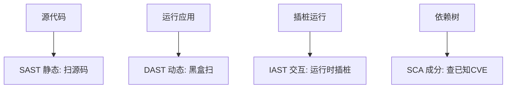
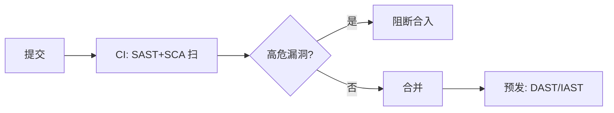
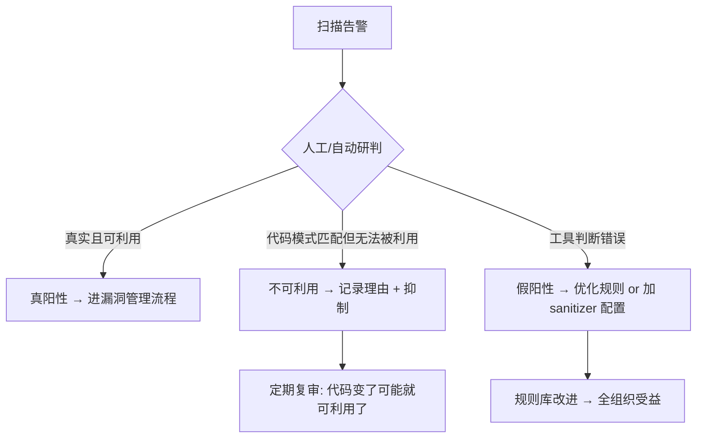
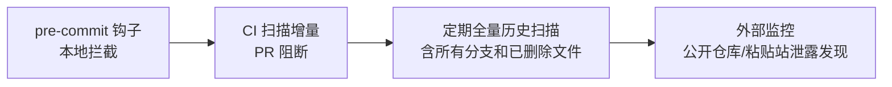
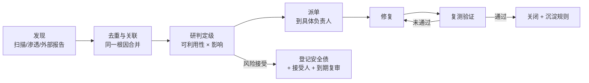

# 04 · 安全测试方法论

> 漏洞写出来了，怎么"测出来"？这一篇讲安全测试的四种形态（SAST/DAST/IAST/SCA）、模糊测试、渗透测试，以及如何把它们接进 CI 成为**安全门禁**。

---

## 一、安全测试的四种形态



| 形态 | 全称 | 怎么测 | 优点 | 缺点 |
|------|------|--------|------|------|
| **SAST** | Static AST | 扫源码/字节码找漏洞模式 | 早期、覆盖全、无运行 | 误报多 |
| **DAST** | Dynamic AST | 黑盒扫运行中的应用 | 真实、无需源码 | 晚、漏逻辑漏洞 |
| **IAST** | Interactive AST | 运行时插桩，结合流量 | 准、低误报 | 需 agent、重 |
| **SCA** | Software Composition Analysis | 查第三方依赖的已知 CVE | 防供应链攻击 | 只管已知漏洞 |

> **组合**：SAST（写代码时）+ SCA（依赖）进 CI 左移；DAST/IAST 在预发/准生产扫运行态。

---

## 二、SCA：供应链安全（OWASP A06/A08）

> 现代应用 80%+ 代码来自依赖。一个有 CVE 的库（如 Log4j）就能打穿。

- 工具：OWASP Dependency-Check、Snyk、Trivy（镜像）；
- 实践：**CI 卡高危 CVE**、SBOM（软件物料清单）留存、定期更新；
- 与 [测试·安全门禁](../测试与代码质量/07-质量门禁度量与持续测试.md) 联动。

---

## 三、模糊测试（Fuzzing）：主动喂畸形输入

> 与其手想攻击向量，不如让工具自动生成海量随机/畸形输入，看程序崩不崩。

| 工具 | 语言/场景 |
|------|-----------|
| AFL / libFuzzer | C/C++ 原生 |
| jazzer | JVM |
| go-fuzz | Go |
| Atheris | Python |

价值：发现**崩溃/内存破坏/未处理异常**——这类漏洞手测极难覆盖。

---

## 四、渗透测试（Penetration Test）

人工/工具模拟真实攻击者：
- **黑盒**：不知内部，纯外部打；
- **白盒**：给源码，深入；
- **灰盒**：部分信息；
- 产出：漏洞报告 + 修复建议 + 复测。

> 与 [测试·混沌工程](../测试与代码质量/08-测试数据Mock服务与混沌工程.md) 区别：混沌测"可用性韧性"，渗透测"安全性突破"。

---

## 五、安全门禁：把安全接进 CI



门禁项（参考 [测试·质量门禁](../测试与代码质量/07-质量门禁度量与持续测试.md)）：
- SAST 高危项 = 0；
- SCA 高危 CVE = 0；
- 密钥泄露扫描（别把 AK/SK 提交进库，用 [CI/CD·密钥管理](../基础知识/CI-CD/12-环境配置与密钥管理.md)）；
- DAST 在预发兜底。

---

## 六、深挖：工具落地清单与红蓝视角

### 6.1 常用工具速查（按形态）

| 形态 | 开源工具 | 商业化 | 何时跑 |
|------|----------|--------|--------|
| SAST | SpotBugs、Semgrep、ESLint 安全规则 | Fortify、Checkmarx | 每次 commit/PR |
| SCA | OWASP Dependency-Check、Trivy、Grype | Snyk、Black Duck | CI 每构建 |
| DAST | OWASP ZAP、Nikto | Burp Suite Pro、AppScan | 预发周期 |
| IAST | Contrast Community | Contrast、Seeker | 测试环境常驻 |
| 密钥扫描 | gitleaks、trufflehog | — | 每次 commit |
| Fuzzing | AFL++、jazzer、go-fuzz | — | 专项/协议解析器 |

### 6.2 Fuzzing 工作流

```
种子输入 → 变异器(bit flip/拼接/字典) → 被测程序(插桩) → 崩溃/超时/泄漏?
    ↑                                                        │
    └──────── 新覆盖路径的输入加入语料库 ←────────────────────┘
```

- 核心是**覆盖率引导**：只有能触发新代码路径的输入才保留，越走越深；
- JVM 用 **jazzer**（可查 OOM、NullPointer、反序列化异常）；
- 重点对象：协议解析、JSON/XML 解析、正则、命令拼接处。

### 6.3 红队 vs 蓝队（组织视角）

| 角色 | 职责 | 产出 |
|------|------|------|
| 红队 | 模拟真实攻击者找漏洞/突破口 | 攻击报告、突破路径 |
| 蓝队 | 监测、响应、加固 | 告警有效、响应时效 |
| 紫队 | 红蓝联动复盘 | 检测缺口清单、改进项 |

> 攻防演练的本质：**不是测"有没有漏洞"，而是测"发现和响应速度"**。

---

## 七、反模式

| 反模式 | 危害 |
|--------|------|
| 只做 DAST（上线前才测） | 晚、贵、改不动 |
| 忽视依赖 CVE | 供应链被打穿（Log4j 教训） |
| SAST 误报全忽略 | 真漏洞也被关 |
| 密钥提交明文 | 仓库即泄露源 |

---

## 八、面试高频追问（12+ 条）

1. Q：SAST 和 DAST 区别？ A：SAST 扫源码（白盒、早、误报多）；DAST 扫运行态（黑盒、真、晚）。
2. Q：IAST 为什么误报低？ A：运行时插桩结合真实流量/污点分析，能确认数据流真的到危险函数。
3. Q：SCA 只能查已知漏洞吗？ A：是，靠 CVE 库比对；逻辑漏洞/0day 查不到，需配合 SAST/DAST。
4. Q：Log4j 事件启示？ A：供应链风险——依赖也要进 CI 扫描、关注社区告警、SBOM 留档。
5. Q：Fuzzing 为什么有效？ A：自动化生成海量畸形输入，覆盖手测不到的崩溃路径（内存破坏/异常）。
6. Q：安全门禁卡什么？ A：SAST 高危=0、SCA 高危 CVE=0、密钥扫描=0；中危可超时升级。
7. Q：渗透测试分哪几种？ A：黑盒（纯外部）、白盒（给源码）、灰盒（部分信息）；产出=漏洞报告+复测。
8. Q：SBOM 是什么？ A：软件物料清单，记录依赖及版本，用于快速定位受影响组件（应急响应用）。
9. Q：安全测试和普通测试关系？ A：普通测功能/质量，安全测"被恶意使用"；门禁体系可共用 CI 通道。
10. Q：密钥扫描放哪个阶段？ A：commit 钩子（gitleaks）+ CI 双保险，防 AK/SK 入库。
11. Q：0day 怎么防？ A：防不了事前，靠纵深防御+监控（WAF 规则、异常检测）+快速回滚预案。
12. Q：测试环境要不要安全测试？ A：要，IAST/Fuzzing 在测试环境成本最低，越早发现越便宜。
13. Q：误报太多怎么处理？ A：SAST 规则收敛+白名单化，重点保"真高危"；定期复查被忽略项。
14. Q：DAST 能不能替代渗透测试？ A：不能，DAST 是工具自动化，渗透有人工业务逻辑挖掘，互补。

---

## 九、Cheat Sheet

| 主题 | 要点 |
|------|------|
| 四形态 | SAST 早、DAST 真、IAST 准、SCA 管依赖 |
| SCA | CI 卡 CVE、SBOM、防供应链 |
| Fuzzing | 自动畸形输入找崩溃 |
| 渗透 | 黑/白/灰盒模拟攻击 |
| 门禁 | SAST+SCA 卡合入；DAST 预发兜底；防密钥泄露 |

> 下一篇：[05 数据安全与密码学基础](05-数据安全与密码学基础.md) —— 数据怎么加密、密钥怎么管、敏感信息怎么脱敏合规。

---

## 十、DAST 深入：认证态、爬虫与误报调优

DAST 是黑盒，难点不在"扫"而在"扫得准"：

| 难点 | 对策 |
|------|------|
| 登录态维持 | 配置登录脚本/会话池，避免扫一半掉登录 |
| SPA/JS 渲染 | 用带 headless 浏览器的扫描器（ZAP ajax spider / 商业） |
| 误报（假阳性） | 人工确认 + 写排除规则；按"是否可达危险函数"二次研判 |
| 生产环境风险 | DAST 只在预发/准生产跑，禁止打生产 |
| 覆盖率低 | 先跑一遍核心业务流程造流量，再让 DAST 复用流量 |


---

## 十一、IAST 原理：污点追踪（Taint Tracking）

IAST 误报低，核心是**运行时污点分析**：

```
污点源(Source)：用户输入/HTTP 参数/Header
   ↓ 标记
传播(Propagation)：污点经字符串拼接/函数调用流动
   ↓
污点汇(Sink)：SQL 执行/命令执行/反序列化/输出
   ↓
告警：当且仅当污点真的到达 Sink，且未被净化(Sanitizer)
```

- 与 SAST 区别：SAST 只看代码路径（可能不可达），IAST 看**真实流量**触发的可达路径；
- 与 DAST 区别：DAST 只看响应，IAST 知道"内部有没有危险调用"；
- 代价：需在应用内挂 agent（Java 用 bytecode 插桩），对性能/兼容性有要求。

---

## 十二、SCA 深入：依赖树解析与 EPSS

SCA 不只是"比对版本号"：

1. **依赖树解析**：Maven/Gradle/npm/go mod 各有锁文件（go.sum、package-lock.json、yarn.lock）。SCA 要解析**传递依赖**（A→B→C，漏洞在 C）；
2. **CVE 匹配**：用 purl（Package URL）唯一标识组件，去 NVD/GitHub Advisory/OSV 匹配；
3. **可达性分析（新一代）**：漏洞函数是否真的被调用？未被调用可降权处理；
4. **EPSS（漏洞利用预测）**：NVD 给 CVSS（严重程度），EPSS 给"未来 30 天被利用的概率"——**优先修 EPSS 高 + CVSS 高**的组合；
5. **许可证合规**：GPL/LGPL/AGPL 传染风险，商业闭源项目要拦截。

> 与 [06 供应链安全与 SBOM](06-供应链安全与SBOM.md) 一体：SCA 是 SBOM 的消费方之一。

---

## 十三、模糊测试实战（覆盖率引导）

### 13.1 jazzer 示例（JVM）

```java
// 被测函数：解析不可信输入
public class JsonParser {
    public static void parse(byte[] input) {
        // 若输入触发异常未捕获 → jazzer 报告
        MyJson.read(new String(input, UTF_8));
    }
}
// 编译后用 jazzer 跑：
// ./jazzer --cp=target/classes --target_class=JsonParser --jvm_args=-Xmx1g
// 崩溃输入自动保存到 crashes/ 目录
```

### 13.2 何时上 Fuzzing

| 场景 | 适合度 |
|------|--------|
| 协议/文件解析器（JSON/XML/压缩/编解码） | ★★★★★ 必须 |
| 命令/正则拼接处 | ★★★★ |
| 纯 CRUD 业务 | ★★ 收益低，优先 SAST+逻辑测试 |

> 覆盖率引导（coverage-guided）是关键：只有触发新路径的用例才保留，越跑越深。这点与混沌工程的"探索系统边界"精神一致（见 [测试·混沌工程](../测试与代码质量/08-测试数据Mock服务与混沌工程.md)）。

---

## 十四、渗透测试方法论（OWASP WSTG）

专业渗透不是"拿工具扫一遍"，而是结构化流程：

```
1. 信息收集：子域/端口/技术栈/泄露文件
2. 配置与部署管理：敏感目录/错误页/TLS 配置
3. 身份管理：注册/登录/会话/越权
4. 输入输出：注入/XSS/SSRF/反序列化
5. 业务逻辑：并发/越权/重放
6. 客户端：CORS/点击劫持/POST 重定向
7. 报告：复现步骤 + PoC + 影响 + 修复建议 + 复测
```

**报告模板关键字段**：
- 漏洞名称 / OWASP 分类 / CVSS 评分；
- 复现步骤（curl/截图）；
- 影响范围（能否拖库/提权）；
- 修复建议（给代码级而非"请修复"）。

---

## 十五、安全门禁工程化（CI 实例）

### 15.1 GitHub Actions 门禁

```yaml
jobs:
  security:
    runs-on: ubuntu-latest
    steps:
      - uses: actions/checkout@v4
      - name: SAST (Semgrep)
        run: semgrep --config auto --error # 高危即非零退出
      - name: 密钥扫描 (gitleaks)
        uses: gitleaks/gitleaks-action@v2
      - name: SCA (Trivy fs)
        run: trivy fs --severity CRITICAL,HIGH --exit-code 1 .
      - name: 构建镜像并扫
        run: |
          docker build -t myapp:ci .
          trivy image --exit-code 1 --severity CRITICAL,HIGH myapp:ci
```

### 15.2 门禁的"度"

| 设置 | 风险 |
|------|------|
| 门禁过严（中危也阻断） | 开发者绕过/关告警，真高危也被淹没 |
| 门禁过松（只告警） | 长期无人修，形同虚设 |
| 不区分环境 | 开发分支卡死迭代 |

> 推荐：**CI 阻断 Critical/High（SAST+SCA）+ 密钥泄露零容忍**；中危进 Issue 排期；预发 DAST 兜底。密钥管理细节见 [CI/CD·密钥管理](../基础知识/CI-CD/12-环境配置与密钥管理.md)。

---

## 十六、安全度量指标

不度量就无法改进。建议跟踪：

| 指标 | 含义 | 目标 |
|------|------|------|
| 漏洞密度 | 每千行高危漏洞数 | 持续下降 |
| 漏洞修复 MTTR | 发现到修复的时长 | P0 < 24h |
| 门禁通过率 | 首次提交即过门禁比例 | 上升 |
| 依赖新鲜度 | 过期 >180 天依赖占比 | 下降 |
| SBOM 覆盖率 | 有 SBOM 的制品比例 | 100% |
| 误报率 | SAST 误报占比 | 收敛 |

---

## 十七、踩坑实录与误区

1. **SAST 误报全忽略**：规则仓库关掉后，真漏洞也一起没了。应"收敛规则 + 白名单 + 定期复审被忽略项"。
2. **只在预发 DAST**：上线后改造成本高。应在 CI 左移（SAST/SCA 每次提交）。
3. **把 SCA 当银弹**：只能查已知 CVE，逻辑漏洞/0day 查不到。
4. **渗透测试走过场**：只交工具报告不交业务漏洞。业务漏洞靠人挖。
5. **密钥扫描只在 CI**：历史提交里早有 AK/SK。要扫全量历史（`gitleaks detect --no-git`）。

---

## 十八、延伸与面试框架

**答"如何保障应用安全"的框架**：
1. **左移**：设计期威胁建模（[01](../安全工程/01-应用安全基础与威胁建模.md)）；
2. **写码**：参数化/转义/校验（[03](../安全工程/03-常见Web安全漏洞与防护.md)）；
3. **测出**：SAST/DAST/IAST/SCA/Fuzzing（本篇）+ 门禁；
4. **护数据**：加密/脱敏/密钥（[05](../安全工程/05-数据安全与密码学基础.md)）；
5. **供应链**：SBOM/签名（[06](../安全工程/06-供应链安全与SBOM.md)）；
6. **架构**：零信任（[07](../安全工程/07-零信任架构.md)）。

> **本篇口诀**：四态互补——SAST 早、DAST 真、IAST 准、SCA 管依赖；Fuzzing 喂畸形找崩溃，门禁卡高危进 CI；渗透挖逻辑，度量看 MTTR。

---

## 十九、一个 PR 的安全检查全链路（实战视图）

把前面所有手段串成一条可见的流水线，开发者每次提交都"无形被保护"：

```mermaid
graph LR
    A[git push] --> B[pre-commit: gitleaks 扫密钥 + 本地 SAST]
    B --> C[PR: SAST + SCA + 依赖License]
    C -->|高危阻断| Z[打回修改]
    C -->|通过| D[CI 构建: 生成 SBOM + 镜像扫 + 签名]
    D --> E[预发: DAST + IAST 跑核心链路]
    E -->|通过| F[人工渗透(周期/重大变更)]
    F --> G[发布 + 运行时持续扫]
```

**开发者视角**：大部分问题在 pre-commit / PR 阶段就拦下，到不了预发；只有中危和逻辑漏洞留给渗透。这正是 [总览·DevSecOps](../安全工程/安全工程总览.md) 讲的"安全织进流水线"。

**成本取舍**：小团队先上 `gitleaks + Semgrep + Trivy` 三件套（全开源、零费用），再逐步补 DAST/IAST。详见 [CI/CD·DevSecOps](../基础知识/CI-CD/13-可观测性DORA度量与DevSecOps.md)。

---

## 二十、SAST 原理：为什么它既漏报又误报

理解 SAST 的能力边界，才能知道该期待什么、不该期待什么。SAST 的实现是分层演进的：

| 层次 | 技术 | 能发现 | 局限 |
|------|------|--------|------|
| L1 正则匹配 | 文本模式 | `eval(`、`md5(`、硬编码密钥 | 完全不懂语法，噪音巨大 |
| L2 AST 匹配 | 抽象语法树模式 | "调用了 `Runtime.exec` 且参数是拼接表达式" | 不跟踪数据流，不知道参数从哪来 |
| L3 数据流 / 污点分析 | Source → Propagation → Sink | "HTTP 参数经过三层函数调用最终进了 SQL" | 跨文件/跨框架时精度下降 |
| L4 符号执行 / 约束求解 | 路径可行性求解 | "这条路径实际可达且条件可满足" | 计算量大，路径爆炸 |

### 20.1 污点分析的三个要素

```
Source（污点源）：request.getParameter()、@RequestParam、消息体、文件内容、
                  以及——从数据库/缓存读出来的用户可控数据（最常被漏配的一类）
Propagator（传播）：字符串拼接、集合装载、DTO 赋值、序列化/反序列化
Sanitizer（净化）：参数化绑定、白名单校验、编码转义
Sink（污点汇）：Statement.execute、Runtime.exec、ObjectInputStream.readObject、
               response.getWriter().write、new File(path)、HTTP 客户端 URL 参数
```

**误报的三大来源**：

| 误报原因 | 例子 | 处理 |
|----------|------|------|
| 净化器未被识别 | 团队自己写的 `SqlSafeUtil.escape()`，工具不认识 | 配置自定义 sanitizer |
| 路径不可达 | 危险代码在 `if (DEBUG_MODE)` 分支里 | 人工研判，或用 IAST 确认可达性 |
| 框架魔法 | 依赖注入、AOP、反射调用导致调用链断裂 | 配置框架规则包 |

**漏报的三大来源**：

| 漏报原因 | 说明 |
|----------|------|
| 跨语言 / 跨进程边界 | 前端传给后端、服务 A 传给服务 B，污点链在 SAST 视野外断了 |
| 框架隐式调用 | 注解驱动、配置文件里的类名、SpEL 表达式 |
| **业务逻辑漏洞** | 越权、改价、并发——SAST 不知道业务规则，**根本性无法发现** |

> **最重要的认知**：**SAST 永远发现不了访问控制漏洞**（OWASP 排第一的那一类）。它不知道"这条订单该归谁"。所以 SAST 覆盖率再高，越权漏洞该有还是有——这类漏洞只能靠 [03 章的框架层数据权限下推](03-常见Web安全漏洞与防护.md) 从设计上消除，靠 20.5 节的自动化 Diff 测试来守护。

### 20.2 增量扫描：让 SAST 真正可用

存量代码库首次扫描出成百上千条告警，是门禁被关掉的头号原因。解法是**基线化 + 增量**：

```
1. 首次全量扫描 → 结果全部写入「基线（baseline）」，视为已知债务
2. 门禁只对「不在基线中的新增问题」阻断
3. 基线里的问题进专项治理，按优先级分批清理，清一批就从基线移除一批
4. 效果：主干始终是绿的，新增代码始终干净，存量债务单独管理
```

```bash
# Semgrep 的基线用法：只报告相对某个 commit 的新增问题
semgrep --config auto --baseline-commit $(git merge-base origin/main HEAD) --error
```

| 策略 | 效果 |
|------|------|
| 全量扫描 + 全量阻断 | 门禁永远红 → 被关掉 |
| 全量扫描 + 只告警 | 无人修 → 形同虚设 |
| **增量阻断 + 存量基线治理** | 门禁可维持，债务可见可控 |

> 这与 [SRE 错误预算](../SRE与稳定性工程/01-SRE理念与SLI-SLO-ErrorBudget.md) 的思路一致：**承认现状不完美，但严格控制"变得更差"**。

---

## 二十一、自定义规则：把团队的踩坑变成检查

通用规则集能覆盖 OWASP 常见项，但**团队特有的反模式只有自己写规则**。这是 SAST 投入产出比最高的部分——每次事故复盘的结论，都应该沉淀成一条规则。

### 21.1 Semgrep 规则示例

```yaml
rules:
  # 规则一：禁止字符串拼接 SQL（比通用规则更贴合本团队 API）
  - id: no-string-concat-sql
    languages: [java]
    severity: ERROR
    message: |
      禁止拼接 SQL。请使用 PreparedStatement 或 MyBatis #{} 占位符。
      排序字段等结构部分请走白名单枚举，参见 安全工程/03 第 19.2 节。
    patterns:
      - pattern-either:
          - pattern: $CONN.prepareStatement("..." + $X)
          - pattern: $STMT.executeQuery("..." + $X)
          - pattern: $STMT.executeUpdate("..." + $X)

  # 规则二：禁止 MyBatis XML 里对用户输入使用 ${}
  - id: mybatis-dollar-interpolation
    languages: [generic]
    paths:
      include: ["**/*Mapper.xml"]
    severity: WARNING
    message: "MyBatis ${} 为字符串拼接，存在注入风险；如为排序/列名请加白名单校验并标注豁免"
    pattern-regex: '\$\{[^}]+\}'

  # 规则三：签名/令牌比较必须用恒定时间（防时序侧信道）
  - id: use-constant-time-compare
    languages: [java]
    severity: ERROR
    message: "令牌/签名比较请用 MessageDigest.isEqual，避免时序侧信道（见 安全工程/05 第 24 章）"
    patterns:
      - pattern-either:
          - pattern: $SIG.equals($EXPECTED)
      - metavariable-regex:
          metavariable: $SIG
          regex: '(?i).*(token|signature|sign|hmac|mac|secret).*'

  # 规则四：禁止使用非安全随机源生成凭据
  - id: insecure-random-for-token
    languages: [java]
    severity: ERROR
    message: "凭据生成必须用 SecureRandom，不能用 java.util.Random（见 安全工程/05 第 23 章）"
    patterns:
      - pattern: new java.util.Random(...)

  # 规则五：团队特有——数据权限豁免注解必须有理由
  - id: data-scope-ignore-needs-reason
    languages: [java]
    severity: WARNING
    message: "@IgnoreDataScope 必须填写 reason 并经安全评审，否则可能引入越权"
    patterns:
      - pattern: "@IgnoreDataScope"
      - pattern-not: "@IgnoreDataScope(reason = \"...\")"
```

### 21.2 什么样的规则值得写

| 值得写 | 不值得写 |
|--------|----------|
| 事故复盘发现的具体反模式 | 通用规则集已覆盖的 |
| 团队自研安全工具的"必须使用"检查 | 纯代码风格问题（交给 linter） |
| 危险 API 的禁用清单（含内部 API） | 需要复杂数据流才能判断的（误报会很高） |
| 配置项的强制要求（如必须开启某开关） | 业务逻辑正确性（SAST 做不到） |

**规则质量的判断标准**：**误报率**。一条误报率高的规则会训练开发者"看到告警就忽略"，从而毒化整个门禁的可信度。新规则应先以 WARNING 级别观察一段时间，误报收敛后再升级为 ERROR 阻断。

### 21.3 抑制注释的规范

必须允许豁免，但豁免要留痕可审计：

```java
// nosemgrep: no-string-concat-sql
// 理由：此处拼接的是白名单校验后的列名，非用户输入；评审记录 SEC-1234
String sql = "select * from t order by " + whitelistedColumn;
```

| 抑制规范要求 | 原因 |
|-------------|------|
| 必须指定具体规则 ID | 裸 `nosemgrep` 会屏蔽该行所有规则，包括未来新增的 |
| 必须写理由 | 半年后没人知道为什么豁免 |
| 必须有评审记录编号 | 可追溯到是谁批准的 |
| 定期统计抑制数量 | 抑制数上涨是危险信号，说明规则不合理或有人在绕 |

---

## 二十二、误报治理工作流

误报治理不是"删告警"，而是一套有状态机的流程。

### 22.1 三态研判



**"不可利用"和"假阳性"必须区分开**：

| | 假阳性 | 不可利用 |
|---|--------|----------|
| 含义 | 工具理解错了代码 | 工具理解对了，但当前上下文无法利用 |
| 处理 | 改规则/配置，全局生效 | 单点抑制 + 记理由 |
| 风险 | 无 | **有**——代码一改可能就可利用了 |
| 是否需复审 | 不需要 | **需要**（代码变更时重新评估） |

把"不可利用"当"假阳性"处理是常见错误：规则被改宽后，其他地方真正可利用的同类问题也被一起放过了。

### 22.2 研判的效率技巧

| 技巧 | 说明 |
|------|------|
| 按 Sink 类型批量看 | 同一类 Sink 的告警研判逻辑相同，批量处理快得多 |
| 优先看"新增" | 新代码的告警最可能是真的，且改起来最便宜 |
| 用 IAST/DAST 交叉验证 | SAST 说有、IAST 也命中 → 高置信度真阳性 |
| 可达性优先 | 先看公网可达接口链路上的告警 |
| 建立"已知安全封装"清单 | 团队的安全工具类一次性配为 sanitizer，消掉大批误报 |

### 22.3 度量误报治理效果

| 指标 | 健康信号 |
|------|----------|
| 新增告警的真阳性率 | 上升（说明规则在收敛） |
| 抑制注释总数 | 平稳或下降（上涨说明规则不合理） |
| 基线债务数量 | 持续下降 |
| 从告警到研判的时长 | 短（积压意味着最终没人看） |
| 门禁首次通过率 | 上升 |

> **告警积压是最危险的状态**：它同时意味着"真漏洞躺在里面没人发现"和"团队已经放弃这个工具"。宁可减少规则数量、提高单条规则质量，也不要维持一个没人看的告警池。

---

## 二十三、密钥扫描工程化

密钥泄露是所有安全问题里**修复窗口最短、后果最直接**的一类——提交推送到远端的那一刻起就应视为已泄露。

### 23.1 两种检测思路

| 方法 | 原理 | 优点 | 缺点 |
|------|------|------|------|
| 正则/特征匹配 | 匹配已知格式（如带固定前缀的 API Key） | 精确，误报低 | 只能发现已知格式 |
| 熵检测 | 检测高随机性字符串 | 能发现未知格式 | 误报高（哈希、UUID、base64 资源都会命中） |

**实践**：以特征匹配为主（阻断），熵检测为辅（只告警不阻断）。同时——**给自己签发的密钥加固定可识别前缀**，让特征匹配能覆盖内部凭据（见 [05 第 23.2 节](05-数据安全与密码学基础.md)）。

### 23.2 三道防线



| 防线 | 覆盖 | 为什么不能少 |
|------|------|-------------|
| pre-commit | 提交前 | 成本最低，且**避免密钥进入 git 历史** |
| CI 增量 | 推送后 | pre-commit 可被 `--no-verify` 绕过 |
| 全量历史 | 所有历史提交 | 上述两道防线上线之前的存量泄露 |
| 外部监控 | 已泄露到外部 | 开发者用个人仓库/AI 工具/粘贴站导致的泄露 |

```bash
# 关键：扫描全部历史，而不只是当前工作区
gitleaks detect --source . --log-opts="--all"   # 扫所有分支的所有提交
gitleaks detect --no-git                        # 扫工作区文件（含未纳入 git 的）
```

### 23.3 已泄露的正确处置顺序

```
1. 【立即】轮换密钥 —— 这是第一步，不是最后一步
2. 【立即】审计该密钥的使用记录（是否已被他人使用）
3. 【然后】才考虑清理 git 历史
4. 【最后】补检测（为什么没被拦住）
```

**为什么"轮换"必须排第一**：

| 常见错误做法 | 为什么错 |
|-------------|----------|
| 先删代码提交一版"移除密钥" | 历史里还在，且此时密钥仍然有效 |
| 先用 filter-repo 重写历史 | 耗时且需协调所有人重新 clone；期间密钥仍有效 |
| 认为"私有仓库所以没事" | 所有有仓库访问权的人都能看到；且仓库可能被 fork/镜像/误设为公开 |
| 认为"改了历史就安全了" | 平台可能仍有缓存的 commit 可访问；且已被爬取的无法收回 |

**核心认知**：**密钥一旦进入远端仓库，就必须假设已泄露。历史清理是卫生工作，轮换才是止血。**

### 23.4 从根上减少密钥数量

最好的密钥管理是**没有长期密钥**：

| 场景 | 消除长期密钥的方式 |
|------|-------------------|
| CI 访问云资源 | OIDC 联邦，换取临时凭据 |
| 服务访问数据库 | Vault 动态凭据（见 [05 第 18 章](05-数据安全与密码学基础.md)） |
| 服务间调用 | mTLS 工作负载身份（见 [07](07-零信任架构.md)） |
| 本地开发 | 本地专用的低权限凭据 + 短 TTL，绝不用生产凭据 |
| 制品签名 | keyless 签名（见 [06](06-供应链安全与SBOM.md)） |

> **密钥扫描是"止损"，减少密钥是"治本"**。一个已经没有长期密钥的系统，密钥扫描扫出来的东西自然就少了。

---

## 二十四、IaC 与配置安全扫描

代码里的漏洞会被扫，但**配置错误往往完全没人看**——而 OWASP A05 就是"安全配置错误"。云时代基础设施即代码，配置也应当被扫描。

### 24.1 扫描对象与常见问题

| 对象 | 工具方向 | 高频问题 |
|------|----------|----------|
| Terraform / CloudFormation | checkov、tfsec | 存储桶公开可读、安全组开 0.0.0.0/0、未开加密、未开日志 |
| Kubernetes 清单 / Helm | checkov、kube-linter | 特权容器、hostPath、无资源限制、以 root 运行、未设 readOnlyRootFilesystem |
| Dockerfile | hadolint、Trivy config | 用 latest、以 root 运行、装了不必要的工具、`ADD` 远程 URL |
| 集群运行态 | kube-bench、kubescape | 未启用 RBAC 最小化、匿名访问、etcd 未加密 |
| CI 配置 | 自定义规则 | 引用可变 tag、fork PR 有 secrets（见 [06 第 20 章](06-供应链安全与SBOM.md)） |

### 24.2 为什么配置扫描性价比极高

| 特点 | 说明 |
|------|------|
| 误报极低 | "安全组开了 0.0.0.0/0" 是事实判断，不需要数据流分析 |
| 修复成本极低 | 改一行配置，无需改代码逻辑 |
| 影响面大 | 一个公开的存储桶 = 直接数据泄露，无需任何攻击技巧 |
| 容易回归 | 配置容易被"临时改一下调试"然后忘记改回，扫描能持续守护 |

```yaml
# CI 中同时扫代码、依赖、配置、镜像
- name: IaC 扫描
  run: |
    checkov -d ./infra --framework terraform --compact \
            --hard-fail-on HIGH,CRITICAL
- name: K8s 清单扫描
  run: checkov -d ./deploy --framework kubernetes --hard-fail-on HIGH,CRITICAL
- name: Dockerfile 扫描
  run: trivy config --severity HIGH,CRITICAL --exit-code 1 ./Dockerfile
```

> **实操建议**：如果一个团队只能新增一项安全扫描，**IaC 扫描往往比 SAST 收益更高**——误报低、修复快、能直接防住"存储桶公开"这类零门槛数据泄露。但很多团队的顺序是先上 SAST 然后陷入误报治理，反而一直没做配置扫描。

---

## 二十五、API 安全测试：工具的最大盲区

现代系统以 API 为主，而 API 的高危漏洞恰好是自动化工具最难覆盖的。

### 25.1 API 特有的高危问题

| 问题 | 说明 | 工具能否发现 |
|------|------|-------------|
| **对象级授权失效（BOLA/IDOR）** | 换 ID 能拿别人数据 | ❌ 需要业务语义 |
| **属性级授权失效（BOPLA）** | 请求里多传一个 `role: admin` 就被赋值了（批量赋值） | ❌ |
| **无限资源消耗** | 分页不限上限、无限制的批量接口 | 部分 |
| **函数级授权失效** | 普通用户能调管理接口 | 部分（需知道角色） |
| **未记录的影子 API** | 老版本接口、调试接口仍在线 | 需资产发现 |
| **过度数据暴露** | 接口返回了完整用户对象（含手机号、内部字段） | 部分 |

### 25.2 批量赋值（Mass Assignment）测试

```java
// 危险：直接把请求体绑定到实体
@PutMapping("/user/profile")
public void update(@RequestBody User user) {  // User 含 role、balance、isVerified 字段
    userRepo.save(user);                       // 攻击者传 {"role":"ADMIN"} 就提权了
}

// 正确：用 DTO 白名单字段
@PutMapping("/user/profile")
public void update(@RequestBody ProfileUpdateDTO dto) {   // 只含 nickname、avatar
    User u = userRepo.findById(currentUserId());           // 归属从上下文取，不从请求取
    u.setNickname(dto.getNickname());
    u.setAvatar(dto.getAvatar());
    userRepo.save(u);
}
```

**测试方法**：拿到接口后，在请求体里**追加实体的敏感字段**（`role`、`status`、`balance`、`userId`、`tenantId`、`createdAt`），看是否被接受并生效。这是一个可以半自动化的测试：从数据库 schema 或实体类提取字段名，自动生成注入尝试。

### 25.3 过度数据暴露测试

```
方法：对每个接口的响应做字段级审查，问三个问题
  1. 这个字段前端真的用到了吗？（没用到就不该返回）
  2. 这个字段包含敏感信息吗？（手机号、身份证、内部 ID、状态机字段）
  3. 这个字段暴露了内部实现吗？（数据库主键、内部枚举值、内部服务地址）
```

常见问题：后端图省事直接返回实体对象，前端只显示昵称和头像，但响应里包含了手机号、邮箱、注册 IP、内部状态。**攻击者不需要越权——数据是接口主动给的**。

> 这类问题在有前端渲染时不明显（用户看不到），但 API 响应是明文可见的。**"前端不显示"不等于"没有泄露"**，这与 [03 章"前端隐藏按钮不算鉴权"](03-常见Web安全漏洞与防护.md) 是同一个错误的两种表现。

### 25.4 影子 API 与资产发现

```
来源：
  - 老版本接口（/v1 已废弃但仍在线，且缺少 /v2 的新增鉴权）
  - 调试/内部接口（/actuator、/debug、/internal、/swagger）
  - 前端不再调用但后端未删除的接口
  - 灰度实验留下的临时接口

发现方法：
  1. 从网关/接入层的访问日志聚合所有实际被访问的路径
  2. 与代码中注册的路由做 diff（代码有但日志没有 = 可能是影子）
  3. 与 API 文档做 diff（文档没有但代码有 = 未纳管）
  4. 主动探测常见调试路径
```

**为什么老版本接口特别危险**：新版本接口修了漏洞、加了鉴权，但老版本还在跑旧逻辑。攻击者只需换个路径前缀就绕过了所有新增防护。**接口下线必须真下线，不是"文档里删掉"**。

---

## 二十六、越权自动化测试的工程实现

第 [03 章 20.3 节](03-常见Web安全漏洞与防护.md) 讲了双账号 Diff 的思路，这里补充工程落地细节。

### 26.1 测试矩阵设计

| 维度 | 取值 |
|------|------|
| 主体 | 用户 A、用户 B（同角色不同数据）、低权角色 C、无凭据 D |
| 资源 | A 私有资源、B 私有资源、公共资源 |
| 操作 | 读、写、删、导出 |

**期望结果矩阵**：

| 主体 → 资源 | A 的资源 | B 的资源 | 公共资源 |
|---|---|---|---|
| **A** | 200 | **403/404** | 200 |
| **B** | **403/404** | 200 | 200 |
| **低权 C** | 403 | 403 | 200（若允许） |
| **无凭据 D** | 401 | 401 | 视设计 |

任何标粗的格子返回 200 就是漏洞。

### 26.2 实现要点

```
1. 流量来源：优先复用已有的 E2E/接口自动化测试的请求录制
   —— 不要另建一套，维护成本会导致它很快腐烂

2. 凭据替换：只换认证凭据，其他一切不变（含请求体里的 ID）
   —— 关键：不要让测试框架"聪明地"把请求体里的 ID 也换成 B 的，
      那样测的就不是越权了

3. 断言策略：
   - 403/404 → 通过（404 优于 403，不泄露资源存在性）
   - 200 且响应体与 A 的相同 → 失败（水平越权）
   - 200 但响应体是 B 自己的数据 → 通过（接口按当前用户过滤，设计正确）
   - 500 → 标记待查（可能是鉴权异常，也可能是新的攻击面）

4. 幂等性：写操作的越权测试会产生脏数据，需要独立测试数据集 + 清理
```

### 26.3 常见实现陷阱

| 陷阱 | 后果 |
|------|------|
| 测试账号 A、B 是同一个租户/同一组织 | 测不出跨租户越权 |
| 测试账号权限被设成一样 | 垂直越权测试形同虚设 |
| 只测 GET 不测写操作 | 越权删除/修改漏掉 |
| 断言只判 `status != 200` | 500 也被当成通过，掩盖问题 |
| 只覆盖有文档的接口 | 影子接口测不到 |
| 测试环境的鉴权配置与生产不同 | 测试通过但生产有洞（**最危险**） |

> 最后一条值得强调：**测试环境常为了方便而放宽鉴权**（关掉某个拦截器、给测试账号超级权限）。这会让整套越权测试完全失效。安全测试环境的鉴权配置必须与生产一致，这是前提条件而非可选项。

---

## 二十七、漏洞管理生命周期

工具产出的是"告警"，需要一套流程把它变成"被修复的漏洞"。没有这套流程，扫描就只是在生产垃圾。



### 27.1 去重与关联（最容易忽略的一步）

| 情况 | 处理 |
|------|------|
| 同一漏洞被 SAST 和 DAST 都报了 | 合并为一条，标注多来源（置信度更高） |
| 同一根因在 50 个文件里出现 | 合并为一个"根因工单"，而不是 50 个 |
| 同一依赖 CVE 影响 30 个服务 | 一个漏洞工单 + 30 个受影响资产，而不是 30 个漏洞 |
| 上次修过又复现 | 标记为"回归"，优先级提升，且必须补自动化用例 |

**不去重的后果**：漏洞数量虚高、优先级排序失真、修复者收到大量重复工单从而失去信任。

### 27.2 SLA 与定级

沿用 [03 章的双维度模型](03-常见Web安全漏洞与防护.md)（可利用性 × 影响），并补充**修复时限的实际约束**：

| 级别 | 时限 | 超时怎么办 |
|------|------|-----------|
| P0 | 24h（可先止血） | 升级到负责人上级；考虑临时下线功能 |
| P1 | 本迭代 | 进下个迭代必须排；累计超时触发评审 |
| P2 | 排期（如两个迭代内） | 转安全债务登记 |
| P3 | Backlog | 定期批量清理 |

**关键设计**：**允许"止血"和"根治"分开计时**。P0 要求 24 小时内"消除可利用性"（可以是 WAF 规则、关闭入口、加临时校验），根治可以排期。否则会出现"为了赶 SLA 而匆忙上线一个更危险的修复"。

### 27.3 复测与沉淀

| 动作 | 目的 |
|------|------|
| 复测（回归验证） | 确认真修好了，不是改了个表象 |
| 补自动化用例 | 防回归（重构时不再复发） |
| 沉淀 SAST 规则 | 防同类问题在别处再出现（见第二十一章） |
| 更新脚手架/公共库 | 从根上消除（见 [06 第 27 章](06-供应链安全与SBOM.md)） |

> **一个漏洞的修复价值 = 修复本身 + 防回归 + 防同类**。只做第一项的团队会发现同类漏洞反复出现；做全三项的团队漏洞密度会持续下降。**每次修复都应该问：怎么让这类问题不再出现第二次？**

---

## 二十八、安全测试的环境与数据

### 28.1 各类测试的环境选择

| 测试类型 | 环境 | 原因 |
|----------|------|------|
| SAST / SCA / 密钥扫描 / IaC | CI（无需运行环境） | 静态分析，成本最低 |
| 单元级安全测试 | CI | 如越权判断的单测 |
| IAST | 测试环境常驻 | 需要真实流量触发 |
| 越权 Diff 测试 | 测试/预发（鉴权配置须同生产） | 需要完整鉴权链路 |
| DAST | 预发 / 准生产 | **禁止打生产**（会造脏数据、可能触发限流告警） |
| Fuzzing | 独立环境 | 会造成崩溃，不能影响他人 |
| 渗透测试 | 预发为主，生产需严格授权与窗口 | 风险高 |

### 28.2 为什么"DAST 禁止打生产"

| 风险 | 说明 |
|------|------|
| 造脏数据 | 扫描器会提交表单、创建订单、发送消息 |
| 触发副作用 | 可能真的发出短信、真的扣款、真的删数据 |
| 拖垮性能 | 大量请求可能触发限流甚至打挂服务 |
| 污染告警 | 大量异常请求触发安全告警，消耗 On-call 精力（见 [SRE·告警](../SRE与稳定性工程/06-日志与告警规则库.md)） |
| 污染业务数据 | 埋点、报表、风控模型被测试流量污染 |

**若确实需要在生产做（如验证 WAF 规则）**：必须提前通知、限定时间窗口、限定 IP、限定 payload 类型、准备回滚、且**只做被动/只读检测**。

### 28.3 测试数据

| 要求 | 说明 |
|------|------|
| 生产数据必须脱敏后才可用于测试 | 见 [05 数据脱敏](05-数据安全与密码学基础.md) 与 [测试·TDM](../测试与代码质量/08-测试数据Mock服务与混沌工程.md) |
| 越权测试需要专门的账号矩阵 | A/B/低权/无凭据，且数据归属明确 |
| 测试账号不能有生产超级权限 | 常见错误：测试账号是管理员，测不出垂直越权 |
| 测试环境不得直连生产数据库 | 一条误操作 SQL 就是生产事故 |

---

## 二十九、安全测试成熟度与起步顺序

| 维度 | L1 | L2 | L3 | L4 |
|------|----|----|----|----|
| **静态检查** | 无 | 手工跑扫描 | CI 增量阻断 + 基线治理 | 自定义规则库 + 误报率下降 |
| **依赖与配置** | 无 | 偶尔扫 | CI 阻断高危 + IaC 扫描 | VEX 研判 + 可达性排序 |
| **密钥** | 无 | CI 扫增量 | pre-commit + CI + 全量历史 | 从根上减少长期密钥 |
| **动态测试** | 无 | 上线前人工点 | 预发 DAST 常态化 | IAST 常驻 + 流量回放 |
| **越权测试** | 无 | 人工抽查 | 自动化 Diff 进 CI | 全接口矩阵覆盖 |
| **漏洞管理** | 邮件/口头 | 有清单 | 有流程 + SLA | 去重关联 + 度量驱动 |
| **沉淀** | 修完就完 | 有复盘 | 补自动化用例 | 沉淀规则 + 改脚手架 |

### 29.1 起步顺序建议（按性价比排序）

```
1. 密钥扫描（pre-commit + CI + 全量历史）
   → 成本最低，防的是"提交即泄露"这种不可逆问题

2. SCA + 镜像扫描（阻断 Critical/High）
   → 依赖漏洞是最容易被自动化利用的

3. IaC / 配置扫描
   → 误报低、修复快，能直接防住"存储桶公开"这类零门槛泄露

4. SAST（增量阻断 + 基线）
   → 有价值但需要误报治理投入，放在有余力时

5. 越权自动化 Diff 测试
   → OWASP 排第一的漏洞，工具替代不了，但可自动化

6. 预发 DAST
   → 兜底，发现前面漏掉的运行时问题

7. IAST / Fuzzing / 人工渗透
   → 专项深挖，按业务风险决定投入
```

> 注意这个顺序里 **SAST 排在第 4 位而不是第 1 位**。原因是它的"误报治理成本"最高，如果团队还没有漏洞管理流程就先上 SAST，很可能第一周就产生几百条告警然后被永久忽略。**先上误报低、修复快的检查建立信任，再上需要研判的检查。**

---

## 三十、口诀汇总（扩展）

> **四形态互补**：SAST 早（但盲越权）、DAST 真（但晚且浅）、IAST 准（但需 agent）、SCA 管依赖（但只知已知）。
>
> **SAST 的铁律**：**它永远发现不了访问控制漏洞**——越权只能靠设计消除 + 自动化 Diff 守护。
>
> **门禁可维持的唯一姿势**：**增量阻断 + 存量基线**。全量阻断必被关掉，只告警必被忽略。
>
> **误报治理两分**：假阳性改规则（全局生效），不可利用记理由（需定期复审）。混为一谈会放过真漏洞。
>
> **密钥四步**：轮换 → 审计 → 清历史 → 补检测。**轮换排第一，清历史不是止血。**
>
> **配置扫描一句**：误报最低、修复最快、影响最大，却最常被跳过。
>
> **API 三查**：换 ID 能否拿别人数据（BOLA）、多传字段能否改不该改的（BOPLA）、响应里有没有前端根本不用的敏感字段（过度暴露）。
>
> **漏洞管理一句**：去重、定级、派单、复测、沉淀——**沉淀（规则 + 用例 + 脚手架）才是让漏洞密度真正下降的那一步。**
>
> **起步顺序**：先上误报低的（密钥、SCA、IaC）建立信任，再上需要研判的（SAST、DAST）。
