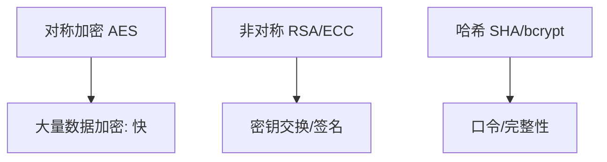
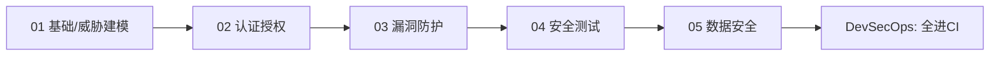

# 05 · 数据安全与密码学基础

> 应用安全的最终落点是"数据"——加密、脱敏、密钥管理、合规，是工程师绕不开的底线知识。这一篇用**工程视角**讲清密码学怎么用（不推导数学），以及数据全生命周期怎么护。

---

## 一、密码学三件套（工程选型）



| 类型 | 算法 | 用途 | 特点 |
|------|------|------|------|
| **对称** | AES-256 | 加密大块数据 | 快，但密钥分发难 |
| **非对称** | RSA / ECC | 密钥交换、数字签名 | 慢，解决"怎么安全给密钥" |
| **哈希** | SHA-256 / bcrypt / Argon2 | 摘要、口令存储 | 单向不可逆 |

> **经典组合**：非对称交换出"会话密钥" → 用对称加密通信（TLS 就是这个套路）。

---

## 二、口令存储：绝不存明文

```java
// 错误：明文/单向MD5（可彩虹表反查）
db.save(md5(password));
// 正确：加盐慢哈希（bcrypt/Argon2/SCrypt），自动含盐
String hash = BCrypt.hashpw(password, BCrypt.gensalt(12));
// 校验
BCrypt.checkpw(input, storedHash);
```

- 用 **bcrypt / Argon2 / scrypt**（慢哈希，抗暴力）；
- **加盐**（salt）防彩虹表；
- 不要用 MD5/SHA 直接哈希口令（太快，易暴力）。

---

## 三、TLS：传输加密

- HTTPS = HTTP + TLS，防中间人窃听/篡改；
- 用 **TLS 1.2+**（禁用 SSLv3/TLS 1.0/1.1）；
- 证书管理：自动续期（Let's Encrypt / cert-manager），避免过期导致中断；
- **HSTS** 防降级攻击。

---

## 四、密钥管理：密钥也是数据

> 最危险的不是加密算法，而是**密钥怎么存**。硬编码 AK/SK 进代码库 = 自杀。

| 实践 | 做法 |
|------|------|
| 别硬编码 | 用环境变量/密钥服务，参考 [CI/CD·密钥管理](../基础知识/CI-CD/12-环境配置与密钥管理.md) |
| KMS | 云密钥管理服务（AWS KMS / 阿里 KMS），密钥不落本地 |
| 轮换 | 定期轮换密钥，泄露影响可控 |
| 信封加密 | 数据密钥加密数据、主密钥加密数据密钥 |
| 防提交 | Git 预提交钩子 + SCA 扫描密钥泄露 |

---

## 四、深挖：TLS 握手与密钥管理实操

### 4.1 TLS 握手（为什么"慢但安全"）

```
客户端 ──ClientHello(支持算法)──▶ 服务器
服务器 ──ServerHello+证书(公钥)──▶ 客户端
客户端 验证证书链 → 生成 pre-master 密钥
客户端 ──用服务器公钥加密 pre-master──▶ 服务器
双方 用 pre-master 派生会话密钥 → 此后对称加密通信
```

- **非对称只用于握手交换密钥**，数据用 AES 对称加密——快且安全；
- 一连接一密钥（前向保密，mTLS 可验证客户端身份）；
- 证书链验证失败必须拒绝连接（防中间人伪造）。

### 4.2 信封加密（Envelope Encryption）落地

```
数据 ──(数据密钥DEK/AES)──▶ 密文落库
DEK ──(主密钥KEK/KMS)──▶ 信封(加密的DEK) 存库
解：KMS 解 DEK → DEK 解数据
```

- 好处：KEK 永不离开 KMS；DEK 可随数据泄露但无 KEK 无用；轮换只需换 KEK；
- 云厂商：AWS KMS / 阿里 KMS / Vault（自建 HashiCorp Vault）。

### 4.3 密钥轮换与泄露响应

| 场景 | 动作 |
|------|------|
| 定期轮换 | 云 KMS 自动轮换；自建按策略（季度/半年） |
| 泄露应急 | 立即吊销/轮换 → 审计泄露前日志 → 补检测（secret 扫描全库） |
| 双密钥过渡 | 新旧并行，流量灰度切新——避免一次性切换中断 |

---

## 五、数据脱敏与最小化

| 场景 | 做法 |
|------|------|
| 日志/展示 | 手机号/身份证掩码（138****8000） |
| 测试数据 | 生产脱敏后克隆（见 [测试·TDM](../测试与代码质量/08-测试数据Mock服务与混沌工程.md)） |
| 数据最小化 | 只收集必要字段，减少泄露面 |
| 加密存储 | 敏感字段（密码/证件/卡号）落库加密 |

> 与可观测性 [SRE·日志](../SRE与稳定性工程/02-可观测性与稳定性看护.md) 呼应：日志别打敏感信息，否则既不安全也不合规。

---

## 六、隐私合规

| 法规/框架 | 要点 |
|-----------|------|
| GDPR（欧盟） | 被遗忘权、数据出境、违规重罚 |
| 个人信息保护法（中国） | 告知同意、最小必要、境内存储 |
| PCI-DSS | 卡数据不落库、强加密 |

工程落地：同意管理、数据分类分级、出境评估、审计留痕。

---

## 七、反模式

| 反模式 | 危害 |
|--------|------|
| 明文存口令 | 拖库即全泄露 |
| 密钥硬编码进仓库 | 公开即泄露 |
| 自研加密算法 | 99% 有漏洞，用标准算法 |
| 用 MD5/SHA 存口令 | 易暴力/彩虹表 |
| TLS 1.0 仍启用 | 可被降级攻击 |

---

## 八、面试高频追问（12+ 条）

1. Q：为什么不用 RSA 直接加密数据？ A：非对称慢且密文膨胀（1024 位 RSA 加密上限 ~117 字节），大数据用对称 AES。
2. Q：TLS 里非对称/对称各干什么？ A：非对称交换会话密钥（前向保密），对称加密实际数据。
3. Q：口令为什么用慢哈希？ A：MD5/SHA 每秒可算亿次，暴力/彩虹表成本极低；bcrypt/Argon2 可调高成本因子。
4. Q：加盐的作用？ A：防彩虹表——相同口令产生不同哈希；盐要随机且与哈希同存。
5. Q：密钥能放代码里吗？ A：绝对不行；用环境变量/KMS/密钥服务，提交即泄露（历史记录难清除）。
6. Q：信封加密是什么？ A：DEK 加密数据、KMS 主密钥 KEK 加密 DEK；密钥与数据分离，轮换灵活。
7. Q：数据库字段加密会影响什么？ A：无法模糊查询/排序，需脱敏方案或专用加密检索方案；权衡后再做。
8. Q：脱敏和加密区别？ A：脱敏是变换数据形态（掩码）可逆性弱，用于展示/测试；加密可逆，用于存储/传输。
9. Q：HTTPS 全站强制的理由？ A：明文可被中间人窃听/篡改；HSTS 防降级到 http。
10. Q：GDPR 与个保法共同要求？ A：告知同意、数据最小化、出境评估、被遗忘/删除权、违规重罚。
11. Q：日志为什么不能打敏感字段？ A：日志是明文落盘，泄露面大且难清理；上 [SRE 日志](../SRE与稳定性工程/02-可观测性与稳定性看护.md) 前先脱敏。
12. Q：证书过期会怎样？ A：客户端校验失败直接拒绝——服务不可用；必须自动续期（cert-manager/Let's Encrypt）。
13. Q：如何验证口令存储方案安全？ A：成本因子+盐+标准库（BCrypt 12 轮≈百毫秒级）+ 不泄露哈希格式。
14. Q：测试数据从生产克隆怎么合规？ A：先脱敏（PII 掩码/假名化）再使用，建立 TDM 流程（见 [测试·TDM](../测试与代码质量/08-测试数据Mock服务与混沌工程.md)）。

---

## 九、Cheat Sheet

| 主题 | 要点 |
|------|------|
| 加密选型 | 对称 AES 快、非对称换密钥、哈希单向 |
| 口令 | bcrypt/Argon2 加盐慢哈希，禁明文/MD5 |
| TLS | 1.2+，证书自动续期，HSTS |
| 密钥 | 别硬编码，用 KMS，定期轮换 |
| 脱敏 | 掩码/最小化/测试脱敏 |
| 合规 | GDPR/个保法/PCI-DSS，分类分级 |

---

## 九、板块收尾 · 安全工程全貌



> 回到：[安全工程总览](安全工程总览.md)

---

> **卷五·研发效能 三大支柱已齐**：[测试与代码质量](../测试与代码质量/测试与代码质量总览.md)（上线前对）· [SRE 与稳定性工程](../SRE与稳定性工程/SRE与稳定性工程总览.md)（上线后稳）· [安全工程](../安全工程/安全工程总览.md)（不被攻破）。三者共同构成"质量 + 稳定性 + 安全"的研发效能底座。
