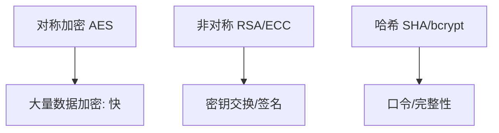
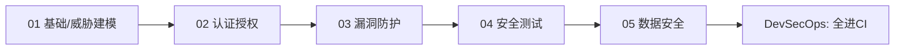
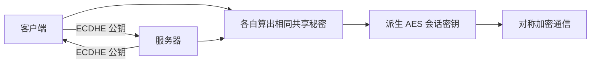
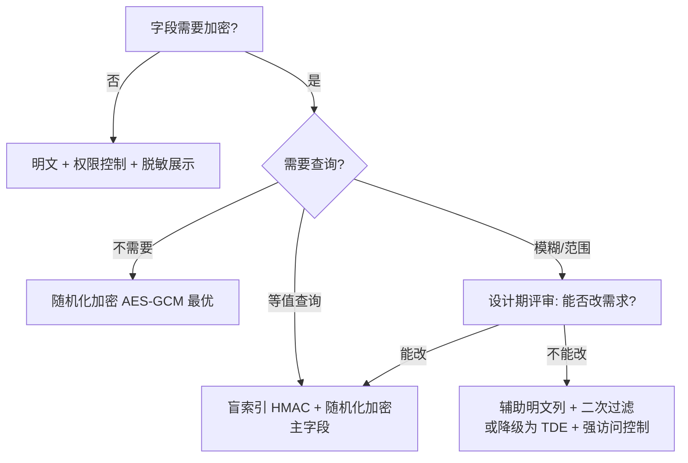
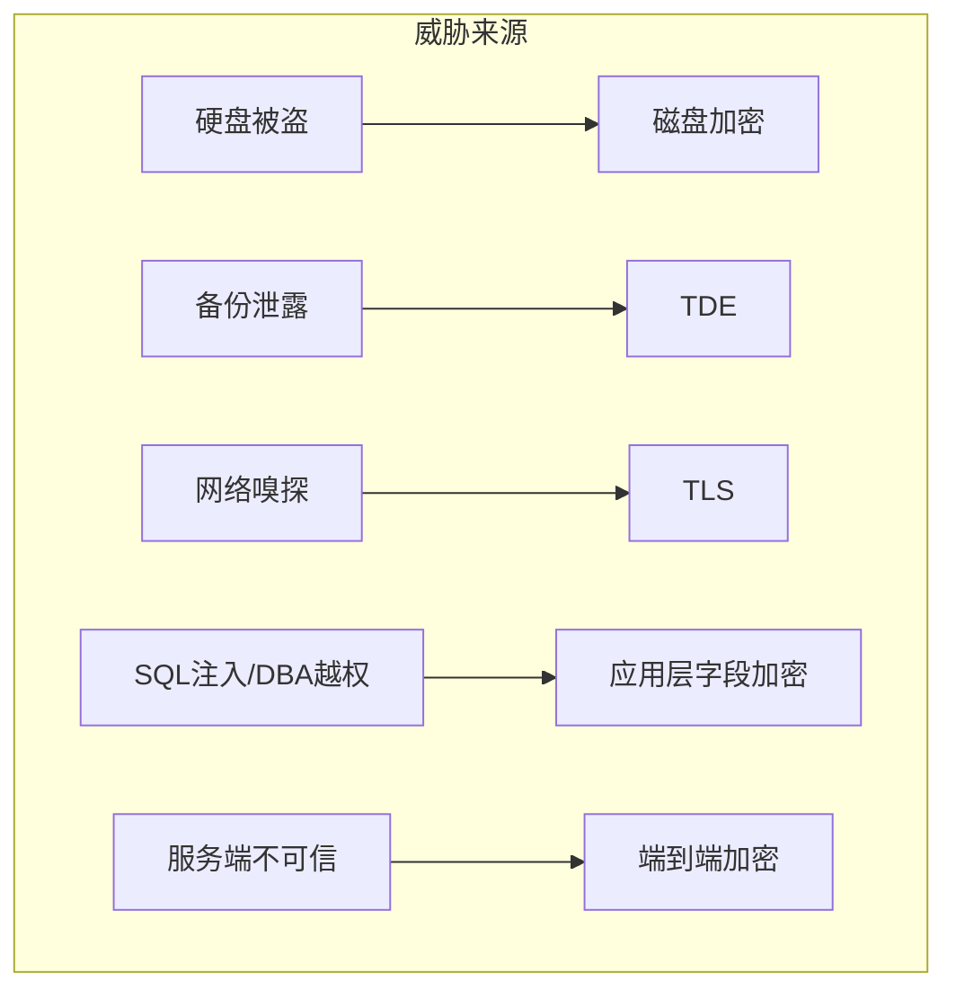
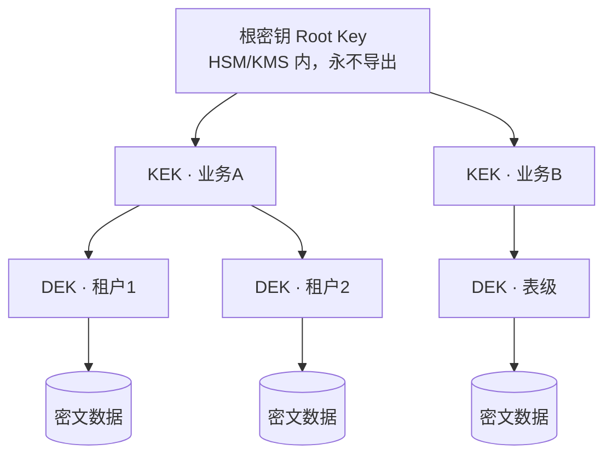
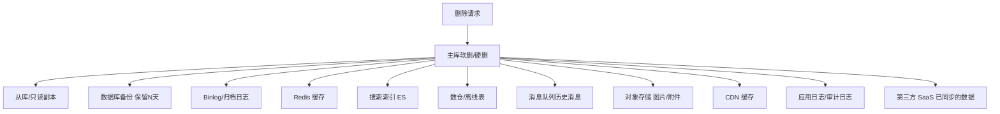

# 05 · 数据安全与密码学基础

> 应用安全的最终落点是"数据"——加密、脱敏、密钥管理、合规，是工程师绕不开的底线知识。这一篇用**工程视角**讲清密码学怎么用（不推导数学），以及数据全生命周期怎么护。

---

## 一、密码学三件套（工程选型）



| 类型 | 算法 | 用途 | 特点 |
|------|------|------|------|
| **对称** | AES-256 | 加密大块数据 | 快，但密钥分发难 |
| **非对称** | RSA / ECC | 密钥交换、数字签名 | 慢，解决"怎么安全给密钥" |
| **哈希** | SHA-256 / bcrypt / Argon2 | 摘要、口令存储 | 单向不可逆 |

> **经典组合**：非对称交换出"会话密钥" → 用对称加密通信（TLS 就是这个套路）。

---

## 二、口令存储：绝不存明文

```java
// 错误：明文/单向MD5（可彩虹表反查）
db.save(md5(password));
// 正确：加盐慢哈希（bcrypt/Argon2/SCrypt），自动含盐
String hash = BCrypt.hashpw(password, BCrypt.gensalt(12));
// 校验
BCrypt.checkpw(input, storedHash);
```

- 用 **bcrypt / Argon2 / scrypt**（慢哈希，抗暴力）；
- **加盐**（salt）防彩虹表；
- 不要用 MD5/SHA 直接哈希口令（太快，易暴力）。

---

## 三、TLS：传输加密

- HTTPS = HTTP + TLS，防中间人窃听/篡改；
- 用 **TLS 1.2+**（禁用 SSLv3/TLS 1.0/1.1）；
- 证书管理：自动续期（Let's Encrypt / cert-manager），避免过期导致中断；
- **HSTS** 防降级攻击。

---

## 四、密钥管理：密钥也是数据

> 最危险的不是加密算法，而是**密钥怎么存**。硬编码 AK/SK 进代码库 = 自杀。

| 实践 | 做法 |
|------|------|
| 别硬编码 | 用环境变量/密钥服务，参考 [CI/CD·密钥管理](../基础知识/CI-CD/12-环境配置与密钥管理.md) |
| KMS | 云密钥管理服务（AWS KMS / 阿里 KMS），密钥不落本地 |
| 轮换 | 定期轮换密钥，泄露影响可控 |
| 信封加密 | 数据密钥加密数据、主密钥加密数据密钥 |
| 防提交 | Git 预提交钩子 + SCA 扫描密钥泄露 |

---

## 五、深挖：TLS 握手与密钥管理实操

### 4.1 TLS 握手（为什么"慢但安全"）

```
客户端 ──ClientHello(支持算法)──▶ 服务器
服务器 ──ServerHello+证书(公钥)──▶ 客户端
客户端 验证证书链 → 生成 pre-master 密钥
客户端 ──用服务器公钥加密 pre-master──▶ 服务器
双方 用 pre-master 派生会话密钥 → 此后对称加密通信
```

- **非对称只用于握手交换密钥**，数据用 AES 对称加密——快且安全；
- 一连接一密钥（前向保密，mTLS 可验证客户端身份）；
- 证书链验证失败必须拒绝连接（防中间人伪造）。

### 4.2 信封加密（Envelope Encryption）落地

```
数据 ──(数据密钥DEK/AES)──▶ 密文落库
DEK ──(主密钥KEK/KMS)──▶ 信封(加密的DEK) 存库
解：KMS 解 DEK → DEK 解数据
```

- 好处：KEK 永不离开 KMS；DEK 可随数据泄露但无 KEK 无用；轮换只需换 KEK；
- 云厂商：AWS KMS / 阿里 KMS / Vault（自建 HashiCorp Vault）。

### 4.3 密钥轮换与泄露响应

| 场景 | 动作 |
|------|------|
| 定期轮换 | 云 KMS 自动轮换；自建按策略（季度/半年） |
| 泄露应急 | 立即吊销/轮换 → 审计泄露前日志 → 补检测（secret 扫描全库） |
| 双密钥过渡 | 新旧并行，流量灰度切新——避免一次性切换中断 |

---

## 六、数据脱敏与最小化

| 场景 | 做法 |
|------|------|
| 日志/展示 | 手机号/身份证掩码（138****8000） |
| 测试数据 | 生产脱敏后克隆（见 [测试·TDM](../测试与代码质量/08-测试数据Mock服务与混沌工程.md)） |
| 数据最小化 | 只收集必要字段，减少泄露面 |
| 加密存储 | 敏感字段（密码/证件/卡号）落库加密 |

> 与可观测性 [SRE·日志](../SRE与稳定性工程/02-可观测性与稳定性看护.md) 呼应：日志别打敏感信息，否则既不安全也不合规。

---

## 七、隐私合规

| 法规/框架 | 要点 |
|-----------|------|
| GDPR（欧盟） | 被遗忘权、数据出境、违规重罚 |
| 个人信息保护法（中国） | 告知同意、最小必要、境内存储 |
| PCI-DSS | 卡数据不落库、强加密 |

工程落地：同意管理、数据分类分级、出境评估、审计留痕。

---

## 八、反模式

| 反模式 | 危害 |
|--------|------|
| 明文存口令 | 拖库即全泄露 |
| 密钥硬编码进仓库 | 公开即泄露 |
| 自研加密算法 | 99% 有漏洞，用标准算法 |
| 用 MD5/SHA 存口令 | 易暴力/彩虹表 |
| TLS 1.0 仍启用 | 可被降级攻击 |

---

## 九、面试高频追问（12+ 条）

1. Q：为什么不用 RSA 直接加密数据？ A：非对称慢且密文膨胀（1024 位 RSA 加密上限 ~117 字节），大数据用对称 AES。
2. Q：TLS 里非对称/对称各干什么？ A：非对称交换会话密钥（前向保密），对称加密实际数据。
3. Q：口令为什么用慢哈希？ A：MD5/SHA 每秒可算亿次，暴力/彩虹表成本极低；bcrypt/Argon2 可调高成本因子。
4. Q：加盐的作用？ A：防彩虹表——相同口令产生不同哈希；盐要随机且与哈希同存。
5. Q：密钥能放代码里吗？ A：绝对不行；用环境变量/KMS/密钥服务，提交即泄露（历史记录难清除）。
6. Q：信封加密是什么？ A：DEK 加密数据、KMS 主密钥 KEK 加密 DEK；密钥与数据分离，轮换灵活。
7. Q：数据库字段加密会影响什么？ A：无法模糊查询/排序，需脱敏方案或专用加密检索方案；权衡后再做。
8. Q：脱敏和加密区别？ A：脱敏是变换数据形态（掩码）可逆性弱，用于展示/测试；加密可逆，用于存储/传输。
9. Q：HTTPS 全站强制的理由？ A：明文可被中间人窃听/篡改；HSTS 防降级到 http。
10. Q：GDPR 与个保法共同要求？ A：告知同意、数据最小化、出境评估、被遗忘/删除权、违规重罚。
11. Q：日志为什么不能打敏感字段？ A：日志是明文落盘，泄露面大且难清理；上 [SRE 日志](../SRE与稳定性工程/02-可观测性与稳定性看护.md) 前先脱敏。
12. Q：证书过期会怎样？ A：客户端校验失败直接拒绝——服务不可用；必须自动续期（cert-manager/Let's Encrypt）。
13. Q：如何验证口令存储方案安全？ A：成本因子+盐+标准库（BCrypt 12 轮≈百毫秒级）+ 不泄露哈希格式。
14. Q：测试数据从生产克隆怎么合规？ A：先脱敏（PII 掩码/假名化）再使用，建立 TDM 流程（见 [测试·TDM](../测试与代码质量/08-测试数据Mock服务与混沌工程.md)）。

---

## 十、Cheat Sheet

| 主题 | 要点 |
|------|------|
| 加密选型 | 对称 AES 快、非对称换密钥、哈希单向 |
| 口令 | bcrypt/Argon2 加盐慢哈希，禁明文/MD5 |
| TLS | 1.2+，证书自动续期，HSTS |
| 密钥 | 别硬编码，用 KMS，定期轮换 |
| 脱敏 | 掩码/最小化/测试脱敏 |
| 合规 | GDPR/个保法/PCI-DSS，分类分级 |

---

## 十一、板块收尾 · 安全工程全貌



> 回到：[安全工程总览](安全工程总览.md)

---

> **卷五·研发效能 三大支柱已齐**：[测试与代码质量](../测试与代码质量/测试与代码质量总览.md)（上线前对）· [SRE 与稳定性工程](../SRE与稳定性工程/SRE与稳定性工程总览.md)（上线后稳）· [安全工程](../安全工程/安全工程总览.md)（不被攻破）。三者共同构成"质量 + 稳定性 + 安全"的研发效能底座。

---

## 十二、对称加密深入：AES 模式与陷阱

AES 不是"一把锁"，**模式和填充**决定安全性：

| 模式 | 特点 | 风险 |
|------|------|------|
| **AES-GCM** | 认证加密（带完整性校验） | 推荐，IV 不可复用（nonce 重用灾难） |
| AES-CBC | 需单独配 MAC 防篡改 | 无 MAC → Padding Oracle 攻击 |
| AES-ECB | 相同明文→相同密文 | **禁用**（会暴露数据模式，如图片轮廓） |
| AES-CTR | 流模式，可并行 | 同 GCM 需唯一 nonce |

```java
// 推荐：AES/GCM/NoPadding，12 字节随机 IV（每次不同）
byte[] iv = new byte[12]; SecureRandom().nextBytes(iv);
Cipher c = Cipher.getInstance("AES/GCM/NoPadding");
c.init(Cipher.ENCRYPT_MODE, new SecretKeySpec(key, "AES"), new GCMParameterSpec(128, iv));
byte[] ct = c.doFinal(plaintext);   // 输出含认证 tag
```

> **金律**：IV/nonce 必须随机且唯一，密钥长度 ≥ 128 位（AES-256 更好）。绝不用 ECB。

---

## 十三、非对称加密深入：RSA / ECC / 密钥交换

- **RSA-OAEP**：比老旧的 PKCS#1 v1.5 填充安全（抗选择密文攻击）。只用 OAEP；
- **ECC（椭圆曲线）**：256 位 ECC ≈ 3072 位 RSA 的安全，更快更省（Ed25519 用于签名）；
- **Diffie-Hellman（ECDHE）**：双方不传密钥也能协商出共享秘密——TLS 前向保密的基础；
- **为什么不全用非对称**：慢 + 密文膨胀。实战是"非对称交换对称密钥，对称加密数据"。



---

## 十四、哈希、MAC 与口令存储的细节

| 概念 | 用途 | 注意 |
|------|------|------|
| **SHA-256** | 完整性校验 | 快，**不能**存口令 |
| **HMAC** | 带密钥的哈希（消息认证） | 验证来源+完整性，防篡改 |
| **bcrypt** | 口令哈希（自带 salt、可调成本） | 13 年起主流 |
| **Argon2** | 口令哈希（抗 GPU/ASIC） | 2015 Password Hashing 竞赛冠军，最推荐 |
| **PBKDF2** | 口令哈希（迭代） | FIPS 合规，但抗 GPU 弱于 Argon2 |

> **长度扩展攻击**：SHA-256 等 Merkle–Damgård 结构可被扩展伪造——这就是为什么"用哈希做消息认证"要用 HMAC 而非 `hash(secret+msg)`。

```python
# 口令：用 Argon2（argon2-cffi）
from argon2 import PasswordHasher
ph = PasswordHasher()
hash = ph.hash("user_password")     # 自带盐，存库
ph.verify(hash, "user_password")    # 校验
# 参数可调：time_cost / memory_cost 提高抗暴力
```

---

## 十五、数字签名、证书链与 PKI

签名 = 用**私钥**对摘要加密，任何人用**公钥**验证——证明"谁签的 + 没被改"：

```
签名：hash(文档) → 私钥加密 → 数字签名
验证：hash(文档) == 公钥解密(签名) ?
```

**证书链**：你的证书由中间 CA 签发，中间 CA 由根 CA 签发。验证要一路追溯到**受信任的根**。任一层失效（如中间 CA 私钥泄露）→ 整条不信任。这就是 [06 供应链](../安全工程/06-供应链安全与SBOM.md) 里"签名验证"的信任根来源（Sigstore 的 Fulcio 即短期证书 CA）。

---

## 十六、国密与合规算法（SM 系列）

国内合规场景（等保、金融）常要求国密：

| 算法 | 对应 | 用途 |
|------|------|------|
| SM2 | 类 ECC | 非对称签名/加密 |
| SM3 | 类 SHA-256 | 哈希 |
| SM4 | 类 AES | 对称加密 |

> 选型原则：**优先用国际标准（AES-GCM / RSA-OAEP / ECC）+ 合规要求时叠加国密**。切勿自研算法（见 [01 反模式](../安全工程/01-应用安全基础与威胁建模.md)）。

---

## 十七、数据全生命周期保护（含脱敏代码）

数据不是"存的时候加密"一件事，而贯穿全生命周期：

```
采集(最小化) → 传输(TLS) → 存储(加密+脱敏) → 使用(权限+脱敏展示)
   → 共享(脱敏/假名化) → 销毁(彻底删除/密钥销毁)
```

```java
// 展示脱敏：手机号掩码
public static String maskPhone(String phone) {
    if (phone == null || phone.length() != 11) return phone;
    return phone.replaceAll("(\\d{3})\\d{4}(\\d{4})", "$1****$2");
}
// 日志脱敏：统一用 MDC/日志过滤器，禁止打明文身份证/ token
```

> 与 [SRE·日志](../SRE与稳定性工程/02-可观测性与稳定性看护.md) 呼应：**日志是明文落盘的高泄露面**，先脱敏再打。测试数据克隆见 [测试·TDM](../测试与代码质量/08-测试数据Mock服务与混沌工程.md)。

---

## 十八、密钥管理进阶：Vault、HSM、密钥派生

### 18.1 HashiCorp Vault 实战

```bash
# 动态数据库凭证：应用按需领，到期自动吊销（比长期 AK/SK 安全）
vault read database/creds/readonly-role    # 返回临时账号+密码，TTL 短
#  transit 引擎：加解密不存明文密钥，Vault 托管
vault write transit/encrypt/my-key plaintext=$(base64 <<< "secret")
```

### 18.2 HSM 与密钥派生

- **HSM**：硬件加密机，密钥**不出硬件**，合规场景（金融/CA）必需；
- **KDF（密钥派生）**：从主密钥 + 上下文派生出不同子密钥（HKDF），避免"一把钥匙开所有门"；
- **信封加密**（见第五章）：DEK 随数据、KEK 在 KMS/HSM，轮换只换 KEK。

---

## 十九、合规映射：GDPR / 个保法 / 等保 工程落地

| 要求 | 工程动作 |
|------|----------|
| 告知同意 | 隐私弹窗 + 同意记录留存 |
| 数据最小化 | 只采集必要字段，接口按需返回 |
| 被遗忘权 | 提供删除链路（含备份脱敏/销毁） |
| 出境评估 | 数据分类分级，跨境走合规通道 |
| 等保/PCI | 加密存储、强访问控制、审计留痕 |

> 合规不是法务的事，**每个字段的采集/存储/展示都要工程师落地**（脱敏、加密、权限）。

---

## 二十、踩坑实录与误区

1. **用 MD5/SHA 存口令**：GPU 每秒数十亿次，彩虹表秒破。必须用慢哈希（Argon2/bcrypt）。
2. **AES 用 ECB**：相同明文密文相同，数据模式泄露（经典"加密后的 Linux 企鹅图"）。
3. **IV 复用**：GCM 的 nonce 重用会泄露密钥流，可解密。务必每次随机 12 字节。
4. **密钥硬编码**：提交即泄露且历史难清。用 KMS/Vault + 扫描（[04 门禁](../安全工程/04-安全测试方法论.md)）。
5. **自研 crypto**：99% 有洞。用标准库、标准模式、标准参数。
6. **加密字段还要模糊查询**：设计期就要决策（要么不加密可查，要么用确定性加密/分词索引，权衡安全）。

> **本篇口诀**：对称快、非对称换密钥、哈希单向；口令 Argon2/bcrypt 加盐慢哈希，禁 MD5/明文；TLS 1.2+ 前向保密，HSTS 防降级；密钥不硬编码用 KMS，信封加密分离 DEK/KEK；数据全生命周期脱敏加密，合规靠落地。

---

## 二十一、密钥泄露应急 SOP（背下来）

密钥一旦怀疑泄露，按分钟级响应：

```
1. 立即在 KMS/Vault 吊销 + 轮换（旧密钥进入"已吊销"列表）
2. 审计泄露时间窗内的访问日志（谁用了旧密钥、动了哪些数据）
3. 全库扫描历史提交（gitleaks detect --no-git）确认有无其他残留
4. 通知下游：依赖该密钥的服务需重新拉取新密钥
5. 复盘：为什么会泄露（硬编码? 日志打印? 截图外发?）
```

> 轮换要"新旧并行"灰度切（见第五章 4.3），避免一次性轮换导致依赖方全量失败。密钥管理与 [04 门禁](../安全工程/04-安全测试方法论.md) 的密钥扫描是"防泄露 + 早发现"的两端。

---

## 二十二、常见加密误用对照表（速查避坑）

| 误用 | 正确做法 |
|------|----------|
| 用 ECB 模式 | 用 GCM（带认证） |
| 自己实现 crypto | 用标准库/标准模式 |
| 固定 IV | 每次随机 12 字节 nonce |
| MD5/SHA 存口令 | Argon2/bcrypt 慢哈希 |
| 密钥硬编码 | KMS/Vault + 扫描 |
| 加密字段还要模糊查询 | 设计期决策检索方案（分词/确定性加密） |
| TLS 1.0/1.1 启用 | 仅 1.2+，HSTS 防降级 |
| 自签证书不校链 | 校验完整证书链 + 吊销状态 |
| 把加密当脱敏 | 加密可逆用于存储，脱敏用于展示（见第六章） |

---

## 二十三、随机数：被忽视的重灾区

加密算法再强，**随机数不随机就全盘崩塌**。密钥、IV/nonce、盐、会话 ID、重置密码令牌、验证码——全都依赖高质量随机源。

### 23.1 PRNG vs CSPRNG

| 类型 | 代表 | 特点 | 能否用于安全场景 |
|------|------|------|-----------------|
| 普通 PRNG | `java.util.Random`、`Math.random()`、C `rand()` | 线性同余，观察少量输出即可推算种子与后续序列 | **绝对不能** |
| CSPRNG | `SecureRandom`、`/dev/urandom`、`crypto.randomBytes` | 密码学安全，不可预测 | 必须用这个 |

```java
// 错误：可预测，攻击者可枚举出他人的重置令牌
String token = Long.toHexString(new Random().nextLong());
// 更错：用时间戳当随机源
String token = String.valueOf(System.currentTimeMillis());

// 正确：CSPRNG + 足够长度 + URL 安全编码
byte[] buf = new byte[32];                    // 256 bit 熵
SecureRandom.getInstanceStrong().nextBytes(buf);
String token = Base64.getUrlEncoder().withoutPadding().encodeToString(buf);
```

```python
# Python：标准库直接给安全的令牌生成
import secrets
token = secrets.token_urlsafe(32)     # 而不是 random.random()
```

```go
// Go：crypto/rand 而非 math/rand
buf := make([]byte, 32)
if _, err := rand.Read(buf); err != nil { panic(err) }  // crypto/rand
token := base64.RawURLEncoding.EncodeToString(buf)
```

### 23.2 令牌长度与熵

| 用途 | 建议熵 | 说明 |
|------|--------|------|
| 会话 ID | ≥ 128 bit | 低于此值存在被暴力猜测的空间 |
| 密码重置令牌 | ≥ 128 bit + 短 TTL + 一次性 | 三者缺一不可 |
| 数字验证码（6 位） | 熵极低 | 必须靠**限频 + 一次性 + 失败锁定**补足，不能靠长度 |
| API Key | ≥ 128 bit | 并附加前缀便于识别与扫描（如 `sk_live_`） |

> **给密钥/令牌加可识别前缀**是个高价值小技巧：`gitleaks` 之类的扫描器可以按前缀精确匹配，泄露到公开仓库时能被自动发现并触发轮换。见 [04 密钥扫描](04-安全测试方法论.md)。

### 23.3 常见随机数踩坑

1. **容器/虚拟机启动时熵不足**：早期 `/dev/random` 会阻塞。现代 Linux 用 `/dev/urandom`（或 `getrandom()`）即可，不要为了"更随机"去读 `/dev/random` 导致启动挂住。
2. **用 UUID v4 当密钥**：UUID v4 只有 122 bit 随机位，而且部分实现底层用的是非安全随机源。做标识可以，**做凭据要确认实现**。
3. **多进程复用种子**：fork 后子进程继承同一随机状态，生成出相同的令牌。用 CSPRNG 可避免。
4. **自己"增强"随机性**：`hash(时间 + 用户ID + 计数器)` 看似复杂，实际熵来源全部可预测。

---

## 二十四、侧信道与恒定时间比较

密码学实现的漏洞常常不在算法，而在**比较方式**。

### 24.1 时序攻击（Timing Attack）

```java
// 危险：String.equals 逐字节比较，首字节不同就立即返回
// 攻击者通过测量响应时间，可以逐字节猜出正确的 token/签名
if (userToken.equals(expectedToken)) { ... }

// 正确：恒定时间比较（无论哪里不同，耗时相同）
if (MessageDigest.isEqual(userToken.getBytes(UTF_8), expected.getBytes(UTF_8))) { ... }
```

```python
import hmac
hmac.compare_digest(user_sig, expected_sig)   # 而不是 user_sig == expected_sig
```

```go
import "crypto/subtle"
subtle.ConstantTimeCompare(userSig, expectedSig) == 1
```

**什么场景必须用恒定时间比较**：

| 场景 | 原因 |
|------|------|
| HMAC / 签名校验（回调验签） | 逐字节泄露可让攻击者伪造签名 |
| API Key / Token 校验 | 同上 |
| 口令哈希校验 | 用 `BCrypt.checkpw` / `ph.verify`（库内部已处理） |
| 普通业务字段比较 | 不需要，别过度设计 |

### 24.2 其他侧信道

| 侧信道 | 表现 | 缓解 |
|--------|------|------|
| 错误信息差异 | "用户不存在" vs "密码错误" → 可枚举账号 | 统一返回"账号或密码错误" |
| 响应时间差异 | 存在的用户走了完整哈希校验（慢），不存在的直接返回（快） | 用户不存在时也执行一次假哈希计算 |
| Padding Oracle | CBC 模式下"填充错误"与"MAC 错误"响应不同 | 用 AEAD（GCM），错误统一化 |
| 缓存/压缩侧信道 | 压缩后长度泄露内容相关性（CRIME/BREACH） | 敏感响应不压缩，或加随机填充 |

> **口令登录接口的正确形态**：无论用户是否存在，都执行一次慢哈希（对不存在的用户比对一个预置的假哈希），返回统一错误文案与近似耗时。这是防账号枚举的标准做法。

---

## 二十五、加密字段还要查询？可检索加密设计

这是落地加密时最常撞的墙：字段加密了，但业务要"按手机号查用户"。

### 25.1 方案对比

| 方案 | 原理 | 支持的查询 | 安全代价 |
|------|------|-----------|----------|
| **随机化加密**（AES-GCM，每次 IV 随机） | 同一明文每次密文不同 | 只能全表解密后过滤 | 最安全，但不可查 |
| **确定性加密**（AES-SIV / 固定 IV） | 同一明文密文相同 | 等值查询、去重、JOIN | 泄露"相等关系"与频率分布 |
| **盲索引**（Blind Index） | 另存一列 `HMAC(key, 规范化明文)` | 等值查询 | 泄露相等关系；主字段仍随机加密 |
| **部分明文索引** | 存明文的后 4 位/前缀作为辅助列 | 前缀/后缀模糊定位 + 二次过滤 | 泄露部分内容，需评估 |
| **保序加密 OPE** | 密文保持大小顺序 | 范围查询、排序 | 泄露顺序信息，安全性弱 |
| **数据库内加密（TDE）** | 存储层透明加密 | 全部（对 SQL 无影响） | 只防"偷走磁盘/备份文件"，DB 被拿下即失效 |

### 25.2 盲索引落地（推荐方案）

```java
// 表结构：user(id, phone_cipher VARBINARY, phone_bidx BINARY(32), phone_tail CHAR(4))
// 写入
String norm = normalizePhone(rawPhone);                 // 规范化：去空格/加国家码，必须统一
byte[] cipher = aesGcmEncrypt(dek, norm);               // 主字段：随机化加密，不可查
byte[] bidx   = hmacSha256(indexKey, norm);             // 盲索引：确定性，可等值查
String tail   = norm.substring(norm.length() - 4);      // 展示与模糊定位用

// 查询：按手机号精确查
byte[] bidx = hmacSha256(indexKey, normalizePhone(input));
// SELECT * FROM user WHERE phone_bidx = ?
```

**关键设计点**：

1. **规范化必须统一**：`+8613800138000` 和 `13800138000` 会产生不同索引，导致查不到。规范化规则要写成单一函数并加单测。
2. **索引密钥与数据密钥分离**：`indexKey` 泄露只能做"确定性关联"，拿不到明文；`dek` 泄露才是明文泄露。分离降低单点影响。
3. **接受"相等关系泄露"**：DBA 能看出哪两行手机号相同，但看不出是什么。这是可控的权衡。
4. **模糊查询无法支持**：这是硬约束。业务方要求"按手机号前缀模糊搜"时，只能用辅助列 + 二次过滤，或者在设计期就说明该字段不加密（并用其他手段保护）。

### 25.3 决策流程



> **最重要的一条**：**在设计期决定，不要等上线后再加密**。存量数据加密涉及全量迁移 + 双写 + 灰度回放，成本比设计期高一个数量级。这与 [SRE 变更管理](../SRE与稳定性工程/05-变更管理与渐进式发布.md) 里"数据变更要能回滚"的原则一致。

---

## 二十六、数据库加密方案分层对比

"数据加密"是个含糊词，必须问清"防谁"。不同层次防的威胁完全不同：

| 层次 | 实现 | 能防 | 不能防 |
|------|------|------|--------|
| **磁盘加密** | LUKS / 云盘加密 | 物理硬盘被盗、磁盘退役未擦除 | 系统运行时的任何访问 |
| **DB 透明加密 TDE** | MySQL/PG 表空间加密 | 数据文件被拷走、备份文件泄露 | SQL 注入、DBA 查询、连接被劫持 |
| **传输加密** | TLS 到 DB 的连接 | 网络嗅探、中间人 | 端点被控 |
| **字段级加密（应用层）** | 应用加解密，DB 存密文 | SQL 注入拖库、DBA 越权看数据、备份泄露 | 应用被 RCE（应用有密钥） |
| **端到端加密** | 客户端加密，服务端无密钥 | 服务端全部内部威胁 | 服务端无法做任何计算/搜索 |



**工程结论**：
- 拖库（SQL 注入 / 备份泄露）是最高频的真实威胁，**能防它的只有应用层字段加密**——TDE 对 SQL 注入完全无效（注入是通过合法连接查询，DB 会正常解密返回）。
- 很多团队上了 TDE 就以为"数据已加密"，这是最常见的误解。TDE 的定位是"防磁盘和备份文件泄露"，仅此而已。
- 分层不冲突，按敏感度叠加：**普通业务字段 TDE + TLS 足够；证件号/银行卡/口令必须应用层加密**。

---

## 二十七、密钥分层体系与多租户隔离

单一密钥加密全库 = 单点全泄露。生产级方案是**分层密钥树**：



| 层级 | 存放位置 | 轮换频率 | 泄露影响 |
|------|----------|----------|----------|
| 根密钥 | HSM / KMS 内部，不可导出 | 极低（年级） | 灾难性 |
| KEK（密钥加密密钥） | KMS 托管，通过 API 调用 | 中（季度） | 该业务域全部 DEK |
| DEK（数据加密密钥） | 加密后随数据存储 | 高（可随数据版本） | 仅对应数据分片 |

### 27.1 多租户隔离粒度

| 粒度 | 优点 | 缺点 | 适用 |
|------|------|------|------|
| 全局一个 DEK | 简单，缓存友好 | 一泄露全泄露；无法单租户"密钥销毁" | 内部低敏系统 |
| 每租户一个 DEK | 租户间隔离；支持"删租户=销毁密钥" | 密钥数量多，需缓存管理 | SaaS 多租户（推荐） |
| 每条记录一个 DEK | 隔离最强 | KMS 调用量与存储开销大 | 极高敏（医疗/金融核心） |

### 27.2 加密擦除（Crypto-Shredding）

多租户场景下，"删除租户全部数据"是个工程噩梦——数据散布在主库、从库、备份、数仓、日志、缓存。

**加密擦除的思路**：每个租户独立 DEK，**销毁 DEK 即等价于销毁该租户所有密文**。备份里的密文永远解不开了。

```
删除请求 → 销毁该租户 DEK（KMS 中标记不可用/删除）
        → 所有副本中的密文即时失效（无需逐个物理删除）
        → 异步做物理清理（降级为"清理垃圾"，不再是"合规义务"）
```

> 这是应对"被遗忘权"最优雅的工程方案。前提是**设计期就做了每租户/每用户密钥隔离**——事后补做需要全量重加密。

---

## 二十八、数据分类分级落地表

分级不是写在制度文件里给审计看的，而是要**直接映射到工程约束**。一张能落地的分级表长这样：

| 级别 | 示例字段 | 存储要求 | 传输 | 日志 | 权限 | 导出 |
|------|----------|----------|------|------|------|------|
| **L4 核心敏感** | 身份证号、银行卡号、生物特征、口令 | 应用层加密（每租户 DEK） | 强制 TLS | **禁止出现**（含链路追踪） | 单独审批 + 全量审计 | 禁止，或加密+审批 |
| **L3 敏感** | 手机号、真实姓名、精确地址、健康信息 | 应用层加密或强访问控制 | 强制 TLS | 脱敏后可记录 | 按角色最小化 | 脱敏后可导 |
| **L2 内部** | 订单详情、行为日志、内部配置 | TDE + 权限控制 | 内网 TLS | 可记录 | 按业务线 | 内部可导 |
| **L1 公开** | 商品信息、公开文案 | 无特殊要求 | — | 可记录 | 公开 | 可导 |

### 28.1 让分级"自动生效"的工程手段

分级最容易失效的地方是"靠人记住"。可以用代码强制：

```java
// 用注解声明字段级别，由框架统一处理加密与日志脱敏
public class User {
    @Sensitive(level = L4, strategy = ENCRYPT)     // 落库自动加密
    private String idCard;

    @Sensitive(level = L3, strategy = MASK_PHONE)  // 序列化到日志/响应时自动掩码
    private String phone;

    private String nickname;                        // L1，无需处理
}
```

配套三个拦截点，缺一不可：

1. **持久层拦截**（MyBatis 插件 / JPA Converter）：写入时加密，读取时解密；
2. **日志序列化拦截**（Jackson Serializer / Logback Converter）：打日志时自动掩码；
3. **API 响应拦截**：对外返回时按调用方权限决定掩码或明文。

> **只做第一点是最常见的半成品**：数据库里是密文，但日志里满是明文手机号。日志是明文落盘、全员可查、长期保留、还会被采集到 ELK——**泄露面往往比数据库更大**。见 [SRE·可观测性](../SRE与稳定性工程/02-可观测性与稳定性看护.md)。

---

## 二十九、删除与"被遗忘权"的工程难题

用户点了"注销账号"，数据真的删干净了吗？把所有数据副本列一遍，答案通常是"没有"：



| 副本位置 | 处理难点 | 可行做法 |
|----------|----------|----------|
| 从库 | 自动同步，通常无需额外处理 | 依赖主从复制 |
| 备份文件 | 不可能改历史备份 | 加密擦除（销毁密钥）或等备份过期 |
| Binlog / 归档 | 含变更前的明文 | 缩短保留期 + 加密存储 |
| 缓存 | key 分散、可能有派生副本 | 按用户维度设计 key 前缀，可批量清 |
| 搜索索引 | 需要独立删除 API | 删除事件走同一条消息广播 |
| 数仓 | 分区表、宽表、衍生指标 | 建"删除名单"表，下游按名单过滤/覆写 |
| 对象存储 | 文件与用户的关联可能没记录 | 存储路径带用户 ID，可按前缀批删 |
| CDN | 边缘节点缓存 | 主动刷新 + 私有资源用签名 URL 短有效期 |
| 第三方 | 数据已出境/出域 | 调用对方删除 API 并留痕 |

**工程解法**：

1. **建立"删除事件"广播**：删除不是一条 SQL，而是一个领域事件，所有持有副本的系统订阅并各自处理；
2. **登记副本清单**：新增一处数据副本，必须在清单里登记删除处理方式（评审卡点）；
3. **优先用加密擦除**（见第二十七章）：对备份等不可变副本，这是唯一现实解；
4. **区分"删除"与"匿名化"**：财务、审计数据法律要求保留，此时应做**假名化**（把可识别信息替换为不可逆假名），保留业务统计能力，去除可识别性。

> 注销功能最常见的实现是"给 user 表打个 `deleted=1`"。这在合规视角下几乎等于什么都没做——**数据仍完整可查、仍在备份里、仍在数仓里**。设计注销功能时，先画出上面那张副本图。

---

## 三十、别自己拼加密协议：用成熟方案

自己组合密码学原语出错率极高。典型错误：只加密不认证（可被篡改）、忘了绑定上下文（密文可被搬移到别处复用）、密钥重用于多个用途。

| 需求 | 不要自己做 | 用这个 |
|------|-----------|--------|
| 加密一段数据存起来 | AES + 自己拼 MAC | AES-GCM 或 libsodium `secretbox` / `age` |
| 传输结构化令牌 | 自定义"base64(json) + md5 签名" | JWS（签名）/ JWE（加密），或 PASETO |
| 服务间加密通信 | 自研握手协议 | TLS / mTLS（见 [07 零信任](07-零信任架构.md)） |
| 口令存储 | 自己加盐迭代 SHA | Argon2id / bcrypt 标准库 |
| 从口令派生密钥 | `sha256(password)` | PBKDF2 / Argon2 / scrypt（带足够迭代） |
| 派生多个子密钥 | 截断同一个密钥分段用 | HKDF（带 info 上下文区分用途） |

### 30.1 上下文绑定（AAD）：一个高频遗漏

AEAD 算法支持"附加认证数据"（AAD）——它不加密，但参与认证。作用是**把密文绑定到它的使用场景**：

```java
// 不绑定上下文：攻击者可以把用户A记录里的密文搬到用户B的记录，解密照样成功
byte[] ct = aesGcmEncrypt(dek, iv, plaintext, null);

// 绑定上下文：AAD 里放表名+主键+字段名+密钥版本
byte[] aad = ("user:" + userId + ":idCard:v" + keyVersion).getBytes(UTF_8);
byte[] ct  = aesGcmEncrypt(dek, iv, plaintext, aad);
// 解密时必须传入相同 AAD，搬移到别处会认证失败
```

这类"密文搬移攻击"在字段级加密中很常见，而且不会被任何扫描器发现——因为加密算法用得完全正确，错的是**缺少上下文绑定**。

### 30.2 密钥用途分离

```java
// 危险：同一把 key 既做加密又做 HMAC 索引，存在交叉分析风险
// 正确：用 HKDF 从主密钥派生出用途明确的子密钥
byte[] encKey = hkdf(masterKey, salt, "enc:user.idCard:v1");
byte[] idxKey = hkdf(masterKey, salt, "idx:user.phone:v1");
```

> **一把钥匙只开一把锁**。用途分离让"某个子密钥泄露"的影响面被限制在单一用途内，且轮换时可以只换一个用途的密钥。

---

## 三十一、加密改造实施路线（存量系统）

给一个已上线的系统加字段加密，不能停机重写。标准的四阶段灰度：


| 阶段 | 动作 | 校验点 | 可回滚性 |
|------|------|--------|----------|
| 1 双写 | 新增密文列与盲索引列，写入时同时写明文和密文 | 双写成功率、性能影响 | 完全可回滚（读还是明文） |
| 2 回填 | 后台任务分批加密历史数据，控制速率避免拖垮 DB | 回填进度、失败重试、数据一致性 | 可回滚（明文仍在） |
| 3 切读 | 读路径切到密文列，同时读明文列做**影子比对**并告警 | 比对差异数应为 0，持续观察一段时间 | 开关切回明文列 |
| 4 收尾 | 停止写明文列 → 观察 → 删除明文列 | 无代码引用明文列 | **不可回滚**，必须充分观察 |

**踩坑提醒**：

1. **回填任务打满 DB**：加解密是 CPU 密集，且 KMS 调用有配额。必须限速 + 分批 + 可暂停。
2. **忘了盲索引的规范化一致性**：回填时用的规范化逻辑与在线写入不一致，导致老数据查不到。规范化函数必须是唯一实现。
3. **第三阶段跳过影子比对直接切**：加解密逻辑的边界 bug（空值、超长、特殊字符、多字节截断）只有真实数据能暴露。
4. **删列太早**：报表、数据同步、离线任务可能还在读明文列。删列前搜索全部代码库 + 观察 DB 审计日志确认无访问。

> 这套流程与 [SRE·渐进式发布](../SRE与稳定性工程/05-变更管理与渐进式发布.md) 的灰度思路完全同构：**每一步都可观测、可回滚，不可回滚的那一步放到最后并充分验证**。

---

## 三十二、密码学工程自检清单

上线前逐条过一遍：

**算法与模式**
- [ ] 对称加密用 AES-GCM（或其他 AEAD），没有 ECB、没有裸 CBC
- [ ] 每次加密的 IV/nonce 随机且唯一（12 字节），绝不复用
- [ ] 非对称用 RSA-OAEP（不是 PKCS#1 v1.5）或 ECC
- [ ] 有 AAD 绑定上下文（表名/主键/字段/密钥版本）
- [ ] 没有任何自研加密算法或自拼协议

**口令与令牌**
- [ ] 口令用 Argon2id / bcrypt，成本因子经过压测校准
- [ ] 所有令牌用 CSPRNG 生成，熵 ≥ 128 bit
- [ ] 令牌有 TTL、一次性（重置密码类）
- [ ] 签名/令牌校验用恒定时间比较
- [ ] 登录接口对"用户不存在"和"密码错误"响应一致（含耗时）

**密钥管理**
- [ ] 代码库、配置文件、镜像、CI 变量中无明文密钥（已用 gitleaks 扫全量历史）
- [ ] 密钥存 KMS/Vault，分层（Root/KEK/DEK）
- [ ] 密钥有版本号，密文中记录了用哪个版本加密
- [ ] 不同用途的密钥已派生分离（HKDF）
- [ ] 轮换流程演练过，支持新旧并行灰度

**传输与证书**
- [ ] 仅 TLS 1.2+，禁用弱套件
- [ ] 证书自动续期已配置且有过期告警（提前 30 天）
- [ ] HSTS 已开启
- [ ] 客户端严格校验证书链，无 `verify=False` / `InsecureSkipVerify`

**数据治理**
- [ ] 敏感字段已按分级表标注，加密与脱敏由框架统一处理
- [ ] 日志、链路追踪、监控指标、异常堆栈中无敏感明文
- [ ] 数据删除链路覆盖了所有副本（含备份策略）
- [ ] 测试环境数据已脱敏，非生产直连

> **最后一条口诀**：**算法用标准的，密钥交给 KMS，随机用 CSPRNG，比较用恒定时间，上下文要绑定，日志先脱敏，删除想全副本，改造走灰度。**
