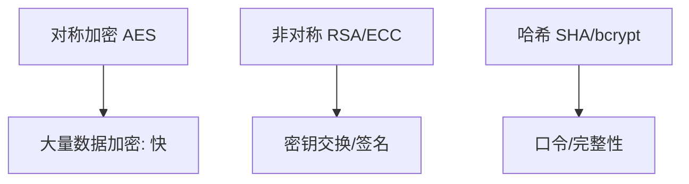
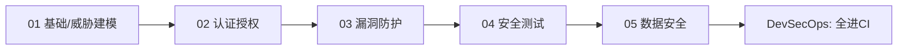

# 05 · 数据安全与密码学基础

> 应用安全的最终落点是"数据"——加密、脱敏、密钥管理、合规，是工程师绕不开的底线知识。这一篇用**工程视角**讲清密码学怎么用（不推导数学），以及数据全生命周期怎么护。

---

## 一、密码学三件套（工程选型）



| 类型 | 算法 | 用途 | 特点 |
|------|------|------|------|
| **对称** | AES-256 | 加密大块数据 | 快，但密钥分发难 |
| **非对称** | RSA / ECC | 密钥交换、数字签名 | 慢，解决"怎么安全给密钥" |
| **哈希** | SHA-256 / bcrypt / Argon2 | 摘要、口令存储 | 单向不可逆 |

> **经典组合**：非对称交换出"会话密钥" → 用对称加密通信（TLS 就是这个套路）。

---

## 二、口令存储：绝不存明文

```java
// 错误：明文/单向MD5（可彩虹表反查）
db.save(md5(password));
// 正确：加盐慢哈希（bcrypt/Argon2/SCrypt），自动含盐
String hash = BCrypt.hashpw(password, BCrypt.gensalt(12));
// 校验
BCrypt.checkpw(input, storedHash);
```

- 用 **bcrypt / Argon2 / scrypt**（慢哈希，抗暴力）；
- **加盐**（salt）防彩虹表；
- 不要用 MD5/SHA 直接哈希口令（太快，易暴力）。

---

## 三、TLS：传输加密

- HTTPS = HTTP + TLS，防中间人窃听/篡改；
- 用 **TLS 1.2+**（禁用 SSLv3/TLS 1.0/1.1）；
- 证书管理：自动续期（Let's Encrypt / cert-manager），避免过期导致中断；
- **HSTS** 防降级攻击。

---

## 四、密钥管理：密钥也是数据

> 最危险的不是加密算法，而是**密钥怎么存**。硬编码 AK/SK 进代码库 = 自杀。

| 实践 | 做法 |
|------|------|
| 别硬编码 | 用环境变量/密钥服务，参考 [CI/CD·密钥管理](../基础知识/CI-CD/12-环境配置与密钥管理.md) |
| KMS | 云密钥管理服务（AWS KMS / 阿里 KMS），密钥不落本地 |
| 轮换 | 定期轮换密钥，泄露影响可控 |
| 信封加密 | 数据密钥加密数据、主密钥加密数据密钥 |
| 防提交 | Git 预提交钩子 + SCA 扫描密钥泄露 |

---

## 五、数据脱敏与最小化

| 场景 | 做法 |
|------|------|
| 日志/展示 | 手机号/身份证掩码（138****8000） |
| 测试数据 | 生产脱敏后克隆（见 [测试·TDM](../测试与代码质量/08-测试数据Mock服务与混沌工程.md)） |
| 数据最小化 | 只收集必要字段，减少泄露面 |
| 加密存储 | 敏感字段（密码/证件/卡号）落库加密 |

> 与可观测性 [SRE·日志](../SRE与稳定性工程/02-可观测性与稳定性看护.md) 呼应：日志别打敏感信息，否则既不安全也不合规。

---

## 六、隐私合规

| 法规/框架 | 要点 |
|-----------|------|
| GDPR（欧盟） | 被遗忘权、数据出境、违规重罚 |
| 个人信息保护法（中国） | 告知同意、最小必要、境内存储 |
| PCI-DSS | 卡数据不落库、强加密 |

工程落地：同意管理、数据分类分级、出境评估、审计留痕。

---

## 七、反模式

| 反模式 | 危害 |
|--------|------|
| 明文存口令 | 拖库即全泄露 |
| 密钥硬编码进仓库 | 公开即泄露 |
| 自研加密算法 | 99% 有漏洞，用标准算法 |
| 用 MD5/SHA 存口令 | 易暴力/彩虹表 |
| TLS 1.0 仍启用 | 可被降级攻击 |

---

## 八、Cheat Sheet

| 主题 | 要点 |
|------|------|
| 加密选型 | 对称 AES 快、非对称换密钥、哈希单向 |
| 口令 | bcrypt/Argon2 加盐慢哈希，禁明文/MD5 |
| TLS | 1.2+，证书自动续期，HSTS |
| 密钥 | 别硬编码，用 KMS，定期轮换 |
| 脱敏 | 掩码/最小化/测试脱敏 |
| 合规 | GDPR/个保法/PCI-DSS，分类分级 |

---

## 九、板块收尾 · 安全工程全貌



> 回到：[安全工程总览](安全工程总览.md)

---

> **卷五·研发效能 三大支柱已齐**：[测试与代码质量](../测试与代码质量/测试与代码质量总览.md)（上线前对）· [SRE 与稳定性工程](../SRE与稳定性工程/SRE与稳定性工程总览.md)（上线后稳）· [安全工程](../安全工程/安全工程总览.md)（不被攻破）。三者共同构成"质量 + 稳定性 + 安全"的研发效能底座。
