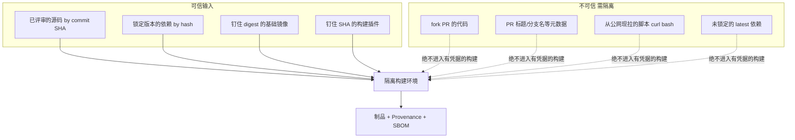
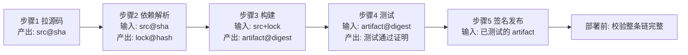
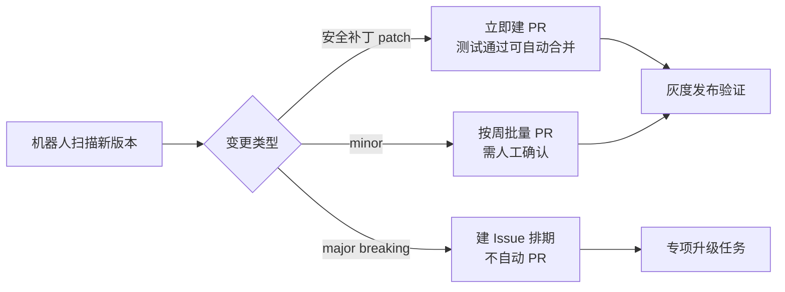

# 供应链安全与 SBOM（深入：攻击链 / 依赖混淆攻防 / 制品签名 / 全生命周期治理）

> 供应链安全 =「**你的代码依赖的每一个组件都是潜在攻击面**」。SolarWinds/Log4Shell 事件证明：攻击者不攻你的代码，攻你依赖的库。本篇深入拆解：供应链攻击链、依赖混淆攻防、制品签名体系、SBOM 全生命周期、组织级治理。

---

## 一、要解决的问题

| 痛点 | 说明 |
|------|------|
| 依赖漏洞 | Log4j/Logback 等库有 CVE，但你不知道项目里有没有用 |
| 传递依赖 | A 依赖 B，B 依赖 C（漏洞在 C 里，你感知不到） |
| 版本老旧 | 项目里某个库 3 年没更新，已有 10 个 CVE |
| 供应链投毒 | 恶意包名/typosquatting（如 `lodash` vs `lodas`） |
| 合规要求 | 开源许可证冲突（GPL 传染）/ 政府监管要求 |

> 核心认知：**SBOM = 依赖的 X 光片**——扫描项目生成完整依赖树 + 版本 + 许可证 + 漏洞状态，一键可见。

---

## 二、供应链攻击链全景

### 2.1 攻击链模型

```
源码 → 构建 → 制品 → 分发 → 部署 → 运行
  ↓      ↓      ↓      ↓      ↓      ↓
代码注入 构建污染 制品篡改 供应链投毒 运行时漏洞
```

| 环节 | 攻击方式 | 典型案例 |
|------|----------|----------|
| 源码 | 开源贡献者植入后门 | xz-utils 后门（2024） |
| 构建 | CI/CD 环境被入侵，篡改构建脚本 | SolarWinds（构建服务器被黑） |
| 制品 | 篡改发布包/镜像 | Codecov 脚本注入 |
| 分发 | 污染镜像仓库/包仓库 | PyPI/NPM 恶意包 |
| 依赖 | 投毒、依赖混淆 | ua-parser-js（NPM 劫持） |
| 运行时 | 漏洞利用 | Log4Shell |

### 2.2 依赖混淆（Dependency Confusion）

```
原理：
  私有包名与公开包同名
  包管理器优先拉取公开仓库（版本号更高）
  → 恶意公开包被当成私有包安装

防御：
  私有源配置验证（scope/registry 白名单）
  包名扫描（与公开仓库交叉比对）
  锁定版本 + 完整性校验（integrity hash）
```

### 2.3 Typosquatting

```
原理：
  恶意包名与知名包仅差一个字母
  `lodash` → `lodas` / `lo-dash`
  开发手滑装错 → 执行恶意代码

防御：
  安装前校验包名与发布者
  使用 lock 文件（防范围依赖）
  扫描依赖树对比已知恶意包数据库（如 Socket）
```

---

## 三、核心原理

### 3.1 SBOM 标准

| 标准 | 格式 | 特点 |
|------|------|------|
| CycloneDX | JSON/XML | OWASP 出品，支持漏洞/许可证/CVSS |
| SPDX | RDF/YAML | Linux 基金会，ISO 标准 |
| SWID Tags | XML | ISO 标准，侧重软件标识 |

### 3.2 SBOM 生成工具

| 工具 | 语言/生态 | 特点 |
|------|-----------|------|
| Syft | 通用（Go/Rust/Java/Python） | 最全面，CycloneDX/SPDX 输出 |
| Trivy | 通用 | 安全扫描 + SBOM 生成一体 |
| CycloneDX CLI | 通用 | OWASP 官方工具 |
| Snyk | 通用 | SaaS + CLI，漏洞数据库最全 |
| OWASP Dep-Check | Java/NPM | Java 漏洞扫描 |

### 3.3 漏洞数据库

| 数据库 | 维护方 | 特点 |
|--------|--------|------|
| NVD | NIST | 最全 CVE 数据库（有延迟） |
| GitHub Advisory | GitHub | 生态覆盖好、更新快 |
| OSV | Google | 开源生态专用，漏洞格式统一 |
| CVE.org | MITRE | CVE 官方分配机构 |

---

## 四、制品签名与验证（Supply-chain 信任链）

### 4.1 Sigstore / Cosign

```
Sigstore = 开源软件签名基础设施

组成：
  Fulcio：免费短期证书颁发（GitHub OIDC 身份）
  Rekor：透明日志（签名记录可审计）
  Cosign：签名/验证 CLI

签名流程：
  cosign sign myregistry/myapp:1.0
  → 生成密钥对（短期证书，绑定 GitHub 身份）
  → 对镜像签名 → 记录到 Rekor

验证流程：
  cosign verify myregistry/myapp:1.0
  → 校验签名 + 证书身份 + Rekor 记录
```

### 4.2 密钥生命周期

```
私钥永不离开签名机器（HSM/KMS）
短期证书（分钟~天级）降低泄露影响
轮换：证书自动轮换（Sigstore 默认）
吊销：发现泄露 → 撤销证书 → Rekor 可审计
```

### 4.3 SLSA 框架

```
SLSA（Supply-chain Levels for Software Artifacts）= 供应链等级认证

SLSA Level 1：有文档化构建流程
SLSA Level 2：构建过程有源控制 + 认证
SLSA Level 3：构建不可篡改（隔离环境 + 可复现构建）
SLSA Level 4：构建完全可复现 + 依赖完整性

实践对应：
  L1~2：CI/CD 跑构建
  L3：GitHub Actions 隔离环境 + provenance 生成
  L4：Hermetic build（完全离线构建）+ 依赖锁定
```

---

## 五、漏洞扫描流程

### 5.1 全链路扫描

```
代码仓库 → SBOM 生成（Syft/Trivy）→ 漏洞匹配（NVD/GitHub Advisory/OSV）
  → 漏洞报告（CVE + 严重程度 + 修复建议）
  → 修复（升级版本/替换依赖/忽略）

三道防线：
  1. 开发期：IDE 插件扫描 + PR 门禁
  2. 构建期：CI/CD 扫描，高危阻断发布
  3. 运行时：运行中镜像持续扫描（新 CVE 报警）
```

### 5.2 漏洞分级处置

| 级别 | 处置 | 时限 |
|------|------|------|
| Critical（CVSS ≥ 9.0） | 立即修复/阻断发布 | 24h |
| High（7.0~8.9） | 尽快修复 | 1 周 |
| Medium（4.0~6.9） | 排期修复 | 1 月 |
| Low（< 4.0） | 低优先级 | 3 月 |

### 5.3 误报治理

```
误报来源：
  版本匹配错误（lock 文件与实际不符）
  无利用路径（漏洞函数未被调用）
  环境隔离（漏洞仅影响特定平台）

处理：
  人工确认 + 上下文评估（调用链是否可达）
  漏洞忽略清单（IGNORE 理由必填 + 定期复审）
  与运行时检测联动（EPSS 评分辅助排序）
```

---

## 六、CI/CD 集成

```yaml
# GitHub Actions 示例
- name: Generate SBOM
  uses: anchore/sbom-action@v0
  with:
    image: myapp:latest
    format: cyclonedx-json

- name: Scan vulnerabilities
  uses: aquasecurity/trivy-action@master
  with:
    image-ref: myapp:latest
    severity: CRITICAL,HIGH
    exit-code: 1  # 有高危漏洞则失败

- name: Sign image
  run: cosign sign myregistry/myapp:1.0
```

### 6.1 关键实践

| 实践 | 说明 |
|------|------|
| SBOM 生成 | 每次构建生成 SBOM 并归档（与制品绑定） |
| 漏洞扫描 | CI/CD 中集成扫描，高危漏洞阻断发布 |
| 依赖锁定 | lock 文件（package-lock.json / go.sum）锁定版本 |
| 自动更新 | Dependabot/Renovate 自动提交依赖更新 PR |
| 许可证检查 | 防止 GPL 传染（尤其商业项目） |
| 供应链签名 | Sigstore/Cosign 对制品签名（防篡改） |

### 6.2 依赖更新策略

```
Renovate / Dependabot：
  PR 频率：weekly（默认）
  安全更新：立即 PR
  分组：同类依赖合并 PR（减少噪音）

更新验证：
  更新后跑完整测试（单测 + 集成 + E2E）
  关注 breaking change（major 版本升级）
  灰度发布验证
```

---

## 七、SBOM 全生命周期

```
生成（构建时）→ 归档（与制品绑定）→ 消费（漏洞匹配/许可证审计）
  → 追溯（事件响应定位受影响制品）→ 治理（政策执行）

消费场景：
  漏洞管理：新 CVE 发布 → 自动匹配所有受影响制品
  许可证合规：GPL/AGPL 传染检查
  事件响应：某库出问题 → 秒级定位受影响系统
  审计合规：向监管提交 SBOM 报告
```

---

## 八、常见坑

| 坑 | 说明 | 对策 |
|----|------|------|
| 传递依赖漏洞 | 直接依赖没问题，间接依赖有漏洞 | 递归扫描（SBOM 全量） |
| 误报 | 漏洞数据库匹配错误 | 人工确认 + IGNORE 清单 |
| lock 文件不同步 | 实际依赖与 lock 不一致 | CI 校验 lock 完整性 |
| SBOM 过大 | 大型项目数万条 | 分层扫描 + 优先级排序 |
| 扫描延迟 | NVD 数据滞后 | 多数据源（GitHub/OSV） |
| 签名流程缺失 | 制品无签名验证 | Sigstore 强制签名 |

---

## 九、组织级供应链治理

```
治理框架：
  政策：依赖引入标准（许可证/版本/来源）
  流程：PR 门禁（扫描）+ 发布门禁（签名+SBOM）
  工具：统一扫描平台 + 漏洞库
  指标：漏洞修复时长（MTTR）、依赖更新率、SBOM 覆盖率
  审计：季度供应链安全审计

责任分工：
  CISO：政策与风险决策
  DevSecOps：扫描/签名/门禁落地
  开发团队：依赖治理第一责任人
  安全团队：漏洞研判与事件响应
```

---

## 十、与其他板块的关系

- CI/CD 安全见「[CI-CD/13-可观测性DORA度量与DevSecOps](../基础知识/CI-CD/13-可观测性DORA度量与DevSecOps.md)」；
- 容器安全见「[安全工程/01-应用安全基础与威胁建模](./01-应用安全基础与威胁建模.md)」；
- Docker 镜像见「[云原生/容器与Docker](../云原生/容器与Docker.md)」。

> 一句话：**供应链安全 = SBOM（依赖清单）+ 漏洞扫描（CVE 匹配）+ 依赖锁定（lock 文件）+ 制品签名（Sigstore/SLSA）+ 全生命周期治理——三道防线（开发期/构建期/运行时），高危阻断、事件可追溯**。

---

## 十一、SLSA 深入与可复现构建

SLSA 不只是"证书等级"，它解决"**构建过程本身可信吗**"：

| Level | 构建可信度 | 关键能力 |
|-------|-----------|----------|
| 1 | 有文档 | 记录构建流程 |
| 2 | 有溯源 | 构建服务需认证，产出 provenance |
| 3 | 防篡改 | 隔离构建环境 + 不可伪造的 provenance |
| 4 | 可复现 | 相同输入→相同输出（Hermetic build） |

**可复现构建（Reproducible Build）核心**：
- 固定所有输入：源码版本、依赖（lock）、构建工具版本、时间戳/随机数剔除；
- 两次构建字节一致 → 攻击者无法偷偷植入后门而不被发现；
- 实践：Bazel/Tektite 的 hermetic 模式、`SOURCE_DATE_EPOCH` 固定时间。

> xz-utils 后门（2024）正是"构建脚本被篡改植入"——SLSA L3+ 的 provenance + 多源构建比对能显著降低此类风险。

---

## 十二、Sigstore 实战：keyless 签名与验证

### 12.1 签名（无长期私钥）

```bash
# 用 GitHub OIDC 身份签名，Fulcio 临时发证书，记录进 Rekor
COSIGN_EXPERIMENTAL=1 cosign sign \
  --yes registry.example.com/myapp:1.0
```

### 12.2 验证（部署前必做）

```bash
# 验证签名 + 证书身份（必须指定期望的签发者/仓库）
COSIGN_EXPERIMENTAL=1 cosign verify \
  --certificate-identity-regexp "https://github.com/.*" \
  --certificate-oidc-issuer https://token.actions.githubusercontent.com \
  registry.example.com/myapp:1.0
```

> **关键**：验证必须校验"身份"（谁签的），否则攻击者用自己的 key 签了也能过。这与 [02 认证授权](../安全工程/02-认证与授权体系.md) 的"验身份而非验有无签名"同理。

---

## 十三、依赖混淆防护（分生态落地）

| 生态 | 防护要点 |
|------|----------|
| npm | `.npmrc` 配私有 registry + `save-exact`；用 `npm ci`（严格 lock） |
| Python | 私有索引优先（`pip config` + `index-url`）；`pip-audit` 扫 |
| Go | `go.sum` 锁定 + `GOPRIVATE` 指定私有模块；`govulncheck` 扫 |
| Maven | `<repositories>` 私有优先；`mvn dependency:tree` 审传递依赖 |

**统一防线**：私有源代理（Artifactory/Nexus/云效）做"上游白名单"，阻断未知公开包被拉入。

---

## 十四、开源许可证合规深入

| 许可证 | 传染度 | 商业闭源项目注意 |
|--------|--------|------------------|
| MIT/Apache/BSD | 无传染 | 保留版权声明即可 |
| LGPL | 弱传染 | 动态链接可接受，改库本身要开源 |
| GPL | 强传染 | 链接即需开源整个衍生作品 |
| AGPL | 最强 | 即使 SaaS 不分发也需开源（网络传染） |

> 实务：用工具（FOSSA/Snyk/ScanCode）扫许可证，CI 阻断 GPL/AGPL 进入闭源产物；双许可（如 MySQL 的 GPL+商业）可规避。

---

## 十五、内部私有源与制品仓库

自建/采购私有源是供应链治理的**中枢**：

```
开发者 → 私有源代理(缓存+白名单) → 上游公共源
   ↓
CI 构建 → 制品库(镜像/包) + SBOM + 签名
   ↓
部署时验证签名 + SBOM 匹配
```

- 价值：断网可用、拦截恶意上游、统一审计、加速构建；
- 削峰：公共源被投毒时，私有源已缓存的"干净版本"可作回退。

---

## 十六、事件响应：以 Log4Shell 为样本

```
T0 漏洞披露(CVE-2021-44228) → 定位受影响（全量 SBOM 匹配）
   → 止血: WAF 规则拦截 ${jndi:} + 临时禁用 lookup
   → 根治: 升级 Log4j 到修复版（或移除 JndiLookup 类）
   → 验证: SCA 复扫确认无残留
   → 复盘: 为何依赖这么老? 更新机制是否缺失?
```

> **SBOM 的应急价值在这刻爆发**：没有 SBOM，只能全公司人肉 grep；有 SBOM，分钟级定位所有受影响服务。这也是 [04 SCA](../安全工程/04-安全测试方法论.md) 要"每次构建产出 SBOM"的原因。

---

## 十七、供应链度量指标

| 指标 | 含义 | 目标 |
|------|------|------|
| SBOM 覆盖率 | 有 SBOM 的制品比例 | 100% |
| 依赖新鲜度 | 过期 >180 天占比 | 下降 |
| 高危 CVE MTTR | 发现到修复时长 | P0 < 24h |
| 签名覆盖率 | 已签名制品比例 | 100% |
| 私有源命中率 | 走私有源而非直连公网比例 | 上升 |

---

## 十八、踩坑实录与误区

1. **只生成 SBOM 不消费**：SBOM 落盘就完事 = 没价值，必须接漏洞匹配与事件响应。
2. **lock 文件与实际不符**：CI 没校验 lock 完整性，运行时装的却是别的版本。
3. **签名了却不验证**：部署脚本 `cosign verify` 没校验身份，攻击者自签也能过。
4. **忽略传递依赖**：`npm audit` 只报直接依赖，要用 SBOM 全量递归。
5. **依赖更新"一动不动"**：怕 breaking change 三年不升级，CVE 越积越多。用 Dependabot/Renovate 自动 PR + 全量测试兜底。

> **本篇口诀**：依赖皆攻击面，SBOM 先照 X 光；SCA 扫 CVE，lock 锁版本，私有源挡投毒；制品签名验身份，SLSA 管构建，应急靠 SBOM 秒定位。

---

## 十九、构建环境：被严重低估的最高价值目标

大家都在扫依赖 CVE，但攻击者的真实首选目标是 **CI Runner**。原因很简单：

```
攻破一个开发者的笔记本 → 拿到一个人的权限
攻破 CI Runner        → 拿到「生产部署凭据 + 制品签名能力 + 所有仓库的读权限」
```

CI 环境天然拥有一组极其危险的能力集合：

| CI 天然持有 | 攻击者能干什么 |
|-------------|---------------|
| 云平台部署凭据 | 直接改生产 |
| 制品仓库写权限 | 推恶意镜像 |
| 签名密钥（若用长期密钥） | 让恶意制品通过验签 |
| 源码仓库 write / 多仓库读权限 | 横向到所有项目、植入后门 |
| 数据库迁移凭据 | 直接动生产数据 |
| 各类第三方 Token（通知、监控、SaaS） | 横向到外部系统 |

### 19.1 CI 加固清单

| 措施 | 说明 |
|------|------|
| **构建任务隔离** | 每个 Job 用一次性容器/VM，跑完销毁；禁止复用长期存活的 Runner |
| **默认最小权限 Token** | 仓库 Token 默认只读，需要写权限时在单个 Job 里显式声明 |
| **禁止在构建中执行不可信代码** | fork PR 的构建不应拿到任何凭据（见 20.1） |
| **凭据用 OIDC 短期换取** | CI 用 OIDC 向云平台换临时凭据，不存长期 AK/SK |
| **签名密钥不落 CI** | 用 keyless 签名（Sigstore）或独立签名服务，CI 只提交签名请求 |
| **构建脚本纳入代码评审** | `.github/workflows`、`Jenkinsfile` 的变更必须走 Review，且需要更高权限审批 |
| **锁定 Action / 插件版本到 commit SHA** | 用 tag 引用第三方 Action 等于允许对方随时改代码 |
| **出网收敛** | 构建过程只允许访问私有源与必要域名，防外带数据/下载载荷 |
| **构建产物与日志脱敏** | 防凭据打印进日志 |

```yaml
# 危险：引用可变 tag，上游可随时改内容（历史上有 Action 被劫持的案例）
- uses: some-org/some-action@v1

# 安全：钉到 commit SHA（注释里保留可读版本号）
- uses: some-org/some-action@a1b2c3d4e5f6a7b8c9d0e1f2a3b4c5d6e7f8a9b0  # v1.2.3
```

> **一个反直觉的结论**：**构建脚本的权限敏感度高于业务代码**。业务代码改错影响一个功能，构建脚本改错等于交出全部生产权限。但绝大多数团队对 `.github/workflows/` 的 Review 严格程度远低于业务代码——这是一个普遍存在的错配。

### 19.2 构建过程的"可信输入"边界



**`curl | bash` 是构建脚本里最常见的高危模式**：它把"当前时刻公网上的任意内容"变成了在有凭据环境中执行的代码。上游被入侵、域名过期被抢注、CDN 被污染，任一种情况都直接导致构建被控。替代方案：把工具固化到构建镜像里，或下载后校验哈希再执行。

---

## 二十、CI/CD 凭据泄露的典型路径

这一节列出实战中真实高频的泄露路径，每一条都值得对照自查。

### 20.1 fork PR 拿到凭据

```
危险模式：
  外部贡献者提 PR → CI 自动运行 → 构建脚本执行了 PR 里的代码
  → 而这个 Job 被授予了 secrets 访问权
  → 攻击者在 PR 里写一行「把环境变量发到我的服务器」→ 全部密钥泄露
```

| 防护 | 说明 |
|------|------|
| fork PR 的 CI 不注入任何 secrets | 只跑编译和测试，不跑需要凭据的步骤 |
| 需要凭据的流程改为"合并后触发" | 或由维护者手动审批后再运行 |
| 谨慎使用"以目标仓库上下文运行"的触发器 | 这类触发器同时具备"跑 PR 代码"和"有凭据"两个属性，是极高危组合 |
| 首次贡献者需人工批准运行 | 平台通常提供此开关，务必开启 |

### 20.2 缓存投毒

```
构建缓存（依赖缓存、Docker layer 缓存）通常在分支间共享
攻击者从一个低权限分支/PR 写入被污染的缓存
→ 主干构建命中该缓存 → 污染进入生产制品
```

**防护**：缓存 key 包含分支/信任级别，不可信来源写入的缓存不被可信构建读取；对缓存内容做完整性校验。

### 20.3 日志与产物泄露

| 泄露方式 | 说明 |
|----------|------|
| `set -x` / 调试模式打印环境变量 | 密钥直接进日志，而日志可能公开可见 |
| 报错堆栈带连接串 | 含数据库密码的 URL 被打印 |
| 密钥经过 base64 / 拼接后打印 | 平台的密钥掩码机制识别不出变形后的值 |
| 构建产物包含 `.env` / `.git` 目录 | 打包时未排除，随镜像发布出去 |
| 测试报告/覆盖率报告上传到公开服务 | 报告里可能含配置与数据 |

> **平台的密钥掩码不可依赖**：它只能匹配"原样出现"的密钥值。一旦密钥被 base64、被 URL 编码、被逐字符打印、或被拼接进 JSON，掩码就失效了。**根本对策是不打印，而不是靠掩码兜底。**

### 20.4 制品仓库权限过大

```
常见问题：CI 用一个"万能账号"推所有镜像仓库
→ 任一项目的 CI 被攻破 = 所有项目的镜像可被替换

正确：每个项目独立凭据，且只有对应仓库路径的 push 权限
      生产环境的镜像仓库与测试环境物理隔离
```

### 20.5 自查清单

- [ ] fork PR 的构建拿不到任何 secrets
- [ ] 所有第三方 Action / 插件钉到 commit SHA
- [ ] 构建脚本里没有 `curl ... | bash`（或已加哈希校验）
- [ ] 云凭据通过 OIDC 短期换取，无长期 AK/SK 存在 CI 变量里
- [ ] 缓存不跨信任边界共享
- [ ] 构建日志已确认无密钥输出（含变形形式）
- [ ] 每个项目的制品推送凭据独立且路径受限
- [ ] `.dockerignore` / 打包排除规则覆盖 `.git`、`.env`、密钥文件
- [ ] 构建脚本变更需要额外审批

---

## 二十一、in-toto 与 Provenance：怎样算"真的验证了"

签名只证明"某个身份签过这个制品"，**Provenance（溯源证明）才回答"这个制品是怎么来的"**。

### 21.1 Provenance 里应该有什么

```
builder:      谁构建的（构建平台身份，不可由用户伪造）
buildType:    用什么流程构建的
invocation:   触发参数（哪个仓库、哪个 commit、哪个 workflow 文件）
materials:    输入清单（源码 commit SHA、依赖 hash、基础镜像 digest）
subject:      产出物及其 digest
metadata:     构建时间、构建 ID
```

### 21.2 验证不是"verify 通过就行"

```bash
# 弱验证：只确认"有签名且签名有效" —— 攻击者用自己的密钥签也能过
cosign verify myimage:1.0                       # ❌ 不够

# 强验证：确认身份 + 签发者 + 溯源内容
cosign verify \
  --certificate-identity-regexp "^https://github\.com/myorg/myrepo/\.github/workflows/release\.yml@refs/tags/" \
  --certificate-oidc-issuer https://token.actions.githubusercontent.com \
  myimage:1.0

# 再验 provenance：确认源码仓库、分支、构建流程都是预期的
cosign verify-attestation --type slsaprovenance \
  --certificate-identity-regexp "..." \
  --certificate-oidc-issuer "..." \
  myimage:1.0
```

**必须校验的四件事**（少任何一件，验证就有绕过空间）：

| 校验项 | 不校验的后果 |
|--------|-------------|
| 签名有效性 | 任意篡改可通过 |
| **签名者身份** | 攻击者用自己的 keyless 身份签名即可通过 |
| **OIDC 签发者** | 攻击者用别的身份提供方伪造身份 |
| **Provenance 内容**（源仓库/分支/工作流） | 攻击者从自己 fork 的分支构建出"合法签名"的恶意制品 |

> 这与 [02 认证授权](02-认证与授权体系.md) 的核心原则完全同构：**验签名有效 ≈ 验 Token 没过期；验签名者身份 ≈ 验这个 Token 是不是我们签发给合法主体的**。只做前者是最常见的"看起来做了安全，实际没做"。

### 21.3 in-toto 的分层视角

in-toto 把整条流水线抽象为一系列"步骤 + 每步的输入输出证明"，验证时检查**链条是否完整衔接**：



**价值在于发现"跳步"**：如果某个制品有构建证明但没有测试证明，或者测试证明对应的 digest 与实际部署的制品不一致，就说明中间被替换过。这种"链条断裂"是单纯的签名验证发现不了的。

---

## 二十二、准入控制：把"必须签名"变成硬约束

前面的验证如果只写在部署脚本里，就还是"靠自觉"。要让它成为硬约束，得放到**集群准入层**——绕不过去的地方。

```yaml
# Kyverno 策略：拒绝未经指定身份签名的镜像
apiVersion: kyverno.io/v1
kind: ClusterPolicy
metadata:
  name: require-image-signature
spec:
  validationFailureAction: Enforce      # 不是 Audit，是真拦截
  rules:
  - name: verify-signature
    match:
      any:
      - resources:
          kinds: [Pod]
          namespaces: [prod]
    verifyImages:
    - imageReferences:
      - "registry.example.com/myorg/*"
      attestors:
      - entries:
        - keyless:
            issuer: https://token.actions.githubusercontent.com
            subject: "https://github.com/myorg/*/.github/workflows/release.yml@refs/tags/*"
```

### 22.1 配套需要的其他准入策略

| 策略 | 防什么 |
|------|--------|
| 镜像必须来自私有仓库白名单 | 防直接跑公网镜像 |
| 镜像必须用 digest 而非 tag 引用 | 防 tag 被重新指向（`:latest` 或 `:v1.0` 被覆盖） |
| 禁止 `imagePullPolicy: Never` | 防使用节点上预置的未知镜像 |
| 禁止特权容器 / hostPath / hostNetwork | 限制逃逸面 |
| 必须声明资源限制 | 防资源耗尽（见 [SRE 容量规划](../SRE与稳定性工程/03-容量规划与冗余容灾.md)） |

### 22.2 落地顺序（同样要渐进）

```
1. Audit 模式上线，收集"有多少工作负载会被拦"
2. 治理存量（给历史镜像补签名，或迁移到合规流程）
3. 新命名空间先 Enforce，老命名空间继续 Audit
4. 逐个命名空间切 Enforce
5. 全局 Enforce + 例外清单（例外必须有到期日）
```

> 直接 Enforce 的结果是"所有 Pod 起不来"，包括监控和日志采集——这时你连排查工具都没了。**准入策略的灰度和 [SRE 渐进式发布](../SRE与稳定性工程/05-变更管理与渐进式发布.md) 同等重要，而且失败半径更大**（它影响整个集群的调度能力）。

---

## 二十三、VEX：解决"扫出一堆 CVE 但其实不受影响"

这是 SCA 落地最大的实际痛点：一个镜像扫出几百个 CVE，其中大部分根本不影响你。逐个手工写 ignore 不可持续，也无法在团队/组织间传递。

**VEX（Vulnerability Exploitability eXchange）** 就是把"是否受影响"这个判断结构化、可传递、可自动消费。

### 23.1 四种状态

| 状态 | 含义 | 使用场景 |
|------|------|----------|
| `not_affected` | 确认不受影响 | 漏洞代码路径未被引入/未被调用 |
| `affected` | 确认受影响 | 需要修复 |
| `fixed` | 已修复 | 已升级到安全版本 |
| `under_investigation` | 正在研判 | 刚披露，还没结论 |

### 23.2 `not_affected` 必须给出理由（这是关键）

| 理由 | 说明 |
|------|------|
| 漏洞组件未被包含 | 打包时该模块被裁剪掉了 |
| 漏洞代码不可达 | 有该类但从未被调用（可达性分析支撑） |
| 需要的前置配置未启用 | 漏洞仅在开启某特性时触发 |
| 已有内联缓解 | 通过配置/WAF/沙箱阻断了利用路径 |

```json
// VEX 的核心思想（CycloneDX / OpenVEX 等格式的语义要点）
{
  "vulnerability": "CVE-XXXX-YYYY",
  "products": ["pkg:oci/myapp@sha256:abc..."],
  "status": "not_affected",
  "justification": "vulnerable_code_not_in_execute_path",
  "impact_statement": "该库仅用于构建期代码生成，运行时不加载",
  "timestamp": "..."
}
```

### 23.3 为什么 VEX 比"ignore 清单"好

| 维度 | 手工 ignore 清单 | VEX |
|------|-----------------|-----|
| 可传递 | 只在本项目本工具内有效 | 可随制品分发给下游/客户 |
| 有理由 | 常常是空的或"暂时忽略" | 强制结构化理由 |
| 可复审 | 靠人记得 | 带时间戳，可自动提醒复审 |
| 可自动消费 | 需手工同步到每个工具 | 扫描器可直接读取并过滤 |
| 上游可提供 | 无 | 上游厂商可发布 VEX，下游直接用 |

> **实操建议**：把 VEX 与 SBOM 一起随制品归档。当新 CVE 披露时，SBOM 告诉你"哪些制品含这个组件"，VEX 告诉你"其中哪些真的受影响"——两者结合才能把应急响应从"几百条待查"压缩到"几条待修"。缺了 VEX，SBOM 带来的常常是告警疲劳。

---

## 二十四、容器镜像的供应链治理

镜像是"依赖"的另一种形态，而且往往被忽视：应用依赖扫得很干净，基础镜像里却躺着一堆系统库 CVE。

### 24.1 基础镜像治理

| 实践 | 说明 |
|------|------|
| **统一黄金基础镜像** | 组织维护少数几个经加固与扫描的基础镜像，业务只能从中选 |
| **钉住 digest 而非 tag** | `FROM base:1.2` 会随上游重推而变，`FROM base@sha256:...` 才是确定的 |
| **越小越好** | distroless / alpine / scratch，减少攻击面与 CVE 数量 |
| **定期重建** | 即使应用代码没变，也要定期重建以吸收基础镜像的安全更新 |
| **多阶段构建** | 构建工具链不进最终镜像（编译器、包管理器、调试工具都是提权跳板） |

```dockerfile
# 多阶段 + distroless + digest 钉住
FROM golang:1.22@sha256:<digest> AS builder
WORKDIR /src
COPY go.mod go.sum ./
RUN go mod download && go mod verify        # 校验依赖完整性
COPY . .
RUN CGO_ENABLED=0 go build -trimpath -o /app ./cmd/server
# -trimpath 去掉构建路径，有助于可复现构建

FROM gcr.io/distroless/static-debian12@sha256:<digest>
COPY --from=builder /app /app
USER 65532:65532                            # 非 root
ENTRYPOINT ["/app"]
```

**为什么 distroless 收益这么大**：没有 shell、没有包管理器、没有 curl/wget。攻击者拿到 RCE 后，常规的"下载载荷、反弹 shell、横向扫描"套路全部失效——**这是把攻击者的后续利用路径直接删掉，而不是去检测它**。

### 24.2 镜像层的隐藏泄露

```dockerfile
# 危险：即使后面删了，密钥仍留在中间层里，docker history / 解包即可取出
COPY secrets.env /tmp/
RUN use-secret /tmp/secrets.env && rm /tmp/secrets.env    # ❌ 删不掉，层是不可变的

# 正确：用构建期挂载（不进层）
RUN --mount=type=secret,id=mysecret \
    use-secret /run/secrets/mysecret
```

| 常见镜像泄露 | 说明 |
|-------------|------|
| 中间层残留密钥 | 层不可变，`rm` 只是在新层里标记删除 |
| `.git` 目录被 COPY 进去 | 含全部历史，可能有历史泄露的密钥 |
| 构建参数（ARG）含密钥 | `docker history` 可见 |
| `.env`、配置文件、私钥被打包 | `.dockerignore` 未覆盖 |
| 镜像标签/注解里写了内部信息 | 内网地址、账号等 |

### 24.3 镜像的 tag 可变性问题

```
问题：registry 里的 tag 可以被重新指向另一个 digest
  → 你验证过的 myapp:v1.0 和你部署的 myapp:v1.0 可能不是同一个东西

对策：
  1. 部署清单里用 digest 引用（myapp@sha256:...）
  2. registry 开启 tag 不可变（immutable tags）
  3. 准入策略强制要求 digest 引用（见第二十二章）
```

> 这也是**签名必须绑定 digest 而非 tag** 的原因。对 tag 签名等于对一个"可变的指针"签名，毫无意义。

---

## 二十五、依赖引入的准入评审

治理存量 CVE 的成本远高于阻止一个坏依赖进来。所以最高杠杆的动作是**在引入时把关**。

### 25.1 引入新依赖的检查清单

| 维度 | 要问的问题 | 危险信号 |
|------|-----------|----------|
| **必要性** | 能否用标准库/已有依赖实现？ | 为一个小工具函数引入整个框架 |
| **维护活跃度** | 最近是否有提交？issue 是否有响应？ | 长期无人维护但被广泛依赖 |
| **维护者结构** | 单人维护还是有组织？ | 单人维护 + 高下载量（账号被盗即大范围投毒） |
| **传递依赖规模** | 装完带进来多少个包？ | 一个包带进来几十个传递依赖 |
| **权限需求** | 是否需要安装脚本（postinstall）？ | 有安装钩子的包风险显著更高 |
| **许可证** | 是否与商业闭源兼容？ | GPL/AGPL |
| **历史安全记录** | 是否反复出高危 CVE？ | 同类漏洞反复出现说明代码质量问题 |
| **包名可疑度** | 是否与知名包高度相似？ | typosquatting |
| **发布规律** | 版本发布是否异常（突然大量发版/深夜发版）？ | 可能是账号被盗的信号 |

### 25.2 高危信号：安装脚本

```json
// npm 的 postinstall 会在 npm install 时自动执行任意代码
// 这是供应链投毒最常用的载荷投放点
{ "scripts": { "postinstall": "node ./setup.js" } }
```

**防护**：
```bash
# CI 中禁用安装脚本（若依赖确实需要，白名单单独处理）
npm ci --ignore-scripts
```

这是一条**低成本高收益**的加固：大多数依赖并不真的需要安装脚本，而恶意包几乎都靠它。

### 25.3 "依赖引入需要评审"怎么落地而不惹人烦

| 做法 | 效果 |
|------|------|
| CI 自动检测 `package.json` / `pom.xml` 的新增依赖，在 PR 上评论清单信息 | 把信息推给评审者，不增加人工负担 |
| 只对"新增直接依赖"要求评审，升级不要求 | 聚焦真正的决策点 |
| 维护组织级"推荐依赖清单"（已评审过的常用库） | 大部分情况可以直接选，无需评审 |
| 明确禁止清单（已知恶意/已废弃/许可证不兼容） | CI 直接阻断 |

---

## 二十六、依赖自动升级的工程化

"不敢升级"和"无脑自动合并"都是错的。可行的中间路线：



| 变更类型 | 策略 | 理由 |
|----------|------|------|
| 安全补丁 | 立即 PR，测试全绿可自动合并 | 修复窗口越短越好 |
| patch / minor | 按周分组批量 PR | 减少 PR 噪音，避免评审疲劳 |
| major | 只建 Issue，人工排期 | 必有 breaking change，需要评估 |
| 传递依赖的安全更新 | 优先用"覆盖版本"能力先止血 | 等上游发新版可能要很久 |

**自动合并的前提条件**（缺一不可）：
1. 测试覆盖足够（否则等于自动把风险合进主干，见 [测试与代码质量](../测试与代码质量/测试与代码质量总览.md)）；
2. 有渐进式发布与快速回滚能力（见 [SRE·变更管理](../SRE与稳定性工程/05-变更管理与渐进式发布.md)）；
3. **有观察期**——自动合并不等于自动上生产。

**"覆盖传递依赖版本"是应急必备技能**：当漏洞在传递依赖里，而直接依赖还没发新版时，可以强制指定传递依赖的版本先止血：

```
npm:    package.json 的 overrides
Yarn:   resolutions
Maven:  dependencyManagement 显式声明版本
Gradle: resolutionStrategy.force
Go:     go.mod 的 replace / 直接 require 更高版本
```

> 这类"覆盖"必须登记为技术债并设复审日期。否则半年后上游早已修复，你的强制覆盖版本反而成了新的过期依赖，甚至造成版本冲突。

---

## 二十七、内部代码也是供应链

供应链安全讨论总聚焦外部依赖，但**内部共享组件的风险同样真实，而且往往治理更差**：

| 内部供应链 | 风险 | 治理 |
|-----------|------|------|
| 内部公共库 / SDK | 一处漏洞影响所有接入方；版本混乱无人升级 | 纳入 SBOM、走同样的扫描与签名流程 |
| 共享 CI 模板 / 构建脚本 | 改一处影响所有项目的构建，且权限极高 | 版本化 + 严格评审 + 钉版本引用 |
| 内部基础镜像 | 一个基础镜像的漏洞传导到所有业务 | 定期重建 + 扫描 + 强制升级机制 |
| 脚手架 / 代码生成模板 | 生成的代码带有不安全默认值，会被复制成百上千次 | 模板本身必须过安全评审 |
| 内部工具与运维脚本 | 常有硬编码凭据、无评审 | 纳入密钥扫描与 Review |

**脚手架的杠杆效应最大**：一个脚手架模板里如果默认关闭了 CSRF 保护、默认用了不安全的序列化配置、或者示例代码里是字符串拼接 SQL，那么**每一个用它创建的新项目都自带这个漏洞**。反过来，把安全默认值做进脚手架，是提升组织整体安全水位性价比最高的动作之一（呼应 [03·默认安全改造](03-常见Web安全漏洞与防护.md)）。

**内部库的"无人升级"问题**：外部依赖有 Dependabot 提醒，内部库往往什么机制都没有。解法是把内部库也发布到私有源，纳入同一套自动升级机器人管理——**让内部依赖享受和外部依赖同等的治理**。

---

## 二十八、供应链应急响应演练

Log4Shell 那次，能在小时级完成定位的团队和花一周人肉排查的团队，差别不在技术水平，而在**有没有提前准备好这条链路**。

### 28.1 应急能力自检（用假想漏洞演练）

假设现在披露了一个"某个极常用的日志/序列化/HTTP 库"的高危 RCE，回答：

| 问题 | 需要的能力 | 没有会怎样 |
|------|-----------|-----------|
| 我们哪些服务用了这个库？ | 全量 SBOM + 可查询的集中存储 | 全公司人肉 grep，漏掉的就是隐患 |
| 用的什么版本？含传递依赖吗？ | SBOM 记录传递依赖与版本 | 只查直接依赖会大面积漏 |
| 哪些服务公网可达？ | 服务资产台账 + 网络拓扑 | 无法排优先级，同时修所有服务 |
| 能否先止血？ | WAF 规则 / 配置开关 / 特性关闭 | 只能等升级，暴露窗口拉长 |
| 升级要多久？ | 依赖升级 + 测试 + 发布流水线的成熟度 | 手工发布几十个服务 = 几天 |
| 怎么确认改完了？ | 复扫 + SBOM 比对 | 以为修完了，其实漏了几个 |
| 有没有已被利用的迹象？ | 访问日志留存 + 可检索 | 无法判断是否已失陷 |

### 28.2 从"能查"到"能修"的关键路径


**每个环节的前置投入**：
- B 需要：每次构建产出 SBOM 并集中归档、可按组件名查询；
- C 需要：可达性分析能力或人工研判流程 + VEX 记录；
- D 需要：服务资产台账（哪些服务对外、数据敏感度）；
- E 需要：有 WAF 或特性开关（见 [SRE·变更管理](../SRE与稳定性工程/05-变更管理与渐进式发布.md)）；
- F/G 需要：测试覆盖 + 自动化流水线；
- H 需要：复扫机制。

> **结论**：供应链应急能力不是"出事时的响应速度"，而是**平时这七项基础设施的完成度**。演练的价值在于暴露缺哪一项——不需要真出漏洞，随便挑一个常用库假想一次即可，成本很低而收获极大。

---

## 二十九、成熟度自评

| 维度 | L1 | L2 | L3 | L4 |
|------|----|----|----|----|
| **可见性** | 不知道依赖了什么 | 能看直接依赖 | 每次构建产出全量 SBOM 并归档 | SBOM 集中可查询 + VEX 研判 |
| **漏洞管理** | 出事才查 | 定期手工扫 | CI 阻断高危 | 按 EPSS/可达性排序 + SLA 跟踪 |
| **依赖更新** | 长期不动 | 偶尔手工升 | 机器人自动 PR | 安全补丁自动合并 + 灰度验证 |
| **来源可信** | 直连公网源 | 有私有源缓存 | 私有源 + 上游白名单 | 禁用安装脚本 + 引入评审 |
| **构建可信** | 无 provenance | 有构建日志 | 隔离构建 + 产出 provenance | 可复现构建 + 多源比对 |
| **制品完整性** | 无签名 | 有签名 | 签名 + 验证签名者身份 | 准入层强制验签 + digest 引用 |
| **CI 安全** | 长期凭据存在 CI | 凭据加密存储 | OIDC 短期凭据 + 最小权限 | 一次性 Runner + 构建脚本严格评审 |
| **应急能力** | 人肉 grep | 能查直接依赖 | SBOM 分钟级定位 | 定期演练 + 全链路自动化 |

**最快见效的三步**（按性价比）：
1. **每次构建产出并归档 SBOM**——这是所有后续能力的基础，成本极低；
2. **CI 凭据改 OIDC 短期化 + fork PR 不给 secrets**——直接消除最高危的泄露路径；
3. **基础镜像统一 + 钉 digest + 定期重建**——用一处治理换全局收益。

---

## 三十、口诀汇总（扩展）

> **供应链一句话**：**你的安全水位等于你最弱的那个依赖，加上你的构建环境。**
>
> **可见性三件套**：SBOM（有什么）+ SCA（有什么漏洞）+ VEX（哪些真受影响）。
>
> **验证四必查**：签名有效、**签名者身份**、OIDC 签发者、Provenance 内容（源仓库/分支/流程）。少一项就有绕过。
>
> **钉住一切**：源码钉 commit SHA，依赖钉 lock+hash，镜像钉 digest，Action 钉 SHA。**凡是可变的引用，都是别人替换你制品的入口。**
>
> **构建环境口诀**：一次性 Runner、最小权限、OIDC 短期凭据、fork PR 无 secrets、不 `curl | bash`。
>
> **镜像口诀**：小（distroless）、非 root、多阶段、钉 digest、定期重建、密钥用构建挂载不进层。
>
> **应急口诀**：SBOM 定位 → VEX 收敛 → 按暴露面排序 → 先止血再升级 → 复扫验证 → 复盘更新机制。
>
> **最高杠杆点**：**在引入时把关**（依赖评审 + 禁安装脚本）比在存量里治理便宜一个数量级；**把安全默认值做进脚手架和基础镜像**，一次投入全组织受益。
