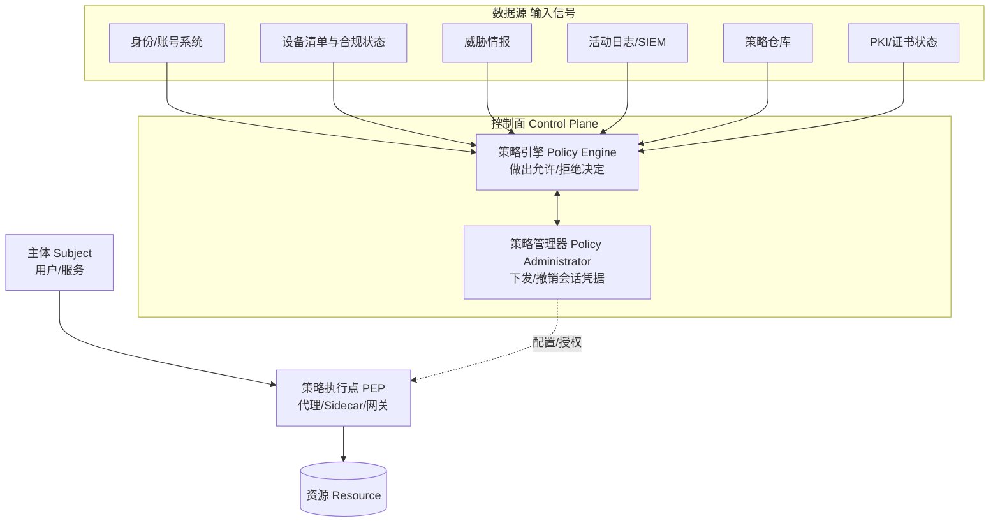
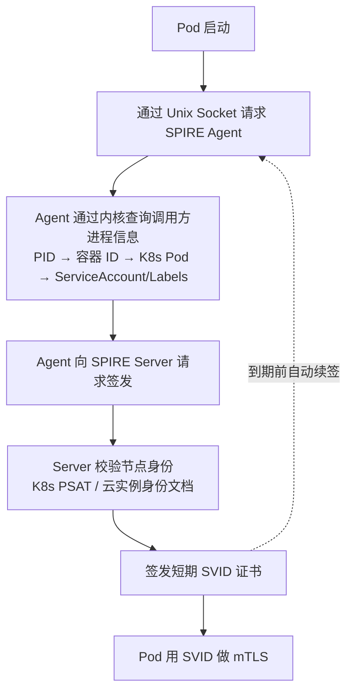
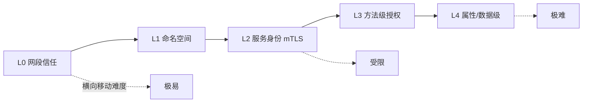
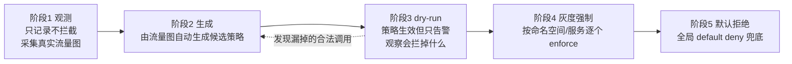
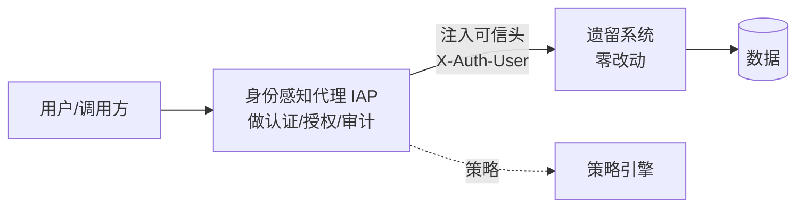

# 零信任架构（BeyondCorp / 微分段 / 身份感知代理 / 落地路径）

> 零信任 =「**永不信任，始终验证**」。传统安全模型假设内网可信（边界防御），零信任假设内网和外网一样危险——每次访问都必须验证身份、设备、上下文。本篇深入拆解：BeyondCorp 模型、微分段、身份感知代理、落地路径。

---

## 一、为什么需要零信任

| 痛点 | 说明 |
|------|------|
| 边界失效 | VPN 被破 = 内网裸奔 |
| 横向移动 | 攻击者进入内网后自由扩散 |
| 内部威胁 | 恶意员工/被控账号在内网无限制访问 |
| 云原生模糊 | 多云/混合云/远程办公，传统边界消失 |
| 合规要求 | SOC2/ISO27001 越来越多要求零信任 |

> 核心认知：**零信任不是产品，是架构原则**——每层都验证（网络/应用/数据），最小权限，持续评估风险。

---

## 二、零信任三原则

| 原则 | 说明 |
|------|------|
| 显式验证 | 每次访问都验证身份（不靠 IP/网段信任） |
| 最小权限 | 只给完成任务所需的最小权限（JIT/JEA） |
| 假设入侵 | 假设已被攻破，实施微隔离 + 持续监控 |

---

## 三、核心架构

### 3.1 架构组件

```
用户/设备 → 身份验证（MFA/SSO）→ 设备评估（合规/补丁/EDR）
  → 策略引擎（ABAC/PBAC）→ 决策（允许/拒绝/要求 MFA）
  → 代理（反向代理/Service Mesh）→ 后端应用/数据

关键组件：
  IDP（Identity Provider）：身份认证（Okta/Azure AD/Keycloak）
  PEP（Policy Enforcement Point）：策略执行点（反向代理/Sidecar）
  PDP（Policy Decision Point）：策略决策点（评估上下文）
  PAM（Privileged Access Management）：特权访问管理
  SIEM/XDR：安全事件检测与响应
  EDR（Endpoint Detection & Response）：终端安全
```

### 3.2 BeyondCorp 模型（Google）

```
BeyondCorp = Google 内部零信任实践（2011 年开始）

核心思想：
  - 所有应用不通过 VPN 访问
  - 访问基于用户身份和设备状态，不基于网络位置
  - 每次访问都经过认证+授权+设备评估

组件：
  Access Proxy（入口代理）：拦截所有请求，转发到后端
  Device Inventory（设备清单）：记录设备信息+合规状态
  User/Device Certificates（用户/设备证书）：mTLS 认证
  Access Control Engine（策略引擎）：评估访问策略
  Trust Inference Engine（信任推断引擎）：动态评估风险
```

---

## 四、微分段（Micro-segmentation）

### 4.1 概念

```
微分段 = 将网络分割为细粒度的信任域
  每个应用/服务独立信任域
  跨域访问必须验证身份+授权
  即使攻击者进入一个域，也无法横向扩散到其他域
```

### 4.2 实现方式

| 方式 | 说明 | 适用 |
|------|------|------|
| K8s NetworkPolicy | Pod 级网络策略 | K8s 环境 |
| Service Mesh（mTLS） | 服务级加密+认证 | 微服务 |
| 云安全组 | 实例级网络策略 | 云环境 |
| 传统防火墙 | 主机级网络策略 | 传统环境 |

### 4.3 K8s NetworkPolicy 示例

```yaml
# 只允许 order-service 访问 payment-service
apiVersion: networking.k8s.io/v1
kind: NetworkPolicy
metadata:
  name: payment-policy
  namespace: default
spec:
  podSelector:
    matchLabels:
      app: payment-service
  policyTypes:
  - Ingress
  ingress:
  - from:
    - podSelector:
        matchLabels:
          app: order-service
    ports:
    - port: 8080
      protocol: TCP
```

---

## 五、身份感知代理（Identity-Aware Proxy）

### 5.1 概念

```
IAP = 在应用前放置代理，所有请求必须经过认证+授权

Google Cloud IAP：
  所有请求 → IAP 代理 → 验证身份 → 策略引擎 → 后端应用
  优势：应用无需自己实现认证，统一在代理层处理
```

### 5.2 实现

```nginx
# Nginx + OAuth2 Proxy（开源 IAP）
server {
    listen 443 ssl;
    server_name app.example.com;

    location / {
        auth_request /oauth2/auth;
        proxy_set_header X-Forwarded-User $remote_user;
        proxy_pass http://backend;
    }

    location /oauth2/auth {
        proxy_pass http://oauth2-proxy:4180;
    }
}
```

---

## 六、落地路径（分阶段）

### 阶段一：统一身份

```
目标：所有系统统一身份入口 + 多因素认证

措施：
  SSO（单点登录）：所有系统接入统一 IDP
  MFA（多因素认证）：密码 + TOTP/SMS
  用户生命周期管理：入职/离职/调岗自动化

工具：
  Keycloak（开源 IDP）
  Okta / Azure AD（商业 IDP）
```

### 阶段二：网络微分段

```
目标：服务间通信加密+认证

措施：
  mTLS（双向 TLS）：Service Mesh 实现
  NetworkPolicy：Pod 级网络策略
  加密传输：所有流量 TLS 加密

工具：
  Istio/Envoy（mTLS）
  Calico/Cilium（NetworkPolicy）
```

### 阶段三：应用层鉴权

```
目标：API 级别最小权限访问

措施：
  API 网关统一鉴权
  RBAC/ABAC 策略引擎
  JWT 验证 + Scope 控制

工具：
  Kong/APISIX（API 网关 + 鉴权）
  Casbin（策略引擎）
```

### 阶段四：数据层加密

```
目标：数据分级+字段级权限

措施：
  静态加密（磁盘加密/数据库加密）
  传输加密（TLS）
  字段级权限（敏感字段脱敏）
  密钥管理（KMS）

工具：
  AWS KMS / HashiCorp Vault
  透明数据加密（TDE）
```

### 阶段五：持续监控

```
目标：异常行为检测+自动响应

措施：
  全量访问日志
  UEBA（用户实体行为分析）
  自动封禁异常账号
  SIEM 聚合分析

工具：
  Splunk / ELK（SIEM）
  CrowdStrike / Carbon Black（EDR）
```

---

## 七、常见坑

| 问题 | 解决 |
|------|------|
| 一刀切部署 | 分阶段（先身份、再网络、再应用） |
| 用户体验下降 | 风险自适应（低风险免 MFA） |
| 遗留系统兼容 | 代理层适配（不改应用） |
| 成本 | 先用开源（Keycloak/Casbin） |
| 性能开销 | 缓存策略决策 + 异步评估 |

---

## 八、与其他板块的关系

- Service Mesh 见「[ServiceMesh](../云原生/ServiceMesh.md)」；
- mTLS 见「[K8s 网络深挖](../云原生/K8s网络深挖.md)」；
- 认证授权见「[认证授权 JWT/OAuth2](../基础知识/中间件/认证授权JWT-OAuth2.md)」；
- 应用安全见「[安全工程/01-应用安全基础](./01-应用安全基础与威胁建模.md)」。

> 一句话：**零信任 = 永不信任 + 始终验证 + 最小权限 + 假设入侵——落地分五阶段（身份→网络→应用→数据→监控），Service Mesh 是网络层零信任的天然实现，先从 SSO+MFA 开始**。

---

## 九、策略引擎深入：OPA / Rego 与 Casbin

零信任的"大脑"是**策略决策点（PDP）**。两种主流：

| 引擎 | 风格 | 适用 |
|------|------|------|
| **OPA (Open Policy Agent)** | Rego 声明式策略，通用（K8s/Istio/Gate） | 云原生统一策略 |
| **Casbin** | 模型驱动（RBAC/ABAC 配置文件） | 应用内细粒度鉴权 |

```rego
# OPA/Rego 示例：只允许同 namespace 的服务互访
allow {
    input.src_namespace == input.dst_namespace
    input.method == "GET"
}
# 否则拒绝——默认拒绝是零信任的基线
```

> 与 [02 认证授权](../安全工程/02-认证与授权体系.md) 的 RBAC/ABAC 衔接：OPA 是"策略执行层"的通用引擎，Casbin 偏应用内。

---

## 十、SPIFFE / SPIRE：工作负载身份

零信任不仅认证"人"，还要认证"服务"（机器对机器）：

```
SPIFFE = 为每个工作负载发可验证身份（SPIFFE ID，形如 spiffe://trustdomain/svc/order）
SPIRE  = SPIFFE 的实现：Agent 在节点上、Server 签发 SVID（X.509/短命证书）
```

- 服务不再靠"IP/网段"互信，而靠 **SVID 证书**互认；
- 与 mTLS 配合：Istio 用 SPIFFE ID 做服务间身份，彻底消除"内网默认可信"。

---

## 十一、ZTNA vs 传统 VPN

| 维度 | VPN | ZTNA（零信任网络访问） |
|------|-----|------------------------|
| 信任模型 | 连上即获得内网.flat 访问 | 每次访问按策略单独授权 |
| 暴露面 | 内网整体暴露 | 仅授权应用暴露，默认隐藏 |
| 设备检查 | 通常无 | 强制设备合规评估 |
| 横向移动 | 易 | 微分段阻断 |

> ZTNA 不是"换个 VPN"，而是把"网络连通"与"应用授权"解耦——这正呼应 [03 越权防护](../安全工程/03-常见Web安全漏洞与防护.md) 的"服务端校验归属"。

---

## 十二、应用层每请求授权（Istio 示例）

```yaml
# Istio AuthorizationPolicy：仅允许 product 命名空间调用 reviews 的 GET
apiVersion: security.istio.io/v1
kind: AuthorizationPolicy
metadata:
  name: reviews-allow
  namespace: default
spec:
  selector:
    matchLabels: { app: reviews }
  rules:
  - from:
    - source:
        principals: ["cluster.local/ns/product/sa/product"]
    to:
    - operation:
        methods: ["GET"]
# 未匹配默认拒绝（需配 action: Deny 或全局 default deny）
```

---

## 十三、数据层：字段级加密与动态脱敏

零信任的"假设入侵"落到数据层 = 即使拿到库也读不懂：

- **字段级加密**：敏感字段（证件/卡号）应用层或 TDE 加密，密钥走 KMS（见 [05](../安全工程/05-数据安全与密码学基础.md)）；
- **动态脱敏**：同一份数据，客服看掩码、风控看明文，按角色在网关/数据层下推（数据权限见 [02 数据权限下推](../安全工程/02-认证与授权体系.md)）；
- **EFS（加密文件存储）/ 磁盘加密**：失物理机也不泄露。

---

## 十四、持续监控与 UEBA

零信任不是"设完策略就完事"，要**持续评估风险**：

```
全量访问日志 → SIEM 聚合 → UEBA(用户实体行为分析)
   → 异常: 异地登录/非工作时间大流量/频繁越权尝试
   → 响应: 降权/强制重认证/封禁 + 联动 [SRE·事故响应](../SRE与稳定性工程/04-On-call与事故管理.md)
```

> 与 SRE 的可观测性一体：安全日志也是遥测。异常检测思路见 [SRE·日志告警](../SRE与稳定性工程/06-日志与告警规则库.md)。

---

## 十五、落地路线图细化与度量

| 阶段 | 关键交付 | 成功信号 |
|------|----------|----------|
| 1 统一身份 | SSO + MFA 全覆盖 | 无独立账号体系 |
| 2 网络微分段 | mTLS + NetworkPolicy | 跨域访问需显式授权 |
| 3 应用鉴权 | 网关/RBAC/ABAC | 每接口有授权策略 |
| 4 数据加密 | KMS + 字段加密 + 脱敏 | 拖库不可读 |
| 5 持续监控 | SIEM + UEBA + 自动响应 | 异常分钟级发现 |

**度量指标**：MFA 覆盖率、mTLS 覆盖率、策略命中/拒绝率、异常响应 MTTR。

---

## 十六、踩坑实录与误区

1. **"上了一个 IAP 就是零信任"**：零信任是架构原则（验证+最小权限+监控），单产品只是其中一环。
2. **一刀切强制 MFA**：全员每次都 MFA → 体验崩、绕过增多。用**风险自适应**（低风险免 MFA，高风险才要）。
3. **策略默认允许**：零信任基线必须是**默认拒绝**，遗漏的策略不该是"放行"。
4. **只做网络不做应用**：网络层零信任挡住横向，但应用层越权（[03](../安全工程/03-常见Web安全漏洞与防护.md)）仍需应用鉴权。
5. **忽略遗留系统**：老系统改不动，用代理层（IAP）包裹，不改应用也能纳入零信任。

> **本篇口诀**：零信任三句——永不信任、始终验证、最小权限；落地五段——身份→网络→应用→数据→监控；默认拒绝是基线，风险自适应保体验，mTLS 是网络零信任的脊梁。

---

## 十七、标准视角：NIST SP 800-207 的逻辑架构

零信任容易被讲成一堆产品名。NIST SP 800-207 给了一个厂商中立的抽象模型，理解它就能看穿所有产品宣传。

### 17.1 核心逻辑组件



| 组件 | 职责 | 常见实现 |
|------|------|----------|
| **PE**（Policy Engine） | 综合所有信号，输出决策 | OPA、云厂商策略引擎 |
| **PA**（Policy Administrator） | 把决策转化为对 PEP 的配置/凭据下发 | 控制面（Istiod、SPIRE Server） |
| **PEP**（Policy Enforcement Point） | 实际拦截并放行/拒绝流量 | Envoy Sidecar、API 网关、IAP、反向代理 |

**关键洞察**：**PE/PA 是控制面，PEP 是数据面**。这个分离决定了零信任系统的两个核心工程属性：
1. 控制面故障时，数据面应能按最后已知策略继续工作（否则控制面成了全站单点）；
2. 策略变更的生效延迟 = 控制面下发延迟，这是一个需要监控的 SLI（见 [SRE·SLI/SLO](../SRE与稳定性工程/01-SRE理念与SLI-SLO-ErrorBudget.md)）。

### 17.2 七条基本原则（对照自检）

| NIST 原则 | 通俗解释 | 工程动作 |
|-----------|----------|----------|
| 1. 所有数据源与计算服务都是资源 | 数据库、K8s API、日志系统都要纳管，不只是"应用" | 资源清单化 |
| 2. 无论网络位置，所有通信都要安全 | 内网也要加密认证 | 全链路 mTLS |
| 3. 按**单个会话**授权 | 不是"登录一次管一天" | 每请求鉴权、短期凭据 |
| 4. 访问由**动态策略**决定 | 策略输入含身份、设备、行为、环境属性 | ABAC + 上下文信号 |
| 5. 持续监测资产完整性与安全态势 | 设备/工作负载状态会变化 | EDR、合规检查、准入控制 |
| 6. 认证授权是**动态且严格执行**的循环 | 授权后仍要重评估 | 会话内重认证、令牌短 TTL |
| 7. 尽可能收集信息以改进策略 | 决策质量取决于信号质量 | 全量访问日志 → 策略优化 |

**第 3 条是最容易打折扣的**：很多团队做到了"入口 SSO+MFA"，但入口之后签发了一个 8 小时的长 Token，后端服务对它无条件信任——这实质上退回了边界防御，只是把边界从网络挪到了网关。真正的"按会话授权"要求**每一跳都独立验证，令牌短期且可即时吊销**。

---

## 十八、信任算法：从静态策略到持续评估

零信任的"验证"不是布尔值，而是**基于多信号的持续打分**。

### 18.1 信号维度

| 维度 | 信号示例 | 可信度提升 / 降低 |
|------|----------|-----------------|
| **身份** | 账号、组、角色、认证强度（密码 vs 硬件密钥） | 硬件密钥 ↑，仅密码 ↓ |
| **设备** | 是否受管、磁盘加密、补丁级别、EDR 在线、越狱检测 | 受管且合规 ↑，个人未受管设备 ↓ |
| **位置/网络** | 地理位置、IP 信誉、是否常用网络、是否 Tor/代理 | 常用位置 ↑，异地新 IP ↓ |
| **时间/行为** | 是否常规工作时段、操作频率、是否偏离历史基线 | 符合基线 ↑，突发大量下载 ↓ |
| **资源敏感度** | 目标资源的数据分级（见 [05 数据分级](05-数据安全与密码学基础.md)） | 高敏资源要求更高分数 |
| **会话状态** | 距上次认证时长、会话内是否有异常 | 刚认证 ↑，长时间未重认证 ↓ |

### 18.2 决策不是二元的

```
风险分 = f(身份强度, 设备合规, 位置异常度, 行为偏离度)
所需分数 = g(资源敏感度, 操作类型是读还是写)

决策：
  风险分 << 所需分  → 直接放行（无感）
  风险分 ≈ 所需分   → 放行但要求补充验证（MFA / 二次确认）
  风险分  > 所需分  → 拒绝，或降级（只读 / 脱敏视图）
  异常剧增          → 终止会话 + 强制重认证 + 告警
```

| 决策档位 | 用户体验 | 适用 |
|----------|----------|------|
| 静默放行 | 无感 | 受管设备 + 常用位置 + 低敏资源 |
| 提升认证（step-up） | 要求 MFA | 敏感操作、异常上下文 |
| 降级访问 | 给脱敏数据 / 只读 | 上下文可疑但需保业务连续 |
| 拒绝 + 告警 | 阻断 | 高风险组合 |

> **风险自适应是零信任落地成败的关键**。一刀切"每次都 MFA"会导致两个后果：用户疲劳（无脑点确认，MFA 形同虚设）和绕过（找各种旁路）。**安全措施的有效性 = 技术强度 × 用户配合度**，后者被忽视时前者归零。

### 18.3 降级访问：一个被低估的档位

大多数系统只有"允许/拒绝"两态，但零信任场景下"降级"往往是最优解：

```
场景：客服在非受管设备上登录，需要查询用户订单
  二元决策：拒绝 → 业务中断，客服找旁路（截图外发、用同事账号）
  降级决策：允许查询，但手机号/地址显示掩码，且不允许导出
  → 业务能继续，泄露面被限制，还留下了完整审计
```

实现上依赖**数据层的动态脱敏能力**（见第十三章）——这也说明为什么零信任的五个阶段不能跳步：没有第四阶段的数据层能力，第三阶段的策略引擎就只能做二元决策。

---

## 十九、四类主体的身份，各有各的难题

零信任讲"身份即边界"，但"身份"在四类主体上是完全不同的工程问题：

| 主体 | 身份载体 | 核心难题 | 典型方案 |
|------|----------|----------|----------|
| **人（员工/客户）** | 账号 + MFA | 生命周期（入职/调岗/离职）、钓鱼 | SSO + 抗钓鱼 MFA（FIDO2/WebAuthn） |
| **设备** | 设备证书 / MDM 注册 | 个人设备（BYOD）、状态实时性 | 设备证书 + 合规检查 + EDR 上报 |
| **工作负载（服务/容器）** | SVID / ServiceAccount | **不能靠人输密码**，且频繁伸缩 | SPIFFE/SPIRE、云 IAM Role、K8s SA Token |
| **API 客户端（第三方/合作方）** | API Key / OAuth Client | 密钥长期不轮换、泄露难发现 | mTLS 客户端证书 + OAuth Client Credentials + 密钥前缀便于扫描 |

### 19.1 工作负载身份为什么是零信任的技术核心

人的身份有成熟方案（SSO/MFA），但服务间调用长期靠"共享密钥"或"内网 IP 白名单"：

```
传统：order-service 调 payment-service
  → 靠"来源 IP 在白名单"或"共享的 API Key"
  问题：
    - IP 会变（容器伸缩、漂移），白名单维护不可持续
    - 共享密钥无法区分具体实例、无法审计到调用者
    - 密钥泄露后轮换困难（要改所有调用方配置并重启）
    - 攻击者只要进了内网任意一台机器，就"是"合法来源
```

```
零信任：每个工作负载有可验证的加密身份
  → order-service 的 Pod 启动时，由平台证明其身份，签发短期证书（SVID）
  → 调用 payment 时用 mTLS 出示证书，payment 验证对方身份是 order
  → 授权策略写"允许 spiffe://.../order 调用 payment 的 POST /pay"
  优势：
    - 身份与 IP 解耦，伸缩无感
    - 证书短期自动轮换，无长期密钥可偷
    - 每次调用可审计到具体服务身份
    - 进了内网也拿不到有效身份（无证书）
```

### 19.2 SPIFFE 的"无密钥启动"问题

这里有个鸡生蛋问题：**工作负载要拿到身份凭据，得先证明自己是谁；但它还没有凭据。**

SPIRE 的解法是**节点证明（Node Attestation）+ 工作负载证明（Workload Attestation）**：



**信任根来自平台本身**（K8s API 的 Pod 信息、云平台的实例身份文档），而不是任何预置的密钥。这就是"无密钥"的含义——**从"我知道一个密码"转向"平台能证明我是谁"**。

| 证明方式 | 信任根 | 注意 |
|----------|--------|------|
| K8s Projected ServiceAccount Token | K8s API Server | 需开启投影卷，Token 有受众限制与 TTL |
| 云实例身份文档 | 云平台元数据服务 | 需防 SSRF 偷取（见 [03 SSRF](03-常见Web安全漏洞与防护.md)） |
| TPM / 硬件根 | 硬件 | 最强，但部署复杂 |

> 注意这里的循环依赖：**工作负载身份依赖元数据服务，而元数据服务是 SSRF 的头号目标**。这就是为什么第二十三章要讲 IMDSv2 加固——它是零信任身份体系的信任根，必须优先保护。

---

## 二十、mTLS 落地的现实问题

理论上 mTLS 完美，工程上有一堆坑。这些是真实会拦住落地的问题：

### 20.1 证书生命周期

| 问题 | 现象 | 对策 |
|------|------|------|
| 证书过期 | 服务间调用突然全失败，且报错信息晦涩 | 短期证书 + 自动轮换 + **过期前告警**（提前 1/3 有效期） |
| 轮换时的连接中断 | 长连接持有旧证书 | 支持热重载证书；连接建立时用新证书，已有连接自然结束 |
| 时钟偏移 | 节点时间不准 → 证书"还没生效"或"已过期" | NTP 强制同步 + 校验时留 skew 容忍窗口 |
| 吊销（CRL/OCSP）不可靠 | 吊销列表分发延迟、OCSP 服务成单点 | **用短期证书代替吊销**（有效期几小时，过期即失效） |
| 信任根轮换 | 换 CA 时新旧不互认 → 全站中断 | 双信任根并行期（先都信任，再逐步切签发，最后移除旧根） |

**核心设计取向**：**用"短生命周期"替代"吊销机制"**。传统 PKI 靠 CRL/OCSP 吊销，但这在大规模服务网格中不可靠（分发延迟、单点故障）。零信任的做法是让证书有效期短到"不需要吊销"——出问题时停止续签即可，几小时内自然失效。

### 20.2 性能开销

| 开销来源 | 影响 | 缓解 |
|----------|------|------|
| TLS 握手（非对称运算） | 首次连接延迟增加 | 连接池复用 + Session Resumption + 用 ECC 而非 RSA |
| 加解密（对称运算） | CPU 占用增加 | 现代 CPU 有 AES-NI 指令集，实际开销通常可接受 |
| Sidecar 额外网络跳 | 每次调用多两次本地转发 | 用 eBPF 加速（Cilium）或 Ambient/无 Sidecar 模式 |
| 证书签发压力 | 大规模伸缩时控制面压力 | 缓存 + 批量签发 + 提前续签打散 |

> 不要凭猜测判断"mTLS 太慢"。**先压测**：对多数业务系统，Sidecar 的额外转发跳数带来的延迟增加往往比加解密本身更显著。优化顺序应该是"先减少跳数（考虑无 Sidecar 方案），再优化加解密"。

### 20.3 可观测性与调试

mTLS 让排查变难，必须提前建设：

| 需求 | 做法 |
|------|------|
| 抓包看不到明文 | 在 Sidecar/网关层出访问日志（含源身份、目标、决策结果） |
| "为什么被拒绝" | 策略引擎输出决策原因（命中哪条策略），而不只是 403 |
| 证书状态可见 | 暴露证书有效期、签发时间为 Metrics，配过期告警 |
| 本地开发 | 提供本地 dev 模式（跳过 mTLS）或本地签发工具，否则开发者会想办法关掉它 |

**"为什么被拒绝"这一条至关重要**。零信任默认拒绝，如果拒绝时不告诉运维"是哪条策略、缺哪个条件"，那么每次上线新服务都要靠猜，最终团队会把策略改成宽松的通配以求省事——**策略的可解释性直接决定策略的严格程度能否维持**。

---

## 二十一、授权粒度的演进路径

零信任不是一步到位。授权粒度可以分阶段收紧，每一阶段都有独立价值：

| 阶段 | 粒度 | 策略示例 | 攻破一个服务的后果 |
|------|------|----------|-------------------|
| L0 | 网段 | "10.0.0.0/8 内可互访" | 内网全部可达 |
| L1 | 命名空间 | "prod 命名空间内可互访" | 该环境全部可达 |
| L2 | 服务身份 | "order 可访问 payment" | 仅该服务的下游可达 |
| L3 | 方法级 | "order 可调 payment 的 POST /pay，不可调 /refund" | 仅特定操作可用 |
| L4 | 属性/字段级 | "order 调 /pay 时，金额不得超过 X；查询用户只能拿到脱敏字段" | 影响面最小 |



**落地建议**：绝大多数团队的合理目标是 **L2 + 关键路径的 L3**。L4 成本高（需要业务语义介入），只对最高敏的少数接口做。

**判断当前所处阶段的方法**：问一个问题——"如果攻击者拿下了一个最不重要的服务（比如一个内部的报表服务），他能访问到什么？"
- 答"整个内网" → L0；
- 答"同环境的所有服务" → L1；
- 答"只有报表服务声明过的那几个下游" → L2，已经达标。

---

## 二十二、微隔离的渐进落地（避免一刀切断网）

直接在生产开 `default deny` 的 NetworkPolicy，结果一定是大面积故障——因为没人清楚真实的调用关系。正确流程是**先观测，再建议，再演练，最后强制**：



| 阶段 | 关键动作 | 退出标准 |
|------|----------|----------|
| 1 观测 | 采集服务间调用关系（Sidecar 日志 / eBPF / NetFlow） | 覆盖完整业务周期（含月末、大促等低频路径） |
| 2 生成 | 由观测数据生成 allow 列表 | 策略数量可控，人工评审过 |
| 3 dry-run | 策略以"只告警"模式运行 | 连续观察期内 0 条本应放行的被告警 |
| 4 灰度强制 | 按服务/命名空间逐个切 enforce | 无故障，且有快速回滚开关 |
| 5 默认拒绝 | 全局兜底 default deny | 新服务上线必须显式声明依赖 |

**最大的坑是"观测周期不够长"**：很多调用是低频的（月末对账、定时任务、灾备切换、运维脚本），观测两周生成的策略会漏掉它们，然后在月末出故障。**观测周期必须覆盖至少一个完整业务周期**，并且对已知的低频路径手工补充声明。

> 这套流程和 [SRE·渐进式发布](../SRE与稳定性工程/05-变更管理与渐进式发布.md) 的灰度思路完全一致：**先影子运行观察差异，再小流量验证，再全量，全程可回滚**。安全策略变更本质上就是一次高风险变更，理应受同样的变更管理约束。

---

## 二十三、零信任与可用性的冲突：fail-open 还是 fail-close

零信任引入了新的故障模式。**安全组件本身成了关键路径上的依赖**。

### 23.1 新增的单点风险

| 组件 | 故障后果 | 缓解 |
|------|----------|------|
| IDP / SSO | 全员无法登录 | 多可用区、缓存有效会话、预案：临时旁路通道（需强审计） |
| 策略引擎（PDP） | 无法做出决策 | PEP 本地缓存策略与决策结果；控制面挂掉时按最后已知策略运行 |
| 证书签发（CA） | 新 Pod 起不来 / 续签失败 | 高可用 + 证书提前续签（在 1/2 有效期就续，留足重试窗口） |
| Sidecar 注入 | Pod 无法启动 | 注入 Webhook 配 `failurePolicy` 需权衡；关键命名空间预留豁免 |
| 元数据服务 | 工作负载拿不到身份 | 平台级保障 |

### 23.2 fail-open vs fail-close 的决策框架

这是零信任最难的工程取舍，没有普适答案，但有决策框架：

| 场景 | 建议 | 理由 |
|------|------|------|
| 认证组件不可用 | **fail-close**（拒绝新会话），但**保留已有会话** | 不可用比被入侵损失小；已有会话已验证过，可继续 |
| 授权策略引擎不可用 | **fail-close 到本地缓存的最后已知策略** | 既不放开也不全断 |
| 设备合规检查服务不可用 | **fail-open + 告警 + 降级**（当作"未知合规状态"处理，只给低敏资源） | 该信号是加分项而非必要条件 |
| 审计日志系统不可用 | 视合规要求：强合规场景 fail-close，否则本地落盘缓冲后补传 | 有些合规要求"无审计即不可操作" |
| mTLS 证书过期 | **fail-close**（这是设计意图） | 但必须有提前告警，不能靠故障发现 |

**核心原则**：
1. **区分"新建"与"已建"**——已通过验证的会话/连接不应因控制面故障而中断；
2. **区分"必要条件"与"加分信号"**——身份是必要条件（fail-close），设备评分是加分信号（可降级）；
3. **任何 fail-open 都必须伴随告警与限期**——临时放宽不能变成永久现状。

### 23.3 破窗预案（Break-glass）

必须设计一个"安全体系本身故障时的应急通道"，否则真出事时会有人临时关掉整套零信任（而且大概率忘记恢复）：

| 要求 | 说明 |
|------|------|
| 极少数人可用 | 严格限定名单 |
| 需多人授权 | 双人规则，防单点滥用 |
| 强审计 | 使用即触发全员可见的告警，事后必须复盘说明 |
| 有时限 | 自动到期失效，不需要人记得关 |
| 定期演练 | 否则真要用时发现流程跑不通（同 [SRE 容灾演练](../SRE与稳定性工程/03-容量规划与冗余容灾.md) 精神） |

> 有预案的"破窗"远好于无预案的"临时关掉全部策略"。**没有设计破窗通道，就等于默认了一个不受控的破窗行为**。

---

## 二十四、非 HTTP 协议与遗留系统

零信任的示例总是 HTTP，但生产环境有大量非 HTTP 流量和改不动的老系统。

### 24.1 各类协议的零信任落地

| 目标 | 难点 | 方案 |
|------|------|------|
| **数据库（MySQL/PG）** | 长连接、连接池、账号通常是共享的 | 动态凭据（Vault 按需签发短期账号）+ TLS + 数据库代理层做审计与鉴权 |
| **Redis / 消息队列** | 协议简单、常无认证、易被 SSRF 利用 | 强制认证 + TLS + NetworkPolicy 限制来源 + 禁危险命令 |
| **SSH 运维访问** | 长期密钥散落各处，离职难回收 | 证书式 SSH（短期签发）+ 跳板机审计 + 会话录制 |
| **gRPC** | 与 HTTP/2 同源，相对好办 | mTLS + 方法级授权（Istio 支持 gRPC 方法匹配） |
| **文件传输 / 批处理** | 定时任务、无交互身份 | 工作负载身份 + 短期凭据，而非固定账号密码 |
| **第三方回调** | 对方 IP 不固定、无法要求 mTLS | 签名验证 + 时间戳防重放 + 独立入口隔离 |

**数据库的动态凭据是高性价比切入点**：

```bash
# 应用启动时向 Vault 领取短期数据库账号，TTL 到期自动吊销
vault read database/creds/order-service-ro
# → username: v-approle-order-xxxx, password: ..., lease_duration: 3600s

# 收益：
#  1) 没有长期数据库密码可泄露
#  2) 每个服务/实例有独立账号 → 审计能定位到具体调用方
#  3) 离职/下线时无需手工回收
```

### 24.2 遗留系统的包裹策略

老系统改不动是常态。用**代理包裹**而不是改代码：



| 包裹要点 | 说明 |
|----------|------|
| 网络上必须只能经代理访问 | 否则可绕过代理直连（用 NetworkPolicy 强制） |
| 代理注入的身份头必须防伪造 | **代理必须剥离客户端传入的同名头**，否则攻击者自己传 `X-Auth-User: admin` |
| 遗留系统自身认证如何处理 | 要么关闭（信任代理），要么代理做凭据代填 |
| 审计在代理层完成 | 遗留系统的日志通常不够 |

> **"剥离客户端传入的身份头"是这个模式的致命细节**。见过的真实事故：代理注入 `X-Forwarded-User`，但没有清除客户端自带的同名头，后端框架取到了第一个值（客户端的），造成完全的身份伪造。**任何"由可信中间层注入身份"的设计，都必须显式清除入口处的同名头**。

---

## 二十五、零信任成熟度自评

| 维度 | L1 传统 | L2 起步 | L3 进阶 | L4 成熟 |
|------|---------|---------|---------|---------|
| **人身份** | 各系统独立账号 | SSO 覆盖主要系统 | SSO 全覆盖 + MFA | 抗钓鱼 MFA（FIDO2）+ 风险自适应 |
| **设备** | 不做检查 | 部分设备受管 | 受管设备 + 合规检查作为准入条件 | 持续合规评估 + 状态变化即时反映到决策 |
| **工作负载身份** | 内网 IP 白名单 / 共享密钥 | 部分服务用 ServiceAccount | 全量 mTLS + 服务身份 | 短期证书自动轮换 + 无长期密钥 |
| **网络** | 大网段互通 | 按环境隔离 | 服务级微隔离（allow list） | 全局 default deny + 自动策略生成 |
| **授权粒度** | 有没有登录 | 角色级 | 方法级 | 属性/数据字段级 + 动态脱敏 |
| **监控** | 只有应用日志 | 有访问日志 | 集中审计 + 异常告警 | 行为基线 + 自动响应 |
| **可用性设计** | 未考虑 | 有高可用 | 有 fail 策略 + 本地缓存 | 有破窗预案且定期演练 |

**自评方法**：不要看"买了什么产品"，看能否回答这三个问题：
1. **一个新员工入职/离职，多久能拿到/失去全部权限？**（人身份成熟度）
2. **攻击者拿下一台最边缘的机器，能横向到哪里？**（网络与工作负载身份成熟度）
3. **策略引擎挂了，业务是全断、全通、还是按最后已知策略运行？**（可用性设计成熟度）

---

## 二十六、常见误解澄清

| 误解 | 事实 |
|------|------|
| "零信任 = 不用 VPN" | ZTNA 可以替代 VPN，但零信任的范围远大于远程接入（还包括服务间、数据层） |
| "买了产品就是零信任" | 零信任是架构原则。产品只提供 PEP/PE 等组件，策略设计和权限治理是自己的工作 |
| "零信任 = 处处加密" | 加密只是手段之一。核心是**身份验证 + 授权 + 最小权限 + 持续评估** |
| "内网加了 mTLS 就零信任了" | mTLS 解决"是谁"，还需要"能做什么"（授权）和"是否异常"（监控） |
| "零信任会拖慢一切" | 性能开销可测可优化；真正的成本是**权限治理的组织工作量** |
| "先把网络做好，其他以后再说" | 网络层零信任挡横向移动，但应用层越权（[03](03-常见Web安全漏洞与防护.md)）完全不受影响 |
| "默认拒绝会导致故障" | 一刀切会。渐进落地（第二十二章）不会 |
| "小团队不需要零信任" | 原则可以小成本落地：统一 SSO + 服务间用 K8s SA 而非共享密钥 + NetworkPolicy，都是免费的 |

---

## 二十七、最小可行零信任（小团队版）

不需要商业产品，用开源和平台自带能力就能拿到大部分收益：

| 目标 | 最小实现 | 成本 |
|------|----------|------|
| 统一人身份 | Keycloak / 云厂商 IAM 做 SSO，强制 MFA | 低 |
| 消除共享密钥 | 服务间改用 K8s ServiceAccount Token（带受众限制）或云 IAM Role | 低 |
| 服务间加密认证 | 服务网格 mTLS（Istio/Linkerd），或先在关键链路手工配 mTLS | 中 |
| 网络微隔离 | K8s NetworkPolicy，按第二十二章渐进落地 | 低 |
| 应用层授权 | 网关统一鉴权 + 应用内 Casbin/OPA | 中 |
| 数据层 | 敏感字段加密 + 日志脱敏（见 [05](05-数据安全与密码学基础.md)） | 中 |
| 审计 | 网关访问日志集中化，含调用方身份（复用现有日志栈） | 低 |
| 密钥治理 | Vault 动态数据库凭据（先覆盖生产库） | 中 |

**推荐起步顺序**（按"收益/成本"排序）：

1. **SSO + MFA**（覆盖人身份，收益最直接）；
2. **NetworkPolicy 渐进落地**（挡横向移动，零成本）；
3. **消除服务间共享密钥**（改用平台身份，一次改造长期受益）；
4. **网关统一鉴权 + 访问日志**（把授权和审计收敛到一处）；
5. **mTLS**（放在后面，因为前四步的收益更高、成本更低）。

> 常见的错误顺序是"先上服务网格做 mTLS"——技术上最酷，但如果人身份还是各系统独立账号、内网还是大网段互通，mTLS 带来的实际安全提升很有限。**先堵最大的洞，不是先上最新的技术。**

---

## 二十八、口诀汇总（扩展）

> **零信任三句**：永不信任、始终验证、最小权限。
>
> **NIST 三件套**：PE 决策、PA 下发、PEP 执行；控制面挂了数据面要能按最后已知策略活着。
>
> **身份四主体**：人靠 MFA、设备靠证书+合规、工作负载靠 SVID、第三方靠 mTLS+签名。
>
> **证书一句**：**用短生命周期代替吊销机制**——过期即失效，比 CRL/OCSP 可靠。
>
> **微隔离四步**：观测 → 生成 → dry-run → 灰度强制，观测期必须覆盖一个完整业务周期。
>
> **fail 策略两分**：身份是必要条件（fail-close），设备评分是加分项（可降级）；已建会话别因控制面故障而断。
>
> **落地五段**：身份 → 网络 → 应用 → 数据 → 监控；先堵最大的洞，别先上最酷的技术。
>
> **代理包裹一句**：注入可信身份头之前，**先剥离客户端传来的同名头**。
