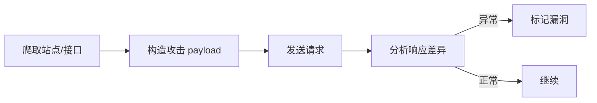

# 应用安全测试与 DAST 实战

> 安全测试不应只在上线后做。DAST（动态应用安全测试）在运行时黑盒探测漏洞，与 SAST（静态）互补。本文讲 DAST 原理、流程与落地要点。

## 1. 安全测试分层

| 层 | 方法 | 阶段 |
| --- | --- | --- |
| 代码层 | SAST、秘密扫描 | 提交/构建 |
| 依赖层 | SCA（查 CVE） | 构建 |
| 运行层 | DAST、渗透 | 预发/生产前 |
| 配置层 | 基线扫描 | 持续 |

## 2. DAST 是什么

- 对运行中的应用发送**恶意/异常请求**，观察是否触发漏洞。
- 黑盒：无需源码，像攻击者一样探测。
- 典型检测：SQL 注入、XSS、命令注入、路径遍历、敏感信息泄露。

## 3. 工作流程

- 爬虫发现入口（表单、API）。
- 注入变异 payload（如 `' OR 1=1 --`）。
- 对比响应特征（报错、延迟、内容变化）判定。

## 4. 工具

| 工具 | 特点 |
| --- | --- |
| OWASP ZAP | 开源、易用 |
| Burp Suite | 专业渗透 |
| Acunetix/Nessus | 商业全面 |
| 自研 | 结合业务规则 |

## 5. 与 CI 集成

- 预发环境自动跑 DAST 扫描。
- 设定严重级别门禁：高危阻断发布。
- 结果对接漏洞管理平台。

## 6. 与 SAST 互补

| 维度 | SAST | DAST |
| --- | --- | --- |
| 查看 | 源码 | 运行态 |
| 误报 | 较多 | 较少 |
| 定位 | 代码行 | 端点 |
| 覆盖 | 全部代码 | 可达路径 |

二者结合：SAST 查潜在缺陷，DAST 验实际可利用。

## 7. 误报与调优

- 定制规则减少业务误报。
- 白名单 Known 端点。
- 分级（高危优先处理）。

## 8. 合规与授权

- 仅对**自有/授权**系统测试，禁止对第三方未授权扫描（违法）。
- 测试数据脱敏，避免真实用户数据。

## 9. 常见坑

| 坑 | 现象 | 对策 |
| --- | --- | --- |
| 仅 SAST | 漏运行态漏洞 | 加 DAST |
| 误报淹没 | 无视 | 分级门禁 |
| 无授权扫描 | 合规风险 | 仅自有系统 |
| 只跑一次 | 新增漏洞 | 常态化 |

## 10. 面试题

1. DAST 与 SAST 区别？
2. DAST 如何检测注入？
3. 为什么需要两者结合？
4. DAST 集成 CI 的门禁？
5. 安全测试的合规边界？

## 11. 小结

DAST 在运行态黑盒探测可利用漏洞，与 SAST 互补构成纵深。落地要接入 CI 门禁、分级处理、且仅对授权系统测试。安全左移 + 持续扫描是刚需。
