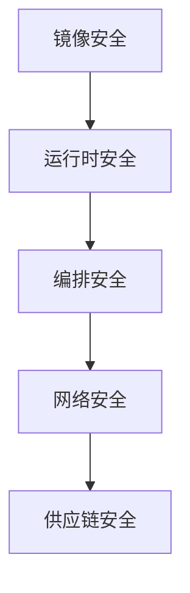

# 云安全与容器安全实战

> 上云与容器化带来新的攻击面：镜像、编排、特权、网络策略。本文讲容器与云原生环境的安全要点与防护。

## 1. 容器安全分层



## 2. 镜像安全

- **最小化基础镜像**：用 distroless/alpine，减少攻击面。
- **扫描漏洞**：构建时对镜像跑 Trivy/Grype，查 CVE。
- **签名与校验**：cosign 签名，准入控制校验。
- **非 root 运行**：`USER` 非 0，禁止 root 容器。

```dockerfile
FROM gcr.io/distroless/java:11
COPY app.jar /app.jar
USER nonroot:nonroot
ENTRYPOINT ["java","-jar","/app.jar"]
```

## 3. 运行时安全

- **Pod 安全上下文**：`runAsNonRoot`、`readOnlyRootFilesystem`、`drop capabilities`。
- **Seccomp/AppArmor**：限制系统调用。
- **Runtime 检测**：Falco 监控异常 syscalls。

## 4. 编排安全

- **RBAC 最小化**：ServiceAccount 仅必要权限。
- **准入控制（Admission）**：限制特权容器、镜像来源。
- **NetworkPolicy**：默认拒绝，显式放行。
- **Secrets 管理**：用外部密钥库（Vault），不硬编码。

## 5. 供应链安全

- **SBOM**：生成软件物料清单，追踪依赖。
- **SLSA**：构建溯源，防篡改。
- **最小依赖**：减少第三方引入。

## 6. 云安全（CSPM）

- 存储桶公开暴露检查。
- IAM 权限最小化（避免 `*`）。
- 日志与审计开启。
- 配置基线扫描（如 CIS Benchmark）。

## 7. 零信任

- 不默认信任任何内部流量。
- mTLS + 身份鉴权（见服务网格安全）。
- 持续验证。

## 8. 常见坑

| 坑 | 风险 | 对策 |
| --- | --- | --- |
| root 容器 | 提权 | 非 root |
| 镜像带漏洞 | 被利用 | 扫描+门禁 |
| 特权逃逸 | 控节点 | 降权+seccomp |
| 密钥硬编码 | 泄露 | 外部密钥库 |
| 无网络策略 | 横向 | NetworkPolicy |

## 9. 面试题

1. 容器镜像如何最小化风险？
2. 为什么禁止 root 容器？
3. 准入控制做什么？
4. SBOM 作用？
5. 零信任在云原生如何体现？

## 10. 小结

云/容器安全是纵深防御：镜像扫描、非 root 运行、RBAC 最小化、NetworkPolicy 隔离、供应链 SBOM。每个层都设防，才能把攻击面压到最低。
