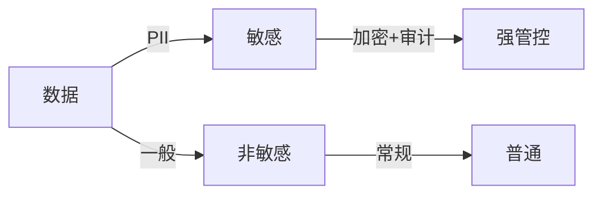

# 数据隐私与合规实战

> 数据已成为受强监管的资产。GDPR、《个人信息保护法》（PIPL）等法规要求"收集最小化、使用可控、主体可撤销"。本文讲工程如何实现隐私合规。

## 1. 合规核心原则

| 原则 | 工程落地 |
| --- | --- |
| 合法正当 | 明确告知与同意 |
| 最小必要 | 只收集必需字段 |
| 目的限定 | 不超范围使用 |
| 主体权利 | 查询/更正/删除/携带 |
| 安全保障 | 加密、访问控制 |

## 2. 数据分类分级

- 分级决定管控强度（加密、访问、留存）。
- PII（个人身份信息）：姓名、手机号、身份证、生物特征。

## 3. 数据脱敏

- **静态脱敏**：入库前/导出时脱敏（如手机号 `138****8000`）。
- **动态脱敏**：按角色/场景实时脱敏（运维看明文、客服看掩码）。
- 技术：掩码、替换、哈希、泛化、随机化。

## 4. 加密与密钥

- 传输加密：TLS 全程。
- 存储加密：字段级（AES）或磁盘级。
- **密钥管理（KMS）**：密钥与数据分离，定期轮换。
- 令牌化（Tokenization）：敏感值替换为无意义的 token。

## 5. 主体权利实现

- **查询/导出**：提供自助接口，验证身份后返回。
- **更正**：修改入口。
- **删除（被遗忘权）**：逻辑删除/物理删除，注意备份与关联。
- **携带**：结构化导出。

## 6. 留存与销毁

- 数据保留期限策略（如日志 6 个月、订单 5 年）。
- 到期自动匿名化/销毁。
- 备份中的过期数据也需处理（或隔离）。

## 7. 跨境与审计

- 数据出境需评估/授权（按法规）。
- 全链路审计：谁、何时、访问了什么。
- 异常访问告警（批量导出、越权）。

## 8. 常见坑

| 坑 | 风险 | 对策 |
| --- | --- | --- |
| 过度收集 | 合规风险 | 最小必要 |
| 明文存储 | 泄露 | 加密+脱敏 |
| 无删除能力 | 侵权 | 实现被遗忘权 |
| 无审计 | 追溯难 | 全链路日志 |

## 9. 面试题

1. 数据分级的意义？
2. 静态与动态脱敏区别？
3. 被遗忘权如何实现？
4. 密钥为何要分离管理？
5. 最小必要原则如何落地？

## 10. 小结

隐私合规是"制度 + 工程"结合：分级分类、脱敏加密、主体权利、留存销毁、审计闭环。工程侧以最小化、加密、可撤销为主线，把合规要求变成系统能力。
